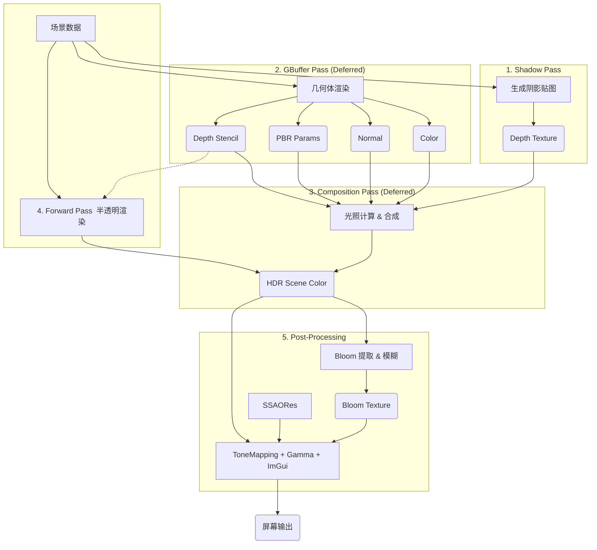

# 渲染管线与 Pass 构成 (Pipeline and Pass Architecture)

本文档描述了 NeuVulkanRender 当前的渲染管线架构、Pass构成及其执行的一致性流程。

## 渲染管线概览 (Pipeline Overview)

渲染器采用 **混合管线 (Hybrid Pipeline)** 架构，结合了 **延迟渲染 (Deferred Rendering)** 用于处理主要的不透明集合体与光照，以及 **前向渲染 (Forward Rendering)** 用于处理半透明物体。最后通过 **后处理 (Post-Processing)** 阶段进行图像特效处理和最终输出。

### 数据流向图

---

## 详细 Pass 构成与执行 (Detailed Pass Description)

### 1. Shadow Pass (阴影通道)
*   **执行顺序**: 0
*   **渲染对象**: `m_ShadowRenderPass`
*   **目的**: 为主方向光（Directional Light）生成阴影贴图（Shadow Map）。
*   **输入**: 场景中所有**不透明**物体。
*   **输出**: `m_ShadowMap` (D32_SFLOAT 深度纹理)。
*   **管线逻辑**:
    *   使用 **PCSS (Percentage-Closer Soft Shadows)** 技术所需的深度图。
    *   **视锥体**: 基于光源视角的正交投影（Orthographic Projection），覆盖相机视锥体范围。
    *   只写入深度，不进行片元着色（Fragment Shader 为空或仅用于Alpha Test）。
    *   **剔除**: 可能会使用 Front-Face Culling (渲染背面) 以减少阴影瑕疵（Peter Panning）。

### 2. GBuffer Geometry Pass (几何通道)
*   **执行顺序**: 1
*   **渲染对象**: `m_GBufferRenderPass`
*   **目的**: 将场景几何信息写入 GBuffer 纹理。
*   **输入**: 场景中所有**不透明**物体。
*   **输出 (MRTs - Multiple Render Targets)**:
    *   **Attachment 0 (Color)**: Albedo (RGB) + Material Flags (A) - `R8G8B8A8_SRGB`
    *   **Attachment 1 (Color)**: Specular/Metallic (RGB) + Occlusion (A) - `R8G8B8A8_UNORM`
    *   **Attachment 2 (Color)**: Normal (RGB, Encoding) + Smoothness/Roughness (A) - `R8G8B8A8_UNORM`
    *   **Attachment 3 (Color)**: Shading Model ID (R) + Emission (GBA) - `R8G8B8A8_UNORM`
    *   **Attachment 4 (Depth)**: Scene Depth - `D32_SFLOAT`
*   **管线逻辑**:
    *   启用深度测试与写入。
    *   每个物体将自身的材质属性（BaseColor, Normal, Metallic, Roughness 等）写入对应的 Attachment。
    *   使用 Push Constants 传递 per-object 数据。
    *   **Material Flags (A)**: 目前作为预留字段（写入 0.0），未来可用于标记材质特殊属性（如无光照、双面渲染掩码等）。
    *   **Shading Model ID (R)**: 用于区分不同的光照计算模型（0-100: PBR Standard, 101-200: Cartoon, 201-255: Unlit/Emissive）。在 Composition Pass 中根据此 ID 分支执行不同的着色逻辑。

### 3. Composition Pass (合成通道)
*   **执行顺序**: 2
*   **渲染对象**: `m_CompositionRenderPass`
*   **目的**: 基于 GBuffer 数据进行光照计算。
*   **输入**: GBuffer Attachments (0-4), Shadow Map, Light Uniforms。
*   **输出**: `m_SceneColor` (R16G16B16A16_SFLOAT, HDR 格式)。
*   **管线逻辑**:
    *   绘制一个全屏三角形（Full-screen Triangle）。
    *   在 Fragment Shader 中采样 GBuffer 纹理，重建世界坐标位置（Pos from Depth）。
    *   执行 PBR 光照计算（Cook-Torrance BRDF）。
    *   计算阴影遮挡（采样 Shadow Map + PCF/PCSS）。
    *   计算环境光遮蔽（SSAO，如果启用）。
    *   将最终 radiance 写入 HDR 颜色缓冲。

### 4. Forward Pass (前向渲染通道)
*   **执行顺序**: 3
*   **渲染对象**: `m_ForwardRenderPass`
*   **目的**: 渲染半透明（Transparent）物体。
*   **输入**: 场景中所有**半透明**物体，GBuffer Depth (只读)。
*   **输出**: `m_SceneColor` (叠加在 Composition Pass 结果之上)。
*   **管线逻辑**:
    *   **排序**: 物体按与相机距离从远到近排序（Painter's Algorithm）。
    *   **混合**: 开启 Alpha Blending。
    *   **深度测试**: 开启（与不透明物体进行深度比较），但通常**关闭深度写入**（防止遮挡后续透明物体，视具体实现而定）。
    *   直接在 Shader 中进行光照计算（Forward Lighting）。

### 5. Bloom Pass (泛光通道)
*   **执行顺序**: 4
*   **渲染对象**: `m_BloomRenderPass`
*   **目的**: 提取高亮区域并产生发光效果。
*   **输入**: `m_SceneColor`。
*   **输出**: `m_BloomBlurTexture` (最终模糊后的高亮图)。
*   **步骤**:
    1.  **Threshold (阈值提取)**: 从 `m_SceneColor` 中提取亮度超过阈值的像素，写入 `m_BloomBrightTexture`。
    2.  **Blur (高斯模糊)**:
        *   Horizontal Blur: `m_BloomBrightTexture` -> `m_BloomBlurTexture`
        *   Vertical Blur: `m_BloomBlurTexture` -> `m_BloomBrightTexture` (通过多次 Ping-Pong 迭代实现大范围模糊)。

### 6. Post-Process Pass (后处理通道)
*   **执行顺序**: 5 (最后一环)
*   **渲染对象**: `m_PostProcessRenderPass`
*   **目的**: 将 HDR 图像转换为 LDR 图像并呈现到屏幕。
*   **输入**: `m_SceneColor` (HDR), Bloom Texture, SSAO Result (若独立)。
*   **输出**: `m_SwapchainImages` (屏幕显示的最终图像)。
*   **管线逻辑**:
    *   绘制全屏三角形。
    *   **Bloom 合成**: 将 Bloom 纹理叠加到场景颜色。
    *   **Tone Mapping (色调映射)**: ACES 或 Reinhard 算法，将 HDR (High Dynamic Range) 映射到 LDR (Low Dynamic Range)。
    *   **Gamma Correction (伽马校正)**: 线性空间 -> sRGB 空间。
    *   **ImGui 渲染**: 用户界面 (UI) 最后绘制在图像最上层。

---

## 资源同步与并发 (Synchronization)

*   **Frames in Flight**: 使用 `MAX_FRAMES_IN_FLIGHT` (通常为 2 或 3) 帧并行处理，实现 CPU 录制与 GPU 执行的流水线化。
*   **Fences**: 用于 CPU 等待 GPU 完成当前帧的执行，防止资源并在使用。
*   **Semaphores**:
    *   `ImageAvailable`: 等待交换链图像就绪。
    *   `RenderFinished`: 等待渲染结束，用于 Present 提交。
