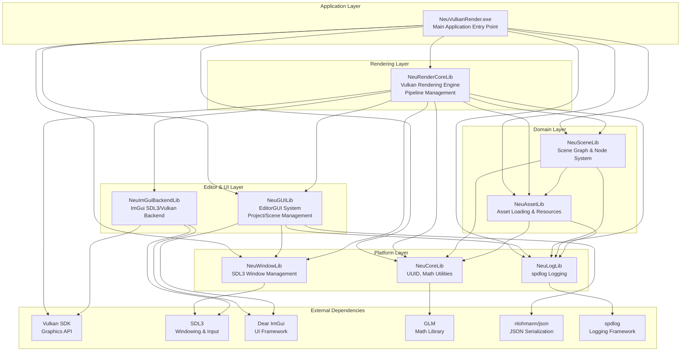
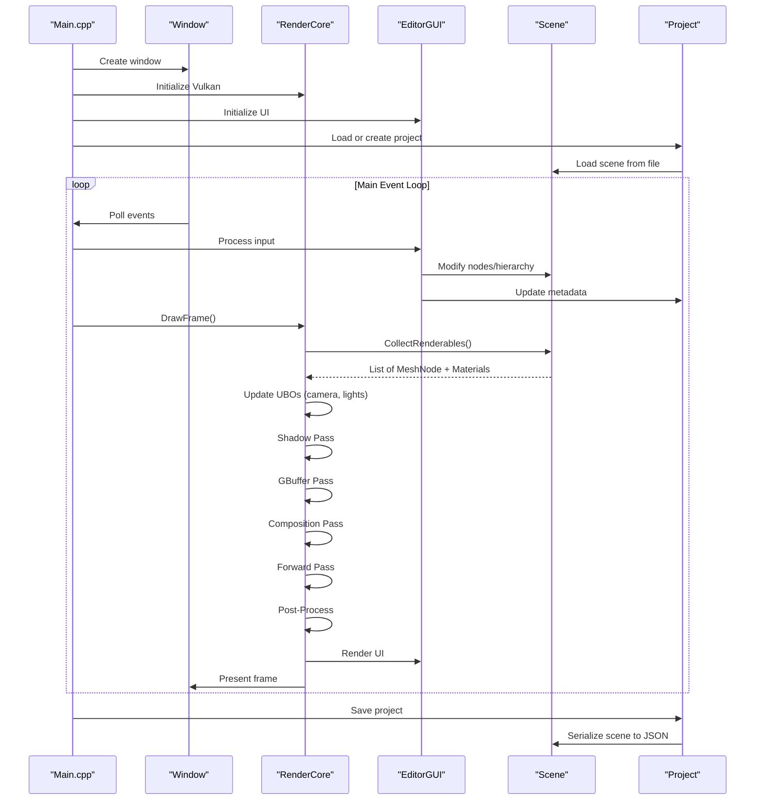

# Overview

Relevant source files

The following files were used as context for generating this wiki page:

- [README.md](README.md)
- [build/CMakeFiles/Makefile2](build/CMakeFiles/Makefile2)
- [build/CMakeFiles/NeuRenderCoreLib.dir/compiler_depend.make](build/CMakeFiles/NeuRenderCoreLib.dir/compiler_depend.make)
- [build/CMakeFiles/NeuVulkanRender.dir/compiler_depend.make](build/CMakeFiles/NeuVulkanRender.dir/compiler_depend.make)
- [build/NeuVulkanRender.exe](build/NeuVulkanRender.exe)

NeuVulkanRender is a Vulkan-based 3D rendering engine with an integrated editor for scene and project management. The system provides a complete environment for creating, editing, and rendering 3D scenes using modern graphics techniques including deferred rendering, physically-based materials, dynamic shadows, and post-processing effects. It is built as a modular collection of static libraries that separate concerns such as windowing, asset management, scene graphs, and rendering.

For details on the modular library architecture and build system, see [Application Architecture](#2). For comprehensive documentation of the rendering pipeline, see [Rendering System (RenderCore)](#3). For information on the editor interface and project management, see [Editor System (EditorGUI)](#4).

## System Purpose and Scope

This document provides a high-level overview of the entire NeuVulkanRender system, introducing its major components and how they relate to each other. It covers:

- The overall architecture and library organization
- Core subsystems and their responsibilities  
- Integration of external dependencies
- Data flow between components
- The application lifecycle

Specific implementation details of individual subsystems are documented in their respective sections (pages 2-7).

## Architecture Overview

NeuVulkanRender follows a layered architecture where platform-independent foundation libraries support domain-specific libraries, which are integrated by a core rendering library and unified by the main application executable.

**Sources**: [build/CMakeFiles/Makefile2:65-74](), [build/CMakeFiles/Makefile2:98-310]()

## Core Components

### NeuVulkanRender.exe

The main executable (`NeuVulkanRender.exe`) serves as the application entry point and orchestrates the initialization and lifecycle of all subsystems. It creates the window, initializes the rendering core, sets up the editor GUI, and runs the main event loop.

**Sources**: [build/NeuVulkanRender.exe:1-4](), [build/CMakeFiles/Makefile2:313-344]()

### NeuRenderCoreLib

The `NeuRenderCoreLib` library implements the Vulkan rendering engine, providing:

- **Vulkan initialization**: Instance, physical device selection, logical device creation
- **Swapchain management**: Presentation surface, image acquisition, frame synchronization
- **Rendering pipeline**: Multi-pass deferred/forward rendering with shadows and post-processing
- **Resource management**: Materials, textures, meshes with UUID-based caching
- **Descriptor management**: Layout creation, set allocation, binding

Key classes include `RenderCore` for the main rendering interface, `GBuffer` for deferred rendering, and `Material` for material management.

**Sources**: [build/CMakeFiles/Makefile2:281-310](), [include/RenderCore.h](), [include/GBuffer.h](), [include/Material.h]()

### NeuGUILib

The `NeuGUILib` library provides the editor interface using Dear ImGui, featuring:

- **Project management**: Create, load, save projects with JSON serialization
- **Scene hierarchy**: Tree view of scene nodes with selection and manipulation
- **Inspector panel**: Property editing for transforms, materials, and node-specific settings
- **Content browser**: Asset browsing and management
- **Viewport**: 3D rendering view with camera controls

The `EditorGUI` class manages the entire editor interface and integrates with the project and scene systems.

**Sources**: [build/CMakeFiles/Makefile2:173-197](), [include/Project/Project.h]()

### NeuSceneLib

The `NeuSceneLib` library implements the scene graph system with:

- **Scene**: Top-level container for the scene hierarchy
- **Node**: Base class for scene graph nodes with transform and hierarchy support
- **MeshNode**: Renders meshes with materials
- **CameraNode**: Provides camera view and projection
- **LightNode**: Point and directional lights

All nodes support parent-child relationships, active/inactive states, and JSON serialization.

**Sources**: [build/CMakeFiles/Makefile2:253-278]()

### NeuAssetLib

The `NeuAssetLib` library handles asset loading and resource management:

- **TextureResource**: Loads and manages textures from files
- **MeshResource**: Loads OBJ models using tiny_obj_loader
- **MaterialResource**: Contains texture references and material properties
- **CubeMapResource**: Loads and manages cube map textures
- **Skybox**: Renders environment skyboxes

All resources use UUID-based identification for stable references across serialization.

**Sources**: [build/CMakeFiles/Makefile2:226-250](), [include/Asset/TextureResource.h](), [include/Asset/MeshResource.h](), [include/Asset/MaterialResource.h]()

### Platform Libraries

**NeuWindowLib**: Wraps SDL3 for window creation, event handling, and input management. The `Window` class provides the main interface.

**NeuLogLib**: Wraps spdlog for structured logging with multiple severity levels and output targets.

**NeuCoreLib**: Provides core utilities including `UUID` generation, `Math` helper functions using GLM, and base `Object` class.

**NeuImGuiBackendLib**: Implements ImGui backends for SDL3 and Vulkan to enable the editor UI.

**Sources**: [build/CMakeFiles/Makefile2:121-170](), [build/CMakeFiles/Makefile2:95-118](), [build/CMakeFiles/Makefile2:200-223](), [build/CMakeFiles/Makefile2:147-170](), [include/Window.h](), [include/neuLog.h](), [include/Core/UUID.h](), [include/Core/Math.h]()

## Component Interaction and Data Flow

The following diagram illustrates how the major components interact during typical application execution:

**Sources**: [source/Main.cpp](), [include/RenderCore.h](), [include/Window.h](), [include/Project/Project.h]()

## Key Technologies and External Dependencies

NeuVulkanRender integrates several key external libraries:

| Library | Purpose | Usage |
|---------|---------|-------|
| **Vulkan SDK** | Low-level GPU API | All graphics rendering, compute, and resource management |
| **SDL3** | Windowing & Input | Cross-platform window creation, event handling, input processing |
| **Dear ImGui** | Immediate-mode GUI | All editor UI panels and controls |
| **GLM** | Mathematics | Vector/matrix operations, transformations, projections |
| **nlohmann/json** | JSON parsing | Project and scene serialization/deserialization |
| **spdlog** | Logging | Structured logging with multiple output targets |
| **tiny_obj_loader** | OBJ model loading | Mesh asset import from Wavefront OBJ files |
| **STB** | Image loading | Texture loading from various image formats |

**Sources**: [build/CMakeFiles/NeuVulkanRender.dir/compiler_depend.make:543-602](), [README.md:1-4]()

## Build System and Development Environment

The project uses CMake with MinGW makefiles on Windows x86_64. The build produces:

- 9 static libraries (`NeuLogLib.a`, `NeuWindowLib.a`, `NeuCoreLib.a`, `NeuAssetLib.a`, `NeuSceneLib.a`, `NeuGUILib.a`, `NeuImGuiBackendLib.a`, `NeuRenderCoreLib.a`)
- 1 executable (`NeuVulkanRender.exe`)
- 1 shader compilation target (`CompileShaders`)

The layered library structure ensures clean separation of concerns with well-defined dependency relationships.

**Sources**: [build/CMakeFiles/Makefile2:1-382](), [README.md:1-12]()

## Rendering Pipeline Overview

The rendering system implements a sophisticated multi-pass pipeline:

1. **Shadow Pass**: Generates shadow maps using PCSS (Percentage-Closer Soft Shadows)
2. **GBuffer Pass**: Writes geometry data (positions, normals, albedo, metallic-roughness) to multiple render targets
3. **Composition Pass**: Combines GBuffer data with lighting (IBL environment maps, PBR materials)
4. **Forward Pass**: Renders transparent objects
5. **TAA Pass**: Temporal anti-aliasing with super-resolution support
6. **Bloom Pass**: Extracts bright regions and applies Gaussian blur
7. **Post-Process Pass**: Tone mapping, gamma correction, SSAO

The system uses triple-buffering with fence/semaphore synchronization for smooth frame pacing.

**Sources**: Diagrams from high-level system architecture analysis, [include/RenderCore.h](), [include/GBuffer.h]()

## Editor Features

The integrated editor provides:

- **Project System**: JSON-based projects storing scene paths, asset directories, and editor settings
- **Scene Hierarchy**: Tree view with drag-drop support for node organization
- **Inspector**: Context-sensitive property editors for transforms, materials, cameras, lights
- **Content Browser**: File system navigation and asset preview
- **Viewport**: Interactive 3D view with free-camera controls (WASD movement, mouse look)
- **Docking**: Flexible panel layout with save/restore

**Sources**: README.md analysis showing camera controls, [include/Project/Project.h]()

---
