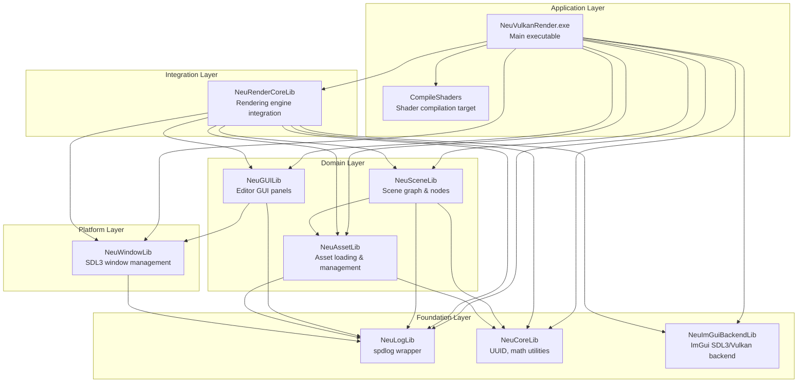
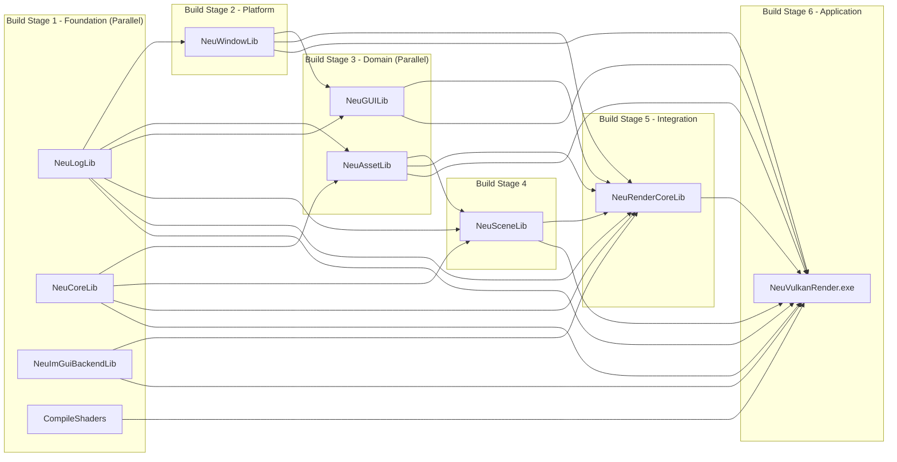
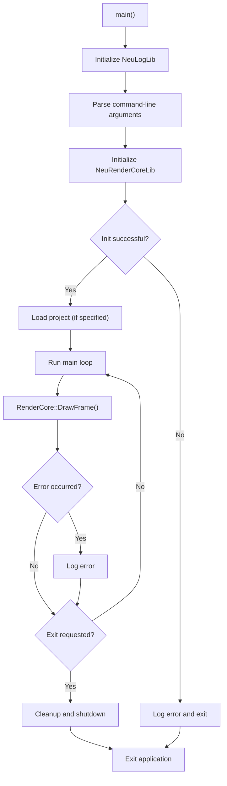

# Application Architecture

Relevant source files

The following files were used as context for generating this wiki page:

- [build/CMakeFiles/Makefile2](build/CMakeFiles/Makefile2)
- [build/CMakeFiles/NeuRenderCoreLib.dir/compiler_depend.make](build/CMakeFiles/NeuRenderCoreLib.dir/compiler_depend.make)
- [build/CMakeFiles/NeuVulkanRender.dir/compiler_depend.make](build/CMakeFiles/NeuVulkanRender.dir/compiler_depend.make)
- [build/CMakeFiles/NeuVulkanRender.dir/source/Main.cpp.obj](build/CMakeFiles/NeuVulkanRender.dir/source/Main.cpp.obj)

## Purpose and Scope

This document provides an overview of NeuVulkanRender's modular library architecture, build system organization, and component integration patterns. It describes the layered design of internal libraries, their dependency relationships, and how they are compiled together to form the final application.

For detailed information about:
- Main executable initialization and lifecycle, see [Main Application Entry Point](#2.1)
- CMake build configuration and dependency details, see [Library Dependencies and Build System](#2.2)
- Rendering system implementation, see [Rendering System (RenderCore)](#3)
- Editor implementation, see [Editor System (EditorGUI)](#4)

## Architectural Overview

NeuVulkanRender follows a **layered modular architecture** where functionality is divided into 10 distinct static libraries, each with clearly defined responsibilities and dependency constraints. Libraries are organized in layers from foundation to application, ensuring unidirectional dependencies and separation of concerns.

The architecture enforces a strict dependency hierarchy: higher-layer libraries may depend on lower-layer libraries, but never the reverse. This design promotes maintainability, testability, and clear ownership of functionality.

### Layered Architecture Diagram

**Sources:** [build/CMakeFiles/Makefile2:65-382]()

## Library Dependency Matrix

The following table shows the complete dependency graph for all internal libraries. An "X" indicates that the row library depends on the column library.

| Library | NeuLogLib | NeuCoreLib | NeuWindowLib | NeuImGuiBackendLib | NeuAssetLib | NeuGUILib | NeuSceneLib | NeuRenderCoreLib |
|---------|-----------|------------|--------------|---------------------|-------------|-----------|-------------|------------------|
| **NeuLogLib** | - | | | | | | | |
| **NeuCoreLib** | | - | | | | | | |
| **NeuImGuiBackendLib** | | | | - | | | | |
| **NeuWindowLib** | X | | - | | | | | |
| **NeuAssetLib** | X | X | | | - | | | |
| **NeuGUILib** | X | | X | | | - | | |
| **NeuSceneLib** | X | X | | | X | | - | |
| **NeuRenderCoreLib** | X | X | X | X | X | X | X | - |

**Sources:** [build/CMakeFiles/Makefile2:98-324]()

## Library Descriptions

### Foundation Layer

#### NeuLogLib
- **Purpose:** Logging infrastructure wrapper around spdlog
- **Dependencies:** None
- **Key Features:** Logger initialization, log level management, formatted output
- **Build Target:** Static library (`libNeuLogLib.a`)

#### NeuCoreLib
- **Purpose:** Core utilities and data structures
- **Dependencies:** None
- **Key Features:** UUID generation and management, common math utilities, base types
- **Build Target:** Static library (`libNeuCoreLib.a`)

#### NeuImGuiBackendLib
- **Purpose:** ImGui rendering backend implementation
- **Dependencies:** None (uses external SDL3 and Vulkan)
- **Key Features:** SDL3 platform backend, Vulkan renderer backend for ImGui
- **Build Target:** Static library (`libNeuImGuiBackendLib.a`)

**Sources:** [build/CMakeFiles/Makefile2:95-170]()

### Platform Layer

#### NeuWindowLib
- **Purpose:** Window and input management
- **Dependencies:** NeuLogLib
- **Key Features:** SDL3 window creation, event handling, input polling
- **Build Target:** Static library (`libNeuWindowLib.a`)

**Sources:** [build/CMakeFiles/Makefile2:121-144]()

### Domain Layer

#### NeuAssetLib
- **Purpose:** Asset loading and resource management
- **Dependencies:** NeuLogLib, NeuCoreLib
- **Key Features:** Model loading (OBJ), texture loading, mesh data management, material resources
- **Build Target:** Static library (`libNeuAssetLib.a`)

**Sources:** [build/CMakeFiles/Makefile2:225-250]()

#### NeuGUILib
- **Purpose:** Editor GUI implementation
- **Dependencies:** NeuLogLib, NeuWindowLib
- **Key Features:** Scene hierarchy panel, inspector panel, content browser, project management
- **Build Target:** Static library (`libNeuGUILib.a`)

**Sources:** [build/CMakeFiles/Makefile2:173-197]()

#### NeuSceneLib
- **Purpose:** Scene graph and node hierarchy
- **Dependencies:** NeuLogLib, NeuAssetLib, NeuCoreLib
- **Key Features:** Scene management, polymorphic node types (MeshNode, CameraNode, LightNode), transform hierarchies
- **Build Target:** Static library (`libNeuSceneLib.a`)

**Sources:** [build/CMakeFiles/Makefile2:253-278]()

### Integration Layer

#### NeuRenderCoreLib
- **Purpose:** Vulkan rendering engine integration
- **Dependencies:** All lower-layer libraries
- **Key Features:** Vulkan initialization, rendering pipeline orchestration, resource binding, frame synchronization
- **Build Target:** Static library (`libNeuRenderCoreLib.a`)

**Sources:** [build/CMakeFiles/Makefile2:281-310]()

### Application Layer

#### NeuVulkanRender.exe
- **Purpose:** Main executable entry point
- **Dependencies:** All libraries
- **Key Features:** Application initialization, main loop, command-line argument parsing
- **Build Target:** Executable

#### CompileShaders
- **Purpose:** Shader compilation build target
- **Dependencies:** None (standalone)
- **Key Features:** Compiles GLSL to SPIR-V using glslangValidator
- **Build Target:** Custom build target (not a library)

**Sources:** [build/CMakeFiles/Makefile2:313-370]()

## Build System Architecture

### Build Order and Parallelization

The CMake build system enforces a specific build order based on library dependencies. The Makefile defines parallel build groups:

**Sources:** [build/CMakeFiles/Makefile2:65-382]()

### CMake Build Configuration

The build system uses **MinGW Makefiles** generator with CMake 3.28. Key build characteristics:

- **Compiler:** GCC 14.1.0 (MinGW-w64)
- **C++ Standard:** C++17 (`-std=gnu++17`)
- **Build Type:** Debug (`-g` flag)
- **Platform:** Windows x86_64
- **Library Type:** Static libraries (`.a` files)

The main executable depends on all libraries and the shader compilation target, ensuring shaders are compiled before the application runs.

**Sources:** [build/CMakeFiles/Makefile2:1-60](), [build/CMakeFiles/NeuVulkanRender.dir/compiler_depend.make:1-10]()

## External Dependencies

NeuVulkanRender integrates several external libraries, included as header-only or pre-compiled dependencies. These are not part of the internal modular architecture but are used throughout the codebase:

| Dependency | Purpose | Used By |
|------------|---------|---------|
| **SDL3** | Windowing, events, input | NeuWindowLib, NeuImGuiBackendLib |
| **Vulkan SDK** | Graphics API | NeuRenderCoreLib, NeuImGuiBackendLib |
| **ImGui** | Immediate-mode GUI framework | NeuGUILib, NeuImGuiBackendLib |
| **GLM** | Mathematics library (vectors, matrices) | NeuCoreLib, NeuRenderCoreLib, NeuSceneLib |
| **nlohmann/json** | JSON serialization | NeuGUILib (project files), NeuSceneLib |
| **spdlog** | Logging framework | NeuLogLib |
| **fmt** | String formatting (spdlog dependency) | NeuLogLib |
| **tiny_obj_loader** | OBJ model loading | NeuAssetLib |
| **STB** | Image loading (likely stb_image) | NeuAssetLib |

For detailed information about external dependencies, see [External Dependencies](#7).

**Sources:** [build/CMakeFiles/NeuVulkanRender.dir/compiler_depend.make:1-491]()

## Main Application Structure

The main executable (`NeuVulkanRender.exe`) serves as the integration point for all libraries. The application follows this high-level flow:

The main function is defined in `source/Main.cpp` and orchestrates the initialization, main loop, and shutdown of all systems. It handles error conditions and ensures proper cleanup of resources.

For detailed information about the main application entry point, see [Main Application Entry Point](#2.1).

**Sources:** [build/CMakeFiles/NeuVulkanRender.dir/source/Main.cpp.obj:1-520]()

## Component Interaction Patterns

The architecture enforces several key interaction patterns:

1. **Dependency Injection:** Higher-level components receive lower-level dependencies (e.g., RenderCore receives Window, Scene, Asset managers)

2. **Event Flow:** User input flows from SDL3 → NeuWindowLib → NeuGUILib/NeuRenderCoreLib

3. **Resource Management:** UUID-based resource references flow from NeuSceneLib through NeuAssetLib to NeuRenderCoreLib

4. **Logging:** All libraries use NeuLogLib for consistent logging output

5. **Frame Rendering:** NeuRenderCoreLib orchestrates rendering by querying NeuSceneLib for renderable objects and NeuAssetLib for resource data

This architecture ensures clear separation of concerns while maintaining efficient data flow through the application.

**Sources:** [build/CMakeFiles/Makefile2:65-382]()

---
