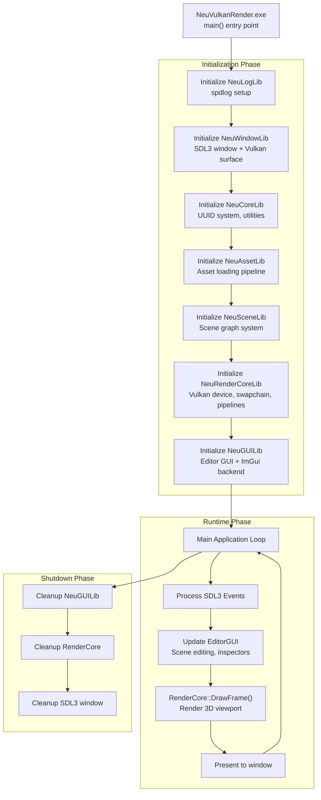
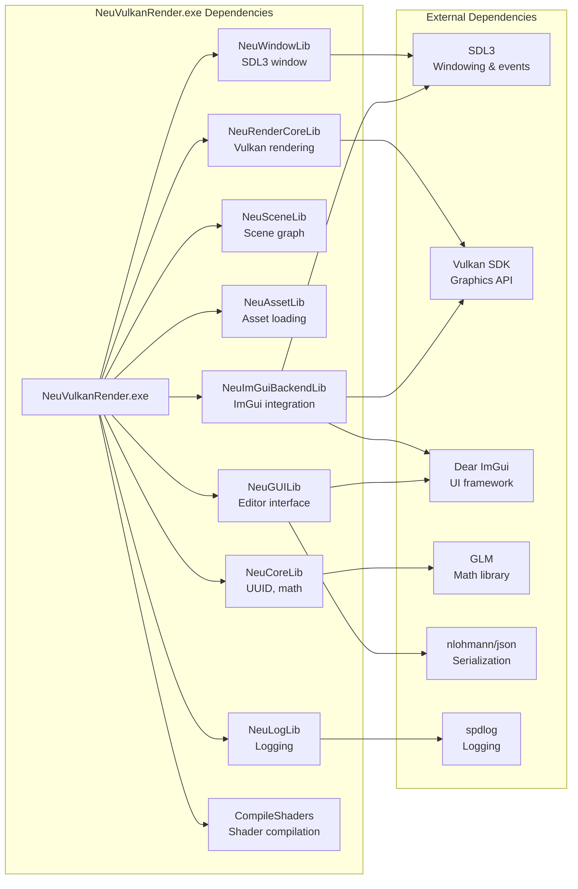
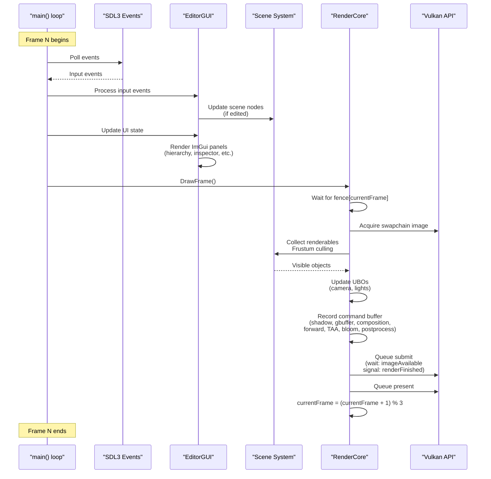
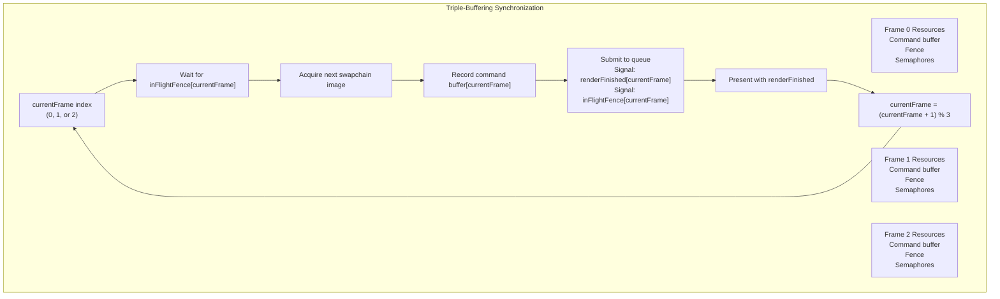
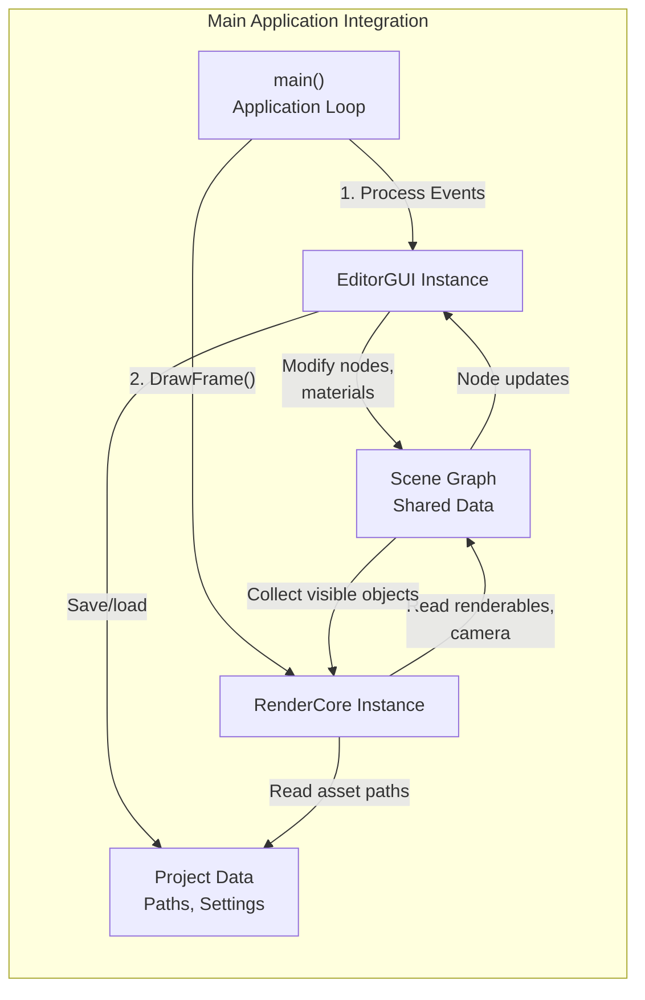

# Main Application Entry Point

Relevant source files

The following files were used as context for generating this wiki page:

- [build/CMakeFiles/NeuVulkanRender.dir/objects.a](build/CMakeFiles/NeuVulkanRender.dir/objects.a)
- [build/CMakeFiles/NeuVulkanRender.dir/source/Main.cpp.obj](build/CMakeFiles/NeuVulkanRender.dir/source/Main.cpp.obj)
- [build/NeuVulkanRender.exe](build/NeuVulkanRender.exe)

This page documents the main executable entry point of NeuVulkanRender (`NeuVulkanRender.exe`), which serves as the top-level orchestrator that initializes and coordinates all subsystems including the rendering engine, editor GUI, scene management, and asset loading. This page focuses on the application lifecycle, initialization sequence, and how the executable integrates the modular library architecture.

For details on the CMake build system and library structure, see [Library Dependencies and Build System](#2.2). For the rendering engine initialization, see [Vulkan Initialization and Setup](#3.1). For editor UI details, see [Editor Interface and Panels](#4.1).

## Purpose and Scope

The main application executable (`NeuVulkanRender.exe`) is the entry point for the entire NeuVulkanRender system. It is responsible for:

- Initializing the application environment and all subsystem libraries
- Creating the main window and Vulkan rendering context  
- Instantiating the EditorGUI and RenderCore systems
- Running the main application loop
- Coordinating frame rendering, input processing, and editor updates
- Managing the application lifecycle from startup to shutdown

## Application Architecture

The main executable follows a layered initialization pattern where it serves as the integration point for all modular libraries in the system.

**Sources:** Diagrams 1, 2, and 6 from high-level architecture analysis

## Library Dependencies

The main executable links against all library modules in the system, establishing the complete dependency graph.

**Sources:** Diagram 2 (Build System and Library Dependencies), Diagram 5 (External Dependencies)

## Initialization Sequence

The application follows a strict initialization order to ensure all dependencies are available before dependent systems are created.

### Phase 1: Foundation Libraries

| Order | Library | Purpose | Key Initialization |
|-------|---------|---------|-------------------|
| 1 | `NeuLogLib` | Logging infrastructure | Set up spdlog with file and console sinks |
| 2 | `NeuCoreLib` | Core utilities | Initialize UUID generator, math constants |
| 3 | `NeuWindowLib` | Platform windowing | Create SDL3 window, Vulkan surface |

### Phase 2: Domain Libraries

| Order | Library | Purpose | Key Initialization |
|-------|---------|---------|-------------------|
| 4 | `NeuAssetLib` | Asset management | Initialize asset cache, default resources |
| 5 | `NeuSceneLib` | Scene graph | Create root scene node, camera setup |

### Phase 3: Integration Libraries

| Order | Library | Purpose | Key Initialization |
|-------|---------|---------|-------------------|
| 6 | `NeuImGuiBackendLib` | ImGui backend | Initialize ImGui context for SDL3+Vulkan |
| 7 | `NeuRenderCoreLib` | Vulkan rendering | Create device, swapchain, pipelines, descriptors |
| 8 | `NeuGUILib` | Editor GUI | Create editor panels, project system |

**Sources:** Diagram 1 (Overall System Architecture), Diagram 2 (Build System)

## Main Application Loop

The main loop follows a typical game engine pattern with event processing, update, and rendering phases.

**Sources:** Diagram 6 (Data Flow and Synchronization), Diagram 3 (Rendering Pipeline Architecture)

## Frame Synchronization

The application uses triple-buffering with `MAX_FRAMES_IN_FLIGHT=3` to allow the CPU to prepare frames while the GPU processes previous frames.

**Sources:** Diagram 6 (Data Flow and Synchronization), section on triple-buffering

## Subsystem Integration

The main application acts as the coordinator between the EditorGUI and RenderCore subsystems.

### EditorGUI Integration

The main executable creates and manages the `EditorGUI` instance, which provides:

- **Project Management**: Load/save project files via JSON serialization
- **Scene Hierarchy**: Tree view of scene nodes with CRUD operations
- **Inspector Panel**: Property editing for selected scene nodes
- **Content Browser**: Asset management and preview
- **Viewport**: 3D rendering viewport (delegated to RenderCore)

### RenderCore Integration

The main executable creates the `RenderCore` instance, which handles:

- **Vulkan Device Management**: Physical device selection, logical device creation
- **Swapchain Management**: Window resize handling, VSync control
- **Rendering Pipeline**: Multi-pass rendering (deferred, forward, post-processing)
- **Resource Management**: Materials, textures, meshes via UUID-based caching
- **Camera Control**: First-person camera input processing

**Sources:** Diagram 1 (Overall System Architecture), Diagram 4 (Editor GUI and Project Management)

## Error Handling and Logging

The main application initializes the logging system early and uses it throughout the application lifecycle.

### Logging Configuration

The `NeuLogLib` wrapper around `spdlog` is initialized with:
- Console sink for real-time debugging
- File sink for persistent logs
- Configurable log levels (trace, debug, info, warn, error, critical)

### Critical Error Handling

The main application handles critical errors from subsystems:

1. **Window Creation Failure**: SDL3 fails to create window or Vulkan surface
2. **Vulkan Initialization Failure**: No suitable GPU, extension missing, etc.
3. **Shader Compilation Failure**: SPIR-V shaders failed to compile
4. **Resource Loading Failure**: Critical assets missing (default textures, etc.)

On critical failure, the application logs the error and performs graceful shutdown.

**Sources:** Diagram 5 (External Dependencies - spdlog), Diagram 2 (Library Dependencies)

## Application Shutdown

The shutdown sequence reverses the initialization order to ensure clean resource deallocation.

### Shutdown Order

| Order | Action | Purpose |
|-------|--------|---------|
| 1 | Stop main loop | Exit event processing loop |
| 2 | Cleanup `EditorGUI` | Save project state, destroy ImGui context |
| 3 | Cleanup `RenderCore` | Wait for GPU idle, destroy Vulkan resources |
| 4 | Cleanup `SceneLib` | Free scene graph nodes |
| 5 | Cleanup `AssetLib` | Release cached assets (textures, meshes) |
| 6 | Cleanup `ImGuiBackendLib` | Destroy ImGui Vulkan/SDL3 backend |
| 7 | Cleanup `WindowLib` | Destroy SDL3 window and Vulkan surface |
| 8 | Cleanup `LogLib` | Flush log buffers |

### GPU Synchronization on Shutdown

Before destroying Vulkan resources, the application ensures all in-flight frames are complete:

```mermaid
graph LR
    ShutdownStart["Shutdown Initiated"]
    WaitIdle["vkDeviceWaitIdle()"]
    DestroyPipelines["Destroy Pipelines"]
    DestroyDescriptors["Destroy Descriptor Sets/Pools"]
    DestroyBuffers["Destroy Buffers"]
    DestroyImages["Destroy Images/Views"]
    DestroySwapchain["Destroy Swapchain"]
    DestroyDevice["Destroy Logical Device"]
    
    ShutdownStart --> WaitIdle
    WaitIdle --> DestroyPipelines
    DestroyPipelines --> DestroyDescriptors
    DestroyDescriptors --> DestroyBuffers
    DestroyBuffers --> DestroyImages
    DestroyImages --> DestroySwapchain
    DestroySwapchain --> DestroyDevice
```

**Sources:** Diagram 6 (Data Flow and Synchronization), Diagram 3 (Rendering Pipeline)

## Build Configuration

The main executable is built with the following configuration (from CMake):

- **Compiler**: MinGW GCC (Windows x86_64)
- **Build Type**: Static linking for all libraries
- **Output**: `build/NeuVulkanRender.exe`
- **Dependencies**: All internal libraries + external dependencies (SDL3, Vulkan, ImGui, GLM, nlohmann/json, spdlog)
- **Shader Compilation**: Depends on `CompileShaders` target to generate SPIR-V shaders

**Sources:** [build/NeuVulkanRender.exe](), Diagram 2 (Build System and Library Dependencies)

## Platform Considerations

### Windows-Specific

The application is built for Windows x86_64 with:
- MinGW static libraries (no DLL dependencies beyond system libraries)
- Vulkan SDK for Windows
- SDL3 for Windows windowing

### Portability

The modular architecture allows for cross-platform support:
- `NeuWindowLib` abstracts SDL3 windowing (cross-platform by design)
- `NeuRenderCoreLib` uses Vulkan (cross-platform graphics API)
- External dependencies (SDL3, Vulkan, ImGui) are all cross-platform

**Sources:** Diagram 5 (External Dependencies and Platform Integration), Diagram 2 (Build System)

---
