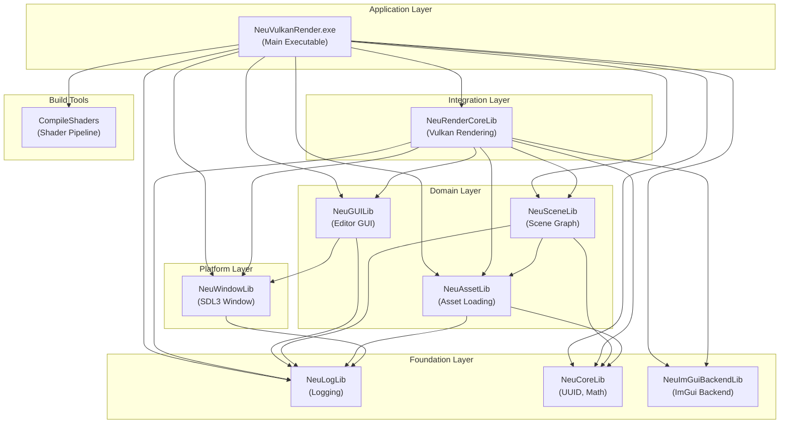
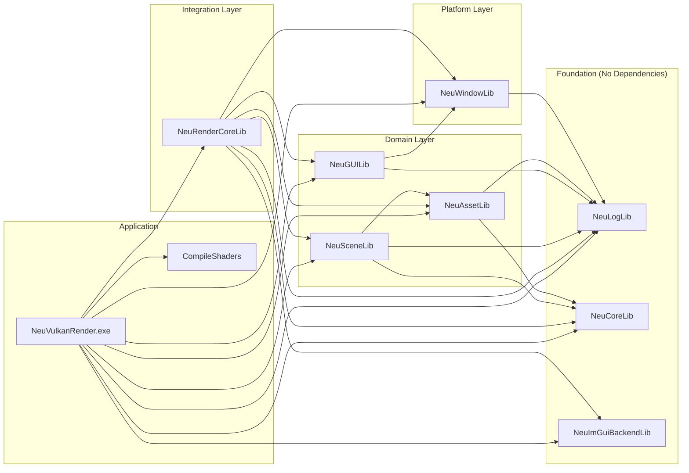

# Library Dependencies and Build System

<details>
<summary>Relevant source files</summary>

The following files were used as context for generating this wiki page:

- [build/CMakeFiles/Makefile2](build/CMakeFiles/Makefile2)
- [build/CMakeFiles/NeuGUILib.dir/progress.make](build/CMakeFiles/NeuGUILib.dir/progress.make)
- [build/CMakeFiles/NeuImGuiBackendLib.dir/compiler_depend.make](build/CMakeFiles/NeuImGuiBackendLib.dir/compiler_depend.make)
- [build/CMakeFiles/NeuImGuiBackendLib.dir/progress.make](build/CMakeFiles/NeuImGuiBackendLib.dir/progress.make)
- [build/CMakeFiles/NeuLogLib.dir/compiler_depend.make](build/CMakeFiles/NeuLogLib.dir/compiler_depend.make)
- [build/CMakeFiles/NeuLogLib.dir/progress.make](build/CMakeFiles/NeuLogLib.dir/progress.make)
- [build/CMakeFiles/NeuRenderCoreLib.dir/progress.make](build/CMakeFiles/NeuRenderCoreLib.dir/progress.make)
- [build/CMakeFiles/NeuVulkanRender.dir/progress.make](build/CMakeFiles/NeuVulkanRender.dir/progress.make)
- [build/CMakeFiles/NeuWindowLib.dir/compiler_depend.make](build/CMakeFiles/NeuWindowLib.dir/compiler_depend.make)
- [build/CMakeFiles/NeuWindowLib.dir/progress.make](build/CMakeFiles/NeuWindowLib.dir/progress.make)
- [build/CMakeFiles/progress.marks](build/CMakeFiles/progress.marks)

</details>


This document details the CMake-based build system architecture, internal library dependencies, and external library integration for NeuVulkanRender. It explains the modular library structure, build order, and compilation configuration. For information about the main application entry point and initialization sequence, see [Main Application Entry Point](#2.1). For detailed usage patterns of external dependencies, see [External Dependencies](#7).

---

## Build System Overview

NeuVulkanRender uses **CMake 3.28** with the **MinGW Makefiles** generator on Windows x86_64. The build system compiles the project as a collection of **static libraries** (`.a` files) that are linked into a final executable. The project also includes a **CompileShaders** custom target that compiles GLSL shaders to SPIR-V format before the main executable build.

The build process is orchestrated through CMake-generated makefiles that manage dependencies, compilation order, and linking. All internal libraries are built as static libraries with symbol export macros for API visibility control.

**Sources:** [build/CMakeFiles/Makefile2:1-382]()

---

## Internal Library Architecture

The project is organized into **9 internal static libraries** plus the main executable. These libraries follow a layered architecture where higher-level libraries depend on lower-level libraries, but not vice-versa. This design enforces clear separation of concerns and prevents circular dependencies.

### Library Layers and Purposes

| Layer | Libraries | Purpose |
|-------|-----------|---------|
| **Foundation** | `NeuLogLib`, `NeuCoreLib`, `NeuImGuiBackendLib` | Logging, core utilities (UUID, math), ImGui integration with SDL3/Vulkan |
| **Platform** | `NeuWindowLib` | SDL3 window management and event handling |
| **Domain** | `NeuAssetLib`, `NeuGUILib`, `NeuSceneLib` | Asset loading, editor GUI, scene graph management |
| **Integration** | `NeuRenderCoreLib` | Vulkan rendering engine, integrates all subsystems |
| **Application** | `NeuVulkanRender.exe` | Main executable, links all libraries |
| **Build Tools** | `CompileShaders` | Shader compilation pipeline (GLSL → SPIR-V) |



**Sources:** [build/CMakeFiles/Makefile2:65-74](), [build/CMakeFiles/Makefile2:98-353]()

---

## Internal Library Dependency Graph

The following diagram shows the precise dependency relationships between internal libraries, mapping to the actual build system rules defined in CMake:



### Build Order

Based on the dependency graph, the libraries are compiled in the following order:

1. **Foundation Libraries** (no internal dependencies):
   - `NeuLogLib` - Logging system wrapper around spdlog
   - `NeuCoreLib` - Core utilities (UUID generation, math helpers)
   - `NeuImGuiBackendLib` - ImGui backend for SDL3 and Vulkan

2. **Platform Layer** (depends only on Foundation):
   - `NeuWindowLib` - SDL3 window management → depends on `NeuLogLib`

3. **Domain Layer** (depends on Foundation and Platform):
   - `NeuAssetLib` - Asset loading → depends on `NeuLogLib`, `NeuCoreLib`
   - `NeuGUILib` - Editor GUI → depends on `NeuLogLib`, `NeuWindowLib`
   - `NeuSceneLib` - Scene graph → depends on `NeuLogLib`, `NeuAssetLib`, `NeuCoreLib`

4. **Integration Layer** (depends on all lower layers):
   - `NeuRenderCoreLib` - Vulkan rendering engine → depends on all 7 libraries above

5. **Application Layer**:
   - `CompileShaders` - Shader compilation (parallel to library compilation)
   - `NeuVulkanRender.exe` - Main executable → depends on all libraries + `CompileShaders`

**Sources:** [build/CMakeFiles/Makefile2:124-127](), [build/CMakeFiles/Makefile2:176-180](), [build/CMakeFiles/Makefile2:229-233](), [build/CMakeFiles/Makefile2:256-261](), [build/CMakeFiles/Makefile2:284-293](), [build/CMakeFiles/Makefile2:316-327]()

---

## External Dependencies by Library

Each internal library depends on specific external libraries and system headers. The following table maps each library to its external dependencies:

| Internal Library | External Dependencies | Purpose |
|------------------|----------------------|---------|
| **NeuLogLib** | `spdlog`, `fmt` | High-performance structured logging with formatting |
| **NeuCoreLib** | C++ Standard Library, `glm` (likely) | UUID generation, math utilities, core data structures |
| **NeuImGuiBackendLib** | `ImGui`, `SDL3`, `Vulkan` | Immediate-mode GUI backend implementation |
| **NeuWindowLib** | `SDL3`, Windows API, `pthread` | Cross-platform window/event handling with threading |
| **NeuAssetLib** | `tiny_obj_loader`, `stb_image` (likely), C++ STL | OBJ model loading, texture loading |
| **NeuGUILib** | `ImGui`, `nlohmann/json` (likely) | Editor UI, project serialization |
| **NeuSceneLib** | `glm`, `nlohmann/json` (likely), C++ STL | 3D math, scene serialization |
| **NeuRenderCoreLib** | `Vulkan SDK`, `glm`, C++ STL | GPU rendering, 3D transformations |
| **NeuVulkanRender.exe** | All of the above transitively | Final executable links all dependencies |

### External Dependencies Diagram

```mermaid
graph TB
    subgraph "Graphics & Windowing"
        SDL3["SDL3<br/>(Window/Events/Input)"]
        Vulkan["Vulkan SDK<br/>(Graphics API)"]
        ImGui["Dear ImGui<br/>(GUI Framework)"]
    end
    
    subgraph "Mathematics & Utilities"
        GLM["GLM<br/>(Math Library)"]
        JSON["nlohmann/json<br/>(Serialization)"]
    end
    
    subgraph "Logging & Formatting"
        spdlog["spdlog<br/>(Logging)"]
        fmt["fmt<br/>(Formatting)"]
    end
    
    subgraph "Asset Loading"
        TinyObj["tiny_obj_loader<br/>(OBJ Models)"]
        STB["STB Libraries<br/>(Image Loading)"]
    end
    
    subgraph "System Libraries"
        WinAPI["Windows API"]
        pthread["pthread<br/>(Threading)"]
        CppSTL["C++ Standard Library"]
    end
    
    NeuLogLib["NeuLogLib"] --> spdlog
    spdlog --> fmt
    
    NeuWindowLib["NeuWindowLib"] --> SDL3
    NeuWindowLib --> WinAPI
    NeuWindowLib --> pthread
    NeuWindowLib --> CppSTL
    
    NeuImGuiBackendLib["NeuImGuiBackendLib"] --> ImGui
    NeuImGuiBackendLib --> SDL3
    NeuImGuiBackendLib --> Vulkan
    
    NeuAssetLib["NeuAssetLib"] --> TinyObj
    NeuAssetLib --> STB
    NeuAssetLib --> CppSTL
    
    NeuGUILib["NeuGUILib"] --> ImGui
    NeuGUILib --> JSON
    
    NeuSceneLib["NeuSceneLib"] --> GLM
    NeuSceneLib --> JSON
    NeuSceneLib --> CppSTL
    
    NeuRenderCoreLib["NeuRenderCoreLib"] --> Vulkan
    NeuRenderCoreLib --> GLM
    NeuRenderCoreLib --> CppSTL
```



**Sources:** [build/CMakeFiles/NeuLogLib.dir/compiler_depend.make:202-227](), [build/CMakeFiles/NeuWindowLib.dir/compiler_depend.make:451-507](), [build/CMakeFiles/NeuImGuiBackendLib.dir/compiler_depend.make:287-349]()

---

## Library Details

### NeuLogLib

**Type:** Static library (`.a`)  
**Dependencies:** None (foundation)  
**External Dependencies:** `spdlog`, `fmt`

`NeuLogLib` provides a logging abstraction layer built on top of `spdlog`. The library includes:
- Async logging support via `spdlog/async.h`
- Color console output via `spdlog/sinks/stdout_color_sinks.h` and `spdlog/sinks/wincolor_sink.h`
- Export macro `neulog_export.h` for DLL visibility control

**Key Source Files:**
- [source/neuLog.cpp]() - Implementation
- [include/neuLog.h]() - Public API

**Sources:** [build/CMakeFiles/Makefile2:98-102](), [build/CMakeFiles/NeuLogLib.dir/compiler_depend.make:4-227]()

---

### NeuCoreLib

**Type:** Static library (`.a`)  
**Dependencies:** None (foundation)  
**External Dependencies:** C++ STL, likely GLM

`NeuCoreLib` provides core utilities used across the entire codebase:
- UUID generation and management (referenced in architecture diagrams)
- Math utilities and helper functions
- Common data structures and type definitions

**Sources:** [build/CMakeFiles/Makefile2:203-206]()

---

### NeuImGuiBackendLib

**Type:** Static library (`.a`)  
**Dependencies:** None (foundation)  
**External Dependencies:** `ImGui`, `SDL3`, `Vulkan`

`NeuImGuiBackendLib` implements custom ImGui backends for SDL3 and Vulkan integration. The library bridges ImGui's immediate-mode rendering with Vulkan command buffers and SDL3 input handling.

**Key Source Files:**
- [source/imgui_impl_sdl3.cpp]() - SDL3 platform backend
- [source/imgui_impl_vulkan.cpp]() - Vulkan renderer backend
- [include/imgui_impl_sdl3.h]() - SDL3 backend API
- [include/imgui_impl_vulkan.h]() - Vulkan backend API

**External Headers Used:**
- `imgui.h`, `imconfig.h` - Core ImGui
- `SDL3/SDL.h` and 50+ SDL3 subsystem headers - Platform layer
- `vulkan/vulkan.h`, `vulkan/vulkan_core.h` - Graphics API
- Video codec headers (`vk_video/vulkan_video_codec_*.h`) - Vulkan video extensions

**Sources:** [build/CMakeFiles/Makefile2:150-153](), [build/CMakeFiles/NeuImGuiBackendLib.dir/compiler_depend.make:4-349]()

---

### NeuWindowLib

**Type:** Static library (`.a`)  
**Dependencies:** `NeuLogLib`  
**External Dependencies:** `SDL3`, Windows API, `pthread`

`NeuWindowLib` wraps SDL3 functionality to provide window management, event handling, and input processing. It integrates with the logging system for diagnostics.

**Key Source Files:**
- [source/Window.cpp]() - Implementation
- [include/Window.h]() - Public API
- [neuwindow_export.h]() - Export macros

**External Dependencies Detail:**
- **SDL3:** Full SDL3 API including video, events, input, gamepad, audio, GPU, etc.
- **Windows API:** Platform-specific functionality (window creation, COM, RPC, shell integration)
- **pthread:** Threading support via MinGW's pthread implementation

**Sources:** [build/CMakeFiles/Makefile2:124-127](), [build/CMakeFiles/NeuWindowLib.dir/compiler_depend.make:4-507]()

---

### NeuAssetLib

**Type:** Static library (`.a`)  
**Dependencies:** `NeuLogLib`, `NeuCoreLib`  
**External Dependencies:** `tiny_obj_loader`, likely `stb_image`

`NeuAssetLib` handles loading of external assets including 3D models and textures. It uses UUIDs from `NeuCoreLib` for stable asset references and logs operations via `NeuLogLib`.

**Compilation Units:** 8 object files (visible in progress tracking)

**Sources:** [build/CMakeFiles/Makefile2:229-233]()

---

### NeuGUILib

**Type:** Static library (`.a`)  
**Dependencies:** `NeuLogLib`, `NeuWindowLib`  
**External Dependencies:** `ImGui`, likely `nlohmann/json`

`NeuGUILib` implements the editor GUI system using ImGui. It builds on `NeuWindowLib` for windowing and integrates with logging. Provides panels for scene hierarchy, inspector, content browser, etc.

**Compilation Units:** 2 object files

**Sources:** [build/CMakeFiles/Makefile2:176-180]()

---

### NeuSceneLib

**Type:** Static library (`.a`)  
**Dependencies:** `NeuLogLib`, `NeuAssetLib`, `NeuCoreLib`  
**External Dependencies:** `glm`, likely `nlohmann/json`

`NeuSceneLib` implements the scene graph system with polymorphic node types (MeshNode, CameraNode, LightNode). Uses assets from `NeuAssetLib`, UUIDs from `NeuCoreLib`, and GLM for 3D transformations.

**Compilation Units:** 8 object files

**Sources:** [build/CMakeFiles/Makefile2:256-261]()

---

### NeuRenderCoreLib

**Type:** Static library (`.a`)  
**Dependencies:** All 7 libraries above  
**External Dependencies:** Vulkan SDK, GLM

`NeuRenderCoreLib` is the integration layer that synthesizes all subsystems into a cohesive Vulkan rendering engine. It depends on:
- `NeuLogLib` - Rendering diagnostics
- `NeuWindowLib` - Window surface creation
- `NeuAssetLib` - Loading meshes/textures
- `NeuImGuiBackendLib` - Rendering editor UI
- `NeuSceneLib` - Scene traversal and rendering
- `NeuCoreLib` - Math and utilities
- `NeuGUILib` - Editor integration

**Compilation Units:** 4 object files

**Sources:** [build/CMakeFiles/Makefile2:284-293]()

---

### NeuVulkanRender (Main Executable)

**Type:** Executable (`.exe`)  
**Dependencies:** All internal libraries + `CompileShaders`  
**External Dependencies:** All external dependencies transitively

The main executable links all internal libraries and serves as the application entry point. It depends on `CompileShaders` to ensure shaders are compiled before the executable runs.

**Compilation Units:** 2 object files

**Sources:** [build/CMakeFiles/Makefile2:316-327]()

---

### CompileShaders (Custom Target)

**Type:** Custom CMake target  
**Dependencies:** None  
**Purpose:** Compile GLSL shaders to SPIR-V format

`CompileShaders` is a build-time tool that uses `glslc` (from Vulkan SDK) or similar compiler to convert GLSL shader files into SPIR-V bytecode that Vulkan can execute on the GPU.

**Compilation Units:** 13 progress steps (one per shader file)

**Sources:** [build/CMakeFiles/Makefile2:350-353]()

---

## Build Configuration

### Toolchain

| Component | Value |
|-----------|-------|
| **Generator** | MinGW Makefiles |
| **CMake Version** | 3.28 |
| **Compiler** | MinGW GCC 14.1.0 (x86_64-w64-mingw32) |
| **Platform** | Windows x86_64 |
| **Build Type** | Static libraries (`.a`) linked into executable |
| **Shell** | `cmd.exe` (Windows Command Prompt) |

### Build Directories

- **Source Directory:** `D:\CppPrograms\NeuVulkanRender`
- **Build Directory:** `D:\CppPrograms\NeuVulkanRender\build`
- **CMake Command:** `C:\Program Files\CMake\bin\cmake.exe`

**Sources:** [build/CMakeFiles/Makefile2:44-59]()

---

## Compiler Include Paths

The build system uses multiple include path sources for external dependencies:

### vcpkg Packages (Dynamic Linkage)

External dependencies are managed via **vcpkg** with dynamic linking (`x64-mingw-dynamic`):

- **Location:** `D:/vcpkg/installed/x64-mingw-dynamic/include/`
- **Packages:**
  - `SDL3/` - Complete SDL3 API
  - `imgui.h`, `imconfig.h` - Dear ImGui
  - `spdlog/` - Logging framework
  - `fmt/` - String formatting library
  - `vulkan/` - Vulkan SDK headers
  - `vk_video/` - Vulkan video extension headers

### MinGW System Headers

- **Location:** `C:/msys64/mingw64/include/`
- **Includes:** C++ Standard Library, Windows API, pthread, math libraries

### GCC Intrinsics

- **Location:** `C:/msys64/mingw64/lib/gcc/x86_64-w64-mingw32/14.1.0/include/`
- **Includes:** CPU intrinsics (AVX, SSE, etc.), compiler built-ins

**Sources:** [build/CMakeFiles/NeuLogLib.dir/compiler_depend.make:202-227](), [build/CMakeFiles/NeuWindowLib.dir/compiler_depend.make:451-507](), [build/CMakeFiles/NeuImGuiBackendLib.dir/compiler_depend.make:228-349]()

---

## Library Export Macros

Each library uses export macros for symbol visibility control:

| Library | Export Header |
|---------|---------------|
| `NeuLogLib` | `neulog_export.h` |
| `NeuWindowLib` | `neuwindow_export.h` |
| Other libraries | Similar pattern (not visible in provided files) |

These macros likely expand to `__declspec(dllexport)` or `__declspec(dllimport)` on Windows, enabling proper symbol visibility when building as static or dynamic libraries.

**Sources:** [build/CMakeFiles/NeuLogLib.dir/compiler_depend.make:200](), [build/CMakeFiles/NeuWindowLib.dir/compiler_depend.make:448]()

---

## Build Targets and Make Rules

### Primary Targets

The build system defines the following make targets:

```makefile
all              # Build all libraries and executable
NeuLogLib        # Build logging library
NeuWindowLib     # Build window management library
NeuImGuiBackendLib  # Build ImGui backend library
NeuGUILib        # Build editor GUI library
NeuCoreLib       # Build core utilities library
NeuAssetLib      # Build asset loading library
NeuSceneLib      # Build scene graph library
NeuRenderCoreLib # Build rendering engine library
NeuVulkanRender  # Build main executable
CompileShaders   # Compile shaders to SPIR-V
clean            # Remove all build artifacts
```

### Build Progress Tracking

Each library tracks compilation progress:

| Library | Progress Numbers |
|---------|------------------|
| `CompileShaders` | 1-13 (13 shader files) |
| `NeuAssetLib` | 14-21 (8 source files) |
| `NeuCoreLib` | 22-24 (3 source files) |
| `NeuGUILib` | 25-26 (2 source files) |
| `NeuImGuiBackendLib` | 27-29 (3 source files) |
| `NeuLogLib` | 30-31 (2 source files) |
| `NeuRenderCoreLib` | 32-35 (4 source files) |
| `NeuSceneLib` | 36-43 (8 source files) |
| `NeuVulkanRender` | 44-45 (2 source files) |
| `NeuWindowLib` | 46-47 (2 source files) |

**Total:** 47 compilation units

**Sources:** [build/CMakeFiles/progress.marks:1](), [build/CMakeFiles/NeuLogLib.dir/progress.make:1-2](), [build/CMakeFiles/NeuWindowLib.dir/progress.make:1-2](), [build/CMakeFiles/NeuRenderCoreLib.dir/progress.make:1-4](), [build/CMakeFiles/NeuVulkanRender.dir/progress.make:1-2]()

---

## Dependency Tracking

CMake generates dependency tracking files (`.make` files) that monitor header file changes. When a header file is modified, CMake automatically recompiles all source files that include it, either directly or transitively.

### Dependency File Types

- **`compiler_depend.make`** - Lists all header dependencies for each source file
- **`build.make`** - Contains actual build rules and commands
- **`progress.make`** - Tracks build progress numbers
- **`DependInfo.cmake`** - CMake internal dependency information

This ensures that changing a widely-used header (like `neuLog.h`) triggers recompilation of all dependent libraries.

**Sources:** [build/CMakeFiles/NeuLogLib.dir/compiler_depend.make:1-3](), [build/CMakeFiles/NeuWindowLib.dir/compiler_depend.make:1-3](), [build/CMakeFiles/NeuImGuiBackendLib.dir/compiler_depend.make:1-3]()

---
