# Rendering System (RenderCore)

<details>
<summary>Relevant source files</summary>

The following files were used as context for generating this wiki page:

- [.cache/clangd/index/RenderCore.h.CFEA37C534CAD967.idx](.cache/clangd/index/RenderCore.h.CFEA37C534CAD967.idx)
- [build/libNeuRenderCoreLib.a](build/libNeuRenderCoreLib.a)
- [include/RenderCore.h](include/RenderCore.h)
- [source/RenderCore.cpp](source/RenderCore.cpp)

</details>


The **RenderCore** system is the central Vulkan-based rendering engine that manages all GPU operations, rendering pipelines, and resource management for NeuVulkanRender. It implements a sophisticated hybrid rendering architecture combining deferred shading, forward rendering, shadow mapping, and post-processing effects.

**Scope**: This page documents the RenderCore subsystem's architecture, rendering pipeline, and resource management. For details on specific rendering techniques, see:
- Vulkan initialization and setup → [Section 3.1](#3.1)
- Multi-pass rendering pipeline → [Section 3.2](#3.2)
- Resource caching and materials → [Section 3.3](#3.3)
- Frame synchronization → [Section 3.4](#3.4)

**Sources**: [include/RenderCore.h:1-619](), [source/RenderCore.cpp:1-100]()

---

## System Architecture Overview

The RenderCore system is implemented as a static class (`RenderCore`) that serves as the singleton interface to all rendering functionality. It owns and manages all Vulkan resources, rendering passes, pipelines, and resource caches.

### Core Responsibilities

| Responsibility | Components | Key Classes/Functions |
|---|---|---|
| **Vulkan Infrastructure** | Instance, Device, Queues, Swapchain | `m_Instance`, `m_Device`, `CreateInstance()`, `CreateSwapchain()` |
| **Rendering Pipeline** | GBuffer, Composition, Forward, Shadow | `m_GBufferRenderPass`, `m_CompositionPipeline`, `m_ShadowPipeline` |
| **Resource Management** | Textures, Materials, Meshes | `m_TextureCache`, `m_MaterialCache`, `m_MeshCache` |
| **Frame Synchronization** | Semaphores, Fences, Triple-buffering | `m_ImageAvailableSemaphores`, `m_InFlightFences` |
| **Post-Processing** | TAA, Bloom, SSAO, Tone Mapping | `m_TAAPipeline`, `m_BloomPipelines`, `m_PostProcessPipeline` |
| **Lighting** | Shadow Maps, IBL, Point/Directional Lights | `m_ShadowMap`, `m_SkyboxCubeMap`, `m_BrdfLutImage` |

**Sources**: [include/RenderCore.h:27-55](), [source/RenderCore.cpp:29-233]()

---

## Vulkan Infrastructure

### Instance and Device Management

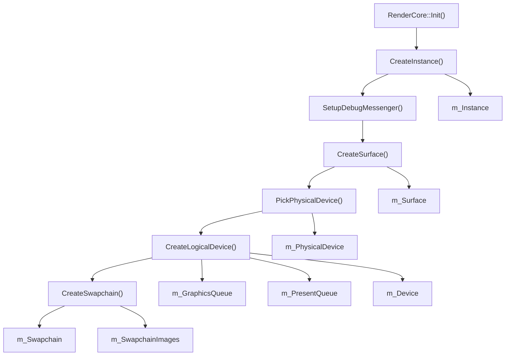

**Initialization Sequence**

The RenderCore initialization follows a strict dependency order:

1. **Vulkan Instance** (`m_Instance`) - Created first with validation layers in debug mode
2. **Debug Messenger** (`m_DebugMessenger`) - Attaches validation layer callbacks
3. **Surface** (`m_Surface`) - Platform-specific window surface via SDL3
4. **Physical Device** (`m_PhysicalDevice`) - Selects discrete GPU if available
5. **Logical Device** (`m_Device`) - Creates device with graphics and present queues
6. **Swapchain** (`m_Swapchain`) - Creates triple-buffered presentation images

**Sources**: [source/RenderCore.cpp:290-391](), [include/RenderCore.h:183-215]()

### Queue Families and Command Submission

The system uses two queue families:

| Queue | Variable | Purpose | Queue Family Search |
|---|---|---|---|
| Graphics Queue | `m_GraphicsQueue` | Rendering, compute, transfers | `VK_QUEUE_GRAPHICS_BIT` |
| Present Queue | `m_PresentQueue` | Swapchain presentation | `vkGetPhysicalDeviceSurfaceSupportKHR()` |

These queues may be from the same family (common) or different families. The system uses `VK_SHARING_MODE_EXCLUSIVE` for swapchain images, assuming same-family queues for optimal performance.

**Sources**: [source/RenderCore.cpp:706-798](), [include/RenderCore.h:207-211]()

### Swapchain Configuration

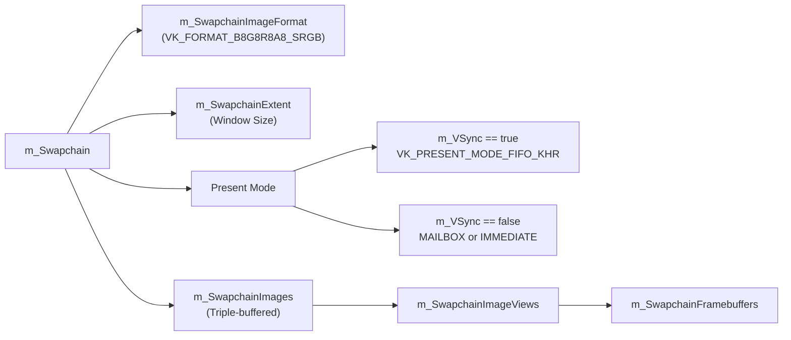

The swapchain is recreated when:
- Window is resized (`m_FramebufferResized = true`)
- VSync setting changes (`SetVSync()`)
- Super-resolution scale changes (`SetSuperResolutionScale()`)

**Sources**: [source/RenderCore.cpp:800-905](), [include/RenderCore.h:218-239]()

---

## Rendering Pipeline Architecture

The RenderCore implements a multi-pass hybrid rendering pipeline:

### Pipeline Overview

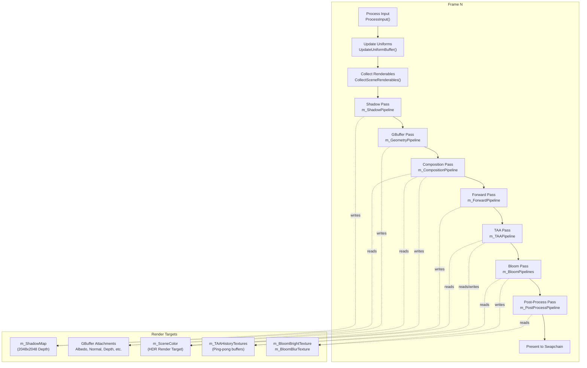

**Sources**: [source/RenderCore.cpp:1872-2394](), [include/RenderCore.h:83-136]()

### Resolution Management and Super-Resolution

The rendering pipeline supports dynamic resolution scaling through the **Super-Resolution** system:

| Resolution Type | Variable | Description | Typical Value |
|---|---|---|---|
| **Presentation Resolution** | `m_SwapchainExtent` | Final display resolution | Window size (e.g., 1920x1080) |
| **Render Resolution** | `m_RenderExtent` | GBuffer/Scene render resolution | `SwapchainExtent / m_SuperResolutionScale` |
| **Super-Resolution Scale** | `m_SuperResolutionScale` | Upscaling factor | 1.0-2.0 (default: 1.25) |

The GBuffer, Shadow Map, and Scene Color targets render at **Render Resolution** (lower), while TAA upscales to **Presentation Resolution** (higher), providing performance gains with minimal quality loss.

**Sources**: [include/RenderCore.h:237-242](), [source/RenderCore.cpp:327-328](), [source/RenderCore.cpp:898-904]()

### GBuffer Structure

The deferred rendering system uses a GBuffer (`m_GBuffer`) with the following attachments:

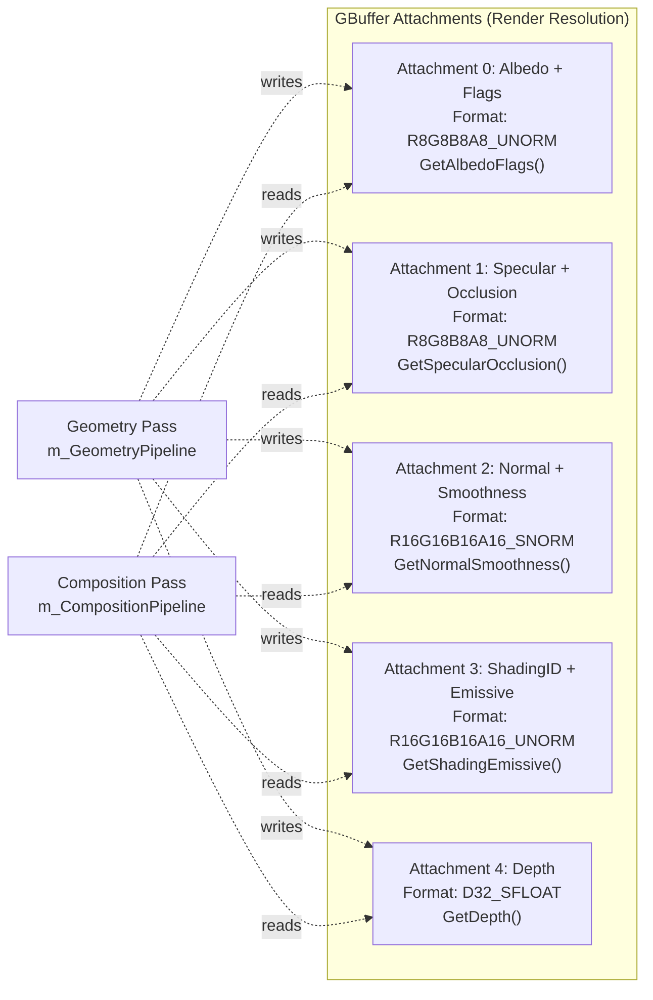

Each attachment is accessible via accessor methods in the `GBuffer` class. The GBuffer is created at **Render Resolution** for performance.

**Sources**: [include/RenderCore.h:307](), [include/GBuffer.h:14-26](), [source/RenderCore.cpp:1080-1141]()

### Shadow Pass (PCSS)

The shadow system implements **Percentage-Closer Soft Shadows (PCSS)** with configurable parameters:

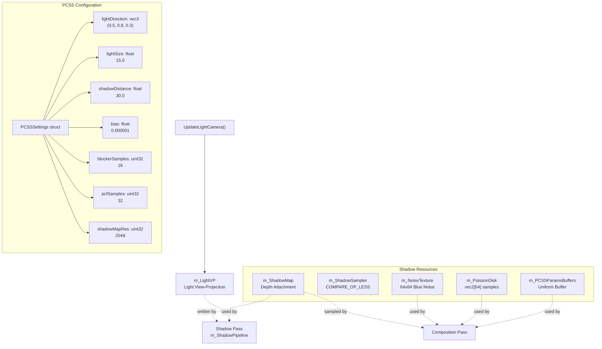

The shadow map is regenerated each frame, and the light camera is updated to tightly fit the view frustum for optimal shadow quality.

**Sources**: [include/RenderCore.h:100-117](), [include/RenderCore.h:523-537](), [source/RenderCore.cpp:3470-3620]()

### Forward Rendering Pass

Transparent objects are rendered in a separate **forward pass** after composition:

1. **Sorting**: Transparent objects are sorted back-to-front by `RenderObject::distanceToCamera`
2. **Blending**: Alpha blending enabled (`VK_BLEND_OP_ADD`, `SRC_ALPHA`, `ONE_MINUS_SRC_ALPHA`)
3. **Depth Testing**: Depth test enabled, depth writes disabled
4. **Target**: Writes to `m_SceneColor` with existing opaque content

**Sources**: [source/RenderCore.cpp:2026-2123](), [include/RenderCore.h:95-98]()

### Post-Processing Chain

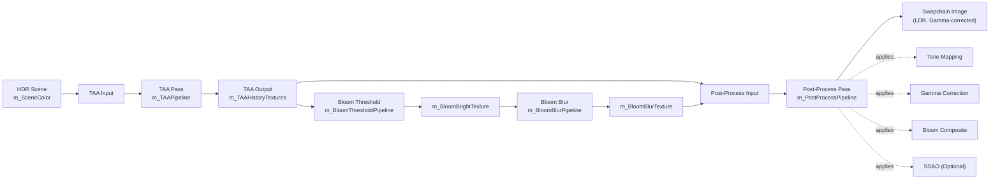

Post-processing settings are controlled via `PostProcessSettings` struct:

| Setting | Variable | Default | Purpose |
|---|---|---|---|
| Enable SSAO | `enableSSAO` | 1 | Screen-space ambient occlusion |
| Enable Bloom | `enableBloom` | 1 | HDR bloom glow |
| Enable Tone Mapping | `enableToneMapping` | 1 | HDR to LDR mapping |
| Enable Gamma | `enableGamma` | 1 | Gamma correction |
| Bloom Intensity | `bloomIntensity` | 0.5 | Bloom strength multiplier |
| Bloom Threshold | `bloomThreshold` | 0.8 | Brightness threshold |
| Debug Mode | `debugMode` | 0 | Visualization modes (0-10) |

**Sources**: [include/RenderCore.h:123-133](), [include/RenderCore.h:450-463](), [source/RenderCore.cpp:2395-2500]()

### TAA (Temporal Anti-Aliasing)

The TAA system upscales from **Render Resolution** to **Presentation Resolution** while providing anti-aliasing:

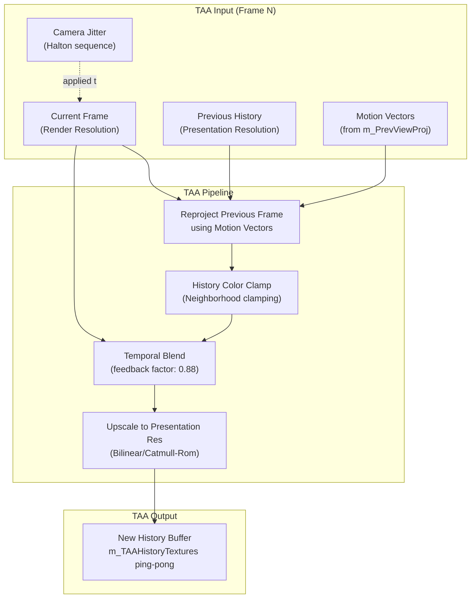

**TAA Configuration**:
- **Enabled**: `m_TAAEnabled` (default: true)
- **Feedback Factor**: `m_TAAFeedbackFactor` (default: 0.88, range: 0.0-1.0)
- **Jitter**: Halton(2,3) sequence applied to projection matrix via `Camera::SetJitter()`

**Sources**: [include/RenderCore.h:240-251](), [source/RenderCore.cpp:4065-4202]()

---

## Resource Management

The RenderCore manages three primary resource types via UUID-based caches:

### Resource Cache Architecture

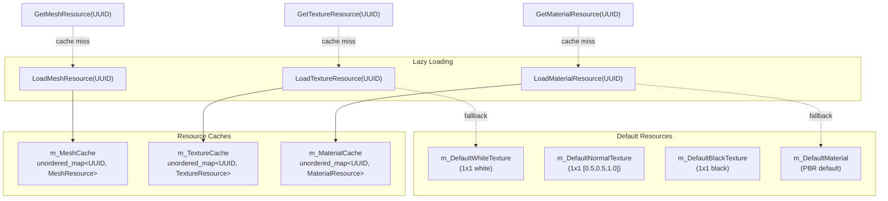

### Material System

Materials are composed of up to 6 texture bindings:

| Binding | Texture Slot | Purpose | Default Fallback |
|---|---|---|---|
| 0 | Albedo Map | Base color (RGB) + Alpha | `m_DefaultWhiteTexture` |
| 1 | Normal Map | Tangent-space normals | `m_DefaultNormalTexture` |
| 2 | Metallic Map | Metallic factor | `m_DefaultBlackTexture` |
| 3 | Roughness Map | Roughness factor | `m_DefaultWhiteTexture` |
| 4 | AO Map | Ambient occlusion | `m_DefaultWhiteTexture` |
| 5 | Emissive Map | Emissive color (HDR) | `m_DefaultBlackTexture` |

Each material has a dedicated descriptor set (`VkDescriptorSet`) created via `CreateMaterialDescriptorSet()`.

**Material API**:
- `CreateMaterial()` - Allocates new UUID and default material
- `GetMaterialResource(UUID)` - Retrieves or loads material
- `SetMaterialTexture(UUID matID, uint32_t binding, UUID texID)` - Updates texture binding
- `DeleteMaterial(UUID)` - Removes from cache
- `SaveAllMaterials()` - Serializes all materials to disk

**Sources**: [include/RenderCore.h:162-177](), [include/Material.h:1-50](), [source/RenderCore.cpp:3108-3252]()

### Mesh Resource Loading

Meshes are loaded from OBJ files using `tiny_obj_loader`:

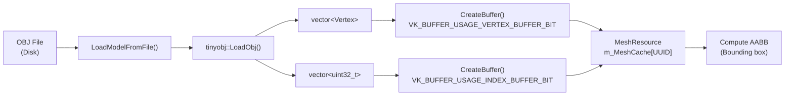

**Vertex Structure** (`Vertex`):
- `position` (vec3)
- `normal` (vec3)
- `texCoord` (vec2)
- `color` (vec3)
- `tangent` (vec4)

Vertex buffer layout is defined by `Vertex::getBindingDescription()` and `Vertex::getAttributeDescriptions()`.

**Sources**: [source/RenderCore.cpp:2844-3024](), [include/Vertex.h:1-30](), [include/Asset/MeshResource.h:1-50]()

### Texture Resource Loading

Textures support multiple formats and are loaded via `TextureResource`:

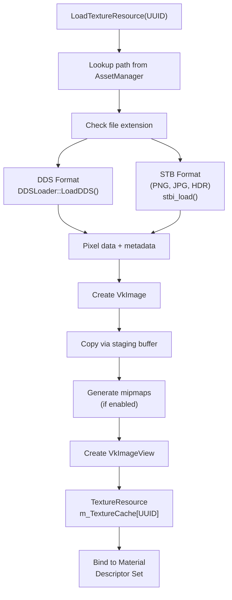

**ImGui Integration**:
- `GetImGuiTextureID(UUID)` - Returns `ImTextureID` for editor preview
- `GetImGuiTextureIDByPath(string)` - Path-based lookup for asset browser

**Sources**: [source/RenderCore.cpp:3252-3350](), [include/Asset/TextureResource.h:1-50](), [include/Asset/DDSLoader.h:1-50]()

---

## Frame Synchronization and Swapchain

The RenderCore uses **triple-buffering** (`MAX_FRAMES_IN_FLIGHT = 3`) to overlap CPU and GPU work:

### Synchronization Primitives

```mermaid
graph TB
    subgraph "Frame N Synchronization"
        WaitFence["Wait for m_InFlightFences[currentFrame]<br/>(Ensures Frame N-3 is complete)"]
        AcquireImage["vkAcquireNextImageKHR()<br/>Signals: m_ImageAvailableSemaphores[currentFrame]"]
        RecordCommands["RecordCommandBuffer()<br/>(Shadow, GBuffer, Composition, etc.)"]
        Submit["vkQueueSubmit()<br/>Wait: ImageAvailable<br/>Signal: RenderFinished"]
        Present["vkQueuePresentKHR()<br/>Wait: m_RenderFinishedSemaphores[currentFrame]"]
        ResetFence["Reset m_InFlightFences[currentFrame]"]
        IncrementFrame["m_CurrentFrame = (m_CurrentFrame + 1) % 3"]
    end
    
    WaitFence --> AcquireImage
    AcquireImage --> RecordCommands
    RecordCommands --> Submit
    Submit --> Present
    Present --> ResetFence
    ResetFence --> IncrementFrame
```

### Synchronization Variables

| Variable | Type | Count | Purpose |
|---|---|---|---|
| `m_ImageAvailableSemaphores` | `VkSemaphore[]` | 3 | Signals when swapchain image is acquired |
| `m_RenderFinishedSemaphores` | `VkSemaphore[]` | 3 | Signals when rendering is complete |
| `m_InFlightFences` | `VkFence[]` | 3 | CPU-GPU sync per frame slot |
| `m_CurrentFrame` | `uint32_t` | 1 | Current frame index (0-2) |

**Frame Index**: All per-frame resources (uniform buffers, descriptor sets, command buffers) are indexed by `m_CurrentFrame`.

**Sources**: [source/RenderCore.cpp:1872-1970](), [include/RenderCore.h:276-299]()

### Swapchain Recreation

The swapchain must be recreated when:
1. **Window Resize**: `m_FramebufferResized` is set to true
2. **VSync Toggle**: `SetVSync(bool)` changes present mode
3. **Acquire Failure**: `vkAcquireNextImageKHR()` returns `VK_ERROR_OUT_OF_DATE_KHR`

**Swapchain Lifecycle**:

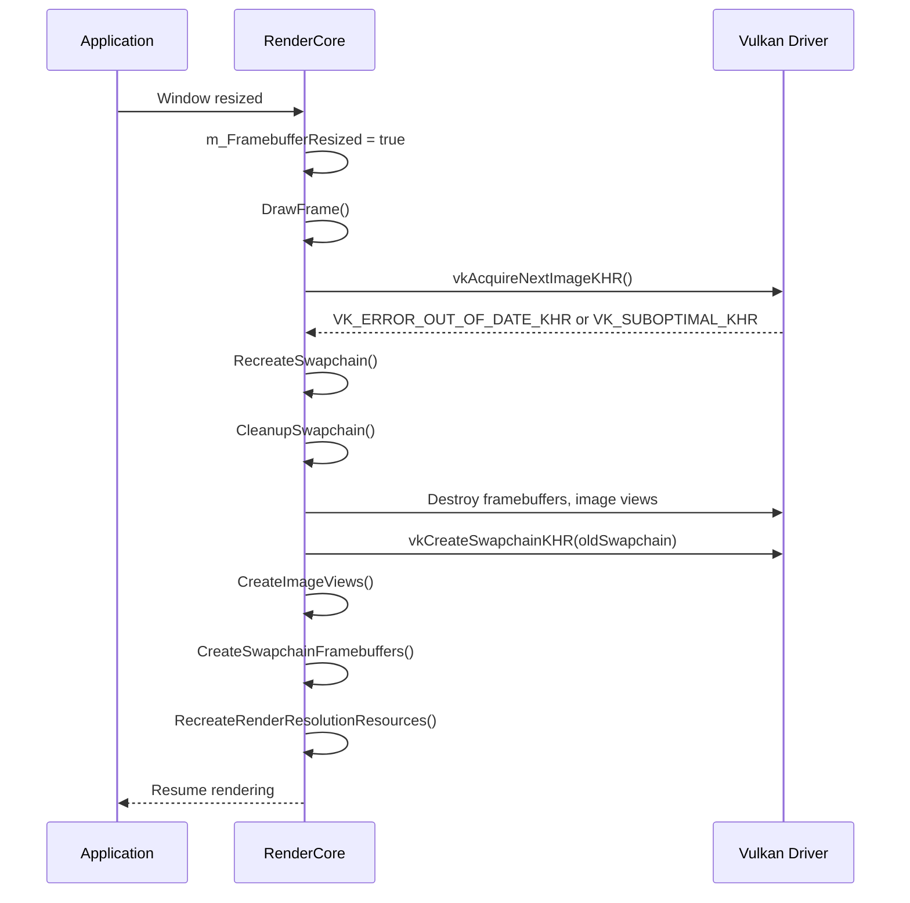

`RecreateRenderResolutionResources()` rebuilds all resolution-dependent resources (GBuffer, Scene Color, TAA textures, Bloom textures).

**Sources**: [source/RenderCore.cpp:1970-2025](), [source/RenderCore.cpp:4378-4448]()

---

## Public API Reference

### Initialization and Lifecycle

| Function | Description | When to Call |
|---|---|---|
| `RenderCore::Init()` | Initialize all Vulkan resources, pipelines, and caches | Once at startup |
| `RenderCore::Shutdown()` | Destroy all resources and cleanup Vulkan | Once at shutdown |
| `RenderCore::DrawFrame()` | Render one frame | Every frame in main loop |

**Sources**: [include/RenderCore.h:29-31](), [source/RenderCore.cpp:290-595]()

### Camera Control

| Function | Description | Returns |
|---|---|---|
| `GetCamera()` | Access camera instance | `Camera&` |
| `SetCameraControlEnabled(bool)` | Enable/disable input handling | void |
| `IsCameraControlEnabled()` | Check if camera control is active | bool |
| `ProcessInput()` | Update camera from input (called per-frame) | void |

**Camera Class** provides:
- Position, rotation (yaw/pitch)
- View/projection matrices
- FOV, near/far planes
- Movement (WASD + mouse)

**Sources**: [include/RenderCore.h:492-497](), [include/Camera.h:1-50]()

### Material Management

| Function | Signature | Purpose |
|---|---|---|
| `CreateMaterial()` | `UUID CreateMaterial()` | Allocate new material with default textures |
| `DeleteMaterial(UUID)` | `void DeleteMaterial(const UUID&)` | Remove material from cache |
| `GetMaterialResource(UUID)` | `MaterialResource* GetMaterialResource(const UUID&)` | Retrieve or lazy-load material |
| `SetMaterialTexture(UUID, uint32_t, UUID)` | `void SetMaterialTexture(...)` | Update texture binding (0-5) |
| `GetAllMaterials()` | `vector<UUID> GetAllMaterials()` | List all cached material UUIDs |
| `SaveAllMaterials()` | `void SaveAllMaterials()` | Serialize materials to disk |

**Example Usage**:
```cpp
UUID matID = RenderCore::CreateMaterial();
UUID albedoTexID = /* ... load texture ... */;
RenderCore::SetMaterialTexture(matID, 0, albedoTexID); // Set albedo map
MaterialResource* mat = RenderCore::GetMaterialResource(matID);
```

**Sources**: [include/RenderCore.h:44-51](), [source/RenderCore.cpp:3108-3252]()

### Texture Management

| Function | Signature | Purpose |
|---|---|---|
| `GetTextureResource(UUID)` | `TextureResource* GetTextureResource(const UUID&)` | Retrieve or lazy-load texture |
| `GetImGuiTextureID(UUID)` | `ImTextureID GetImGuiTextureID(const UUID&)` | Get ImGui-compatible texture ID for preview |
| `GetImGuiTextureIDByPath(string)` | `ImTextureID GetImGuiTextureIDByPath(const string&)` | Path-based texture lookup |

**Supported Formats**: DDS, PNG, JPG, HDR (via `stb_image` and `DDSLoader`)

**Sources**: [include/RenderCore.h:52-54](), [source/RenderCore.cpp:3350-3450]()

### Rendering Settings

| Function | Purpose | Default |
|---|---|---|
| `GetPostProcessSettings()` | Access post-process settings struct | N/A |
| `GetPCSSSettings()` | Access shadow settings struct | N/A |
| `GetSkyboxSettings()` | Access skybox/IBL settings struct | N/A |
| `SetShadowMapResolution(uint32_t)` | Change shadow map resolution | 2048 |
| `SetVSync(bool)` | Toggle vertical sync | true |
| `SetSuperResolutionScale(float)` | Set upscaling factor (1.0-2.0) | 1.25 |
| `SetTAAEnabled(bool)` | Toggle TAA | true |
| `SetTAAFeedbackFactor(float)` | Adjust TAA blending (0.0-1.0) | 0.88 |

**Settings Structs**:
- `PostProcessSettings` - [include/RenderCore.h:450-463]()
- `PCSSSettings` - [include/RenderCore.h:524-535]()
- `SkyboxSettings` - [include/Asset/Skybox.h:1-30]()

**Sources**: [include/RenderCore.h:500-551]()

### Project and Scene Integration

| Function | Purpose |
|---|---|
| `SetCurrentProject(shared_ptr<Project>)` | Bind project for asset path resolution |
| `GetCurrentProject()` | Retrieve current project |

The RenderCore queries the current project's asset paths when loading textures/meshes/materials via UUID.

**Sources**: [include/RenderCore.h:504-510]()

### Utility and Debugging

| Function | Purpose | Returns |
|---|---|---|
| `GetDevice()` | Access VkDevice for external commands | `VkDevice` |
| `GetCommandPool()` | Access VkCommandPool for buffer copies | `VkCommandPool` |
| `GetGraphicsQueue()` | Access VkQueue for submissions | `VkQueue` |
| `LoadModelFromFile(path, vertices, indices)` | Load OBJ file into vertex/index arrays | bool |

**Debug Mode** (`PostProcessSettings::debugMode`):
- 0 = Normal shaded output
- 1 = Wireframe
- 2 = Albedo only
- 3 = Normals
- 4 = Depth
- 5 = Smoothness
- 6 = Specular
- 7 = Occlusion
- 8 = Material Flags
- 9 = Shading ID
- 10 = Emissive

**Sources**: [include/RenderCore.h:37-42](), [include/RenderCore.h:554-563]()

---

## IBL (Image-Based Lighting) System

The RenderCore integrates environment-based lighting using **prefiltered cubemaps** and **BRDF lookup textures**:

### IBL Resources

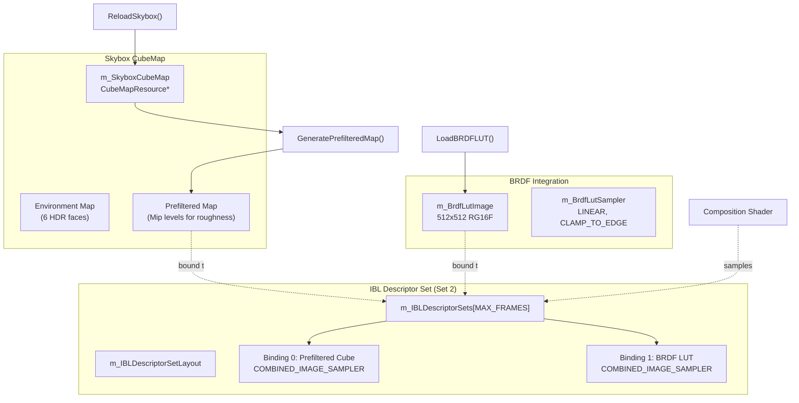

### Skybox Configuration

The skybox is configured via `SkyboxSettings`:

| Property | Type | Purpose | Default |
|---|---|---|---|
| `facePaths` | `vector<string>[6]` | Paths to cubemap faces (right, left, top, bottom, front, back) | DefaultHDRI/*.hdr |
| `rotationY` | `float` | Y-axis rotation in radians | 0.0 |
| `brightness` | `float` | IBL intensity multiplier | 1.0 |

**Workflow**:
1. Load 6 HDR/LDR images via `CubeMapResource::LoadFromFiles()`
2. Generate prefiltered mipmap chain for specular reflections
3. Update IBL descriptor sets via `UpdateIBLDescriptorSets()`

**Sources**: [include/RenderCore.h:539-542](), [source/RenderCore.cpp:308-323](), [source/RenderCore.cpp:4448-4550]()

---

## Performance Considerations

### Frame Budget

With VSync enabled (default), the system targets **60 FPS** (16.67ms/frame). The rendering passes typically consume:

| Pass | Typical GPU Time | Notes |
|---|---|---|
| Shadow Pass | 1-2ms | Depends on `shadowMapRes` (default: 2048) |
| GBuffer Pass | 2-4ms | Scales with scene complexity |
| Composition Pass | 1-3ms | IBL sampling, PCSS filtering |
| Forward Pass | 0.5-2ms | Transparent object count |
| TAA Pass | 0.5-1ms | Resolution upscaling |
| Bloom Passes | 1-2ms | Threshold + Blur |
| Post-Process Pass | 0.5-1ms | Tone mapping, SSAO |

**Total**: ~7-15ms (GPU) + CPU overhead

### Optimization Strategies

1. **Super-Resolution**: Use `m_SuperResolutionScale > 1.0` to render GBuffer at lower resolution
   - 1.25x scale = ~1.56x fewer pixels (~56% perf gain in geometry/composition)
   
2. **Shadow Map Resolution**: Reduce `shadowMapRes` from 2048 to 1024 for ~4x fewer shadow pixels

3. **PCSS Sample Counts**: Lower `blockerSamples` and `pcfSamples` for faster shadow filtering

4. **Frustum Culling**: The system culls objects outside camera frustum (`RenderObject::isInViewFrustum`)

5. **VSync Disable**: Set `SetVSync(false)` to remove 60 FPS cap (use for benchmarking)

**Sources**: [include/RenderCore.h:237-242](), [include/RenderCore.h:513-522]()

---

## Error Handling and Validation

In **Debug builds** (`#ifdef DEBUG`), the RenderCore enables:

1. **Vulkan Validation Layers** (`VK_LAYER_KHRONOS_validation`)
   - Detects API misuse, memory leaks, sync errors
   - Outputs via `debugCallback()` to `NeuLog`

2. **Debug Messenger** (`m_DebugMessenger`)
   - Captures validation layer messages
   - Severity levels: Verbose, Info, Warning, Error

**Runtime Error Handling**:
- Swapchain out-of-date → Automatic recreation
- Device lost → Throws `std::runtime_error`
- Resource allocation failures → Logged and throws exception

**Sources**: [source/RenderCore.cpp:236-288](), [source/RenderCore.cpp:598-646]()

---

**Key Takeaways**:
- RenderCore is a **static class** managing all Vulkan state
- Uses **hybrid rendering**: Deferred (opaque) + Forward (transparent) + Post-processing
- **Triple-buffered** synchronization with fences and semaphores
- **UUID-based caching** for textures, materials, meshes
- **Super-resolution + TAA** for performance and quality balance
- **PCSS shadows** with configurable quality/performance tradeoffs
- **IBL** via prefiltered cubemaps and BRDF lookup textures

For implementation details on specific rendering techniques, see the subsections in [Section 3.2](#3.2) and related pages.

---
