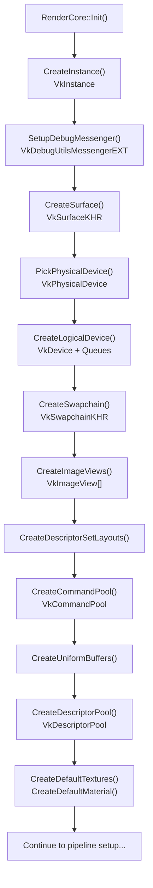
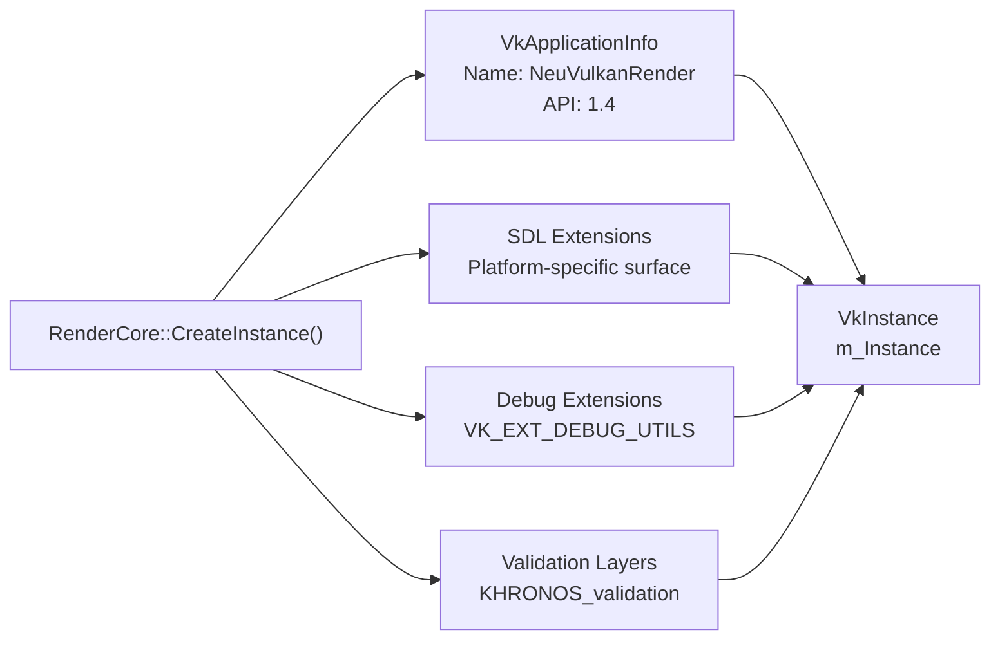
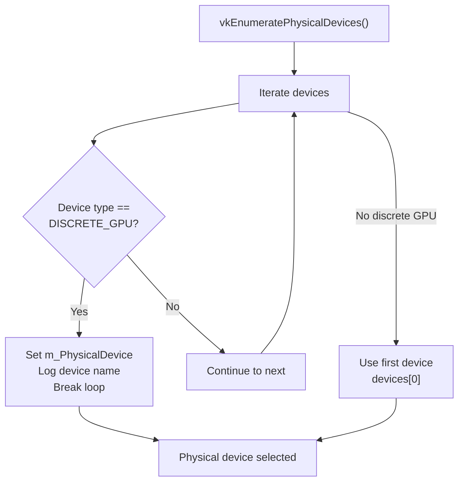
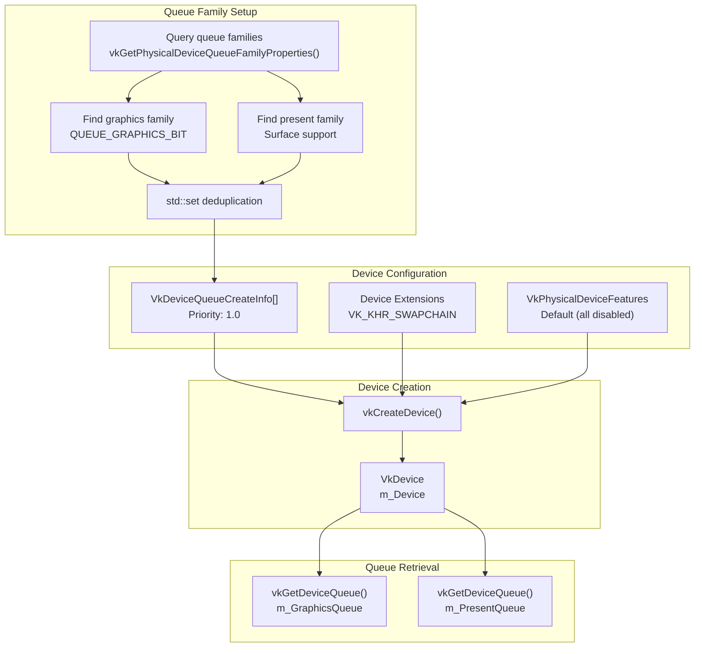
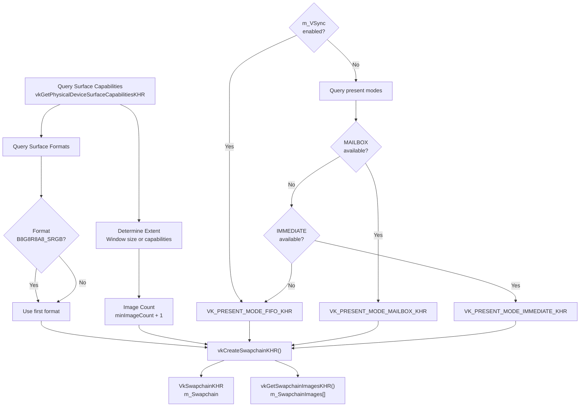
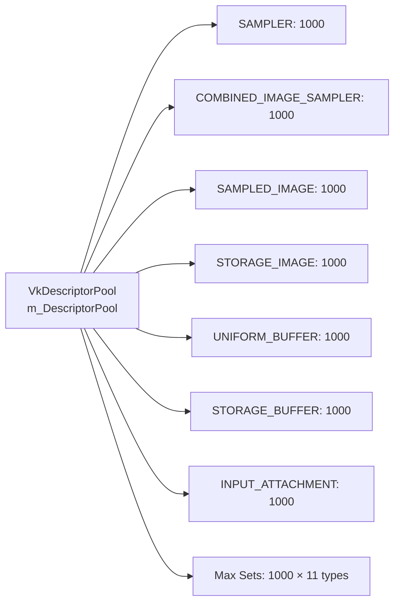
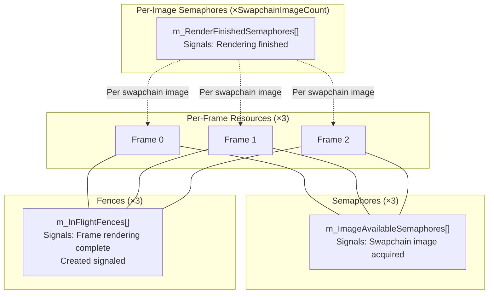
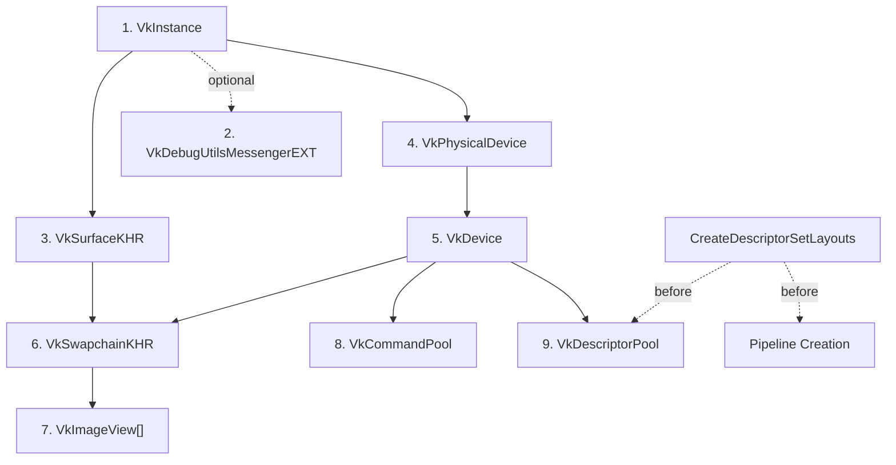

# Vulkan Initialization and Setup

Relevant source files

The following files were used as context for generating this wiki page:

- [.cache/clangd/index/RenderCore.h.CFEA37C534CAD967.idx](.cache/clangd/index/RenderCore.h.CFEA37C534CAD967.idx)
- [include/RenderCore.h](include/RenderCore.h)
- [source/RenderCore.cpp](source/RenderCore.cpp)

This document covers the low-level Vulkan initialization performed by `RenderCore` during application startup. This includes creating the Vulkan instance, selecting and configuring GPU devices, setting up the swapchain for presentation, and establishing command pools and descriptor pools for resource management.

For information about the higher-level rendering pipeline architecture and render passes, see [3.2](#3.2). For details on resource loading and caching, see [3.3](#3.3).

---

## Initialization Sequence

The `RenderCore::Init()` function orchestrates the entire Vulkan initialization process. The sequence must be executed in a specific order due to dependencies between Vulkan objects.

**Initialization Flow Diagram**

**Sources:** [source/RenderCore.cpp:290-391]()

---

## Vulkan Instance and Extensions

### Instance Creation

The Vulkan instance (`VkInstance`) is the entry point for all Vulkan operations. `RenderCore` creates the instance with SDL3-required extensions and validation layers enabled in debug builds.

**Key Components:**
- **Application Info**: Identifies the application as "NeuVulkanRender" using Vulkan API 1.4
- **SDL Extensions**: Obtained via `SDL_Vulkan_GetInstanceExtensions()` for window system integration
- **Debug Extensions**: `VK_EXT_DEBUG_UTILS_EXTENSION_NAME` for validation layer callbacks
- **Validation Layers**: `VK_LAYER_KHRONOS_validation` enabled in debug builds

**Storage:** The instance handle is stored in the static member `RenderCore::m_Instance`.

**Sources:** [source/RenderCore.cpp:598-646](), [include/RenderCore.h:187]()

### Debug Messenger

In debug builds, a debug messenger is attached to capture validation layer messages (warnings, errors, performance hints) and route them to the logging system via `spdlog`.

**Configuration:**
- **Message Severity**: Verbose, Warning, Error levels
- **Message Types**: General, Validation, Performance
- **Callback**: `debugCallback()` function logs messages with severity >= WARNING

**Sources:** [source/RenderCore.cpp:243-288](), [source/RenderCore.cpp:1181-1193](), [include/RenderCore.h:192]()

---

## Physical Device Selection

### Device Enumeration and Selection

`RenderCore::PickPhysicalDevice()` queries all available Vulkan-capable GPUs and selects the most suitable one.

**Selection Criteria (Priority Order):**
1. **Discrete GPU** (`VK_PHYSICAL_DEVICE_TYPE_DISCRETE_GPU`) - preferred
2. **First available device** - fallback if no discrete GPU found

**Physical Device Information:**
- Device properties are logged (GPU name)
- Stored in `RenderCore::m_PhysicalDevice`
- Used for querying capabilities (memory types, queue families, surface support)

**Sources:** [source/RenderCore.cpp:656-694](), [include/RenderCore.h:198]()

---

## Logical Device and Queues

### Queue Family Discovery

Before creating the logical device, `RenderCore::CreateLogicalDevice()` queries available queue families to find those supporting graphics operations and surface presentation.

**Required Queue Families:**
- **Graphics Queue Family**: Must support `VK_QUEUE_GRAPHICS_BIT`
- **Present Queue Family**: Must support presentation to `m_Surface` (via `vkGetPhysicalDeviceSurfaceSupportKHR`)

**Note:** The implementation allows graphics and present queues to be from the same or different families. Duplicate families are automatically deduplicated using `std::set`.

### Logical Device Creation

The logical device (`VkDevice`) is the primary interface for GPU operations. It is created with the necessary queue families and extensions.

**Device Extensions:**
- `VK_KHR_SWAPCHAIN_EXTENSION_NAME` - Required for swapchain support

**Queue Priority:** Set to `1.0f` (highest) for all queues.

**Sources:** [source/RenderCore.cpp:706-798](), [include/RenderCore.h:203-211]()

---

## Surface and Swapchain

### Surface Creation

The window surface (`VkSurfaceKHR`) is created using SDL3's platform-specific Vulkan surface creation API. This surface acts as the rendering target for presentation.

**Creation:** `SDL_Vulkan_CreateSurface()` uses the native window handle from `Window::GetNativeWindow()`.

**Sources:** [source/RenderCore.cpp:648-654](), [include/RenderCore.h:215]()

### Swapchain Configuration

The swapchain manages a queue of images for rendering and presentation. `RenderCore::CreateSwapchain()` configures the swapchain based on surface capabilities and application requirements.

**Configuration Parameters:**

| Parameter | Selection Logic |
|-----------|----------------|
| **Image Count** | `capabilities.minImageCount + 1` (clamped to `maxImageCount`) |
| **Surface Format** | Prefer `VK_FORMAT_B8G8R8A8_SRGB` with `VK_COLOR_SPACE_SRGB_NONLINEAR_KHR` |
| **Extent** | Match window size (from `SDL_GetWindowSizeInPixels`) |
| **Present Mode** | `VK_PRESENT_MODE_FIFO_KHR` (VSync) or `MAILBOX`/`IMMEDIATE` if VSync disabled |
| **Image Usage** | `VK_IMAGE_USAGE_COLOR_ATTACHMENT_BIT` |

**VSync Control:**
- When `m_VSync == true`: Use `VK_PRESENT_MODE_FIFO_KHR` (guaranteed available)
- When `m_VSync == false`: Prefer `VK_PRESENT_MODE_MAILBOX_KHR`, fallback to `IMMEDIATE`, then `FIFO`

**Swapchain Recreation:**
The swapchain can be recreated (e.g., on window resize) by passing the old swapchain handle to `CreateSwapchain()`, which allows the driver to reuse resources.

**Render Resolution vs Swapchain Extent:**
- `m_SwapchainExtent`: Final presentation resolution (window size)
- `m_RenderExtent`: Internal rendering resolution, calculated as `swapchainExtent / m_SuperResolutionScale`
- This separation enables upscaling techniques like TAA

**Sources:** [source/RenderCore.cpp:800-905](), [include/RenderCore.h:221-239]()

### Image Views

Each swapchain image requires an image view for shader access. `CreateImageViews()` creates a `VkImageView` for each image in `m_SwapchainImages`.

**Configuration:**
- **View Type**: `VK_IMAGE_VIEW_TYPE_2D`
- **Format**: Same as `m_SwapchainImageFormat`
- **Component Mapping**: Identity swizzle
- **Subresource Range**: Single mip level, single layer, color aspect

**Sources:** [source/RenderCore.cpp:907-930](), [include/RenderCore.h:256]()

---

## Command Pool

The command pool (`VkCommandPool`) allocates memory for command buffers. A single command pool is created for the graphics queue family.

**Configuration:**
- **Queue Family**: Graphics queue family index (re-queried during creation)
- **Flags**: `VK_COMMAND_POOL_CREATE_RESET_COMMAND_BUFFER_BIT` - allows individual command buffer reset

**Command Buffer Allocation:**
Command buffers are allocated separately in `CreateCommandBuffers()` (3 buffers for triple buffering, `MAX_FRAMES_IN_FLIGHT = 3`).

**Sources:** [source/RenderCore.cpp:996-1023](), [source/RenderCore.cpp:1025-1038](), [include/RenderCore.h:270-274]()

---

## Descriptor Management

### Descriptor Pool

The descriptor pool (`VkDescriptorPool`) pre-allocates storage for descriptor sets used throughout the rendering pipeline.

**Pool Configuration:**

**Flags:**
- `VK_DESCRIPTOR_POOL_CREATE_FREE_DESCRIPTOR_SET_BIT` - allows individual descriptor set freeing

**Shared Usage:**
This descriptor pool is shared with ImGui for its descriptor sets (configured in `ImGui_ImplVulkan_InitInfo`).

**Sources:** [source/RenderCore.cpp:1081-1106](), [include/RenderCore.h:294]()

### Descriptor Set Layouts

Descriptor set layouts define the structure of descriptor sets used by pipelines. `RenderCore` creates multiple layouts for different rendering stages:

**Primary Layouts:**

| Layout | Purpose | Sets Used By |
|--------|---------|--------------|
| `m_GeometryDescriptorSetLayout` | Geometry pass UBOs (MVP matrices) | Deferred geometry pass |
| `m_MaterialDescriptorSetLayout` | Material textures (6 bindings) | Geometry + Forward passes |
| `m_CompositionGBufferDescriptorSetLayout` | GBuffer attachment sampling | Composition pass |
| `m_CompositionLightDescriptorSetLayout` | Lighting data (directional, point lights, shadows) | Composition + Forward passes |
| `m_IBLDescriptorSetLayout` | IBL environment maps (prefiltered map + BRDF LUT) | Composition pass |
| `m_PostProcessDescriptorSetLayout` | Post-process textures | Post-process pass |
| `m_ShadowDescriptorSetLayout` | Shadow pass UBO | Shadow pass |
| `m_TAADescriptorSetLayout` | TAA history and current frame | TAA pass |

**Layout Creation:**
Layouts are created early in `Init()` via `CreateDescriptorSetLayouts()` because pipelines depend on them.

**Actual Descriptor Sets:**
Descriptor sets are allocated from the pool later in initialization (after creating textures/buffers) via functions like `CreateDescriptorSets()`, `CreatePostProcessDescriptorSets()`, etc.

**Sources:** [source/RenderCore.cpp:290-391]() (Init sequence), [include/RenderCore.h:177](), [include/RenderCore.h:320-323](), [include/RenderCore.h:362](), [include/RenderCore.h:378](), [include/RenderCore.h:421](), [include/RenderCore.h:613-614]()

---

## Synchronization Primitives

### Frame-in-Flight Synchronization

`RenderCore` uses triple buffering (`MAX_FRAMES_IN_FLIGHT = 3`) to allow the CPU to prepare frames while the GPU processes previous ones.

**Synchronization Objects:**

**Synchronization Flow:**
1. **Frame Start**: Wait on `m_InFlightFences[currentFrame]` to ensure this frame slot is free
2. **Acquire Image**: Call `vkAcquireNextImageKHR()` with `m_ImageAvailableSemaphores[currentFrame]`
3. **Reset Fence**: Reset the fence before submitting work
4. **Submit Work**: Signal `m_RenderFinishedSemaphores[imageIndex]` when rendering completes, signal `m_InFlightFences[currentFrame]` fence
5. **Present**: Wait on `m_RenderFinishedSemaphores[imageIndex]` before presentation

**Sources:** [source/RenderCore.cpp:1040-1079](), [include/RenderCore.h:279-288](), [source/RenderCore.cpp:1787-1808]() (usage in DrawFrame)

---

## Initialization Order Summary

**Critical Dependencies:**

**Source:** [source/RenderCore.cpp:290-391]()

---

## Resource Handles Table

The following table summarizes all Vulkan handles created during initialization:

| Handle | Type | Storage | Lifetime |
|--------|------|---------|----------|
| `m_Instance` | `VkInstance` | Static member | Application lifetime |
| `m_DebugMessenger` | `VkDebugUtilsMessengerEXT` | Static member | Application lifetime (debug only) |
| `m_PhysicalDevice` | `VkPhysicalDevice` | Static member | Application lifetime (not destroyed) |
| `m_Device` | `VkDevice` | Static member | Application lifetime |
| `m_GraphicsQueue` | `VkQueue` | Static member | Application lifetime (not destroyed) |
| `m_PresentQueue` | `VkQueue` | Static member | Application lifetime (not destroyed) |
| `m_Surface` | `VkSurfaceKHR` | Static member | Application lifetime |
| `m_Swapchain` | `VkSwapchainKHR` | Static member | Recreated on resize |
| `m_SwapchainImages` | `std::vector<VkImage>` | Static member | Recreated on resize (not destroyed) |
| `m_SwapchainImageViews` | `std::vector<VkImageView>` | Static member | Recreated on resize |
| `m_CommandPool` | `VkCommandPool` | Static member | Application lifetime |
| `m_DescriptorPool` | `VkDescriptorPool` | Static member | Application lifetime |
| `m_ImageAvailableSemaphores` | `std::vector<VkSemaphore>` | Static member | Application lifetime (3 elements) |
| `m_RenderFinishedSemaphores` | `std::vector<VkSemaphore>` | Static member | Recreated on resize |
| `m_InFlightFences` | `std::vector<VkFence>` | Static member | Application lifetime (3 elements) |

**Sources:** [include/RenderCore.h:183-300]()

---
