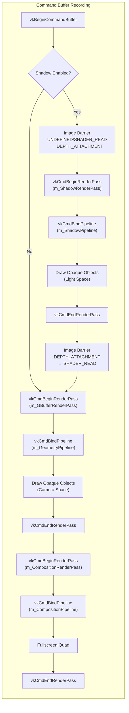
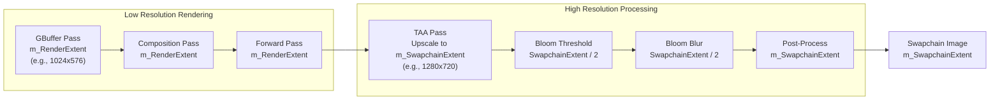
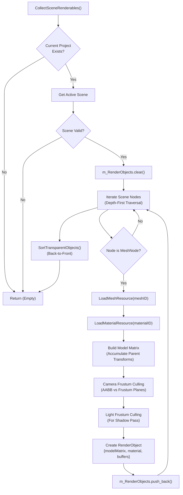

# Rendering Pipeline

<details>
<summary>Relevant source files</summary>

The following files were used as context for generating this wiki page:

- [.cache/clangd/index/Vertex.h.B1B82459C0160BD1.idx](.cache/clangd/index/Vertex.h.B1B82459C0160BD1.idx)
- [build/resource/shaders/glsl/composition.frag](build/resource/shaders/glsl/composition.frag)
- [include/RenderCore.h](include/RenderCore.h)
- [source/RenderCore.cpp](source/RenderCore.cpp)

</details>


## Purpose and Scope

This document describes the multi-pass rendering pipeline architecture implemented in `RenderCore`, including the sequence of render passes, command recording, and frame synchronization. The pipeline combines deferred shading for opaque geometry with forward rendering for transparent objects, followed by temporal anti-aliasing and post-processing effects.

For Vulkan initialization and device setup details, see [Vulkan Initialization and Setup](#3.1). For individual pass implementations (GBuffer structure, shadow mapping techniques, etc.), see sections [3.2.1](#3.2.1) through [3.2.4](#3.2.4). For resource management and descriptor sets, see [Resource Management](#3.3). For frame synchronization primitives, see [Frame Synchronization and Swapchain](#3.4).

---

## Multi-Pass Architecture Overview

The rendering system implements a hybrid rendering pipeline with seven sequential passes executed per frame. The architecture is organized in [include/RenderCore.h:27-617]() with implementation in [source/RenderCore.cpp:1-5282]().

**Key Pipeline Components:**

| Component | Type | Purpose |
|-----------|------|---------|
| `m_ShadowRenderPass` | `VkRenderPass` | Depth-only shadow map generation |
| `m_GBufferRenderPass` | `VkRenderPass` | Deferred geometry buffer population |
| `m_CompositionRenderPass` | `VkRenderPass` | Deferred lighting and IBL evaluation |
| `m_ForwardRenderPass` | `VkRenderPass` | Transparent object rendering |
| `m_TAAPipeline` | `VkPipeline` | Temporal anti-aliasing upscaling |
| `m_BloomRenderPass` | `VkRenderPass` | Bloom extraction and blur |
| `m_PostProcessRenderPass` | `VkRenderPass` | Final tone mapping to swapchain |

**Resolution Handling:**

```cpp
// Render resolution (lower for super resolution)
static VkExtent2D m_RenderExtent;        // GBuffer/TAA input resolution
static VkExtent2D m_SwapchainExtent;     // Final presentation resolution
static float m_SuperResolutionScale;     // 1.25 default (lower render res)
```

The system supports dynamic super resolution where geometry and lighting are rendered at `m_RenderExtent` (reduced resolution), then TAA upscales to `m_SwapchainExtent` (presentation resolution). This is configured in [include/RenderCore.h:237-241]().

**Sources:** [include/RenderCore.h:27-617](), [source/RenderCore.cpp:290-391](), [source/RenderCore.cpp:1195-1316]()

---

## Frame Rendering Flow

### High-Level Pass Sequence

```mermaid
graph TD
    Start["DrawFrame() Entry"] --> WaitFence["Wait for m_InFlightFences[m_CurrentFrame]"]
    WaitFence --> AcquireImage["Acquire Swapchain Image"]
    AcquireImage --> UpdateUBO["UpdateUniformBuffer(currentFrame)"]
    UpdateUBO --> UpdateLightCam["UpdateLightCamera()"]
    UpdateLightCam --> CollectScene["CollectSceneRenderables()"]
    CollectScene --> RecordCmd["RecordCommandBuffer(cmd, imageIndex)"]
    
    RecordCmd --> ShadowPass["Pass 0: Shadow Pass<br/>(Depth-only, PCSS)"]
    ShadowPass --> ShadowBarrier["Image Barrier<br/>DEPTH_ATTACHMENT → SHADER_READ"]
    
    ShadowBarrier --> GBufferPass["Pass 1: GBuffer Pass<br/>(Deferred Geometry)"]
    GBufferPass --> CompositionPass["Pass 2: Composition Pass<br/>(Lighting + IBL)"]
    
    CompositionPass --> ForwardPass["Pass 3: Forward Pass<br/>(Transparent Objects)"]
    
    ForwardPass --> TAAPass["Pass 4: TAA Pass<br/>(Temporal AA + Upscale)"]
    
    TAAPass --> BloomBright["Pass 5a: Bloom Threshold<br/>(Extract Bright Pixels)"]
    BloomBright --> BloomBlur["Pass 5b: Bloom Blur<br/>(Gaussian Blur)"]
    
    BloomBlur --> PostProcess["Pass 6: Post-Process<br/>(SSAO + Tone Map → Swapchain)"]
    PostProcess --> ImGuiRender["Pass 7: ImGui Render"]
    
    ImGuiRender --> Submit["vkQueueSubmit<br/>Wait: ImageAvailable<br/>Signal: RenderFinished"]
    Submit --> Present["vkQueuePresentKHR"]
    Present --> IncrementFrame["m_CurrentFrame = (m_CurrentFrame + 1) % MAX_FRAMES_IN_FLIGHT"]
    IncrementFrame --> End["Frame Complete"]
```



The frame begins at `RenderCore::DrawFrame()` in [source/RenderCore.cpp:4568-4650](), which orchestrates synchronization, command recording, and submission.

**Sources:** [source/RenderCore.cpp:4568-4650](), [source/RenderCore.cpp:1195-1316]()

---

## Command Recording

All rendering commands are recorded in `RecordCommandBuffer()` which executes sequentially in a single primary command buffer. The function is implemented in [source/RenderCore.cpp:1195-2450]().

### Command Buffer Structure



**Key Implementation Details:**

1. **Shadow Pass Recording** [source/RenderCore.cpp:1204-1316]():
   - Image layout transition from `VK_IMAGE_LAYOUT_SHADER_READ_ONLY_OPTIMAL` (or `UNDEFINED` on first frame) to `VK_IMAGE_LAYOUT_DEPTH_STENCIL_ATTACHMENT_OPTIMAL`
   - Binds `m_ShadowDescriptorSets[m_CurrentFrame]` for light VP matrix
   - Renders opaque objects using push constants for model matrices
   - Transitions shadow map to `VK_IMAGE_LAYOUT_SHADER_READ_ONLY_OPTIMAL` for composition pass

2. **GBuffer Pass Recording** [source/RenderCore.cpp:1318-1427]():
   - Clears 5 attachments: Albedo, Specular, Normal, ShadingID, Depth
   - Binds `m_GeometryDescriptorSets[m_CurrentFrame]` for MVP matrices
   - Uses push constants for per-object data (model matrix, material factors)
   - Renders only opaque objects (`!obj.material.IsTransparent()`)

3. **Composition Pass Recording** [source/RenderCore.cpp:1429-1476]():
   - Fullscreen quad rendering (no vertex/index buffers bound)
   - Binds 3 descriptor sets:
     - Set 0: GBuffer textures (`m_CompositionGBufferDescriptorSets`)
     - Set 1: Lighting data (`m_CompositionLightDescriptorSets`)
     - Set 2: IBL resources (`m_IBLDescriptorSets`)
   - Shader reads GBuffer, performs PBR lighting, evaluates IBL

**Sources:** [source/RenderCore.cpp:1195-2450](), [source/RenderCore.cpp:1204-1316](), [source/RenderCore.cpp:1318-1427]()

---

## Render Pass Execution Order

### Pass 0: Shadow Pass

Generates a depth-only shadow map for PCSS soft shadows. Only executed if `m_PCSSSettings.enableShadow` is true.

**Render Pass:** `m_ShadowRenderPass` [source/RenderCore.cpp:2864-2903]()  
**Pipeline:** `m_ShadowPipeline` [source/RenderCore.cpp:2905-2982]()  
**Framebuffer:** `m_ShadowFramebuffers[0]` (single framebuffer, no per-frame variation)  
**Attachments:** `m_ShadowMap` (depth-only, resolution `m_PCSSSettings.shadowMapRes`)

**Descriptor Sets:**
- Set 0: `m_ShadowDescriptorSets[m_CurrentFrame]` - Light VP matrix uniform buffer

**Rendering:**
- Viewport: `[0, 0, shadowMapRes, shadowMapRes]`
- Culling: Skips transparent objects, no camera frustum culling (uses light frustum)
- Push Constants: `glm::mat4 model` per object

**Implementation:** [source/RenderCore.cpp:1204-1316]()

---

### Pass 1: GBuffer Pass (Deferred Geometry)

Renders opaque geometry into multiple render targets (GBuffer). See [Deferred Rendering (GBuffer)](#3.2.1) for detailed GBuffer layout.

**Render Pass:** `m_GBufferRenderPass` [source/RenderCore.cpp:2564-2675]()  
**Pipeline:** `m_GeometryPipeline` [source/RenderCore.cpp:2677-2787]()  
**Framebuffer:** `m_GBuffer.GetFramebuffer(m_CurrentFrame)`  
**Resolution:** `m_RenderExtent` (reduced for super resolution)

**Attachments (5 total):**
1. **Albedo + MaterialFlags** (RGBA16F)
2. **Specular + Occlusion** (RGBA16F)
3. **Normal + Smoothness** (RGBA16F)
4. **ShadingID + Emissive** (RGBA16F)
5. **Depth** (D32_SFLOAT)

**Descriptor Sets:**
- Set 0: `m_GeometryDescriptorSets[m_CurrentFrame]` - Camera UBO (view, proj, VP matrices)
- Set 1: Material textures (albedo, normal, metallic, roughness, AO, emissive)

**Push Constants:**
```cpp
struct {
    glm::mat4 model;
    glm::vec4 baseColorFactor;
    float metallicFactor;
    float roughnessFactor;
    float normalScale;
    float occlusionStrength;
    float emissiveStrength;
    uint shadingID;
    float emissiveHue;
} pushConstants;
```

**Rendering Logic:** [source/RenderCore.cpp:1318-1427]()
- Skips transparent objects (`obj.material.IsTransparent()`)
- Binds per-object vertex/index buffers
- Updates push constants with material properties
- Binds material descriptor set (Set 1)

---

### Pass 2: Composition Pass (Deferred Lighting)

Reads GBuffer and performs PBR lighting, shadow evaluation, and IBL. See [Deferred Rendering (GBuffer)](#3.2.1) for lighting details.

**Render Pass:** `m_CompositionRenderPass` [source/RenderCore.cpp:2789-2842]()  
**Pipeline:** `m_CompositionPipeline` [source/RenderCore.cpp:2844-2937]()  
**Framebuffer:** `m_CompositionFramebuffers[m_CurrentFrame]`  
**Output:** `m_SceneColor[m_CurrentFrame]` (HDR color attachment, RGBA16F)  
**Resolution:** `m_RenderExtent` (matches GBuffer)

**Descriptor Sets:**
- Set 0: `m_CompositionGBufferDescriptorSets[m_CurrentFrame]` - GBuffer textures (6 samplers)
- Set 1: `m_CompositionLightDescriptorSets[m_CurrentFrame]` - Lighting data (directional light, point lights, PCSS params, skybox params)
- Set 2: `m_IBLDescriptorSets[m_CurrentFrame]` - IBL resources (prefiltered cubemap, BRDF LUT)

**Push Constants:**
```cpp
struct {
    vec2 viewportSize;
} pushConstants;
```

**Shader Logic:** [build/resource/shaders/glsl/composition.frag:1-494]()
- World position reconstruction from depth
- PBR shading (Cook-Torrance BRDF)
- PCSS shadow evaluation (`findBlockerDistance`, `penumbraSize`, `PCF_Filter`)
- IBL diffuse (spherical harmonics) and specular (split-sum approximation)
- Point light accumulation (up to 128 lights)
- Skybox rendering for background pixels (depth ≈ 1.0)

**Implementation:** [source/RenderCore.cpp:1429-1476]()

---

### Pass 3: Forward Pass (Transparency)

Renders transparent objects using forward rendering with alpha blending.

**Render Pass:** `m_ForwardRenderPass` [source/RenderCore.cpp:3038-3124]()  
**Pipeline:** `m_ForwardPipeline` [source/RenderCore.cpp:3126-3242]()  
**Framebuffer:** `g_ForwardFramebuffers[m_CurrentFrame]`  
**Attachments:**
- Color: `m_SceneColor[m_CurrentFrame]` (reads/writes HDR color from composition pass)
- Depth: `m_GBuffer.depth` (read-only, depth testing against opaque geometry)

**Blending Configuration:**
- `srcColorBlendFactor = VK_BLEND_FACTOR_SRC_ALPHA`
- `dstColorBlendFactor = VK_BLEND_FACTOR_ONE_MINUS_SRC_ALPHA`
- `colorBlendOp = VK_BLEND_OP_ADD`

**Rendering Logic:** [source/RenderCore.cpp:1478-1584]()
- Sorts transparent objects back-to-front (`SortTransparentObjects()`)
- Uses same descriptor sets and push constants as geometry pass
- Depth writes disabled (`depthWriteEnable = VK_FALSE`)

**Sources:** [source/RenderCore.cpp:3038-3242](), [source/RenderCore.cpp:1478-1584]()

---

### Pass 4: TAA Pass (Temporal Anti-Aliasing)

Applies temporal anti-aliasing with optional super resolution upscaling. See [Post-Processing Effects](#3.2.4) for TAA algorithm details.

**Pipeline:** `m_TAAPipeline` [source/RenderCore.cpp:4126-4238]()  
**Input:** `m_SceneColor[m_CurrentFrame]` (low-res current frame)  
**History:** `m_TAAHistoryTextures[0]` (high-res previous frame)  
**Output:** `m_TAAHistoryTextures[1]` (high-res current frame, becomes history next frame)  
**Resolution:** Input at `m_RenderExtent`, output at `m_SwapchainExtent`

**Descriptor Sets:**
- Set 0: Current frame input, history input, camera velocity data

**TAA Jitter:**
Halton sequence jitter applied to projection matrix in [source/RenderCore.cpp:2261-2284]():
```cpp
// Halton(2,3) sequence for TAA jitter
float jitterX = haltonSequence(2, m_FrameCount % 16);
float jitterY = haltonSequence(3, m_FrameCount % 16);
proj[2][0] += jitterX * jitterScale;  // Offset in NDC space
proj[2][1] += jitterY * jitterScale;
```

**Implementation:** [source/RenderCore.cpp:1586-1623]()

---

### Pass 5: Bloom Pass

Two-step bloom: threshold extraction followed by Gaussian blur.

**Pass 5a: Bloom Threshold**

**Pipeline:** `m_BloomThresholdPipeline` [source/RenderCore.cpp:3647-3716]()  
**Input:** `m_TAAHistoryTextures[1]` (TAA output)  
**Output:** `m_BloomBrightTexture` (RGBA16F, half resolution)  
**Threshold:** Controlled by `m_PostProcessSettings.bloomThreshold` (default 0.8)

**Pass 5b: Bloom Blur**

**Pipeline:** `m_BloomBlurPipeline` [source/RenderCore.cpp:3718-3794]()  
**Input:** `m_BloomBrightTexture`  
**Output:** `m_BloomBlurTexture` (RGBA16F, half resolution)  
**Blur Type:** Separable Gaussian (horizontal + vertical passes, or single-pass approximation)

**Implementation:** [source/RenderCore.cpp:1625-1706]()

**Sources:** [source/RenderCore.cpp:3647-3794](), [source/RenderCore.cpp:1625-1706]()

---

### Pass 6: Post-Process Pass

Final pass that combines SSAO, bloom, tone mapping, and gamma correction, rendering directly to the swapchain image.

**Render Pass:** `m_PostProcessRenderPass` [source/RenderCore.cpp:3338-3383]()  
**Pipeline:** `m_PostProcessPipeline` [source/RenderCore.cpp:3385-3499]()  
**Framebuffer:** `m_SwapchainFramebuffers[imageIndex]` (swapchain image)  
**Output Format:** `VK_FORMAT_B8G8R8A8_SRGB` (automatic sRGB encoding)

**Descriptor Sets:**
- Set 0: TAA output, bloom, SSAO textures
- Set 1: Camera uniform buffer (for SSAO reconstruction)

**Post-Process Settings:**
```cpp
struct PostProcessSettings {
    uint32_t enableSSAO;           // Toggle SSAO
    uint32_t enableBloom;          // Toggle Bloom
    uint32_t enableToneMapping;    // Toggle tone mapping
    uint32_t enableGamma;          // Toggle gamma correction
    float bloomIntensity;          // Bloom blend strength (0.5)
    float bloomThreshold;          // Bloom threshold (0.8)
    float ssaoRadius;              // SSAO sample radius (0.5)
    float ssaoStrength;            // SSAO intensity (1.5)
    uint32_t debugMode;            // 0-10 debug visualization modes
};
```

**Debug Visualization Modes:**
- 0: Shaded (normal output)
- 1: Wireframe
- 2: Albedo
- 3: Normal
- 4: Depth
- 5: Smoothness
- 6: Specular
- 7: Occlusion
- 8: Material Flags
- 9: Shading ID
- 10: Emissive

**Implementation:** [source/RenderCore.cpp:1708-1787]()

**Sources:** [source/RenderCore.cpp:3338-3499](), [include/RenderCore.h:450-463]()

---

### Pass 7: ImGui Rendering

Renders the editor UI on top of the final image using ImGui's Vulkan backend.

**Implementation:** [source/RenderCore.cpp:1789-1795]()
```cpp
ImGui_ImplVulkan_RenderDrawData(ImGui::GetDrawData(), commandBuffer);
```

**Sources:** [source/RenderCore.cpp:1789-1795]()

---

## Resolution Architecture

The system supports independent rendering and presentation resolutions for super resolution:

### Resolution Flow Diagram



**Resolution Calculation:**
```cpp
m_RenderExtent.width = m_SwapchainExtent.width / m_SuperResolutionScale;
m_RenderExtent.height = m_SwapchainExtent.height / m_SuperResolutionScale;
```

Default `m_SuperResolutionScale = 1.25` results in 80% linear resolution (64% pixel count).

**Dynamic Reconfiguration:**  
Calling `SetSuperResolutionScale()` triggers `RecreateRenderResolutionResources()` which rebuilds GBuffer, shadow map, and intermediate textures at the new resolution [source/RenderCore.cpp:1169-1193]().

**Sources:** [include/RenderCore.h:237-241](), [source/RenderCore.cpp:326-328](), [source/RenderCore.cpp:899-905]()

---

## Render Object Collection and Culling

Before command recording, the system collects renderable objects from the scene and performs frustum culling.

### Collection Process



**RenderObject Structure:**
```cpp
struct RenderObject {
    glm::mat4 modelMatrix;
    Material material;
    MaterialResource *pMaterialResource;
    VkBuffer vertexBuffer;
    VkBuffer indexBuffer;
    uint32_t indexCount;
    float distanceToCamera;      // For transparency sorting
    bool isInViewFrustum;        // Camera culling result
    bool isInLightFrustum;       // Light culling result (for shadows)
};
```

**Implementation:** [source/RenderCore.cpp:4312-4480]()

**Transparent Object Sorting:**  
Transparent objects are sorted back-to-front based on distance to camera [source/RenderCore.cpp:4482-4511]():
```cpp
std::sort(m_RenderObjects.begin(), m_RenderObjects.end(),
    [](const RenderObject& a, const RenderObject& b) {
        if (a.material.IsTransparent() && !b.material.IsTransparent()) return false;
        if (!a.material.IsTransparent() && b.material.IsTransparent()) return true;
        return a.distanceToCamera > b.distanceToCamera;  // Far to near
    });
```

**Sources:** [source/RenderCore.cpp:4312-4480](), [source/RenderCore.cpp:4482-4511](), [include/RenderCore.h:467-477]()

---

## Uniform Buffer Updates

Before rendering, uniform buffers are updated with current frame data.

### Update Sequence

**Camera Data (Geometry Pass):**
- View matrix, projection matrix, VP matrix
- Jitter offset applied to projection for TAA
- Previous frame VP matrix stored for motion vectors

**Light Data (Composition Pass):**
- Directional light direction, color, intensity
- Light space VP matrix for shadow mapping
- View position for specular calculations
- Inverse view-projection matrix for position reconstruction

**Point Light Data:**
- Array of up to 128 point lights
- Each light: position, radius, color, intensity

**PCSS Parameters:**
- Light size, shadow distance, bias
- Blocker/PCF sample counts, shadow map resolution
- Enable flags for shadows and directional light

**Skybox Parameters:**
- 9 spherical harmonics coefficients (vec4 each)
- Brightness multiplier, rotation angle

**Camera Parameters (Post-Process):**
- Near/far planes, FOV for SSAO depth reconstruction

**Implementation:** [source/RenderCore.cpp:2089-2343]()

**Sources:** [source/RenderCore.cpp:2089-2343](), [include/RenderCore.h:329-400]()

---

## Pipeline State Summary

| Pass | Render Pass | Pipeline | Depth Test | Depth Write | Blending | Resolution |
|------|-------------|----------|------------|-------------|----------|------------|
| Shadow | `m_ShadowRenderPass` | `m_ShadowPipeline` | Yes | Yes | No | `shadowMapRes` |
| GBuffer | `m_GBufferRenderPass` | `m_GeometryPipeline` | Yes | Yes | No | `m_RenderExtent` |
| Composition | `m_CompositionRenderPass` | `m_CompositionPipeline` | No | No | No | `m_RenderExtent` |
| Forward | `m_ForwardRenderPass` | `m_ForwardPipeline` | Yes | No | Alpha | `m_RenderExtent` |
| TAA | N/A (compute-like) | `m_TAAPipeline` | No | No | No | `m_SwapchainExtent` |
| Bloom Threshold | `m_BloomRenderPass` | `m_BloomThresholdPipeline` | No | No | No | `SwapchainExtent/2` |
| Bloom Blur | `m_BloomRenderPass` | `m_BloomBlurPipeline` | No | No | No | `SwapchainExtent/2` |
| Post-Process | `m_PostProcessRenderPass` | `m_PostProcessPipeline` | No | No | No | `m_SwapchainExtent` |

**Sources:** [source/RenderCore.cpp:2564-3794]()

---
