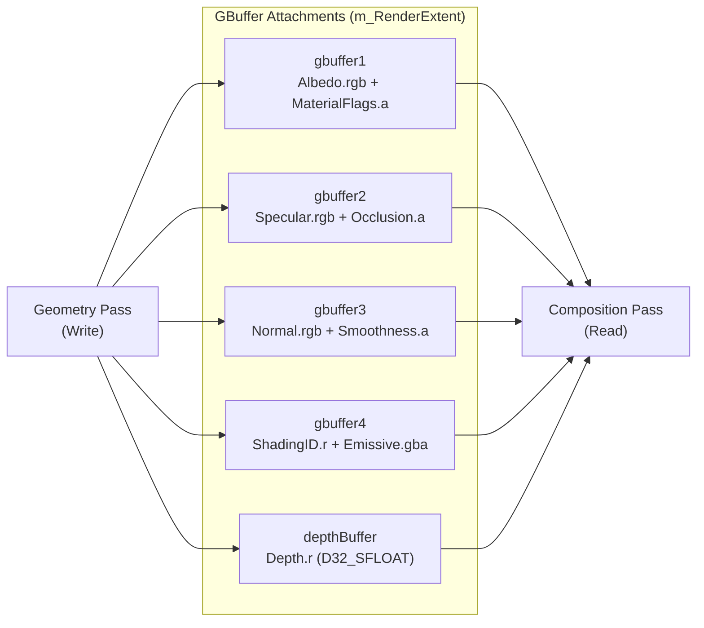
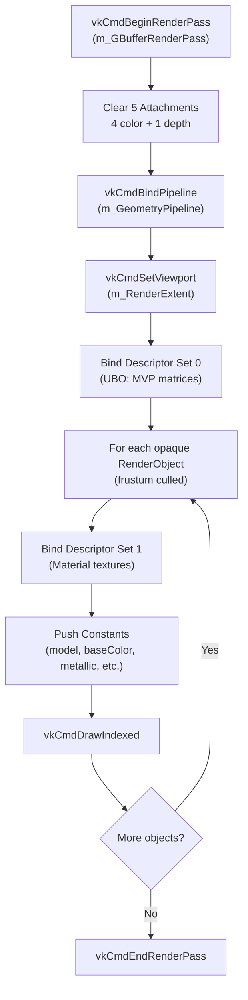
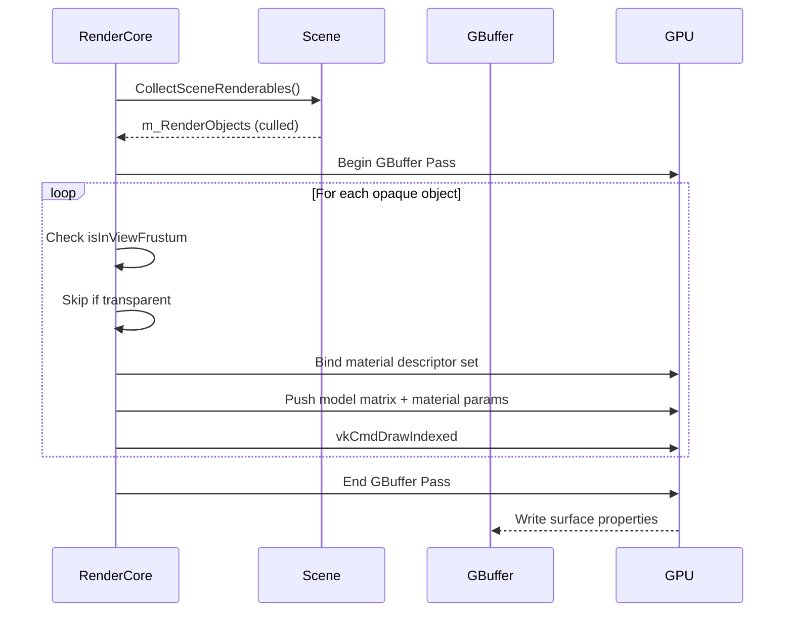
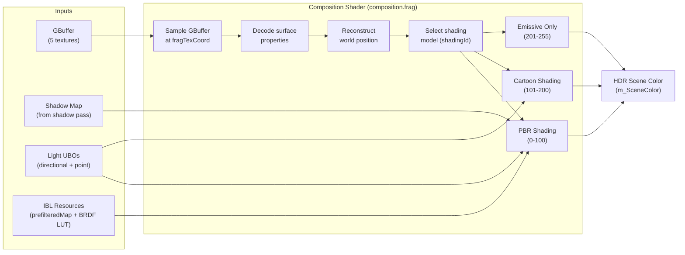
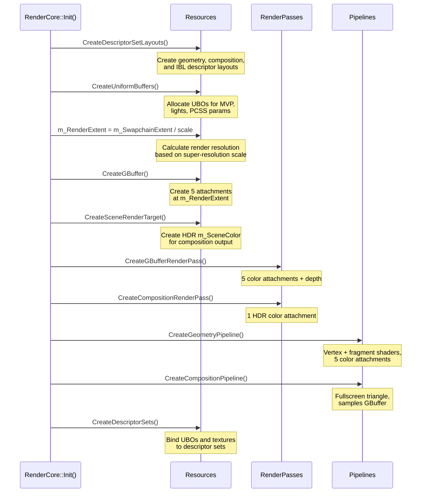
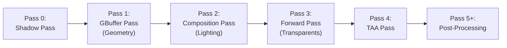

# Deferred Rendering (GBuffer)

<details>
<summary>Relevant source files</summary>

The following files were used as context for generating this wiki page:

- [.cache/clangd/index/Vertex.h.B1B82459C0160BD1.idx](.cache/clangd/index/Vertex.h.B1B82459C0160BD1.idx)
- [build/resource/shaders/glsl/composition.frag](build/resource/shaders/glsl/composition.frag)
- [include/RenderCore.h](include/RenderCore.h)
- [source/RenderCore.cpp](source/RenderCore.cpp)

</details>


This document describes the **deferred rendering system** implemented in NeuVulkanRender, which uses a GBuffer (Geometry Buffer) to decouple geometry rasterization from lighting calculations. The system consists of a **geometry pass** that writes surface properties to multiple render targets, followed by a **composition pass** that performs lighting and shading by reading from these buffers.

**Scope**: This page covers the GBuffer structure, render passes, pipelines, and descriptor bindings for deferred rendering. For shadow mapping (which precedes the geometry pass), see [3.2.2](#3.2.2). For post-processing effects applied after composition, see [3.2.4](#3.2.4). For forward rendering of transparent objects, see [3.2.3](#3.2.3).

---

## Overview

The deferred rendering architecture separates rendering into two distinct passes:

1. **Geometry Pass**: Rasterizes all opaque geometry and writes surface attributes to the GBuffer
2. **Composition Pass**: Performs lighting calculations using GBuffer data as input

This approach enables:
- Complex lighting with many light sources without per-object overhead
- Consistent shading across all geometry
- Efficient culling of invisible surfaces before lighting calculations
- Support for multiple shading models (PBR, cartoon, emissive) via `shadingId`

The system renders at a configurable resolution (`m_RenderExtent`) that can differ from the swapchain resolution, enabling super-resolution scaling via TAA.

**Sources**: [include/RenderCore.h:305-327](), [source/RenderCore.cpp:330-344]()

---

## GBuffer Structure

The GBuffer consists of **five attachments** that store surface properties at each pixel. All color attachments use `VK_FORMAT_R16G16B16A16_SFLOAT` for HDR precision, while depth uses `VK_FORMAT_D32_SFLOAT`.

### Attachment Layout



### Attachment Semantics

| Attachment | Format | Channels | Purpose |
|------------|--------|----------|---------|
| **gbuffer1** | R16G16B16A16_SFLOAT | RGB: Albedo (base color)<br/>A: Material flags (unused) | Diffuse color for lighting calculations |
| **gbuffer2** | R16G16B16A16_SFLOAT | RGB: Specular (F0)<br/>A: Occlusion | F0 for Fresnel, ambient occlusion |
| **gbuffer3** | R16G16B16A16_SFLOAT | RGB: Normal (encoded as [0,1])<br/>A: Smoothness | Surface normal and smoothness (1-roughness) |
| **gbuffer4** | R16G16B16A16_SFLOAT | R: ShadingID (0-255)<br/>GBA: Emissive color | Shading model selector and self-illumination |
| **depthBuffer** | D32_SFLOAT | R: Depth | Depth for Z-testing and position reconstruction |

The GBuffer is managed by the `GBuffer` class, which encapsulates creation, destruction, and framebuffer management. The RenderCore maintains a single `m_GBuffer` instance that is recreated when render resolution changes.

**Sources**: [build/resource/shaders/glsl/composition.frag:4-8](), [build/resource/shaders/glsl/composition.frag:419-423](), [include/RenderCore.h:307]()

---

## Geometry Pass

The geometry pass rasterizes all opaque geometry from the scene, writing surface properties to the GBuffer. This pass uses frustum culling and skips transparent objects.

### Render Pass Configuration



**Clear Values**: The GBuffer is cleared with default surface properties:
- Albedo: `{0, 0, 0, 0}` (black)
- Specular: `{0, 0, 0, 1}` (no specular, full occlusion)
- Normal: `{0.5, 0.5, 1.0, 0}` (up direction when decoded)
- ShadingID: `{0, 0, 0, 0}` (PBR shading by default)
- Depth: `1.0` (far plane)

**Sources**: [source/RenderCore.cpp:1318-1359]()

### Descriptor Set Bindings (Geometry Pass)

The geometry pass uses two descriptor sets:

**Set 0** (`m_GeometryDescriptorSetLayout`): Per-frame uniforms
```
Binding 0: Uniform Buffer (UniformBufferObject)
  - mat4 view
  - mat4 proj
  - vec3 viewPos
  - mat4 prevViewProj (for TAA motion vectors)
```

**Set 1** (`m_MaterialDescriptorSetLayout`): Per-material textures
```
Binding 0: sampler2D baseColorTexture
Binding 1: sampler2D metallicRoughnessTexture
Binding 2: sampler2D normalTexture
Binding 3: sampler2D occlusionTexture
Binding 4: sampler2D emissiveTexture
Binding 5: sampler2D (unused/reserved)
```

Materials reference textures by UUID. If a texture is missing, default textures are bound (`m_DefaultWhiteTexture`, `m_DefaultNormalTexture`, `m_DefaultBlackTexture`).

**Sources**: [include/RenderCore.h:320-327](), [source/RenderCore.cpp:1360-1365]()

### Push Constants

The geometry pass uses push constants to pass per-object data efficiently:

```cpp
struct PushConstantData {
    glm::mat4 model;           // Model matrix
    glm::vec4 baseColorFactor; // Tint factor
    float metallicFactor;      // Metallic multiplier
    float roughnessFactor;     // Roughness multiplier
    float normalScale;         // Normal map intensity
    float occlusionStrength;   // AO strength
    glm::vec3 emissiveFactor;  // Emissive multiplier
    uint shadingId;            // Shading model (0-255)
};
```

These values modulate the texture samples in the fragment shader before writing to the GBuffer.

**Sources**: [source/RenderCore.cpp:1367-1377]()

### Rendering Loop



Transparent objects are skipped in the geometry pass and rendered later in the forward pass (see [3.2.3](#3.2.3)). Frustum culling is performed by checking `obj.isInViewFrustum`, which is computed during `CollectSceneRenderables()`.

**Sources**: [source/RenderCore.cpp:1366-1513]()

---

## Composition Pass

The composition pass performs lighting calculations by reading from the GBuffer and writing to a HDR scene render target (`m_SceneColor`). This pass uses a fullscreen triangle to process every pixel.

### Composition Pipeline Flow



### Descriptor Set Bindings (Composition Pass)

The composition pass uses three descriptor sets:

**Set 0** (`m_CompositionGBufferDescriptorSetLayout`): GBuffer inputs
```
Binding 0: sampler2D gbuffer1 (Albedo + MaterialFlags)
Binding 1: sampler2D gbuffer2 (Specular + Occlusion)
Binding 2: sampler2D gbuffer3 (Normal + Smoothness)
Binding 3: sampler2D gbuffer4 (ShadingID + Emissive)
Binding 4: sampler2D depthBuffer
Binding 5: sampler2D shadowMap
```

**Set 1** (`m_CompositionLightDescriptorSetLayout`): Lighting data
```
Binding 0: Uniform Buffer (LightDataUBO)
  - Directional light (direction, color, viewPos)
  - invViewProj (for world position reconstruction)
  - Light VP matrix (for shadow mapping)
  
Binding 1: Uniform Buffer (PointLightsUBO)
  - PointLight[128] array
  - uint count
  
Binding 2: Uniform Buffer (PCSSParamsUBO)
  - Shadow parameters (light size, bias, samples, etc.)
  
Binding 3: Uniform Buffer (SkyboxParamsUBO)
  - Spherical harmonics coefficients (9 vec4s)
  - Brightness, rotation
```

**Set 2** (`m_IBLDescriptorSetLayout`): IBL resources
```
Binding 0: samplerCube prefilteredMap (prefiltered environment)
Binding 1: sampler2D brdfLUT (BRDF integration map)
```

**Sources**: [include/RenderCore.h:321-323](), [build/resource/shaders/glsl/composition.frag:3-61]()

### Shading Models

The composition shader supports three shading models selected by `shadingId`:

| ShadingID Range | Model | Description |
|-----------------|-------|-------------|
| 0-100 | **PBR** | Full physically-based rendering with Cook-Torrance BRDF, IBL, multiple lights |
| 101-200 | **Cartoon** | Cel-shaded rendering with quantized lighting levels |
| 201-255 | **Emissive** | Unlit, outputs emissive color only |

**PBR Shading** (`shadePBR`):
- Cook-Torrance BRDF for directional light
- Iterates over all point lights (up to 128)
- PCSS soft shadows from shadow map
- Image-based lighting (IBL):
  - Diffuse: Spherical harmonics irradiance
  - Specular: Split-sum approximation (prefiltered environment + BRDF LUT)
- Combines ambient + direct lighting + emissive

**Cartoon Shading** (`shadeCartoon`):
- Quantizes NdotL into discrete steps (0.3, 0.6, 1.0)
- Simple diffuse only, no specular
- Adds emissive

**Emissive Shading** (`shadeEmissive`):
- Outputs emissive color directly
- Ignores all lighting

**Sources**: [build/resource/shaders/glsl/composition.frag:346-413](), [build/resource/shaders/glsl/composition.frag:474-487]()

### Skybox Rendering

When the depth buffer equals `1.0` (far plane), the composition shader renders the skybox instead of performing lighting:

1. Reconstruct view ray direction from NDC coordinates using `invViewProj`
2. Apply `rotationY` rotation around Y-axis
3. Sample `prefilteredMap` at LOD 0 (full resolution)
4. Multiply by `skyboxParams.brightness`

This approach renders the skybox directly in the composition pass without a separate geometry pass.

**Sources**: [build/resource/shaders/glsl/composition.frag:426-453]()

---

## Code Entity Mapping

### Key Classes and Structures

```mermaid
graph TB
    subgraph RenderCoreClass["RenderCore (include/RenderCore.h)"]
        GBuffer["m_GBuffer: GBuffer"]
        GBufRP["m_GBufferRenderPass: VkRenderPass"]
        CompRP["m_CompositionRenderPass: VkRenderPass"]
        GeomPipe["m_GeometryPipeline: VkPipeline"]
        CompPipe["m_CompositionPipeline: VkPipeline"]
        GeomLayout["m_GeometryDescriptorSetLayout"]
        CompGBufLayout["m_CompositionGBufferDescriptorSetLayout"]
        CompLightLayout["m_CompositionLightDescriptorSetLayout"]
        IBLLayout["m_IBLDescriptorSetLayout"]
    end
    
    subgraph Methods["RenderCore Methods"]
        CreateGBuf["CreateGBuffer()"]
        CreateGBufRP["CreateGBufferRenderPass()"]
        CreateCompRP["CreateCompositionRenderPass()"]
        CreateGeomPipe["CreateGeometryPipeline()"]
        CreateCompPipe["CreateCompositionPipeline()"]
        RecordCmd["RecordCommandBuffer()"]
    end
    
    subgraph Shaders["GLSL Shaders"]
        GeomVert["geometry.vert"]
        GeomFrag["geometry.frag"]
        CompVert["composition.vert"]
        CompFrag["composition.frag"]
    end
    
    CreateGBuf --> GBuffer
    CreateGBufRP --> GBufRP
    CreateCompRP --> CompRP
    CreateGeomPipe --> GeomPipe
    CreateGeomPipe --> GeomVert
    CreateGeomPipe --> GeomFrag
    CreateCompPipe --> CompPipe
    CreateCompPipe --> CompVert
    CreateCompPipe --> CompFrag
    RecordCmd --> GBufRP
    RecordCmd --> CompRP
```



### Member Variables

| Variable | Type | Purpose |
|----------|------|---------|
| `m_GBuffer` | `GBuffer` | Encapsulates all GBuffer attachments and framebuffers |
| `m_GBufferRenderPass` | `VkRenderPass` | Render pass for geometry phase (5 color + depth) |
| `m_CompositionRenderPass` | `VkRenderPass` | Render pass for lighting phase (1 HDR color) |
| `m_GeometryPipeline` | `VkPipeline` | Graphics pipeline for geometry pass |
| `m_CompositionPipeline` | `VkPipeline` | Graphics pipeline for composition pass |
| `m_GeometryDescriptorSets` | `vector<VkDescriptorSet>` | Per-frame UBO bindings for geometry |
| `m_CompositionGBufferDescriptorSets` | `vector<VkDescriptorSet>` | GBuffer texture bindings |
| `m_CompositionLightDescriptorSets` | `vector<VkDescriptorSet>` | Light data bindings |
| `m_IBLDescriptorSets` | `vector<VkDescriptorSet>` | IBL resource bindings |
| `m_CompositionFramebuffers` | `vector<VkFramebuffer>` | Framebuffers for composition output |
| `m_RenderExtent` | `VkExtent2D` | Render resolution (may differ from swapchain) |
| `m_SceneColor` | `vector<GBufferAttachment>` | HDR render target for composition output |

**Sources**: [include/RenderCore.h:305-327](), [include/RenderCore.h:237-239]()

---

## Initialization Sequence

The deferred rendering system is initialized in `RenderCore::Init()` with the following order:



The order is critical: descriptor layouts must exist before pipelines, and render passes must exist before framebuffers.

**Sources**: [source/RenderCore.cpp:290-391]()

---

## Frame Rendering Integration

Within `RecordCommandBuffer()`, the deferred rendering passes execute in this order:



**Pass 1 (GBuffer)**: Lines 1318-1513 of RenderCore.cpp
- Binds `m_GBufferRenderPass`
- Uses framebuffer from `m_GBuffer.GetFramebuffer(m_CurrentFrame)`
- Renders to `m_RenderExtent` (low-res if super-resolution enabled)
- Outputs 5 attachments

**Pass 2 (Composition)**: (Not shown in provided snippet, but referenced)
- Binds `m_CompositionRenderPass`
- Reads from GBuffer via descriptor set 0
- Reads shadow map, lights, IBL via descriptor sets 1-2
- Outputs to `m_SceneColor[m_CurrentFrame]` (HDR)

The composition output serves as input to the forward pass for transparent rendering and TAA.

**Sources**: [source/RenderCore.cpp:1195-1513]()

---

## Resolution Independence

The GBuffer renders at `m_RenderExtent`, which is calculated based on `m_SuperResolutionScale`:

```cpp
m_RenderExtent.width = m_SwapchainExtent.width / m_SuperResolutionScale;
m_RenderExtent.height = m_SwapchainExtent.height / m_SuperResolutionScale;
```

For example, with `m_SuperResolutionScale = 1.25` and a 1920x1080 swapchain:
- `m_RenderExtent = 1536x864` (78% of native resolution)
- TAA upscales to 1920x1080 in a later pass

This reduces pixel shading cost while TAA recovers detail. All GBuffer attachments and the composition output are created at `m_RenderExtent`, not swapchain resolution.

**Sources**: [include/RenderCore.h:237-241](), [source/RenderCore.cpp:327-328](), [source/RenderCore.cpp:898-904]()

---

## Performance Characteristics

### Memory Footprint

At native 1920x1080 resolution:
- 4 color attachments × 8 bytes (RGBA16F) × 1920×1080 = **63.3 MB**
- 1 depth attachment × 4 bytes (D32F) × 1920×1080 = **7.9 MB**
- **Total: ~71 MB** per frame (×3 for triple buffering = **213 MB**)

With `m_SuperResolutionScale = 1.25`:
- Render at 1536×864: **~46 MB** per frame (×3 = **138 MB**)
- **Savings: 75 MB**

### Bandwidth Optimization

**Geometry Pass**:
- Writes: 5 attachments × 8 bytes = 40 bytes/pixel
- At 1920×1080: **80.6 MB** write bandwidth per frame

**Composition Pass**:
- Reads: 5 attachments × 8 bytes = 40 bytes/pixel
- Writes: 1 attachment × 8 bytes = 8 bytes/pixel
- At 1920×1080: **96.8 MB** bandwidth per frame

**Total deferred bandwidth**: ~177 MB/frame vs. per-object lighting which scales with scene complexity.

---

## Related Systems

- **Shadow Mapping**: The composition pass samples the shadow map generated in the shadow pass. See [3.2.2](#3.2.2).
- **Forward Rendering**: Transparent objects are rendered after composition using the GBuffer depth. See [3.2.3](#3.2.3).
- **Post-Processing**: TAA, bloom, and tone mapping operate on the composition output. See [3.2.4](#3.2.4).
- **Material System**: Materials define textures and parameters written to the GBuffer. See [3.3](#3.3).
- **Resource Management**: GBuffer attachments are managed as `GBufferAttachment` structures. See [3.3](#3.3).

**Sources**: [include/RenderCore.h:1-619](), [source/RenderCore.cpp:1-1600]()

---
