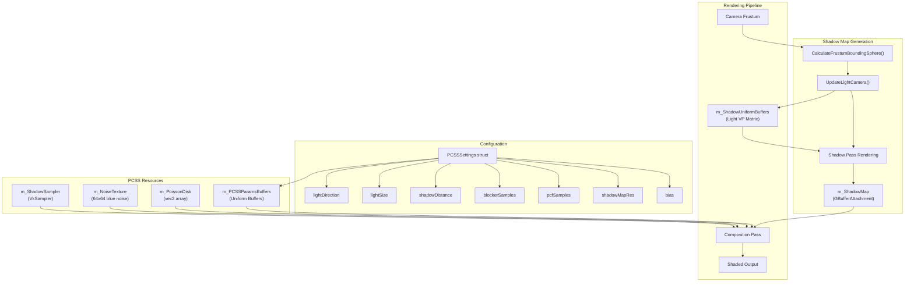
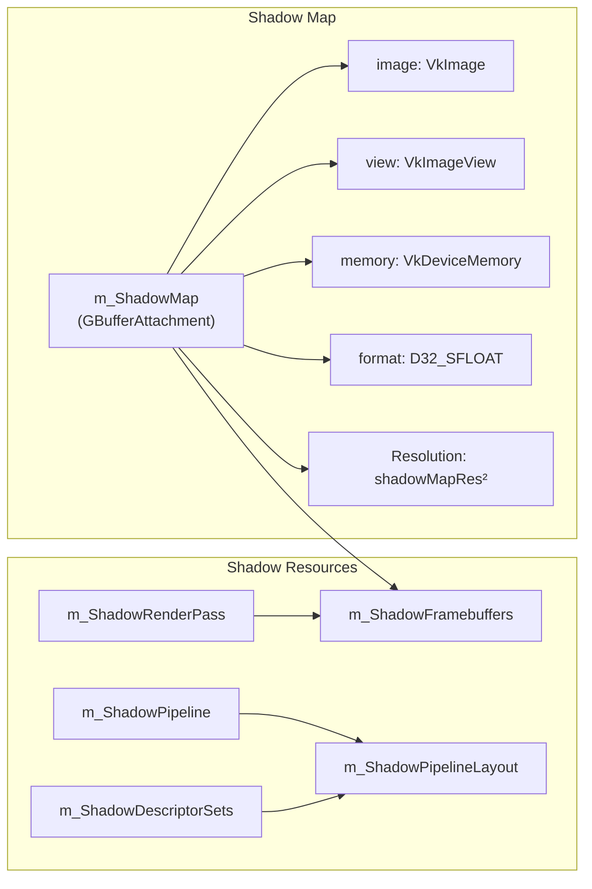
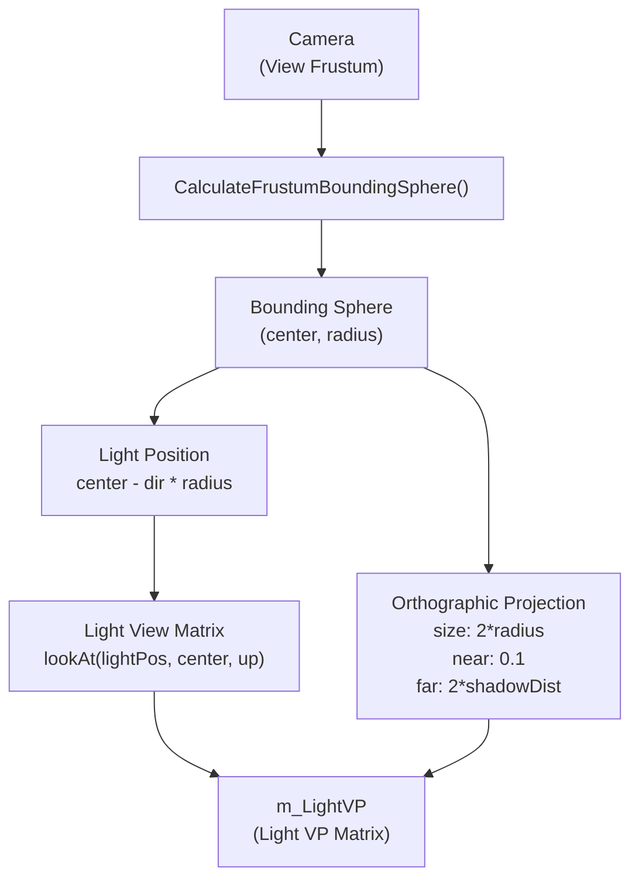
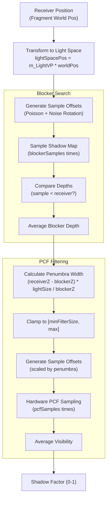

# Shadow Mapping (PCSS)

<details>
<summary>Relevant source files</summary>

The following files were used as context for generating this wiki page:

- [include/RenderCore.h](include/RenderCore.h)
- [source/RenderCore.cpp](source/RenderCore.cpp)

</details>


This document describes the **Percentage Closer Soft Shadows (PCSS)** implementation in the rendering pipeline. PCSS provides realistic soft shadows by simulating light source area and penumbra regions. The system generates a shadow map from the directional light's perspective and applies a two-stage filtering algorithm (blocker search + percentage closer filtering) to produce contact-hardening shadows.

For general rendering pipeline overview, see [3.2](#3.2). For the deferred shading composition pass that consumes the shadow map, see [3.2.1](#3.2.1).

## Overview

The PCSS shadow system consists of several integrated components working together to produce high-quality soft shadows:

1. **Shadow Map Generation** - Renders scene depth from the light's perspective
2. **Light Camera Calculation** - Fits orthographic projection to the view frustum
3. **PCSS Filtering** - Two-stage algorithm for soft shadow computation
4. **Sampling Patterns** - Poisson disk distribution with noise-based rotation
5. **Configuration Parameters** - Runtime controls for shadow quality and appearance

**Sources:** [include/RenderCore.h:100-117](), [include/RenderCore.h:523-538]()

## System Architecture



**Sources:** [include/RenderCore.h:357-404](), [source/RenderCore.cpp:346-356]()

## Shadow Map Generation

### Shadow Render Pass

The shadow render pass uses a depth-only attachment to store scene depth from the light's perspective. The render pass is created with a single depth attachment using `VK_FORMAT_D32_SFLOAT` format.

The `m_ShadowRenderPass` is configured to:
- Clear depth to 1.0 at the start
- Transition from `VK_IMAGE_LAYOUT_UNDEFINED` (first frame) or `VK_IMAGE_LAYOUT_SHADER_READ_ONLY_OPTIMAL` (subsequent frames) to `VK_IMAGE_LAYOUT_DEPTH_STENCIL_ATTACHMENT_OPTIMAL`
- Store depth results for later sampling in composition pass



**Sources:** [source/RenderCore.cpp:5042-5196](), [include/RenderCore.h:357-370]()

### Shadow Pipeline

The shadow pipeline is a simplified graphics pipeline that only writes depth:

- **Vertex Shader**: Transforms vertices using light's view-projection matrix via push constants
- **Fragment Shader**: Empty (depth written automatically)
- **Depth Test**: Enabled with `VK_COMPARE_OP_LESS`
- **Depth Write**: Enabled
- **Color Attachments**: None
- **Culling**: Back-face culling enabled
- **Viewport**: Dynamic, set to `shadowMapRes × shadowMapRes`

The model matrix is passed via push constants (64 bytes for `mat4`), while the light VP matrix is bound via descriptor set 0.

**Sources:** [source/RenderCore.cpp:5198-5362]()

### Light Camera Calculation

The light camera is updated each frame via `UpdateLightCamera()` to ensure optimal shadow map coverage. The algorithm:

1. **Calculate Bounding Sphere**: `CalculateFrustumBoundingSphere()` computes a sphere that encloses the view frustum up to `shadowDistance`
2. **Position Light**: Place light at `center - lightDirection * radius`
3. **Create Orthographic Projection**: Orthographic matrix with size `2 * radius`, near=0.1, far=`2 * shadowDistance`
4. **Compute Light VP**: Combine view and projection matrices into `m_LightVP`

This approach ensures the shadow map tightly fits the visible scene, maximizing shadow resolution.



**Sources:** [source/RenderCore.cpp:5644-5741](), [include/RenderCore.h:113-116]()

### Shadow Rendering Command Recording

During command buffer recording, the shadow pass executes before the GBuffer pass:

1. **Transition Shadow Map**: Barrier from `SHADER_READ_ONLY_OPTIMAL` to `DEPTH_STENCIL_ATTACHMENT_OPTIMAL`
2. **Begin Render Pass**: `vkCmdBeginRenderPass` with clear depth value 1.0
3. **Bind Pipeline**: `vkCmdBindPipeline(m_ShadowPipeline)`
4. **Bind Descriptors**: Light VP matrix descriptor set
5. **Set Viewport/Scissor**: Dynamic state set to shadow map resolution
6. **Render Objects**: Loop through `m_RenderObjects`, skip transparent objects, push model matrix, draw indexed
7. **End Render Pass**: `vkCmdEndRenderPass`
8. **Transition to Shader Read**: Barrier from `DEPTH_STENCIL_ATTACHMENT_OPTIMAL` to `SHADER_READ_ONLY_OPTIMAL`

**Sources:** [source/RenderCore.cpp:1204-1316]()

## PCSS Parameters and Resources

### PCSSSettings Structure

The `PCSSSettings` structure provides runtime configuration for shadow rendering:

| Parameter | Type | Default | Description |
|-----------|------|---------|-------------|
| `lightDirection` | `vec3` | `normalize(0.5, 0.8, 0.3)` | Direction of directional light |
| `lightSize` | `float` | `15.0` | Light source size (affects penumbra) |
| `shadowDistance` | `float` | `30.0` | Maximum shadow render distance |
| `bias` | `float` | `0.000001` | Depth bias to prevent shadow acne |
| `minFilterSize` | `float` | `0.2` | Minimum PCF filter kernel size (pixels) |
| `blockerSamples` | `uint32_t` | `16` | Number of samples for blocker search |
| `pcfSamples` | `uint32_t` | `32` | Number of samples for PCF filtering |
| `shadowMapRes` | `uint32_t` | `2048` | Shadow map resolution (width/height) |
| `enableDirectionalLight` | `bool` | `true` | Enable directional light |
| `enableShadow` | `bool` | `true` | Enable shadow rendering |

**Sources:** [include/RenderCore.h:524-536]()

### PCSS Uniform Buffer

The `PCSSParamsUBO` structure is uploaded to the GPU each frame and bound to the composition pass:

```cpp
struct PCSSParamsUBO {
    float u_LightSize;
    float u_ShadowDistance;
    float u_Bias;
    uint32_t u_BlockerSamples;
    uint32_t u_PCFSamples;
    uint32_t u_ShadowMapRes;
    uint32_t enableDirectionalLight;
    uint32_t enableShadow;
    float u_MinFilterSize;
};
```

The uniform buffer is created per frame-in-flight and persistently mapped for efficient updates. It is bound to **Set 1, Binding 2** in the composition pass descriptor layout.

**Sources:** [source/RenderCore.cpp:3287-3298](), [source/RenderCore.cpp:5405-5437]()

### Poisson Disk Sampling

The `m_PoissonDisk` is a pre-generated array of 64 2D sample points distributed in a Poisson disk pattern. This provides good spatial coverage for both blocker search and PCF filtering.

The Poisson disk is generated once during initialization via `GeneratePoissonDisk()` using a dart-throwing algorithm:

1. Start with a random point
2. For each subsequent point, generate random candidates
3. Accept only if distance to all existing points is above minimum threshold
4. Continue until 64 valid points are found

The points are normalized to a unit circle and uploaded as a uniform buffer to the GPU.

**Sources:** [source/RenderCore.cpp:5564-5618](), [include/RenderCore.h:403]()

### Noise Texture

The `m_NoiseTexture` is a 64×64 blue noise texture loaded during initialization via `LoadNoiseTexture()`. Blue noise provides high-frequency randomization with good perceptual properties (minimal low-frequency artifacts).

The noise texture is used in the shader to rotate the Poisson disk sampling pattern on a per-pixel basis, breaking up regular sampling patterns and reducing aliasing/banding artifacts.

**Sources:** [source/RenderCore.cpp:5620-5642](), [include/RenderCore.h:373]()

### Shadow Sampler

The `m_ShadowSampler` is configured for hardware PCF (Percentage Closer Filtering) with depth comparison:

- **Filter**: `VK_FILTER_LINEAR`
- **Address Mode**: `VK_SAMPLER_ADDRESS_MODE_CLAMP_TO_EDGE`
- **Compare Enable**: `VK_TRUE`
- **Compare Op**: `VK_COMPARE_OP_LESS` (for shadow map comparison)
- **Border Color**: `VK_BORDER_COLOR_FLOAT_OPAQUE_WHITE` (always lit outside shadow map)

This sampler performs hardware-accelerated depth comparison during texture sampling, automatically returning 0.0 for shadowed pixels and 1.0 for lit pixels.

**Sources:** [source/RenderCore.cpp:5364-5385]()

## PCSS Algorithm

The PCSS algorithm is implemented in the composition fragment shader and consists of two stages:

### Stage 1: Blocker Search

For each pixel, the shader searches the shadow map to find the average depth of occluders (blockers) between the light and the receiver:

1. Transform pixel's world position to light space using `m_LightVP`
2. Sample the shadow map at `blockerSamples` random positions (Poisson disk + noise rotation)
3. Compare each sample depth with receiver depth
4. Compute average depth of samples that are closer (blockers)
5. If no blockers found, pixel is fully lit (early exit)

### Stage 2: Percentage Closer Filtering (PCF)

Using the blocker depth information, the shader computes penumbra width and applies variable-size PCF:

1. Calculate penumbra width: `(receiverDepth - blockerDepth) * lightSize / blockerDepth`
2. Clamp penumbra width to `[minFilterSize, maxFilterSize]`
3. Sample shadow map at `pcfSamples` positions scaled by penumbra width
4. Hardware PCF compares each sample and returns visibility (0 or 1)
5. Average all visibility samples to get final shadow factor

The result is contact-hardening shadows: sharp near contact points (small penumbra) and soft farther away (large penumbra).



**Sources:** [include/RenderCore.h:523-538](), [source/RenderCore.cpp:3287-3298]()

## Integration with Rendering Pipeline

### Descriptor Set Binding

The shadow map and PCSS parameters are bound to the composition pass via descriptor sets:

**Set 0 (GBuffer):**
- Binding 5: `m_ShadowMap` (combined image sampler with `m_ShadowSampler`)

**Set 1 (Lights):**
- Binding 0: Directional light UBO (contains `u_LightVP`, `u_LightNear`, `u_LightFar`)
- Binding 2: PCSS parameters UBO

The noise texture and Poisson disk are embedded in shader code or uploaded as separate uniform buffers.

**Sources:** [source/RenderCore.cpp:3037-3086](), [source/RenderCore.cpp:3088-3168]()

### Frame Update Sequence

Each frame, the following shadow-related updates occur:

1. **ProcessInput()** - Handle camera movement
2. **UpdateLightCamera()** - Recalculate light VP matrix based on new camera frustum
3. **UpdateUniformBuffer()** - Upload light data, PCSS parameters to GPU
4. **CollectSceneRenderables()** - Build renderable object list
5. **RecordCommandBuffer()** - Record shadow pass, then GBuffer, then composition

**Sources:** [source/RenderCore.cpp:1838-1851]()

### Performance Considerations

The PCSS implementation provides several quality/performance trade-offs:

| Parameter | Impact | Recommendation |
|-----------|--------|----------------|
| `shadowMapRes` | Higher = sharper shadows, more memory, slower rendering | 2048 for high quality, 1024 for balanced |
| `blockerSamples` | Higher = better penumbra estimation, slower | 16-32 for good quality |
| `pcfSamples` | Higher = smoother shadows, slower | 32-64 for soft shadows |
| `lightSize` | Larger = softer shadows, no performance impact | 10-20 for realistic outdoor lighting |
| `shadowDistance` | Larger = more area covered, lower effective resolution | Match scene scale |

The shadow map resolution can be changed at runtime via `SetShadowMapResolution()`, which triggers recreation of the shadow map attachment and framebuffers.

**Sources:** [source/RenderCore.cpp:5743-5777]()

## Resource Management

### Shadow Map Lifecycle

The shadow map is created during initialization:

1. **CreateShadowMap()**: Allocates `VkImage` with `VK_FORMAT_D32_SFLOAT`, creates `VkImageView`, allocates device memory
2. **CreateShadowRenderPass()**: Creates render pass with depth attachment
3. **CreateShadowPipeline()**: Creates graphics pipeline for depth-only rendering
4. **CreateShadowSampler()**: Creates sampler with depth comparison enabled
5. **CreateShadowDescriptorSets()**: Allocates and updates descriptor sets

Resolution changes trigger recreation via `SetShadowMapResolution()`:
1. Wait for device idle
2. Destroy old shadow map resources
3. Recreate with new resolution
4. Update descriptor sets

**Sources:** [source/RenderCore.cpp:5387-5403](), [source/RenderCore.cpp:5743-5777]()

### Memory Footprint

Shadow system GPU memory usage:

- **Shadow Map**: `shadowMapRes² × 4 bytes` (default: 2048² × 4 = 16 MB)
- **PCSS Uniform Buffers**: `9 × float/uint × 3 frames` ≈ 108 bytes
- **Shadow Uniform Buffers**: `64 bytes × 3 frames` = 192 bytes
- **Poisson Disk**: `64 × vec2 × 4 bytes` = 512 bytes
- **Noise Texture**: `64 × 64 × 4 channels × 1 byte` = 16 KB

Total: ~16.2 MB (dominated by shadow map)

**Sources:** [source/RenderCore.cpp:5387-5403](), [source/RenderCore.cpp:5405-5437]()

## Shader Interface

### Vertex Shader (shadow.vert)

Expected inputs:
- **Push Constants**: `mat4 model` (offset 0, 64 bytes)
- **Descriptor Set 0, Binding 0**: Uniform buffer with Light VP matrix

Output: `gl_Position = lightVP * model * vec4(inPosition, 1.0)`

### Fragment Shader (composition.frag)

Shadow-related inputs:
- **Set 0, Binding 5**: `sampler2DShadow shadowMap`
- **Set 1, Binding 0**: Light UBO with `u_LightVP`, `u_LightNear`, `u_LightFar`
- **Set 1, Binding 2**: PCSS parameters UBO

Shadow calculation function signature (pseudo-code):
```glsl
float calculatePCSSShadow(vec3 worldPos, vec3 normal) {
    // Transform to light space
    vec4 lightSpacePos = u_LightVP * vec4(worldPos, 1.0);
    
    // Blocker search
    float blockerDepth = findBlockerDepth(lightSpacePos.xy, lightSpacePos.z);
    if (blockerDepth < 0.0) return 1.0; // No blockers
    
    // Calculate penumbra
    float penumbra = (lightSpacePos.z - blockerDepth) * u_LightSize / blockerDepth;
    penumbra = clamp(penumbra, u_MinFilterSize, maxFilterSize);
    
    // PCF with variable kernel size
    float shadow = 0.0;
    for (int i = 0; i < u_PCFSamples; i++) {
        vec2 offset = poissonDisk[i] * penumbra;
        shadow += texture(shadowMap, vec3(lightSpacePos.xy + offset, lightSpacePos.z - u_Bias));
    }
    return shadow / float(u_PCFSamples);
}
```

**Sources:** [source/RenderCore.cpp:3037-3168]()

## Configuration and Debugging

### Runtime Controls

The PCSS settings are exposed via `GetPCSSSettings()` and can be modified through the editor GUI:

```cpp
auto& settings = RenderCore::GetPCSSSettings();
settings.lightSize = 20.0f;          // Softer shadows
settings.blockerSamples = 32;        // Higher quality blocker search
settings.enableShadow = true;        // Toggle shadows on/off
```

Shadow map resolution changes require explicit update:
```cpp
RenderCore::SetShadowMapResolution(4096); // Triggers resource recreation
```

**Sources:** [include/RenderCore.h:536-537]()

### Debug Visualization

The post-process debug modes do not directly expose shadow map visualization, but the depth buffer can be viewed via debug mode 4 (Depth). To visualize the shadow map specifically, a custom debug path would sample from the shadow map attachment.

The shadow map is bound to descriptor set 0, binding 5 in the composition pass, making it accessible for inspection or custom visualization passes.

**Sources:** [source/RenderCore.cpp:3037-3086]()

---
