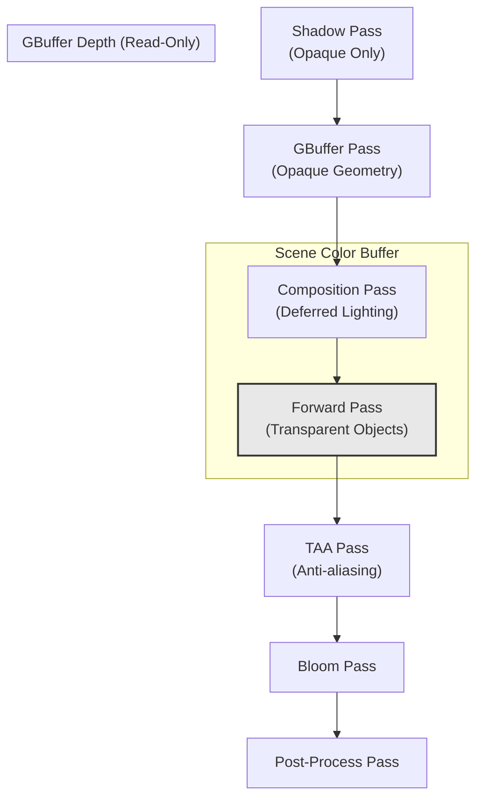
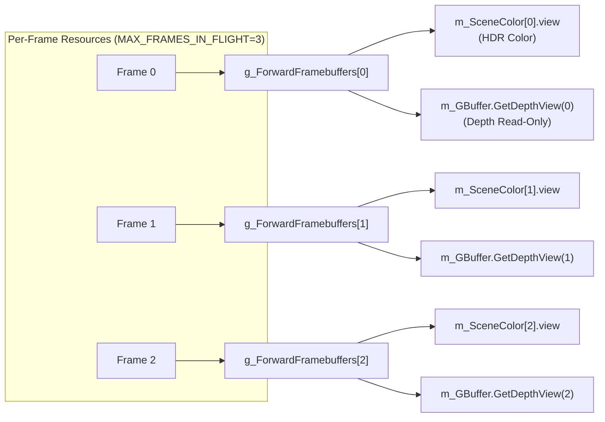
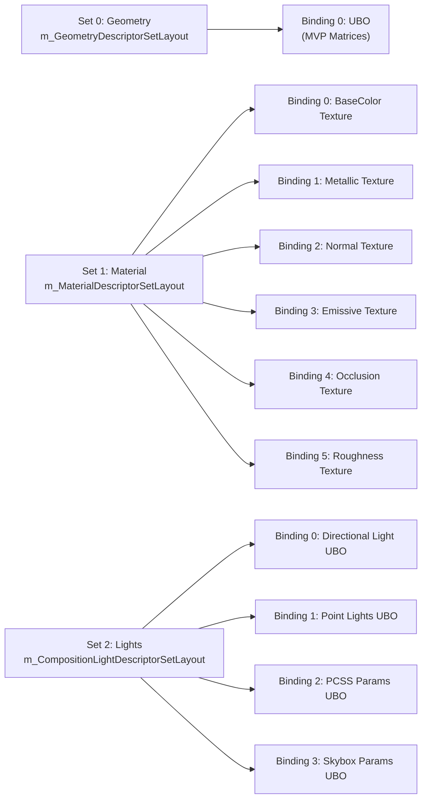
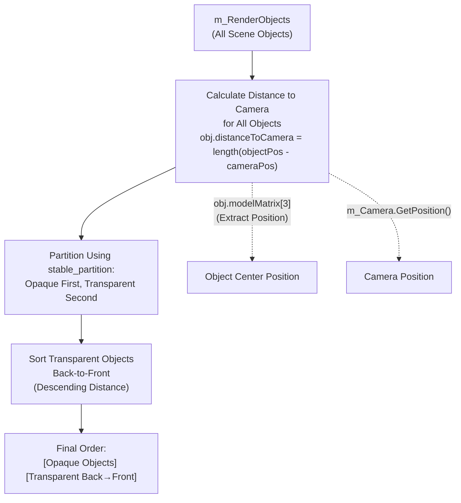
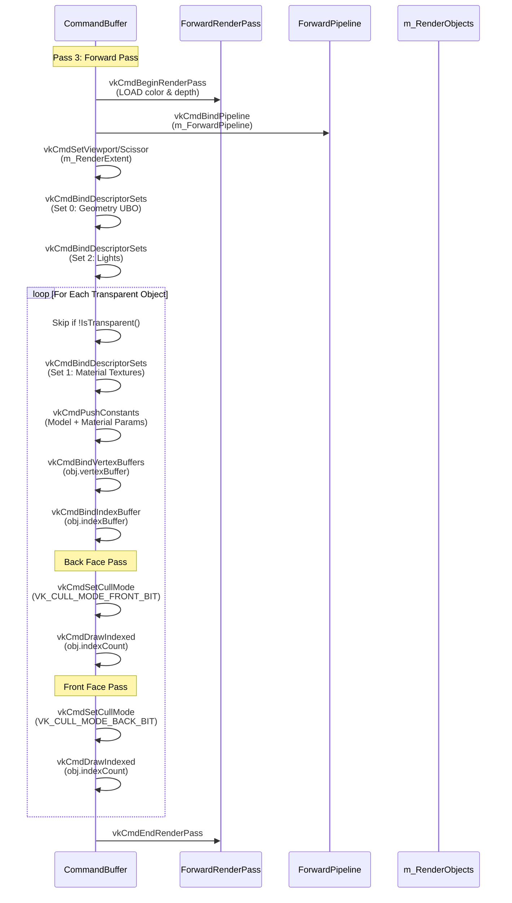
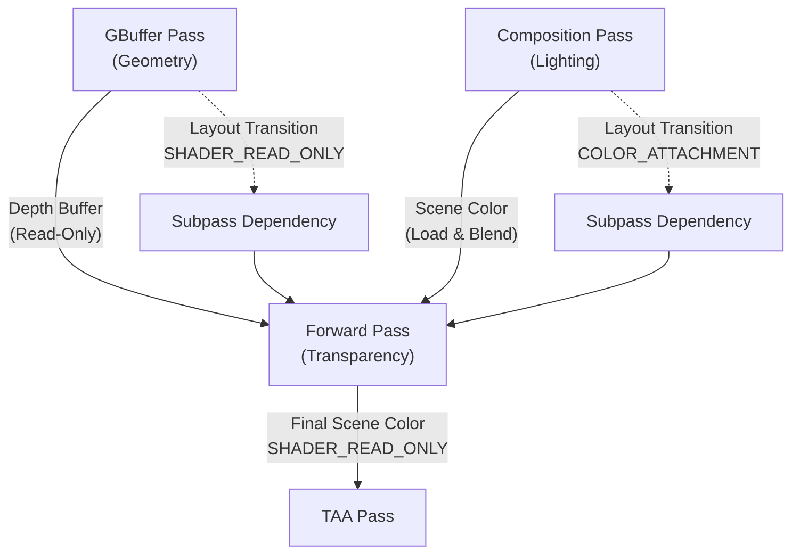

# Forward Rendering and Transparency

<details>
<summary>Relevant source files</summary>

The following files were used as context for generating this wiki page:

- [include/RenderCore.h](include/RenderCore.h)
- [source/RenderCore.cpp](source/RenderCore.cpp)

</details>


## Purpose and Scope

This document describes the **forward rendering pipeline** used exclusively for rendering **transparent objects** in NeuVulkanRender. The forward pass executes after the deferred composition pass (#3.2.1) and before post-processing (#3.2.4), enabling correct alpha blending of transparent geometry over the opaque scene.

For deferred rendering of opaque geometry, see [Deferred Rendering (GBuffer)](#3.2.1). For the overall rendering pipeline structure, see [Rendering Pipeline](#3.2).

---

## Overview

The forward rendering system handles transparent objects that cannot be correctly rendered using deferred shading due to the inability to store multiple overlapping fragments in the GBuffer. The implementation features:

- **Single-pass forward rendering** with alpha blending
- **Back-to-front sorting** of transparent objects for correct transparency
- **Depth buffer reuse** from the GBuffer pass (read-only)
- **Double-sided rendering** with separate front and back face passes
- **HDR color accumulation** on the scene color buffer

**Key Components:**
- `m_ForwardRenderPass` - Render pass with color load and depth read
- `m_ForwardPipeline` - Graphics pipeline with alpha blending enabled
- `g_ForwardFramebuffers` - Per-frame framebuffers binding scene color and GBuffer depth
- `SortTransparentObjects()` - Distance-based sorting function

Sources: [include/RenderCore.h:95-98](), [include/RenderCore.h:405-411](), [source/RenderCore.cpp:133-138]()

---

## Pipeline Position in Frame Rendering



**Diagram: Forward Pass Position in Rendering Pipeline**

The forward pass operates on the `m_SceneColor` HDR buffer after deferred composition has completed. It reads the GBuffer depth buffer to ensure proper depth testing against opaque geometry.

Sources: [source/RenderCore.cpp:1471-1566]()

---

## Render Pass Configuration

### Attachment Specifications

The forward render pass defines two attachments with specific load/store operations optimized for transparent rendering:

| Attachment | Format | Load Op | Store Op | Initial Layout | Final Layout | Purpose |
|------------|--------|---------|----------|----------------|--------------|---------|
| Color | `VK_FORMAT_R16G16B16A16_SFLOAT` | `LOAD` | `STORE` | `COLOR_ATTACHMENT_OPTIMAL` | `SHADER_READ_ONLY_OPTIMAL` | Accumulate transparent color over opaque scene |
| Depth | `VK_FORMAT_D32_SFLOAT` | `LOAD` | `STORE` | `SHADER_READ_ONLY_OPTIMAL` | `SHADER_READ_ONLY_OPTIMAL` | Read GBuffer depth for testing |

The color attachment uses **`VK_ATTACHMENT_LOAD_OP_LOAD`** to preserve the opaque scene rendered by the composition pass. The depth attachment is read-only (`VK_IMAGE_LAYOUT_DEPTH_STENCIL_READ_ONLY_OPTIMAL`) to prevent transparent objects from occluding each other incorrectly.

Sources: [source/RenderCore.cpp:3447-3524]()

### Framebuffer Creation



**Diagram: Forward Framebuffer Structure**

The framebuffers use a global variable `g_ForwardFramebuffers` (defined at [source/RenderCore.cpp:231]()) to avoid modifying the header. Each framebuffer binds the scene color attachment (written by composition pass) and the GBuffer depth attachment.

Sources: [source/RenderCore.cpp:3526-3547]()

---

## Graphics Pipeline Configuration

### Pipeline State

The forward pipeline is configured specifically for transparent object rendering with the following key states:

**Depth State:**
- Depth test: **Enabled** (`VK_TRUE`)
- Depth write: **Disabled** (`VK_FALSE`) - prevents transparent objects from occluding each other
- Depth compare: `VK_COMPARE_OP_LESS` - rejects fragments behind opaque geometry

**Blend State:**
```cpp
colorBlendAttachment.blendEnable = VK_TRUE;
colorBlendAttachment.srcColorBlendFactor = VK_BLEND_FACTOR_SRC_ALPHA;
colorBlendAttachment.dstColorBlendFactor = VK_BLEND_FACTOR_ONE_MINUS_SRC_ALPHA;
colorBlendAttachment.colorBlendOp = VK_BLEND_OP_ADD;
```

This implements standard alpha blending: `Result = SrcColor * SrcAlpha + DstColor * (1 - SrcAlpha)`

**Rasterization State:**
- Cull mode: `VK_CULL_MODE_NONE` - double-sided rendering
- Polygon mode: `VK_POLYGON_MODE_FILL`
- Front face: `VK_FRONT_FACE_COUNTER_CLOCKWISE`

Sources: [source/RenderCore.cpp:3615-3644]()

### Descriptor Set Layout

The forward pipeline uses three descriptor sets matching the deferred geometry pass for material consistency:



**Diagram: Forward Pipeline Descriptor Sets**

The descriptor sets are shared with the geometry pipeline to avoid duplication. Set 2 provides lighting data for forward-shaded lighting calculations in the fragment shader.

Sources: [source/RenderCore.cpp:3662-3673]()

### Push Constants

The pipeline uses 128 bytes of push constants to pass per-object material parameters:

```cpp
struct ForwardPushConstants {
    glm::mat4 model;              // 64 bytes - model matrix
    glm::vec4 baseColorFactor;    // 16 bytes
    float metallicFactor;         // 4 bytes
    float roughnessFactor;        // 4 bytes
    float normalScale;            // 4 bytes
    float alpha;                  // 4 bytes - transparency value
    float shadingId;              // 4 bytes
    float emissiveIntensity;      // 4 bytes
    uint32_t textureFlags;        // 4 bytes - texture presence flags
    // Total: 108 bytes (aligned to 128)
};
```

The `alpha` field is critical for transparent rendering, controlling the blend factor.

Sources: [source/RenderCore.cpp:3510-3520](), [source/RenderCore.cpp:3655-3659]()

### Dynamic States

Three dynamic states are enabled for runtime flexibility:

1. **`VK_DYNAMIC_STATE_VIEWPORT`** - allows viewport adjustment without pipeline recreation
2. **`VK_DYNAMIC_STATE_SCISSOR`** - enables dynamic scissor rectangle updates
3. **`VK_DYNAMIC_STATE_CULL_MODE`** - critical for double-sided rendering (see below)

Sources: [source/RenderCore.cpp:3646-3652]()

---

## Transparent Object Sorting

### Sorting Algorithm

The `SortTransparentObjects()` function implements a two-stage sorting process:



**Diagram: Transparent Object Sorting Process**

**Implementation Details:**

1. **Distance Calculation** (lines 3710-3713):
   ```cpp
   for (auto &obj : m_RenderObjects) {
       glm::vec3 objectCenter = glm::vec3(obj.modelMatrix[3]);
       obj.distanceToCamera = glm::length(objectCenter - cameraPos);
   }
   ```

2. **Partitioning** (lines 3716-3718):
   ```cpp
   auto transparentStart = std::stable_partition(
       m_RenderObjects.begin(), m_RenderObjects.end(),
       [](const RenderObject &obj) { return !obj.material.IsTransparent(); });
   ```
   Uses `stable_partition` to maintain relative order of opaque objects while grouping them before transparent objects.

3. **Back-to-Front Sorting** (lines 3721-3724):
   ```cpp
   std::sort(transparentStart, m_RenderObjects.end(),
             [](const RenderObject &a, const RenderObject &b) {
                 return a.distanceToCamera > b.distanceToCamera;
             });
   ```
   Sorts only the transparent range in descending distance order (furthest first).

**When Sorting Occurs:**

Sorting is **not** called within the command buffer recording. The current implementation relies on the order of objects in `m_RenderObjects`, which is populated by `CollectSceneRenderables()`. The sorting function exists but may need to be called explicitly before rendering.

Sources: [source/RenderCore.cpp:3706-3725]()

---

## Rendering Process

### Command Recording

The forward pass rendering sequence within `RecordCommandBuffer()`:



**Diagram: Forward Pass Command Recording Sequence**

Sources: [source/RenderCore.cpp:1471-1566]()

### Double-Sided Rendering

To correctly render transparent objects that may be visible from both sides (e.g., glass, leaves), the implementation renders each object **twice per object**:

1. **Back Face Pass** (lines 1559-1560):
   ```cpp
   vkCmdSetCullMode(commandBuffer, VK_CULL_MODE_FRONT_BIT);
   vkCmdDrawIndexed(commandBuffer, obj.indexCount, 1, 0, 0, 0);
   ```
   Renders only back-facing triangles first.

2. **Front Face Pass** (lines 1562-1563):
   ```cpp
   vkCmdSetCullMode(commandBuffer, VK_CULL_MODE_BACK_BIT);
   vkCmdDrawIndexed(commandBuffer, obj.indexCount, 1, 0, 0, 0);
   ```
   Renders front-facing triangles on top.

This two-pass approach ensures that for objects like a glass sphere, the back surface is drawn before the front surface, producing correct visual results with depth-based blending.

Sources: [source/RenderCore.cpp:1557-1563]()

### Object Filtering

Only objects meeting all criteria are rendered in the forward pass:

```cpp
for (const auto &obj : m_RenderObjects) {
    if (!obj.material.IsTransparent())
        continue;
    // ... render object
}
```

The `IsTransparent()` method (defined in the `Material` class) checks if the material has an alpha value less than 1.0 or specific material flags set.

**Note:** Frustum culling is **not** applied in the forward pass iteration shown. Objects are filtered only by transparency. This differs from the GBuffer pass which checks `obj.isInViewFrustum`.

Sources: [source/RenderCore.cpp:1522-1524]()

---

## Integration with Deferred Pipeline

### Resource Sharing

The forward pass shares several resources with the deferred pipeline:

| Resource | Shared From | Usage in Forward Pass |
|----------|-------------|----------------------|
| `m_SceneColor[i]` | Composition Pass Output | Color attachment (LOAD/STORE) |
| `m_GBuffer.GetDepthView(i)` | GBuffer Pass | Depth attachment (Read-Only) |
| `m_GeometryDescriptorSets[i]` | Geometry Pass | Set 0: MVP matrices |
| `m_CompositionLightDescriptorSets[i]` | Composition Pass | Set 2: Light data |
| Material Descriptor Sets | Material Resources | Set 1: Textures |

Sources: [source/RenderCore.cpp:1476-1477](), [source/RenderCore.cpp:1501-1508](), [source/RenderCore.cpp:1526-1532]()

### Render Pass Dependencies



**Diagram: Forward Pass Dependencies**

The forward render pass dependency (lines 3489-3504) ensures:
- **Source Stage:** Wait for previous color and depth writes to complete
- **Destination Stage:** Synchronize with color blending and depth testing
- **Access Masks:** Allow reading previous color for blending and depth for testing

Sources: [source/RenderCore.cpp:3489-3504]()

---

## Shader Interface

### Vertex Shader

The forward vertex shader (`forward.vert.spv`) processes standard vertex attributes:

**Input Layout (from `Vertex::getAttributeDescriptions()`):**
- Location 0: `position` (vec3)
- Location 1: `normal` (vec3)
- Location 2: `texCoord` (vec2)
- Location 3: `tangent` (vec3)

**Outputs:**
- `gl_Position` - Transformed vertex position (with jitter for TAA)
- Interpolated attributes for fragment shader (normal, tangent, UV, world position)

Sources: [source/RenderCore.cpp:3575-3586]()

### Fragment Shader

The forward fragment shader (`forward.frag.spv`) performs:

1. **Material Sampling** - Reads textures from Set 1 based on `textureFlags`
2. **Lighting Calculation** - Computes direct and IBL lighting using PBR
3. **Alpha Output** - Uses `alpha` from push constants for blending

The shader shares the same lighting model as the composition pass but computes it per-fragment instead of reading from GBuffer.

Sources: [source/RenderCore.cpp:3550-3554]()

---

## Performance Considerations

### Overdraw and Fill Rate

**Transparent rendering is fill-rate intensive** due to:
- Multiple overlapping fragments requiring blending
- Double-sided rendering (2x draw calls per object)
- Back-to-front ordering maximizing overdraw

**Optimization:** The depth test (even without writes) helps reject fragments behind opaque geometry, reducing unnecessary fragment shader invocations.

### Sorting Cost

The sorting algorithm has **O(n log n)** complexity for transparent objects. For scenes with many transparent objects, this can become a CPU bottleneck. The implementation uses `std::stable_partition` which is generally efficient for maintaining opaque object order.

### Descriptor Set Reuse

By reusing descriptor set layouts from the geometry and composition passes, the forward pipeline avoids:
- Duplicate descriptor pool allocations
- Additional descriptor set updates
- Pipeline layout incompatibilities

Sources: [source/RenderCore.cpp:3662-3665]()

---

## Limitations and Known Issues

1. **Order-Independent Transparency:** The current implementation does not support OIT techniques. Complex overlapping transparent surfaces may produce artifacts.

2. **Explicit Sorting Call:** The `SortTransparentObjects()` function is defined but its invocation is not evident in the main rendering loop. Sorting must be called before command recording for correct results.

3. **No Frustum Culling:** Transparent objects in the forward pass are not filtered by `obj.isInViewFrustum`, potentially rendering off-screen objects.

4. **Shadow Receiving:** The current implementation does not clearly show how transparent objects receive shadows. They may need special handling in the shadow pass or composition.

Sources: [source/RenderCore.cpp:3706-3725](), [source/RenderCore.cpp:1522-1524]()

---

**Key Symbols Reference:**
- `RenderCore::CreateForwardRenderPass()` - [source/RenderCore.cpp:3447-3524]()
- `RenderCore::CreateForwardPipeline()` - [source/RenderCore.cpp:3549-3704]()
- `RenderCore::CreateForwardFramebuffers()` - [source/RenderCore.cpp:3526-3547]()
- `RenderCore::SortTransparentObjects()` - [source/RenderCore.cpp:3706-3725]()
- `m_ForwardRenderPass` - [include/RenderCore.h:407]()
- `m_ForwardPipeline` - [include/RenderCore.h:408]()
- `g_ForwardFramebuffers` - [source/RenderCore.cpp:231]()

---
