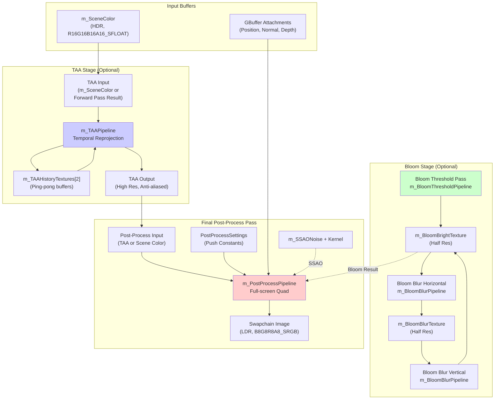
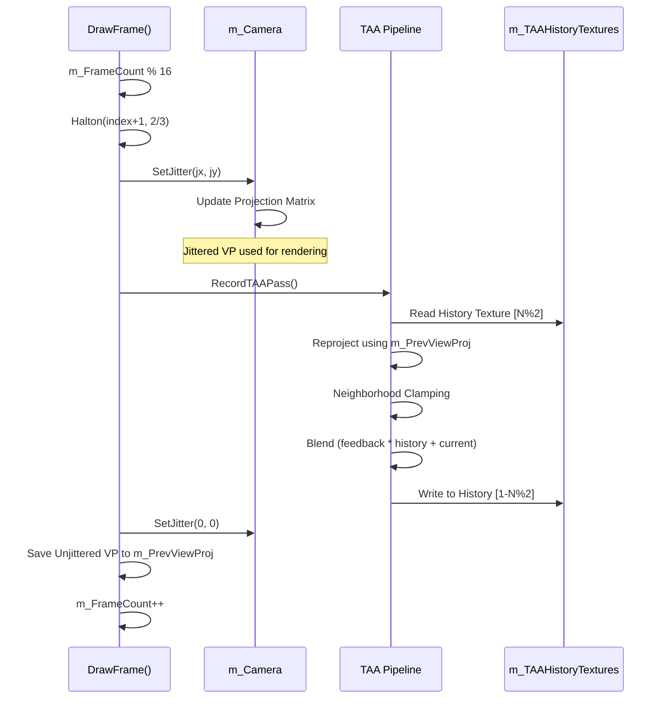
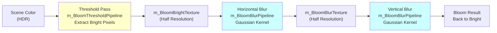
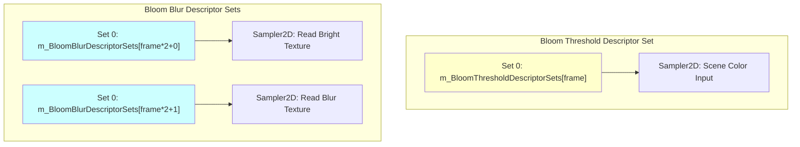
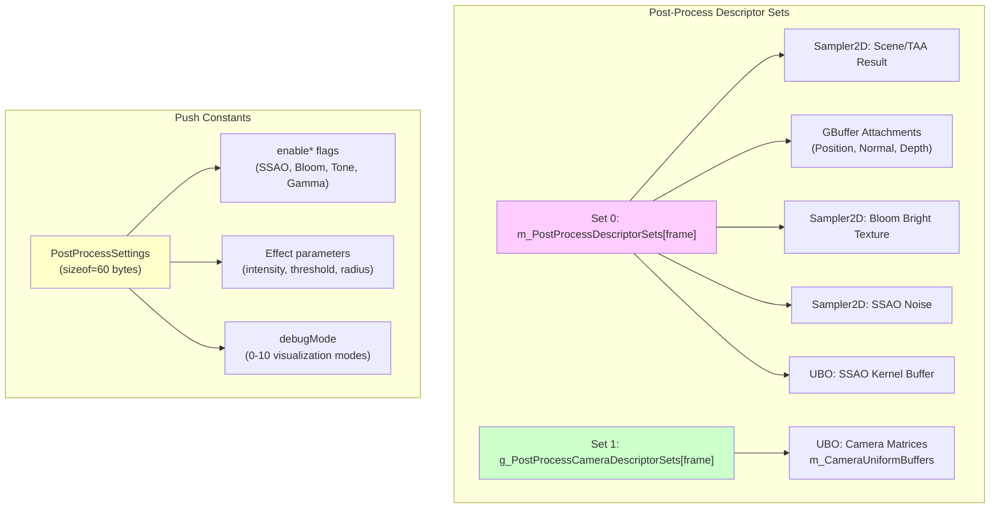
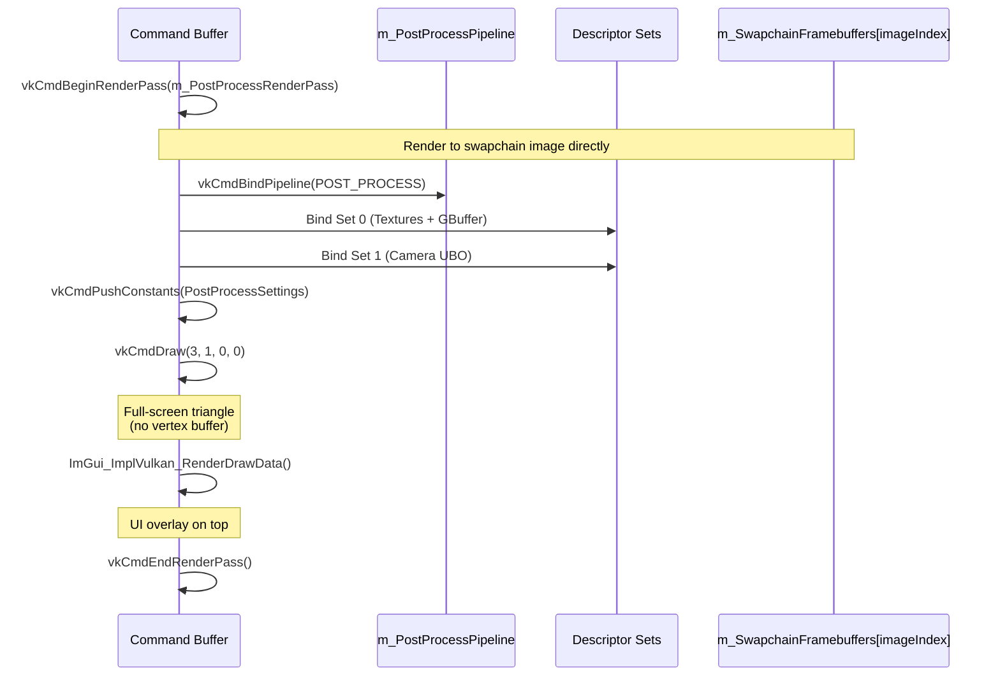
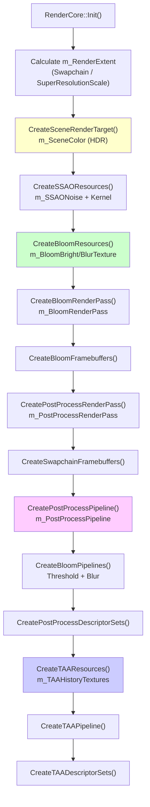

# Post-Processing Effects

<details>
<summary>Relevant source files</summary>

The following files were used as context for generating this wiki page:

- [.cache/clangd/index/RenderCore.h.CFEA37C534CAD967.idx](.cache/clangd/index/RenderCore.h.CFEA37C534CAD967.idx)
- [include/RenderCore.h](include/RenderCore.h)
- [source/RenderCore.cpp](source/RenderCore.cpp)

</details>


This document describes the post-processing effects system in NeuVulkanRender, which applies image enhancement and correction operations after the main rendering passes. The post-processing stage operates on the final composed HDR scene buffer and produces the LDR output displayed on screen.

For information about the preceding rendering passes (deferred and forward), see [Deferred Rendering (GBuffer)](#3.2.1) and [Forward Rendering and Transparency](#3.2.3). For general rendering pipeline architecture, see [Rendering Pipeline](#3.2).

## Overview

The post-processing system implements a multi-stage pipeline that includes:

- **Temporal Anti-Aliasing (TAA)**: Reduces aliasing artifacts using temporal reprojection and jitter
- **Bloom**: Creates HDR glow effects through threshold extraction and Gaussian blur
- **Screen Space Ambient Occlusion (SSAO)**: Approximates ambient occlusion in screen space
- **Tone Mapping**: Converts HDR luminance to displayable LDR range
- **Gamma Correction**: Applies gamma curve for correct color display
- **Debug Visualization**: Provides multiple debug views of rendering intermediate buffers

Sources: [include/RenderCore.h:450-463](), [source/RenderCore.cpp:1674-1726]()

## Post-Processing Pipeline Architecture

The post-processing effects are applied in a specific sequence to maximize quality and minimize artifacts. The pipeline operates on the `m_SceneColor` HDR render target produced by the composition pass.



**Sources**: [include/RenderCore.h:413-422](), [source/RenderCore.cpp:1569-1726]()

## Temporal Anti-Aliasing (TAA)

TAA reduces aliasing by accumulating sub-pixel jittered samples across multiple frames. The system uses a Halton(2,3) sequence for camera jitter and maintains a history buffer for temporal reprojection.

### TAA Configuration

| Resource | Type | Resolution | Format |
|----------|------|------------|--------|
| `m_TAAHistoryTextures[2]` | Ping-pong buffers | High Res (Swapchain) | R16G16B16A16_SFLOAT |
| `m_PrevViewProj` | Previous frame VP matrix | - | mat4 |
| `m_FrameCount` | Jitter sequence index | - | uint32_t |
| `m_TAAFeedbackFactor` | Blend weight | - | float (default 0.88) |

The TAA pipeline can be toggled via `RenderCore::SetTAAEnabled(bool)` and its feedback factor adjusted with `RenderCore::SetTAAFeedbackFactor(float)`.

**Sources**: [include/RenderCore.h:238-251](), [include/RenderCore.h:376-390]()

### TAA Jitter Pattern



**Sources**: [source/RenderCore.cpp:1824-1833](), [source/RenderCore.cpp:1890-1895]()

### TAA Descriptor Sets

The TAA pass uses descriptor sets to access:
- **Set 0**: Scene color input texture and velocity/depth from GBuffer
- **Set 1**: History texture and previous frame motion vectors

The `RecordTAAPass()` function performs temporal reprojection by sampling the history buffer using motion vectors computed from the current and previous view-projection matrices.

**Sources**: [source/RenderCore.cpp:1569-1571]()

## Bloom Effect

Bloom creates a glow effect around bright areas by extracting luminance above a threshold, applying Gaussian blur, and additively blending the result back into the scene.

### Bloom Pipeline Stages



**Sources**: [source/RenderCore.cpp:1573-1672]()

### Bloom Resources

| Resource | Purpose | Resolution | Framebuffer |
|----------|---------|------------|-------------|
| `m_BloomBrightTexture` | Bright pixel extraction | Swapchain / 2 | `m_BloomBrightFramebuffer` |
| `m_BloomBlurTexture` | Intermediate blur buffer | Swapchain / 2 | `m_BloomBlurFramebuffer` |
| `m_BloomThresholdPipeline` | Luminance threshold | - | - |
| `m_BloomBlurPipeline` | Separable Gaussian blur | - | - |

**Sources**: [include/RenderCore.h:424-437]()

### Bloom Parameters

Bloom behavior is controlled via push constants in the `PostProcessSettings` structure:

```cpp
struct PostProcessSettings {
    uint32_t enableBloom = 1;
    float bloomIntensity = 0.5f;      // Additive blend strength
    float bloomThreshold = 0.8f;       // Luminance threshold
    // ...
};
```

The threshold pass extracts pixels with luminance > `bloomThreshold` using the shader:

1. **Threshold Pass** (lines 1586-1621): Reads `m_SceneColor`, applies threshold and soft knee, writes to `m_BloomBrightTexture`
2. **Blur Horizontal** (lines 1623-1649): Gaussian blur in X direction
3. **Blur Vertical** (lines 1651-1671): Gaussian blur in Y direction

**Sources**: [include/RenderCore.h:450-463](), [source/RenderCore.cpp:1586-1671]()

### Bloom Descriptor Sets



**Sources**: [source/RenderCore.cpp:1605-1607](), [source/RenderCore.cpp:1633-1635](), [source/RenderCore.cpp:1661-1663]()

## Screen Space Ambient Occlusion (SSAO)

SSAO approximates ambient occlusion by sampling depth/normal buffers in screen space. The effect darkens areas where geometry is occluded from ambient lighting.

### SSAO Resources

| Resource | Type | Purpose | Resolution |
|----------|------|---------|------------|
| `m_SSAONoise` | GBufferAttachment | Blue noise texture | 64x64 (tiled) |
| `m_SSAOKernelBuffer` | VkBuffer | Sample kernel | 64 samples |
| `m_CameraUniformBuffers` | VkBuffer | Camera matrices for reconstruction | Per-frame |

The SSAO shader samples the GBuffer depth and normal attachments, applying a hemisphere sample kernel rotated by the noise texture to compute occlusion.

**Sources**: [include/RenderCore.h:439-447]()

### SSAO Parameters

SSAO is configured through the `PostProcessSettings`:

```cpp
struct PostProcessSettings {
    uint32_t enableSSAO = 1;
    float ssaoRadius = 0.5f;         // Sample radius in world space
    float ssaoStrength = 1.5f;       // Occlusion multiplier
    // ...
};
```

The SSAO effect is computed in the final post-process fragment shader by:
1. Reconstructing world-space position from depth
2. Sampling hemisphere using kernel + noise rotation
3. Computing occlusion based on depth comparison
4. Applying occlusion as a darkening factor

**Sources**: [include/RenderCore.h:457-458]()

## Final Post-Process Pass

The final post-process pass combines all effects and performs tone mapping to produce the final LDR output for display.

### Post-Process Descriptor Sets



**Sources**: [source/RenderCore.cpp:1707-1714](), [include/RenderCore.h:450-463]()

### Post-Process Render Pass

The final post-process pass is executed as follows:



**Sources**: [source/RenderCore.cpp:1674-1726]()

### Post-Process Shader Operations

The post-process fragment shader performs the following operations in sequence:

1. **Sample Input**: Read scene color (TAA output or scene color), bloom result, GBuffer
2. **SSAO** (if enabled): Compute screen-space ambient occlusion
3. **Bloom** (if enabled): Additively blend bloom texture with intensity factor
4. **Tone Mapping** (if enabled): Apply Reinhard or ACES tone mapping to HDR → LDR
5. **Gamma Correction** (if enabled): Apply gamma curve (typically γ=2.2)
6. **Debug Visualization** (if debugMode > 0): Override output with selected buffer view

**Sources**: [source/RenderCore.cpp:1716-1720]()

## Debug Visualization Modes

The post-processing system provides debug visualization modes controlled by `PostProcessSettings::debugMode`:

| Mode | Value | Visualization |
|------|-------|---------------|
| Shaded | 0 | Final rendered output (default) |
| Wireframe | 1 | Wireframe overlay (requires geometry support) |
| Albedo | 2 | GBuffer albedo channel |
| Normal | 3 | GBuffer normal map (world space) |
| Depth | 4 | GBuffer depth (linearized) |
| Smoothness | 5 | Material smoothness/roughness |
| Specular | 6 | GBuffer specular channel |
| Occlusion | 7 | SSAO occlusion factor |
| Material Flags | 8 | Material texture flags visualization |
| Shading ID | 9 | Shading model identifier |
| Emission | 10 | GBuffer emissive channel |

These modes allow developers to inspect intermediate rendering buffers for debugging lighting, materials, and geometry issues.

**Sources**: [include/RenderCore.h:459-461]()

## Post-Processing Settings API

The post-processing system exposes configuration through the `RenderCore` API:

### Settings Structure Access

```cpp
// Get reference to settings for modification
RenderCore::PostProcessSettings& settings = RenderCore::GetPostProcessSettings();

// Modify settings
settings.enableBloom = true;
settings.bloomIntensity = 0.7f;
settings.bloomThreshold = 1.0f;
settings.enableSSAO = true;
settings.ssaoRadius = 0.8f;
settings.enableToneMapping = true;
settings.enableGamma = true;
settings.debugMode = 0; // Normal shaded output
```

### TAA and Super-Resolution API

```cpp
// Enable/disable TAA
RenderCore::SetTAAEnabled(true);
bool isEnabled = RenderCore::IsTAAEnabled();

// Configure TAA feedback (history blend factor)
RenderCore::SetTAAFeedbackFactor(0.88f); // Higher = more history
float factor = RenderCore::GetTAAFeedbackFactor();

// Configure super-resolution scale
// Scale > 1.0 renders at lower internal resolution, then upscales via TAA
RenderCore::SetSuperResolutionScale(1.25f); // 80% render resolution
float scale = RenderCore::GetSuperResolutionScale();
```

The super-resolution feature renders the scene at `m_RenderExtent = m_SwapchainExtent / m_SuperResolutionScale`, then uses TAA to upscale to the final swapchain resolution. This provides a performance boost with minimal quality loss.

**Sources**: [include/RenderCore.h:500-552](), [source/RenderCore.cpp:327-328](), [source/RenderCore.cpp:899-904]()

## Resource Creation and Initialization

The post-processing resources are created during `RenderCore::Init()` in a specific order:



**Sources**: [source/RenderCore.cpp:326-381]()

### Swapchain Recreation

When the swapchain is recreated (e.g., window resize), post-processing resources dependent on resolution are rebuilt:

```cpp
void RenderCore::RecreateSwapchain() {
    // Update render extent based on new swapchain size
    m_RenderExtent.width = m_SwapchainExtent.width / m_SuperResolutionScale;
    m_RenderExtent.height = m_SwapchainExtent.height / m_SuperResolutionScale;
    
    // Rebuild resolution-dependent resources
    RecreateRenderResolutionResources(); // GBuffer, Scene Color, TAA
    
    // Rebuild bloom resources (half swapchain resolution)
    // Destroy old m_BloomBrightTexture, m_BloomBlurTexture
    CreateBloomResources();
    CreateBloomFramebuffers();
    
    // Rebuild descriptor sets with new image views
    CreateDescriptorSets();
    CreatePostProcessDescriptorSets();
}
```

**Sources**: [source/RenderCore.cpp:1950-2038]()

## Performance Considerations

### Resolution and Performance

| Effect | Resolution | Performance Impact |
|--------|------------|-------------------|
| TAA | High Res (Swapchain) | Medium (temporal sample reuse) |
| Bloom | Half Res (Swapchain / 2) | Low (downsampled processing) |
| SSAO | Low Res (Render Extent) | Medium (per-pixel kernel sampling) |
| Tone Mapping | High Res (Swapchain) | Low (simple per-pixel operation) |

The super-resolution feature (`m_SuperResolutionScale > 1.0`) renders GBuffer and composition at lower resolution, trading some quality for significant performance gains. TAA helps maintain visual quality by accumulating sub-pixel samples.

### Memory Footprint

The post-processing system allocates additional GPU memory:

- **TAA**: 2 × High Res × R16G16B16A16 (16 bytes/pixel)
- **Bloom**: 2 × (Swapchain/2) × R16G16B16A16 (4 bytes/pixel at half res)
- **SSAO Noise**: 64×64 × R8G8B8A8 (16 KB)
- **SSAO Kernel**: 64 samples × vec3 (768 bytes)

For a 1920×1080 swapchain with default settings:
- TAA History: ~32 MB
- Bloom Textures: ~8 MB
- Total: ~40 MB additional VRAM

**Sources**: [include/RenderCore.h:238-251](), [include/RenderCore.h:424-442]()

---
