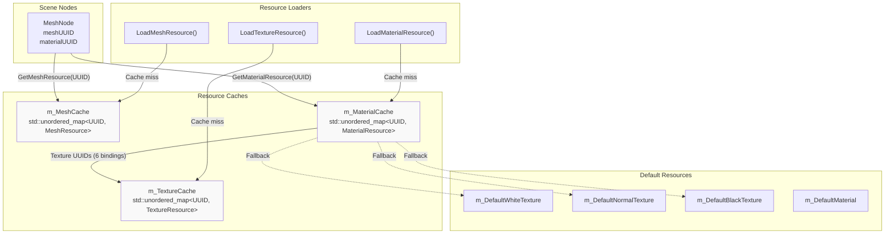
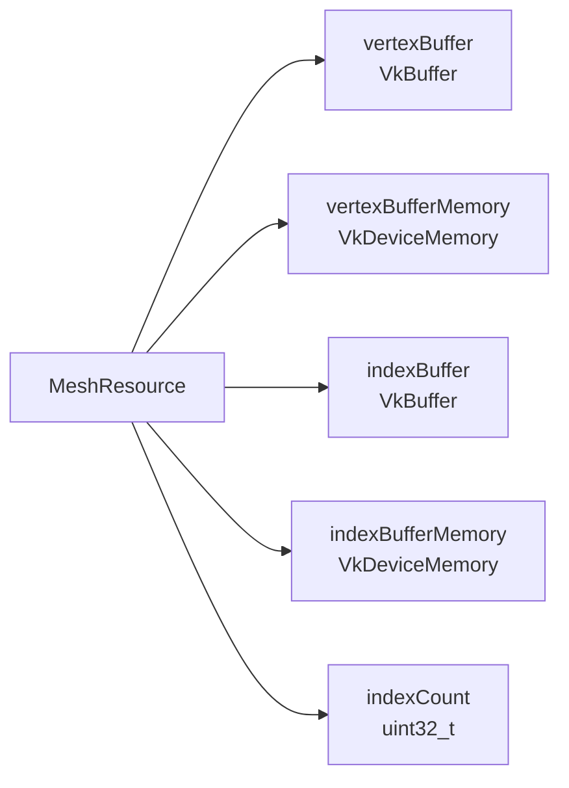
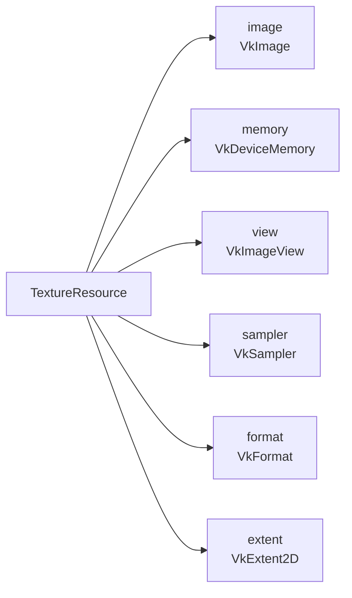
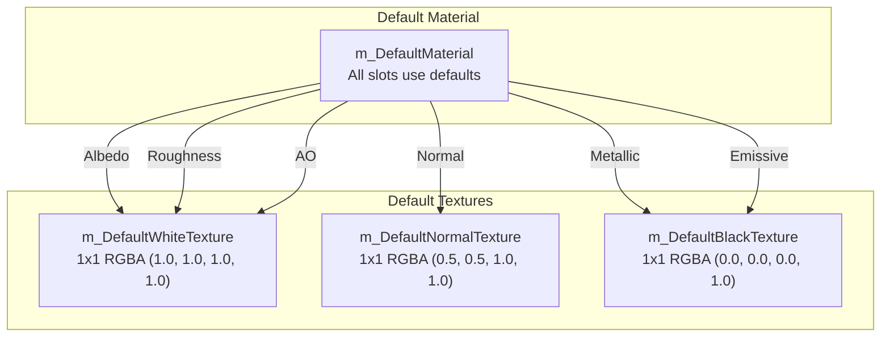
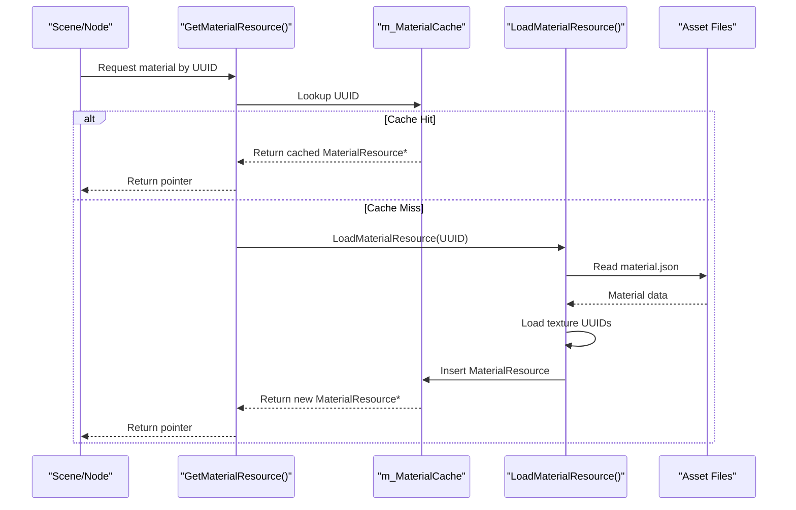
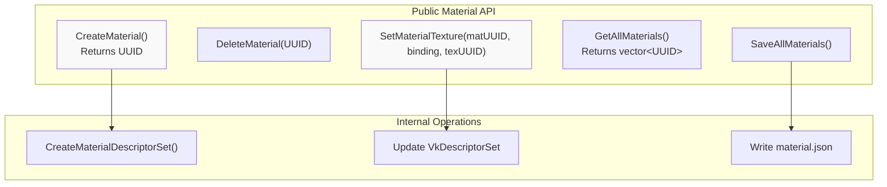
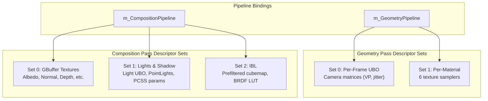
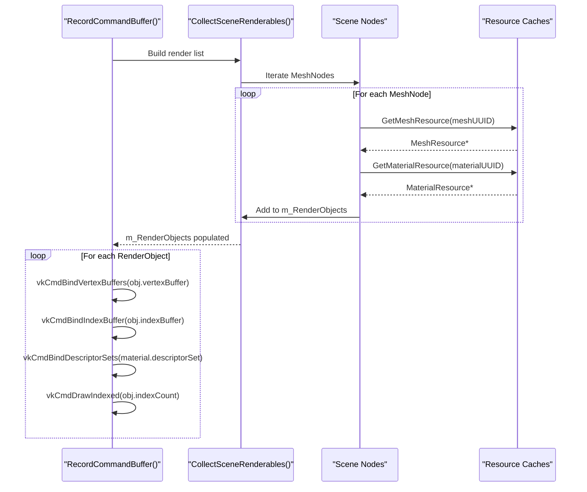

# Resource Management

<details>
<summary>Relevant source files</summary>

The following files were used as context for generating this wiki page:

- [.cache/clangd/index/Vertex.h.B1B82459C0160BD1.idx](.cache/clangd/index/Vertex.h.B1B82459C0160BD1.idx)
- [build/resource/shaders/glsl/composition.frag](build/resource/shaders/glsl/composition.frag)
- [include/RenderCore.h](include/RenderCore.h)
- [source/RenderCore.cpp](source/RenderCore.cpp)

</details>


## Purpose and Scope

This document describes the resource management system in RenderCore, focusing on how GPU resources (meshes, textures, materials) are loaded, cached, and referenced using a UUID-based system. It covers the material system with its multi-texture binding model, descriptor set organization, and lazy loading strategies for efficient memory usage.

For information about asset file loading and serialization, see [Asset Management and UUID System](#5.2). For scene graph integration and node-resource relationships, see [Scene Graph Architecture](#5.1).

---

## Resource Cache Architecture

RenderCore implements a UUID-based resource caching system with three primary resource types: meshes, textures, and materials. Each resource is uniquely identified by a `UUID` and cached in memory on first access, enabling stable references across scene modifications and serialization.



**Sources**: [include/RenderCore.h:151-177]()

### Cache Implementation

The caches are declared as static members in `RenderCore`:

| Cache | Type | Purpose |
|-------|------|---------|
| `m_MeshCache` | `std::unordered_map<UUID, MeshResource>` | Stores vertex/index buffers for geometry |
| `m_TextureCache` | `std::unordered_map<UUID, TextureResource>` | Stores Vulkan images and samplers for textures |
| `m_MaterialCache` | `std::unordered_map<UUID, MaterialResource>` | Stores material parameters and texture references |

**Sources**: [include/RenderCore.h:153](), [include/RenderCore.h:158](), [include/RenderCore.h:163](), [source/RenderCore.cpp:30](), [source/RenderCore.cpp:217-218]()

---

## Resource Types

### MeshResource

`MeshResource` encapsulates geometry data uploaded to GPU memory:



Key properties:
- **Vertex Buffer**: GPU buffer containing `Vertex` structures (position, normal, texCoord, tangent, color)
- **Index Buffer**: GPU buffer with uint32 triangle indices
- **Index Count**: Number of indices for draw calls

**Sources**: [include/RenderCore.h:467-478]()

### TextureResource

`TextureResource` manages 2D image data on the GPU with associated sampling state:



Textures are loaded from disk using STB image libraries and uploaded to GPU memory with appropriate format conversion and mipmap generation.

**Sources**: [include/RenderCore.h:158-159]()

### MaterialResource

`MaterialResource` defines surface appearance using the PBR (Physically-Based Rendering) model with support for six texture slots:

| Binding | Texture Type | Purpose | Default Fallback |
|---------|--------------|---------|------------------|
| 0 | Albedo | Base color (diffuse) | `m_DefaultWhiteTexture` |
| 1 | Normal | Tangent-space normals | `m_DefaultNormalTexture` (0.5, 0.5, 1.0) |
| 2 | Metallic | Metallic workflow | `m_DefaultBlackTexture` |
| 3 | Roughness | Surface roughness | `m_DefaultWhiteTexture` |
| 4 | AO | Ambient occlusion | `m_DefaultWhiteTexture` |
| 5 | Emissive | Self-illumination | `m_DefaultBlackTexture` |

Each material stores:
- **Texture UUIDs**: Six UUIDs referencing textures in `m_TextureCache`
- **Material Factors**: `baseColorFactor`, `metallicFactor`, `roughnessFactor`, etc.
- **Descriptor Set**: Pre-allocated `VkDescriptorSet` binding all six textures for shader access

**Sources**: [include/RenderCore.h:163-165](), [source/RenderCore.cpp:218-224]()

---

## Default Resources

Default resources provide fallback textures when materials reference missing or invalid texture UUIDs, preventing rendering artifacts:



### Creation Process

Default textures are created during `RenderCore::Init()` via `CreateDefaultTextures()` and `CreateDefaultMaterial()`:

1. Allocate 1x1 pixel staging buffers with predefined colors
2. Create `VkImage` resources with `VK_FORMAT_R8G8B8A8_SRGB` format
3. Transition image layouts and copy data via command buffer
4. Create image views and samplers
5. Register in `m_TextureCache` with special UUIDs
6. Create `m_DefaultMaterial` referencing these texture UUIDs

**Sources**: [include/RenderCore.h:169-174](), [source/RenderCore.cpp:304-305]()

---

## Resource Loading and Caching

Resource loading follows a **lazy loading** strategy: resources are only loaded when first accessed. This minimizes startup time and memory usage.



### Loading Functions

| Function | Purpose | Cache Updated |
|----------|---------|---------------|
| `LoadMeshResource(UUID)` | Loads .obj model, creates vertex/index buffers | `m_MeshCache` |
| `LoadTextureResource(UUID)` | Loads image file, creates VkImage/VkImageView | `m_TextureCache` |
| `LoadMaterialResource(UUID)` | Loads material.json, resolves texture UUIDs | `m_MaterialCache` |

**Sources**: [include/RenderCore.h:154](), [include/RenderCore.h:159](), [include/RenderCore.h:164]()

### Cache Lookup Pattern

All resource getters follow the same pattern (example from `GetMaterialResource`):

```cpp
// Pseudo-code based on typical implementation
MaterialResource* GetMaterialResource(const UUID& materialID) {
    auto it = m_MaterialCache.find(materialID);
    if (it != m_MaterialCache.end()) {
        return &it->second;  // Cache hit
    }
    
    // Cache miss - trigger lazy load
    if (LoadMaterialResource(materialID)) {
        return &m_MaterialCache[materialID];
    }
    
    // Load failed - return default
    return &m_DefaultMaterial;
}
```

**Sources**: [include/RenderCore.h:51](), [include/RenderCore.h:52]()

---

## Material System

### Material Creation and Management

RenderCore provides a public API for runtime material creation and modification:



**API Functions**:

| Function | Description | Returns |
|----------|-------------|---------|
| `CreateMaterial()` | Allocates new material with default textures | `UUID` of new material |
| `DeleteMaterial(UUID)` | Removes material from cache, frees resources | void |
| `SaveAllMaterials()` | Serializes all materials to disk | void |
| `GetAllMaterials()` | Returns list of all cached material UUIDs | `std::vector<UUID>` |
| `SetMaterialTexture(matID, binding, texID)` | Updates texture slot and rebuilds descriptor | void |

**Sources**: [include/RenderCore.h:45-54]()

### Material Descriptor Sets

Each `MaterialResource` has a pre-allocated `VkDescriptorSet` containing all six texture bindings. This descriptor set is bound during geometry rendering to provide shader access to material textures.

**Descriptor Set Layout** (`m_MaterialDescriptorSetLayout`):

```
Set 1 (Material Textures):
  Binding 0: Albedo Texture        (VK_DESCRIPTOR_TYPE_COMBINED_IMAGE_SAMPLER)
  Binding 1: Normal Texture        (VK_DESCRIPTOR_TYPE_COMBINED_IMAGE_SAMPLER)
  Binding 2: Metallic Texture      (VK_DESCRIPTOR_TYPE_COMBINED_IMAGE_SAMPLER)
  Binding 3: Roughness Texture     (VK_DESCRIPTOR_TYPE_COMBINED_IMAGE_SAMPLER)
  Binding 4: AO Texture            (VK_DESCRIPTOR_TYPE_COMBINED_IMAGE_SAMPLER)
  Binding 5: Emissive Texture      (VK_DESCRIPTOR_TYPE_COMBINED_IMAGE_SAMPLER)
```

When `SetMaterialTexture()` is called:
1. Update the texture UUID in `MaterialResource`
2. Resolve the new texture from `m_TextureCache` (lazy load if needed)
3. Rebuild the descriptor set via `CreateMaterialDescriptorSet()`
4. Update the `VkDescriptorSet` with new image info

**Sources**: [include/RenderCore.h:177](), [include/RenderCore.h:165]()

---

## Descriptor Set Management

The rendering system organizes descriptor sets by update frequency to minimize rebinding overhead:



### Descriptor Pool Allocation

A large descriptor pool (`m_DescriptorPool`) is created during initialization to support all descriptor types:

- **Pool Sizes**: 1000 descriptors per type (samplers, combined image samplers, uniform buffers, etc.)
- **Max Sets**: 1000 × number of types
- **Flags**: `VK_DESCRIPTOR_POOL_CREATE_FREE_DESCRIPTOR_SET_BIT` for dynamic allocation/deallocation

**Sources**: [include/RenderCore.h:294](), [source/RenderCore.cpp:1081-1106]()

### Set Update Strategy

| Descriptor Set | Update Frequency | When Updated |
|----------------|------------------|--------------|
| Geometry Set 0 (UBO) | Per-frame | `UpdateUniformBuffer()` before rendering |
| Geometry Set 1 (Material) | On material change | `SetMaterialTexture()` or material creation |
| Composition Set 0 (GBuffer) | On swapchain recreate | `RecreateSwapchain()` |
| Composition Set 1 (Lights) | Per-frame | `UpdateUniformBuffer()` when lights change |
| Composition Set 2 (IBL) | On skybox change | `ReloadSkybox()` |

**Sources**: [include/RenderCore.h:319-327](), [source/RenderCore.cpp:composition.frag:4-7]()

---

## Integration with Rendering Pipeline

During frame rendering, resources are accessed through the cache system:



**RenderObject Structure**:

Each frame, `CollectSceneRenderables()` populates `m_RenderObjects` with cached resource pointers:

```cpp
struct RenderObject {
    glm::mat4 modelMatrix;
    Material material;                    // Material parameters
    MaterialResource* pMaterialResource;  // Pointer into m_MaterialCache
    VkBuffer vertexBuffer;                // From MeshResource
    VkBuffer indexBuffer;                 // From MeshResource
    uint32_t indexCount;                  // From MeshResource
    float distanceToCamera;
    bool isInViewFrustum;
    bool isInLightFrustum;
};
```

**Sources**: [include/RenderCore.h:467-478](), [include/RenderCore.h:180-181]()

---

## Memory Management

### Resource Lifetime

- **Textures/Meshes**: Persist in cache until application shutdown or explicit deletion
- **Materials**: Can be deleted via `DeleteMaterial()`, which frees descriptor sets and removes from cache
- **Descriptor Sets**: Allocated from pool on material creation, freed on material deletion

### Cleanup on Shutdown

During `RenderCore::Shutdown()`, all cached resources are destroyed:

1. Wait for device idle: `vkDeviceWaitIdle(m_Device)`
2. Destroy material descriptor sets
3. Free texture images, image views, samplers
4. Free mesh vertex/index buffers
5. Destroy descriptor pool (frees all remaining sets)
6. Clear cache maps

**Sources**: [source/RenderCore.cpp:393-595]()

---

## Summary

The resource management system provides:

- **UUID-based stable references** for assets across serialization and scene modifications
- **Lazy loading** to minimize memory footprint and startup time
- **Three-tier caching** (Mesh, Texture, Material) with automatic fallback to defaults
- **Descriptor set management** organized by update frequency for efficient GPU binding
- **Public API** for runtime material creation, modification, and persistence

This architecture enables the editor to dynamically create and modify materials while maintaining efficient GPU resource usage through caching and descriptor reuse.

**Sources**: [include/RenderCore.h:1-619](), [source/RenderCore.cpp:1-6000]()

---
