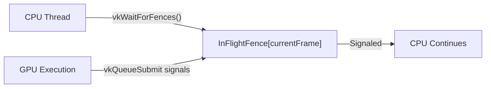
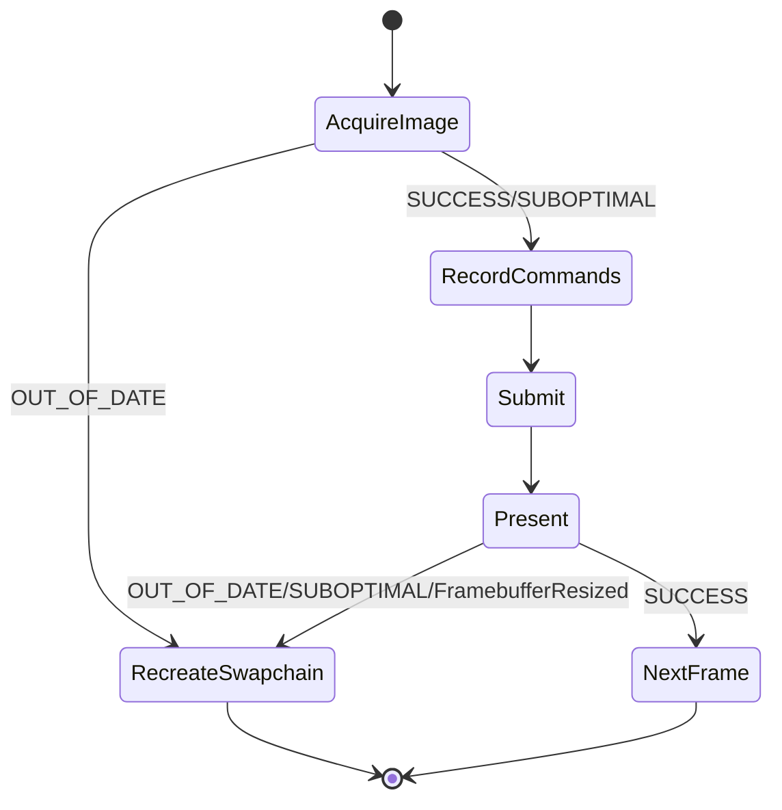
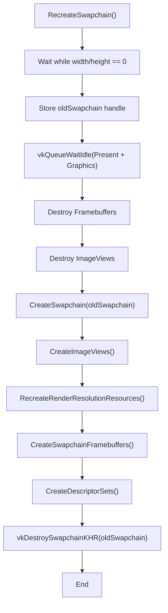
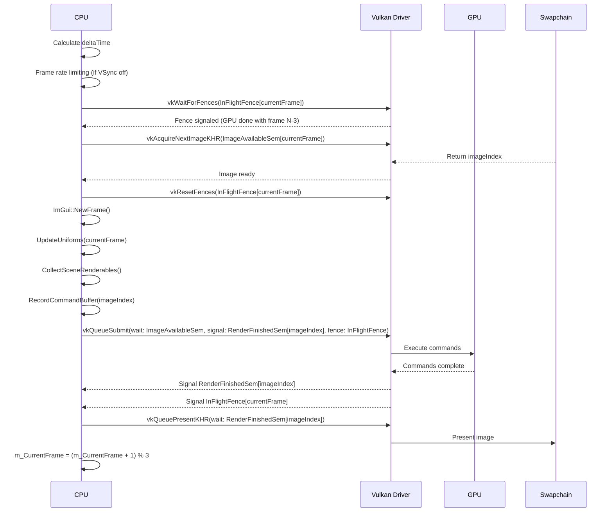
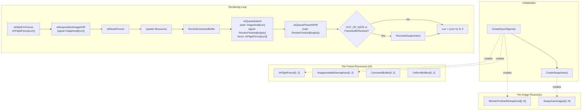

# Frame Synchronization and Swapchain

<details>
<summary>Relevant source files</summary>

The following files were used as context for generating this wiki page:

- [include/RenderCore.h](include/RenderCore.h)
- [source/RenderCore.cpp](source/RenderCore.cpp)

</details>


## Purpose and Scope

This page documents the frame synchronization mechanisms and swapchain management in NeuVulkanRender. It covers the triple-buffering architecture, Vulkan synchronization primitives (fences and semaphores), swapchain lifecycle management, and the rendering loop's synchronization flow. For details on the rendering pipeline stages themselves, see [Rendering Pipeline](#3.2). For Vulkan initialization and device setup, see [Vulkan Initialization and Setup](#3.1).

---

## Triple-Buffering Architecture

The rendering system uses **triple-buffering** to allow the CPU to prepare frames while the GPU executes previous frames, maximizing throughput without introducing excessive latency.

### Frame-in-Flight Limit

The system maintains a constant `MAX_FRAMES_IN_FLIGHT = 3`, defined at [source/RenderCore.cpp:233](). This means at most 3 frames can be in various stages of processing simultaneously:
- Frame N: Being presented by the swapchain
- Frame N+1: Being executed on the GPU  
- Frame N+2: Being prepared by the CPU

### Per-Frame Resources

Resources are allocated per-frame to avoid conflicts when multiple frames are in flight:

| Resource Type | Member Variable | Purpose |
|--------------|----------------|---------|
| **Fences** | `m_InFlightFences` | CPU-GPU synchronization, signals when GPU completes frame |
| **Semaphores (Image Available)** | `m_ImageAvailableSemaphores` | Signals when swapchain image is ready for rendering |
| **Semaphores (Render Finished)** | `m_RenderFinishedSemaphores` | Signals when rendering is complete, safe to present |
| **Command Buffers** | `m_CommandBuffers` | Per-frame command recording |
| **Uniform Buffers** | `m_UniformBuffers`, `m_LightUniformBuffers`, etc. | Per-frame UBO data |
| **Descriptor Sets** | Various descriptor set arrays | Per-frame descriptor bindings |

### Frame Index Tracking

The `m_CurrentFrame` variable cycles through `[0, 1, 2]` and increments after each frame:

```cpp
m_CurrentFrame = (m_CurrentFrame + 1) % MAX_FRAMES_IN_FLIGHT;
```

**Sources:** [include/RenderCore.h:299](), [source/RenderCore.cpp:233](), [source/RenderCore.cpp:1040-1065]()

---

## Synchronization Primitives

### Fences: CPU-GPU Synchronization

**Fences** (`VkFence`) are used to synchronize the CPU with GPU execution. The CPU can wait on a fence to ensure the GPU has finished processing.



**Diagram: Fence-based CPU-GPU Synchronization**

#### Fence Creation

Fences are created with `VK_FENCE_CREATE_SIGNALED_BIT` to allow the first frame to proceed without waiting:

```cpp
VkFenceCreateInfo fenceInfo{};
fenceInfo.sType = VK_STRUCTURE_TYPE_FENCE_CREATE_INFO;
fenceInfo.flags = VK_FENCE_CREATE_SIGNALED_BIT;  // Start signaled
```

**Sources:** [source/RenderCore.cpp:1047-1059]()

#### Fence Usage in DrawFrame

At the start of `DrawFrame()`, the CPU waits for the fence corresponding to `m_CurrentFrame`:

```cpp
vkWaitForFences(m_Device, 1, &m_InFlightFences[m_CurrentFrame], VK_TRUE, UINT64_MAX);
```

This ensures that frame `N` is only reused after frame `N-3` has completed GPU execution.

After acquiring the swapchain image, the fence is reset:

```cpp
vkResetFences(m_Device, 1, &m_InFlightFences[m_CurrentFrame]);
```

When submitting commands, the fence is signaled upon GPU completion:

```cpp
vkQueueSubmit(m_GraphicsQueue, 1, &submitInfo, m_InFlightFences[m_CurrentFrame]);
```

**Sources:** [source/RenderCore.cpp:1787-1788](), [source/RenderCore.cpp:1808](), [source/RenderCore.cpp:1870-1873]()

---

### Semaphores: GPU-GPU Synchronization

**Semaphores** (`VkSemaphore`) coordinate work between different GPU queue operations. Unlike fences, semaphores are never waited on by the CPU.


**Diagram: Semaphore Synchronization Chain**

#### Image Available Semaphores

Created per-frame (3 total), these signal when `vkAcquireNextImageKHR` returns a swapchain image ready for rendering.

```cpp
result = vkAcquireNextImageKHR(m_Device, m_Swapchain, UINT64_MAX,
                               m_ImageAvailableSemaphores[m_CurrentFrame],
                               VK_NULL_HANDLE, &imageIndex);
```

The rendering command submission waits on this semaphore at the `COLOR_ATTACHMENT_OUTPUT` stage:

```cpp
VkSemaphore waitSemaphores[] = {m_ImageAvailableSemaphores[m_CurrentFrame]};
VkPipelineStageFlags waitStages[] = {VK_PIPELINE_STAGE_COLOR_ATTACHMENT_OUTPUT_BIT};
submitInfo.waitSemaphoreCount = 1;
submitInfo.pWaitSemaphores = waitSemaphores;
submitInfo.pWaitDstStageMask = waitStages;
```

**Sources:** [source/RenderCore.cpp:1791-1793](), [source/RenderCore.cpp:1856-1861]()

#### Render Finished Semaphores

Created **per-swapchain-image** (not per-frame) to avoid reuse warnings. When a swapchain has N images (typically 2-3), N semaphores are created.

```cpp
m_RenderFinishedSemaphores.resize(m_SwapchainImages.size());
```

After rendering completes, the GPU signals this semaphore:

```cpp
VkSemaphore signalSemaphores[] = {m_RenderFinishedSemaphores[imageIndex]};
submitInfo.signalSemaphoreCount = 1;
submitInfo.pSignalSemaphores = signalSemaphores;
```

The presentation waits on this semaphore:

```cpp
presentInfo.waitSemaphoreCount = 1;
presentInfo.pWaitSemaphores = signalSemaphores;  // Same as above
```

**Sources:** [source/RenderCore.cpp:1067-1079](), [source/RenderCore.cpp:1866-1868](), [source/RenderCore.cpp:1878-1879]()

---

## Swapchain Management

### Swapchain Creation

The swapchain is created in `CreateSwapchain()` with the following key decisions:

#### Surface Format Selection

The system prefers `VK_FORMAT_B8G8R8A8_SRGB` with `VK_COLOR_SPACE_SRGB_NONLINEAR_KHR` for automatic gamma correction:

```cpp
for (const auto &availableFormat : formats) {
    if (availableFormat.format == VK_FORMAT_B8G8R8A8_SRGB &&
        availableFormat.colorSpace == VK_COLOR_SPACE_SRGB_NONLINEAR_KHR) {
        surfaceFormat = availableFormat;
        break;
    }
}
```

**Sources:** [source/RenderCore.cpp:813-819]()

#### Image Count

The swapchain requests `minImageCount + 1` to enable triple-buffering at the swapchain level:

```cpp
uint32_t imageCount = capabilities.minImageCount + 1;
if (capabilities.maxImageCount > 0 && imageCount > capabilities.maxImageCount) {
    imageCount = capabilities.maxImageCount;
}
```

**Sources:** [source/RenderCore.cpp:837-841]()

#### Present Mode and VSync

The present mode determines VSync behavior:

| Present Mode | VSync | Description |
|-------------|-------|-------------|
| `VK_PRESENT_MODE_FIFO_KHR` | **Enabled** | Guaranteed available, waits for vertical blank |
| `VK_PRESENT_MODE_MAILBOX_KHR` | **Disabled** | Triple-buffering, replaces queued images |
| `VK_PRESENT_MODE_IMMEDIATE_KHR` | **Disabled** | No waiting, may tear |

Selection logic:

```cpp
VkPresentModeKHR presentMode = VK_PRESENT_MODE_FIFO_KHR;  // Default VSync
if (!m_VSync) {
    // Prefer MAILBOX, fallback to IMMEDIATE
    for (const auto &availablePresentMode : presentModes) {
        if (availablePresentMode == VK_PRESENT_MODE_MAILBOX_KHR) {
            presentMode = availablePresentMode;
            break;
        }
        if (availablePresentMode == VK_PRESENT_MODE_IMMEDIATE_KHR) {
            presentMode = availablePresentMode;
        }
    }
}
```

**Sources:** [source/RenderCore.cpp:859-879]()

---

### Swapchain Recreation

Swapchain recreation is necessary when:
- Window is resized (`m_FramebufferResized = true`)
- `vkAcquireNextImageKHR` returns `VK_ERROR_OUT_OF_DATE_KHR`
- `vkQueuePresentKHR` returns `VK_ERROR_OUT_OF_DATE_KHR` or `VK_SUBOPTIMAL_KHR`



**Diagram: Swapchain Recreation Decision Flow**

#### Recreation Process

The `RecreateSwapchain()` function follows this sequence:



**Diagram: Swapchain Recreation Sequence**

Key aspects:

1. **Minimization Handling**: The function blocks while the window is minimized (width/height = 0):
   ```cpp
   while (Window::GetWidth() == 0 || Window::GetHeight() == 0) {
       Window::PollEvents();
       SDL_Delay(1);
   }
   ```

2. **Queue Synchronization**: Both queues are idled to ensure no commands reference the old swapchain:
   ```cpp
   vkQueueWaitIdle(m_PresentQueue);
   vkQueueWaitIdle(m_GraphicsQueue);
   ```

3. **Old Swapchain Reuse**: The old swapchain handle is passed to enable driver optimizations:
   ```cpp
   VkSwapchainKHR oldSwapchain = m_Swapchain;
   CreateSwapchain(oldSwapchain);
   // ... later ...
   vkDestroySwapchainKHR(m_Device, oldSwapchain, nullptr);
   ```

4. **Render Resolution Update**: When the swapchain extent changes, render resolution is recalculated based on super-resolution scale:
   ```cpp
   m_RenderExtent.width = static_cast<uint32_t>(m_SwapchainExtent.width / m_SuperResolutionScale);
   m_RenderExtent.height = static_cast<uint32_t>(m_SwapchainExtent.height / m_SuperResolutionScale);
   ```

**Sources:** [source/RenderCore.cpp:1950-2039](), [source/RenderCore.cpp:899-905]()

---

## Frame Rendering Flow

The `DrawFrame()` function orchestrates the entire rendering loop with precise synchronization:



**Diagram: Frame Rendering Synchronization Sequence**

### Key Stages

#### 1. Frame Rate Limiting (Lines 1746-1779)

When VSync is disabled and a target FPS is set, the system uses a hybrid sleep approach:
- **Coarse sleep**: `SDL_Delay()` for bulk of wait time (>2ms)
- **Busy wait**: Spin-loop for final precision

```cpp
if (!m_VSync && m_TargetFPS > 0) {
    double targetFrameTime = 1.0 / (double)m_TargetFPS;
    if (rawDelta < targetFrameTime) {
        double sleepTime = targetFrameTime - rawDelta;
        if (sleepTime > 0.002) {
            SDL_Delay((uint32_t)((sleepTime - 0.001) * 1000.0));
        }
        while ((double)(SDL_GetPerformanceCounter() - lastCounter) / (double)counterFreq < targetFrameTime) {
            // Spin
        }
    }
}
```

**Sources:** [source/RenderCore.cpp:1757-1779]()

#### 2. Fence Wait and Image Acquisition (Lines 1787-1800)

```cpp
vkWaitForFences(m_Device, 1, &m_InFlightFences[m_CurrentFrame], VK_TRUE, UINT64_MAX);

uint32_t imageIndex;
VkResult result = vkAcquireNextImageKHR(m_Device, m_Swapchain, UINT64_MAX,
                                        m_ImageAvailableSemaphores[m_CurrentFrame],
                                        VK_NULL_HANDLE, &imageIndex);

if (result == VK_ERROR_OUT_OF_DATE_KHR) {
    RecreateSwapchain();
    return;
}
```

**Sources:** [source/RenderCore.cpp:1787-1800]()

#### 3. Resource Updates (Lines 1810-1848)

```cpp
vkResetFences(m_Device, 1, &m_InFlightFences[m_CurrentFrame]);

ImGui_ImplVulkan_NewFrame();
ImGui_ImplSDL3_NewFrame();
ImGui::NewFrame();

// TAA jitter calculation (if enabled)
if (m_TAAEnabled) {
    float jx = (Halton((m_FrameCount % 16) + 1, 2) - 0.5f);
    float jy = (Halton((m_FrameCount % 16) + 1, 3) - 0.5f);
    m_Camera.SetJitter(jx / (float)m_RenderExtent.width * 1.98f,
                       jy / (float)m_RenderExtent.height * 1.98f);
}

UpdateUniformBuffer(m_CurrentFrame);
CollectSceneRenderables();
RecordCommandBuffer(m_CommandBuffers[m_CurrentFrame], imageIndex);
```

**Sources:** [source/RenderCore.cpp:1808-1851]()

#### 4. Command Submission (Lines 1853-1873)

```cpp
VkSubmitInfo submitInfo{};
submitInfo.sType = VK_STRUCTURE_TYPE_SUBMIT_INFO;

VkSemaphore waitSemaphores[] = {m_ImageAvailableSemaphores[m_CurrentFrame]};
VkPipelineStageFlags waitStages[] = {VK_PIPELINE_STAGE_COLOR_ATTACHMENT_OUTPUT_BIT};
submitInfo.waitSemaphoreCount = 1;
submitInfo.pWaitSemaphores = waitSemaphores;
submitInfo.pWaitDstStageMask = waitStages;

submitInfo.commandBufferCount = 1;
submitInfo.pCommandBuffers = &m_CommandBuffers[m_CurrentFrame];

VkSemaphore signalSemaphores[] = {m_RenderFinishedSemaphores[imageIndex]};
submitInfo.signalSemaphoreCount = 1;
submitInfo.pSignalSemaphores = signalSemaphores;

vkQueueSubmit(m_GraphicsQueue, 1, &submitInfo, m_InFlightFences[m_CurrentFrame]);
```

**Sources:** [source/RenderCore.cpp:1853-1873]()

#### 5. Presentation (Lines 1875-1907)

```cpp
VkPresentInfoKHR presentInfo{};
presentInfo.sType = VK_STRUCTURE_TYPE_PRESENT_INFO_KHR;
presentInfo.waitSemaphoreCount = 1;
presentInfo.pWaitSemaphores = signalSemaphores;

VkSwapchainKHR swapchains[] = {m_Swapchain};
presentInfo.swapchainCount = 1;
presentInfo.pSwapchains = swapchains;
presentInfo.pImageIndices = &imageIndex;

result = vkQueuePresentKHR(m_PresentQueue, &presentInfo);

// TAA history matrix update
m_Camera.SetJitter(0.0f, 0.0f);
m_PrevViewProj = m_Camera.GetProjectionMatrix(aspectRatio) * m_Camera.GetViewMatrix();

m_FrameCount++;
m_CurrentFrame = (m_CurrentFrame + 1) % MAX_FRAMES_IN_FLIGHT;

if (result == VK_ERROR_OUT_OF_DATE_KHR || result == VK_SUBOPTIMAL_KHR || m_FramebufferResized) {
    m_FramebufferResized = false;
    RecreateSwapchain();
}
```

**Sources:** [source/RenderCore.cpp:1875-1905]()

---

## VSync and Performance Control

### VSync Toggle

VSync can be toggled at runtime via `SetVSync(bool enabled)`:

```cpp
static void SetVSync(bool enabled) {
    if (m_VSync != enabled) {
        m_VSync = enabled;
        m_FramebufferResized = true;  // Trigger swapchain rebuild
    }
}
```

Setting `m_FramebufferResized` ensures the swapchain is recreated with the new present mode on the next frame.

**Sources:** [include/RenderCore.h:513-518]()

### Target FPS Control

When VSync is disabled, a target FPS can be set:

```cpp
static void SetTargetFPS(int fps) { m_TargetFPS = fps; }
static int GetTargetFPS() { return m_TargetFPS; }
```

A value of `0` disables frame rate limiting entirely.

**Sources:** [include/RenderCore.h:520-521]()

---

## State Variables

| Variable | Type | Purpose |
|----------|------|---------|
| `m_CurrentFrame` | `uint32_t` | Current frame index [0, 2] cycling |
| `m_FramebufferResized` | `bool` | Flag to trigger swapchain recreation |
| `m_VSync` | `bool` | VSync enable state |
| `m_TargetFPS` | `int` | Target frame rate when VSync off (0 = unlimited) |
| `m_SwapchainExtent` | `VkExtent2D` | Current swapchain dimensions |
| `m_RenderExtent` | `VkExtent2D` | Render resolution (may differ due to super-resolution) |

**Sources:** [include/RenderCore.h:299-303](), [include/RenderCore.h:513-521](), [include/RenderCore.h:233-239]()

---

## Summary Diagram



**Diagram: Frame Synchronization System Overview**

**Sources:** [source/RenderCore.cpp:1040-1079](), [source/RenderCore.cpp:800-905](), [source/RenderCore.cpp:1744-1907](), [source/RenderCore.cpp:1950-2039]()

---
