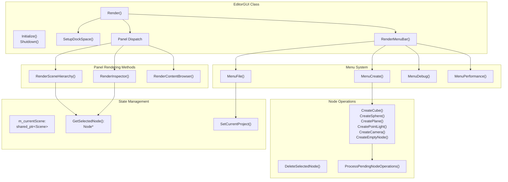
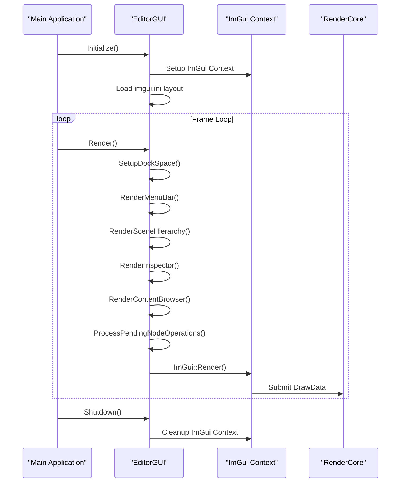
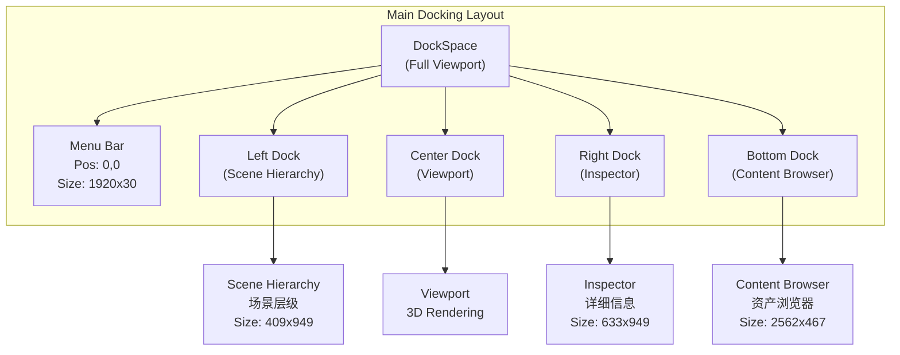
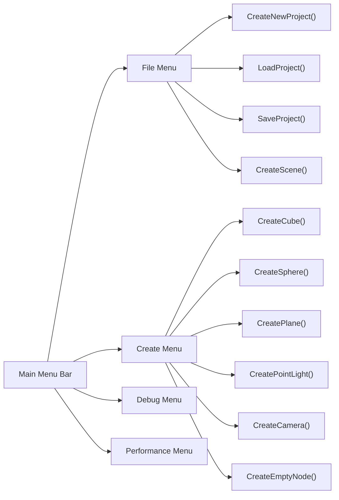
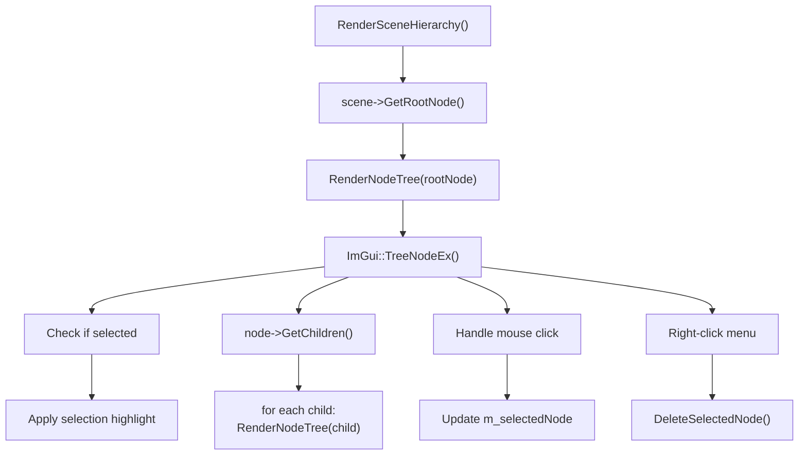
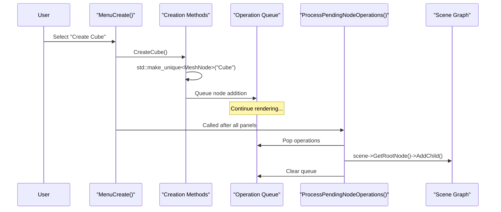
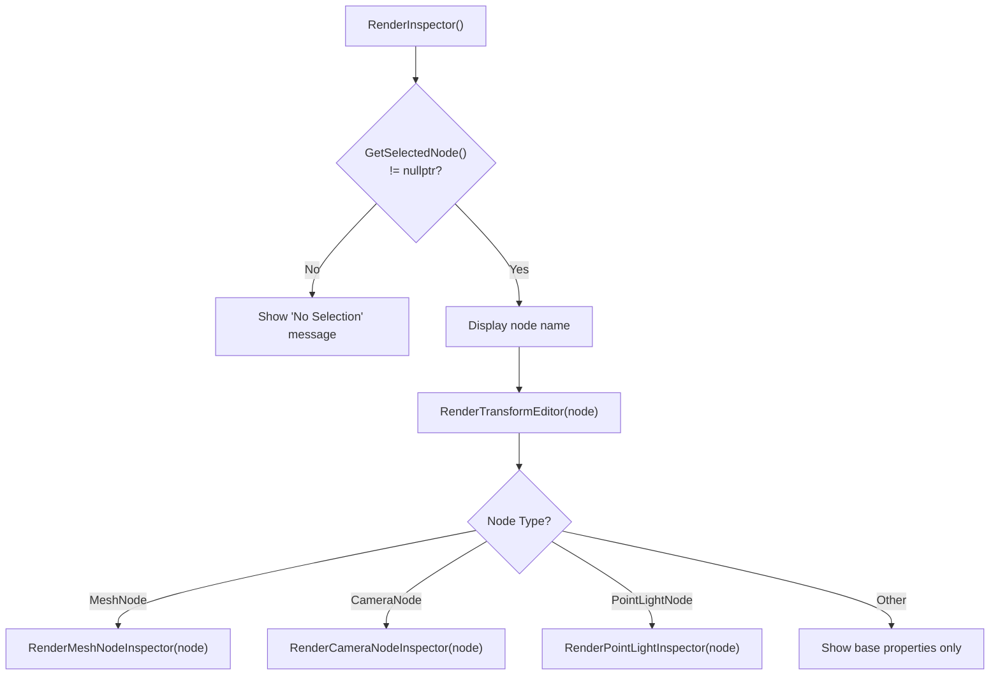
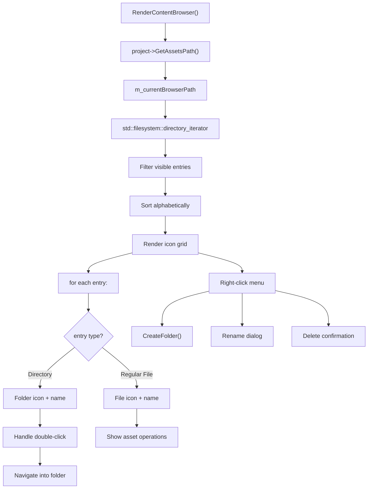
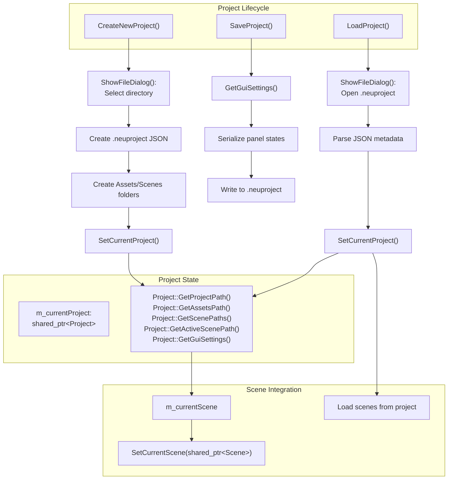
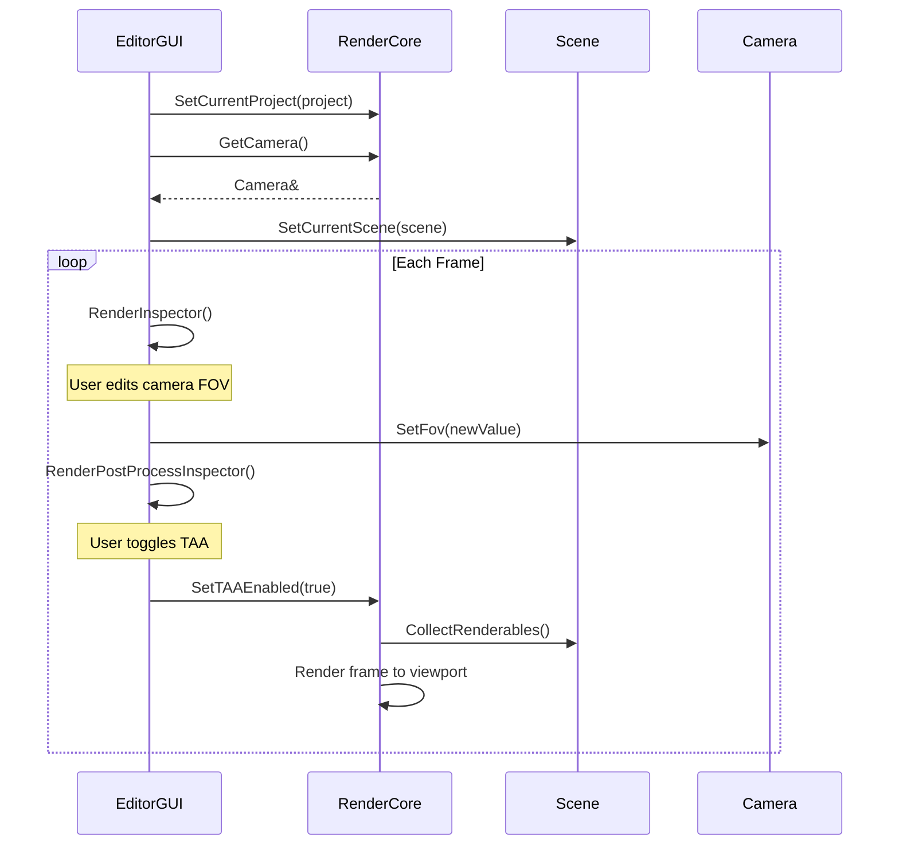

# Editor System (EditorGUI)

<details>
<summary>Relevant source files</summary>

The following files were used as context for generating this wiki page:

- [.cache/clangd/index/neuGUI.cpp.597919E745DAD113.idx](.cache/clangd/index/neuGUI.cpp.597919E745DAD113.idx)
- [build/CMakeFiles/NeuGUILib.dir/source/neuGUI.cpp.obj](build/CMakeFiles/NeuGUILib.dir/source/neuGUI.cpp.obj)
- [build/imgui.ini](build/imgui.ini)
- [build/libNeuGUILib.a](build/libNeuGUILib.a)

</details>


The Editor System provides an interactive graphical user interface for scene and project management in NeuVulkanRender. Implemented in the **NeuGUILib** library, it uses Dear ImGui to deliver a dockable, multi-panel editor environment for creating, editing, and managing 3D scenes, assets, and projects.

This document covers the EditorGUI architecture, UI panels, node manipulation, and inspector system. For scene graph internals and node types, see [Scene Graph Architecture](#5.1). For project serialization details, see [Project Management](#4.2). For asset loading and UUID system, see [Asset Management and UUID System](#5.2).

---

## System Architecture

The EditorGUI is structured around a central `neurender::EditorGUI` class that orchestrates multiple specialized rendering methods for different UI panels. The system follows an immediate-mode UI paradigm using Dear ImGui.



**Core Responsibilities:**
- **UI Layout Management**: Docking system and window arrangement
- **Scene Hierarchy**: Tree-view display and node selection
- **Property Inspection**: Type-specific editors for node properties
- **Asset Browsing**: Filesystem navigation and asset management
- **Project Operations**: Creation, loading, saving of projects
- **Node Creation**: Factory methods for primitive meshes and scene nodes

**Sources:** build/libNeuGUILib.a (symbol table)

---

## Initialization and Lifecycle

The EditorGUI follows a standard initialization-render-shutdown lifecycle integrated with the application's main loop.



**Key Methods:**
- `neurender::EditorGUI::Initialize()`: Sets up ImGui context, loads layout configuration from `imgui.ini`
- `neurender::EditorGUI::Render()`: Called each frame to render all UI panels
- `neurender::EditorGUI::Shutdown()`: Cleanup and persist UI layout
- `neurender::EditorGUI::ProcessPendingNodeOperations()`: Deferred node creation/deletion to avoid iterator invalidation

**Sources:** build/libNeuGUILib.a (Initialize, Shutdown, Render symbols)

---

## User Interface Layout

### Docking System

The editor uses ImGui's docking API to provide a flexible, user-customizable layout. Window positions and sizes are persisted to `imgui.ini`.



**Implementation:**
- `neurender::EditorGUI::SetupDockSpace()`: Creates main docking area and configures layout
- Layout persisted in `build/imgui.ini` with window positions, sizes, and docking relationships
- Supports both English and Chinese localized panel names

**Sources:** build/imgui.ini:10-45, build/libNeuGUILib.a (SetupDockSpace symbol)

### Main Menu Bar

The menu bar provides access to file operations, scene creation tools, and debugging features.

| Menu | Methods | Functionality |
|------|---------|---------------|
| **File** | `MenuFile()` | New Project, Open Project, Save Project, Scene Management |
| **Create** | `MenuCreate()` | Primitive creation (Cube, Sphere, Plane), Lights, Cameras, Empty Nodes |
| **Debug** | `MenuDebug()` | Debug panels, logging controls |
| **Performance** | `MenuPerformance()` | Performance metrics, VSync toggle, FPS target |

**Menu Structure:**


**Sources:** build/libNeuGUILib.a (MenuFile, MenuCreate, MenuDebug, MenuPerformance, CreateNewProject, LoadProject, SaveProject, CreateCube, CreateSphere, CreatePlane, CreatePointLight, CreateCamera, CreateEmptyNode symbols)

---

## Scene Hierarchy Panel

The Scene Hierarchy panel displays the scene graph as a tree view, allowing node selection and hierarchy manipulation.

### Hierarchy Display



**Key Features:**
- Recursive tree rendering via `RenderNodeTree(Node*)`
- Visual indication of selected node
- Right-click context menu for node operations
- Displays node name via `Node::GetName()`
- Shows node active state via `Node::IsActive()`

**Panel Configuration (imgui.ini):**
- English: "Scene Hierarchy" at position (-1, 19), size 324×783
- Chinese: "场景层级" at position (-2, 25), size 409×949

**Sources:** build/libNeuGUILib.a (RenderSceneHierarchy, RenderNodeTree, GetSelectedNode symbols), build/imgui.ini:10-12, 34-36

### Node Operations

Node creation and deletion are queued and processed after rendering to prevent iterator invalidation during tree traversal.



**Factory Methods:**

| Method | Node Type | Default Configuration |
|--------|-----------|----------------------|
| `CreateCube()` | `MeshNode` | Assigns cube mesh UUID |
| `CreateSphere()` | `MeshNode` | Assigns sphere mesh UUID |
| `CreatePlane()` | `MeshNode` | Assigns plane mesh UUID |
| `CreatePointLight()` | `PointLightNode` | Default light properties |
| `CreateCamera()` | `CameraNode` | Default FOV, near/far planes |
| `CreateEmptyNode()` | `Node` | Base node with identity transform |

**Deletion:**
- `DeleteSelectedNode()`: Queues selected node for removal
- Validates node exists and is not root
- Updates selection state after deletion

**Sources:** build/libNeuGUILib.a (CreateCube, CreateSphere, CreatePlane, CreatePointLight, CreateCamera, CreateEmptyNode, DeleteSelectedNode, ProcessPendingNodeOperations symbols)

---

## Inspector System

The Inspector panel provides property editors tailored to the selected node's type. It uses C++ RTTI (`dynamic_cast`) to determine node type and render appropriate controls.

### Inspector Dispatch



**Sources:** build/libNeuGUILib.a (RenderInspector, RenderTransformEditor, RenderMeshNodeInspector, RenderCameraNodeInspector, RenderPointLightInspector symbols)

### Transform Editor

Common to all node types, the transform editor provides controls for position, rotation, and scale.

**Properties Edited:**
- **Position**: 3D vector via `Node::GetPosition()` / `Node::SetPosition()`
- **Rotation**: Euler angles via `Node::GetRotation()` / `Node::SetRotation()`
- **Scale**: 3D vector via `Node::GetScale()` / `Node::SetScale()`

**UI Controls:**
- `ImGui::DragFloat3()` for vector inputs
- Visual feedback on value changes
- Reset buttons for identity transforms

**Sources:** build/libNeuGUILib.a (RenderTransformEditor, Node::GetPosition, Node::SetPosition, Node::GetRotation, Node::SetRotation, Node::GetScale symbols)

### Type-Specific Inspectors

Each node type has specialized inspector controls:

#### MeshNode Inspector

```
RenderMeshNodeInspector(Node*)
├── Mesh UUID selector
│   └── MeshNode::SetMeshID(UUID)
├── Material UUID selector
│   └── MeshNode::SetMaterialID(UUID)
└── Material properties preview
    └── MaterialResource::GetName()
```

**Editable Properties:**
- Mesh reference (UUID)
- Material reference (UUID)
- Material preview (read-only)

**Sources:** build/libNeuGUILib.a (RenderMeshNodeInspector, MeshNode::SetMeshID, MeshNode::SetMaterialID symbols)

#### CameraNode Inspector

```
RenderCameraNodeInspector(Node*)
├── FOV (Field of View)
│   ├── CameraNode::GetFov()
│   └── CameraNode::SetFov(float)
├── Near Plane
│   ├── CameraNode::GetNearPlane()
│   └── CameraNode::SetNearPlane(float)
├── Far Plane
│   ├── CameraNode::GetFarPlane()
│   └── CameraNode::SetFarPlane(float)
├── Movement Speed
│   ├── CameraNode::GetMovementSpeed()
│   └── CameraNode::SetMovementSpeed(float)
└── Mouse Sensitivity
    ├── CameraNode::GetMouseSensitivity()
    └── CameraNode::SetMouseSensitivity(float)
```

**Sources:** build/libNeuGUILib.a (RenderCameraNodeInspector, CameraNode::GetFov, CameraNode::SetFov, CameraNode::GetNearPlane, CameraNode::SetNearPlane, CameraNode::GetFarPlane, CameraNode::SetFarPlane, CameraNode::GetMovementSpeed, CameraNode::SetMovementSpeed, CameraNode::GetMouseSensitivity, CameraNode::SetMouseSensitivity symbols)

#### PointLightNode Inspector

```
RenderPointLightInspector(PointLightNode*)
├── Color (vec3)
│   ├── LightNode::GetColor()
│   └── LightNode::SetColor(glm::vec3)
├── Intensity (float)
│   ├── LightNode::GetIntensity()
│   └── LightNode::SetIntensity(float)
├── Radius (float)
│   ├── PointLightNode::GetRadius()
│   └── PointLightNode::SetRadius(float)
├── Constant Attenuation
│   ├── PointLightNode::GetConstantAttenuation()
│   └── PointLightNode::SetConstantAttenuation(float)
├── Linear Attenuation
│   ├── PointLightNode::GetLinearAttenuation()
│   └── PointLightNode::SetLinearAttenuation(float)
└── Quadratic Attenuation
    ├── PointLightNode::GetQuadraticAttenuation()
    └── PointLightNode::SetQuadraticAttenuation(float)
```

**Sources:** build/libNeuGUILib.a (RenderPointLightInspector, LightNode::GetColor, LightNode::SetColor, LightNode::GetIntensity, LightNode::SetIntensity, PointLightNode::GetRadius, PointLightNode::SetRadius, PointLightNode::GetConstantAttenuation, PointLightNode::SetConstantAttenuation, PointLightNode::GetLinearAttenuation, PointLightNode::SetLinearAttenuation, PointLightNode::GetQuadraticAttenuation, PointLightNode::SetQuadraticAttenuation symbols)

#### Post-Process Inspector

Global post-processing settings accessible via `RenderPostProcessInspector()`:

- **RenderCore Integration:**
  - `RenderCore::GetPostProcessSettings()`: Returns reference to settings
  - `RenderCore::SetTAAEnabled(bool)`: Toggle Temporal Anti-Aliasing
  - `RenderCore::SetTAAFeedbackFactor(float)`: TAA blend factor
  - `RenderCore::SetVSync(bool)`: Enable/disable VSync
  - `RenderCore::SetTargetFPS(int)`: Set target frame rate

**Sources:** build/libNeuGUILib.a (RenderPostProcessInspector, RenderCore::GetPostProcessSettings, RenderCore::SetTAAEnabled, RenderCore::SetTAAFeedbackFactor, RenderCore::SetVSync, RenderCore::SetTargetFPS symbols)

---

## Content Browser Panel

The Content Browser provides filesystem navigation and asset management within the project's asset directory.



**Key Features:**
- Directory navigation via `std::filesystem::directory_iterator`
- Visual distinction between folders and files
- Double-click to navigate into directories
- Right-click context menu for file operations
- Asset import integration (future)

**File Operations:**
- `CreateFolder()`: Shows dialog for new folder creation
- Rename: Shows "重命名文件" (Rename File) dialog
- Delete: Shows confirmation dialog

**Panel Configuration (imgui.ini):**
- English: "Content Browser" at position (-3, 801), size 1923×281
- Chinese: "资产浏览器" at position (0, 974), size 2562×467

**Sources:** build/libNeuGUILib.a (RenderContentBrowser, CreateFolder, ShowFileDialog symbols), build/imgui.ini:18-20, 38-40, 50-52, 58-60

---

## Project Management Integration

The EditorGUI integrates tightly with the Project system for loading, saving, and managing projects.



**Project JSON Structure:**

```json
{
  "projectPath": "C:/path/to/project",
  "assetsPath": "C:/path/to/project/Assets",
  "scenePaths": [
    "Scenes/scene1.neuscene",
    "Scenes/scene2.neuscene"
  ],
  "activeScenePath": "Scenes/scene1.neuscene",
  "guiSettings": {
    "dockLayout": { /* ImGui layout data */ }
  }
}
```

**Key Methods:**
- `CreateNewProject()`: Creates project directory structure and metadata file
- `LoadProject()`: Deserializes project JSON and loads referenced scenes
- `SaveProject()`: Persists current project state and GUI layout
- `SetCurrentProject(shared_ptr<Project>)`: Updates active project
- `ShowFileDialog(bool, const char*)`: Platform file picker for open/save

**Sources:** build/libNeuGUILib.a (CreateNewProject, LoadProject, SaveProject, SetCurrentProject, ShowFileDialog, Project::GetProjectPath, Project::GetAssetsPath, Project::GetScenePaths, Project::GetActiveScenePath, Project::GetGuiSettings, Project::SetGuiSettings symbols)

---

## Interaction with Rendering System

The EditorGUI coordinates with RenderCore to display the 3D viewport and modify rendering settings.



**RenderCore Integration Points:**

| EditorGUI Method | RenderCore API | Purpose |
|------------------|----------------|---------|
| `RenderCameraNodeInspector()` | `GetCamera()` | Edit main camera properties |
| `RenderPostProcessInspector()` | `GetPostProcessSettings()` | Modify post-processing |
| `MenuPerformance()` | `SetVSync()`, `SetTargetFPS()` | Performance controls |
| `MenuPerformance()` | `GetPCSSSettings()` | Shadow quality settings |
| `MenuPerformance()` | `GetSkyboxSettings()` | Environment settings |
| `SetCurrentScene()` | Implicit via shared state | Switch active scene |

**Camera Synchronization:**
- EditorGUI modifies camera through `CameraNode` properties
- RenderCore reads camera state each frame for view/projection matrices
- Changes propagate immediately to rendering

**Sources:** build/libNeuGUILib.a (RenderCore::SetCurrentProject, RenderCore::GetCamera, RenderCore::GetPostProcessSettings, RenderCore::SetTAAEnabled, RenderCore::GetPCSSSettings, RenderCore::GetSkyboxSettings, RenderCore::SetVSync, RenderCore::SetTargetFPS, SetCurrentScene symbols)

---

## Dialog System

The EditorGUI provides modal dialogs for user confirmations and text input.

**Dialog Types (from imgui.ini):**

| Dialog | Chinese Name | Purpose | Configuration |
|--------|--------------|---------|---------------|
| Welcome | (Same) | First-time welcome message | Pos: 303,45, Size: 381×92 |
| New Folder | 新建文件夹 | Create folder in content browser | Pos: 760,471, Size: 400×138 |
| Rename File | 重命名文件 | Rename asset or folder | Pos: 1080,651, Size: 400×138 |
| Exit Confirmation | 退出确认 | Confirm application exit | Pos: 764,481, Size: 392×118 |

**Implementation:**
- Modal dialogs use `ImGui::OpenPopup()` and `ImGui::BeginPopupModal()`
- Text input via `ImGui::InputText()`
- Confirmation buttons for OK/Cancel actions
- Dialog state managed internally by EditorGUI

**Sources:** build/imgui.ini:26-28, 30-32, 50-52, 54-56, 58-60

---

## Localization Support

The editor supports both English and Chinese UI labels, as evidenced by dual panel names in `imgui.ini`.

**Localized Panel Names:**

| English | Chinese | Purpose |
|---------|---------|---------|
| Scene Hierarchy | 场景层级 | Scene graph tree |
| Inspector | 详细信息 | Property editor |
| Content Browser | 资产浏览器 | Asset browser |
| New Folder | 新建文件夹 | Folder creation |
| Exit Confirmation | 退出确认 | Exit dialog |
| Rename File | 重命名文件 | Rename dialog |

**Implementation Note:** The codebase likely uses conditional compilation or runtime language selection to switch between English and Chinese strings, though the exact mechanism is not visible in the provided files.

**Sources:** build/imgui.ini:10-12, 14-16, 18-20, 34-36, 38-40, 42-44, 50-52, 54-56, 58-60

---

## Summary

The EditorGUI system provides a comprehensive, ImGui-based editor interface with the following key capabilities:

1. **Dockable UI Layout**: Persistent window arrangement with Scene Hierarchy, Inspector, Content Browser, and Viewport panels
2. **Scene Manipulation**: Tree-view hierarchy, node selection, and type-safe property editing
3. **Asset Management**: Filesystem navigation, folder creation, and asset operations
4. **Project System**: Create, load, and save projects with JSON serialization
5. **Rendering Integration**: Direct control over camera properties, post-processing, and performance settings
6. **Localization**: English and Chinese UI text support

The system achieves clean separation between UI logic (EditorGUI) and data models (Scene, Node, Project) through dependency injection and observer patterns, enabling flexible editor workflows without tight coupling to the rendering backend.

**Sources:** build/libNeuGUILib.a (comprehensive symbol table), build/imgui.ini:1-62

---
