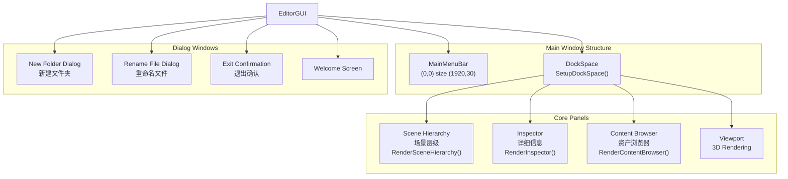
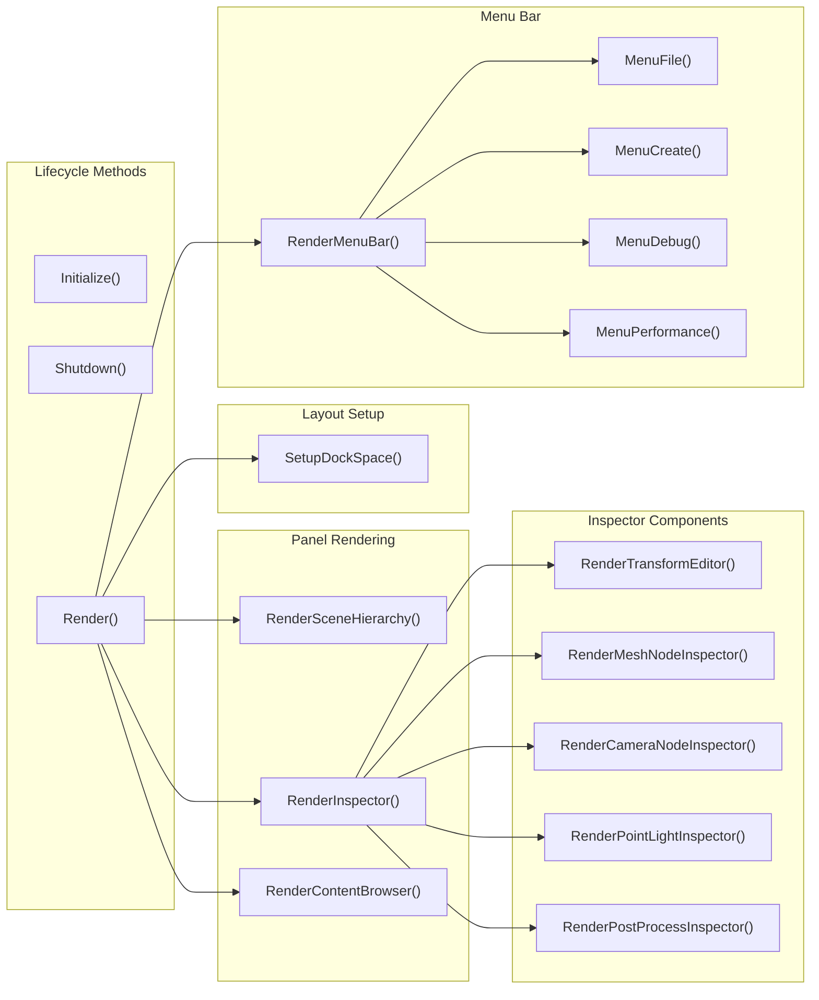
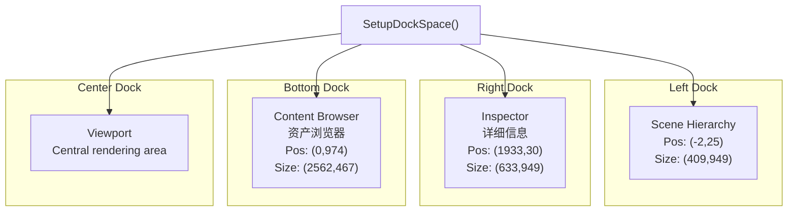
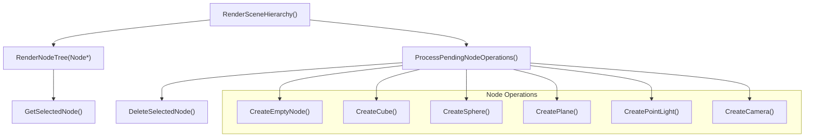
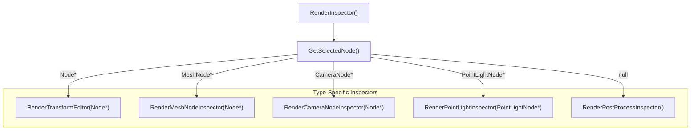
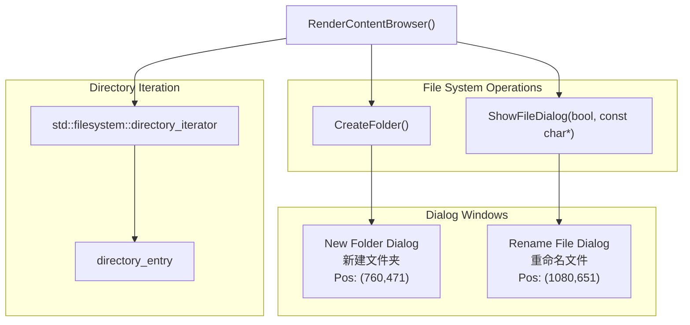
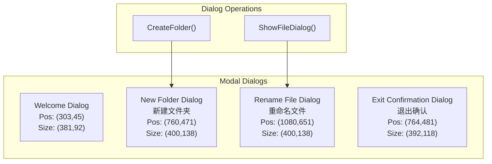
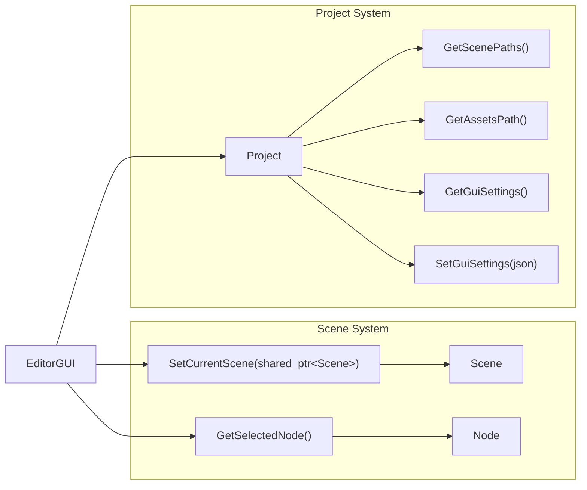

# Editor Interface and Panels

Relevant source files

The following files were used as context for generating this wiki page:

- [.cache/clangd/index/neuGUI.cpp.597919E745DAD113.idx](.cache/clangd/index/neuGUI.cpp.597919E745DAD113.idx)
- [build/CMakeFiles/NeuGUILib.dir/source/neuGUI.cpp.obj](build/CMakeFiles/NeuGUILib.dir/source/neuGUI.cpp.obj)
- [build/imgui.ini](build/imgui.ini)
- [build/libNeuGUILib.a](build/libNeuGUILib.a)

This document describes the **NeuGUILib** editor interface system, which provides a complete Dear ImGui-based editor environment for scene manipulation, asset management, and project configuration. The editor consists of multiple dockable panels organized in a docking workspace, with a main menu bar for application-level operations.

For information about project management functionality, see [Project Management](#4.2). For details about scene hierarchy manipulation and node operations, see [Scene Hierarchy and Node System](#4.3). For inspector property editing specifics, see [Inspector and Property Editing](#4.4).

## Overview

The editor interface is implemented through the `neurender::EditorGUI` class, which manages all UI panels, menus, and user interactions. The system uses immediate-mode rendering with Dear ImGui, providing a dockable panel layout that persists across sessions via `imgui.ini` configuration.

**Sources:** [build/imgui.ini:1-62](), [build/libNeuGUILib.a:1-10]()

### Core Panel Architecture

**Sources:** [build/imgui.ini:5-62](), [build/libNeuGUILib.a:1-10]()

### EditorGUI Class Method Organization

**Sources:** [build/libNeuGUILib.a:1-10]()

## Main Menu Bar

The main menu bar spans the full width of the window at position (0,0) and provides access to file operations, entity creation, debugging tools, and performance settings.

### Menu Structure

```mermaid
graph TB
    MainMenuBar["##MainMenuBar"]
    
    subgraph "File Menu"
        MenuFile["MenuFile()"]
        CreateNewProject["CreateNewProject()"]
        LoadProject["LoadProject()"]
        SaveProject["SaveProject()"]
        CreateScene["CreateScene()"]
        ShowFileDialog["ShowFileDialog()"]
    end
    
    subgraph "Create Menu"
        MenuCreate["MenuCreate()"]
        CreateCube["CreateCube()"]
        CreateSphere["CreateSphere()"]
        CreatePlane["CreatePlane()"]
        CreatePointLight["CreatePointLight()"]
        CreateCamera["CreateCamera()"]
        CreateEmptyNode["CreateEmptyNode()"]
    end
    
    subgraph "Debug Menu"
        MenuDebug["MenuDebug()"]
        DebugPanel["Debug Panel<br/>Collapsed by default"]
    end
    
    subgraph "Performance Menu"
        MenuPerformance["MenuPerformance()"]
    end
    
    MainMenuBar --> MenuFile
    MainMenuBar --> MenuCreate
    MainMenuBar --> MenuDebug
    MainMenuBar --> MenuPerformance
    
    MenuFile --> CreateNewProject
    MenuFile --> LoadProject
    MenuFile --> SaveProject
    MenuFile --> CreateScene
    MenuFile --> ShowFileDialog
    
    MenuCreate --> CreateCube
    MenuCreate --> CreateSphere
    MenuCreate --> CreatePlane
    MenuCreate --> CreatePointLight
    MenuCreate --> CreateCamera
    MenuCreate --> CreateEmptyNode
    
    MenuDebug --> DebugPanel
```

**Sources:** [build/imgui.ini:46-48](), [build/libNeuGUILib.a:1-10]()

### Menu Operations

The menu bar provides the following functionality:

| Menu | Operations | Implementation |
|------|-----------|----------------|
| **File** | New Project, Load Project, Save Project, New Scene | `MenuFile()` |
| **Create** | Cube, Sphere, Plane, Point Light, Camera, Empty Node | `MenuCreate()` |
| **Debug** | Toggle debug panel visibility | `MenuDebug()` |
| **Performance** | VSync, Target FPS, TAA settings | `MenuPerformance()` |

The menu system calls corresponding creation methods:
- `CreateCube()` - Creates a mesh node with cube geometry
- `CreateSphere()` - Creates a mesh node with sphere geometry
- `CreatePlane()` - Creates a mesh node with plane geometry
- `CreatePointLight()` - Creates a point light node
- `CreateCamera()` - Creates a camera node
- `CreateEmptyNode()` - Creates an empty node for grouping

**Sources:** [build/libNeuGUILib.a:1-10]()

## Docking System

The editor uses ImGui's docking API to provide a flexible, persistent workspace layout. The `SetupDockSpace()` method initializes the docking context and enables docking features.

### Docking Configuration

**Sources:** [build/imgui.ini:34-48]()

The docking layout is persisted to `imgui.ini`, which stores:
- Window positions (`Pos=x,y`)
- Window sizes (`Size=w,h`)
- Collapsed state (`Collapsed=0/1`)

Panels can be freely rearranged by dragging their title bars, and the configuration persists across application restarts.

**Sources:** [build/imgui.ini:1-62]()

## Scene Hierarchy Panel

The Scene Hierarchy panel displays the scene graph as a tree view with nodes organized hierarchically. It provides node selection, creation, deletion, and drag-drop reordering.

### Scene Hierarchy Implementation

**Sources:** [build/libNeuGUILib.a:1-10]()

### Scene Hierarchy Features

The Scene Hierarchy panel implements:

1. **Recursive Tree Rendering** - `RenderNodeTree(Node*)` recursively renders the node hierarchy with ImGui tree nodes
2. **Node Selection** - `GetSelectedNode()` returns the currently selected node for editing
3. **Deferred Operations** - `ProcessPendingNodeOperations()` handles node creation/deletion operations deferred until after the current frame
4. **Context Menus** - Right-click context menus for node operations

The panel displays node names, types (via icons or labels), and active state. Node selection updates the Inspector panel to show selected node properties.

**Sources:** [build/imgui.ini:34-37](), [build/libNeuGUILib.a:1-10]()

## Inspector Panel

The Inspector panel displays and allows editing of properties for the currently selected node. It adapts its content based on the node type using specialized inspectors.

### Inspector Rendering Flow

**Sources:** [build/libNeuGUILib.a:1-10]()

### Inspector Components

The Inspector panel renders different components based on selected node type:

| Node Type | Inspector Method | Properties Edited |
|-----------|-----------------|-------------------|
| **Base Node** | `RenderTransformEditor()` | Position, Rotation, Scale, Active state |
| **MeshNode** | `RenderMeshNodeInspector()` | Mesh UUID, Material UUID |
| **CameraNode** | `RenderCameraNodeInspector()` | FOV, Near/Far planes, Movement speed, Mouse sensitivity |
| **PointLightNode** | `RenderPointLightInspector()` | Color, Intensity, Radius, Attenuation (constant, linear, quadratic) |
| **No Selection** | `RenderPostProcessInspector()` | Skybox, PCSS, TAA, Bloom, Post-processing settings |

The inspector uses ImGui widgets such as:
- `ImGui::DragFloat3()` for position/rotation/scale vectors
- `ImGui::ColorEdit3()` for color properties
- `ImGui::SliderFloat()` for bounded numeric values
- `ImGui::InputText()` for string properties (node names)
- `ImGui::Checkbox()` for boolean flags

**Sources:** [build/imgui.ini:42-45](), [build/libNeuGUILib.a:1-10]()

## Content Browser Panel

The Content Browser panel provides file system navigation for the project's assets directory, displaying files and folders with support for creation, deletion, and renaming operations.

### Content Browser Implementation

**Sources:** [build/libNeuGUILib.a:1-10](), [build/imgui.ini:30-33](), [build/imgui.ini:50-53](), [build/imgui.ini:58-61]()

### Content Browser Features

The Content Browser implements:

1. **Directory Navigation** - Uses `std::filesystem::directory_iterator` to traverse the project assets directory
2. **File Filtering** - Distinguishes between directories and regular files using `directory_entry::is_directory()` and `directory_entry::is_regular_file()`
3. **File Operations**:
   - `CreateFolder()` - Opens dialog to create new folder
   - Rename - Uses `ShowFileDialog()` to prompt for new name
   - Delete - File deletion confirmation
4. **Path Management** - Integrates with `Project::GetAssetsPath()` to determine root directory
5. **Vertical Tab Navigation** - `VerticalTab()` utility for compact tab-based UI

The panel uses `std::filesystem::path` for cross-platform path manipulation and displays file entries in a grid or list layout.

**Sources:** [build/imgui.ini:38-41](), [build/libNeuGUILib.a:1-10]()

## Dialog Windows

The editor provides modal dialog windows for various operations requiring user input or confirmation.

### Dialog Window Types

**Sources:** [build/imgui.ini:26-29](), [build/imgui.ini:30-33](), [build/imgui.ini:50-53](), [build/imgui.ini:54-57](), [build/imgui.ini:58-61]()

### Dialog Implementations

| Dialog | Purpose | Implementation |
|--------|---------|----------------|
| **Welcome** | Initial project selection screen | Shown on startup when no project loaded |
| **New Folder** | Create folder in assets directory | Modal popup with text input field |
| **Rename File** | Rename asset file/folder | `ShowFileDialog(bool, const char*)` |
| **Exit Confirmation** | Confirm application exit | Modal popup with Yes/No buttons |

All dialogs use ImGui's modal popup system (`ImGui::OpenPopup()`, `ImGui::BeginPopupModal()`) to block interaction with the main window until dismissed.

**Sources:** [build/imgui.ini:26-61](), [build/libNeuGUILib.a:1-10]()

## Localization Support

The editor interface supports both English and Chinese localization, as evidenced by duplicate window entries in the configuration:

| English | Chinese |
|---------|---------|
| Scene Hierarchy | 场景层级 |
| Inspector | 详细信息 |
| Content Browser | 资产浏览器 |
| New Folder | 新建文件夹 |
| Exit Confirmation | 退出确认 |
| Rename File | 重命名文件 |

The localization is applied to window titles, menu items, and dialog labels, allowing the editor to operate in multiple languages.

**Sources:** [build/imgui.ini:10-61]()

## Integration with Core Systems

The EditorGUI integrates with other core systems through several key methods:

### Scene Management Integration

**Sources:** [build/libNeuGUILib.a:1-10]()

The `EditorGUI` class maintains:
- Current scene reference via `SetCurrentScene(std::shared_ptr<Scene>)`
- Selected node pointer via `GetSelectedNode()`
- Project settings including GUI layout state
- Asset browser current directory state

Window positions and panel layouts are serialized to JSON through `Project::GetGuiSettings()` and `Project::SetGuiSettings()`, providing persistent workspace configurations across sessions.

**Sources:** [build/imgui.ini:1-62](), [build/libNeuGUILib.a:1-10]()

---
