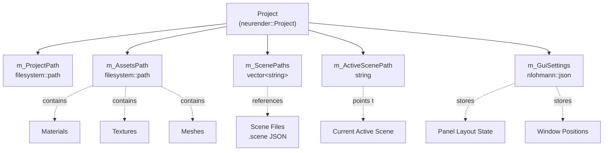
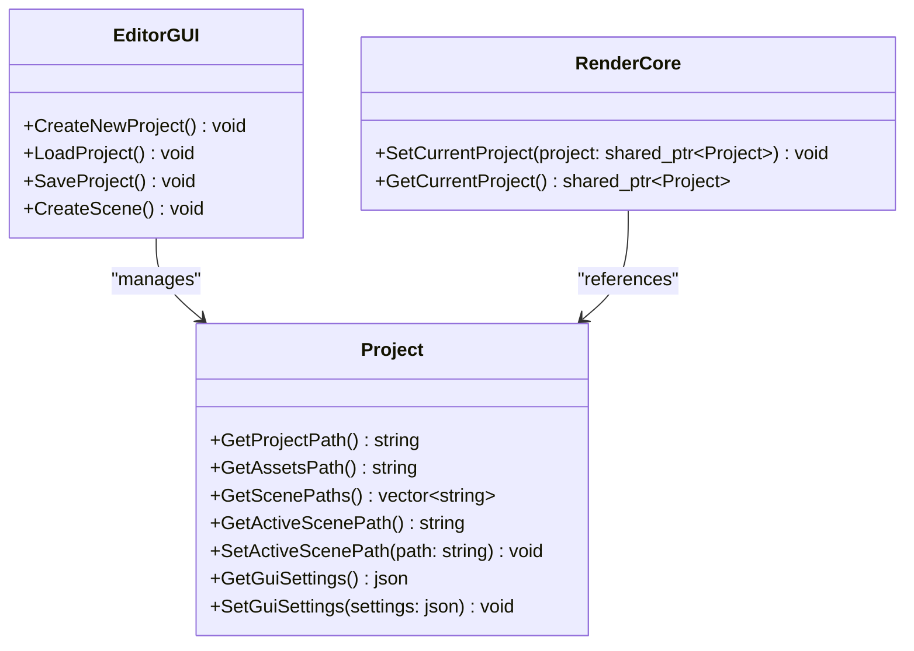
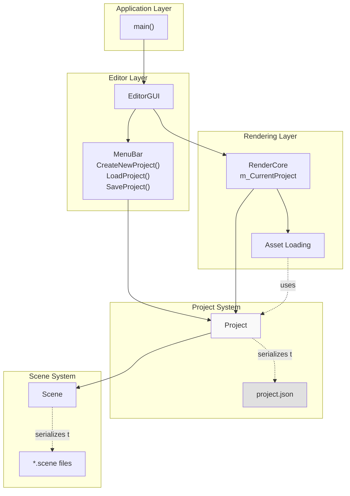
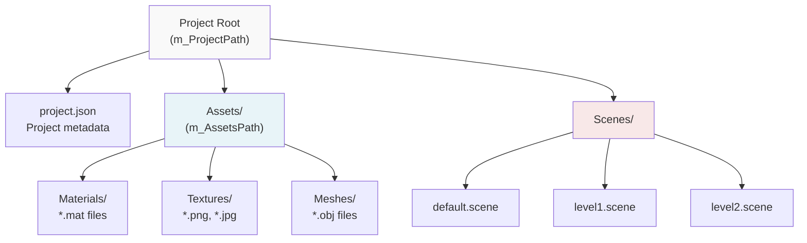
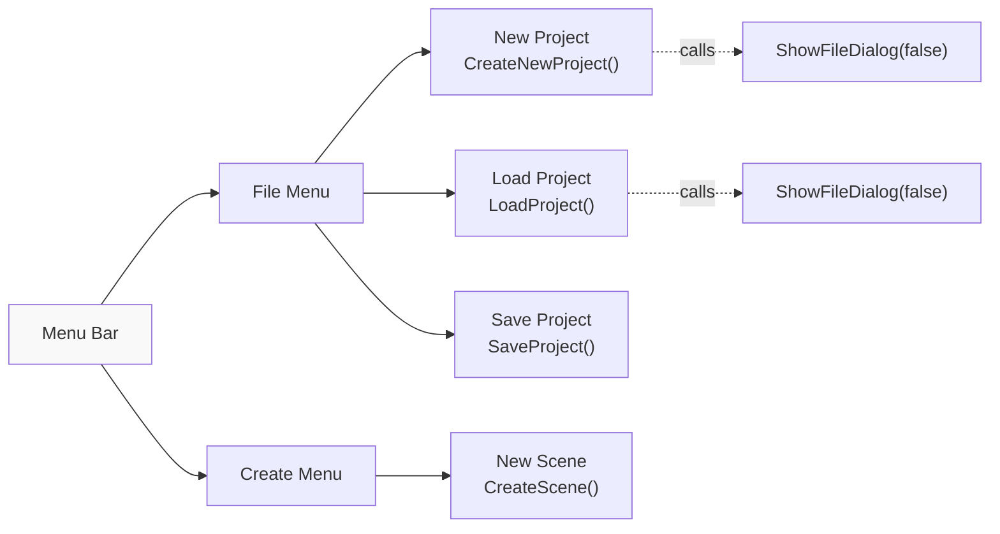
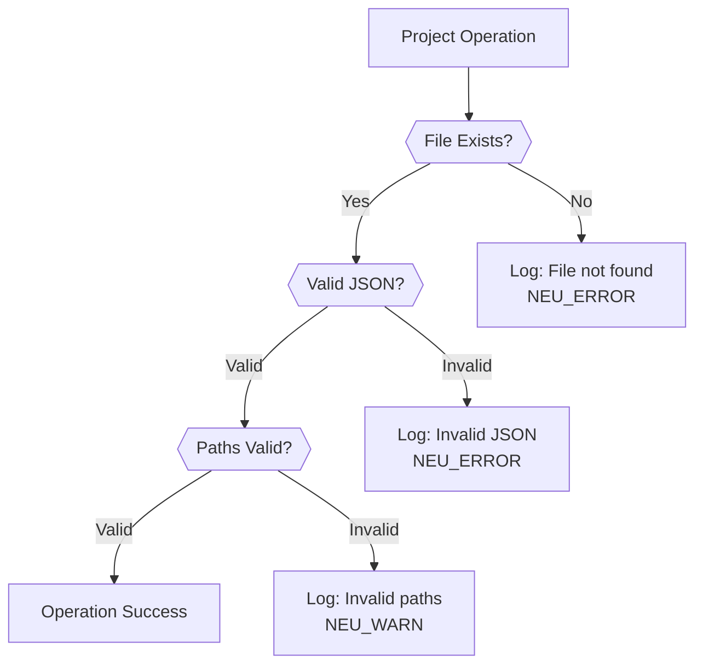

# Project Management

<details>
<summary>Relevant source files</summary>

The following files were used as context for generating this wiki page:

- [.cache/clangd/index/neuGUI.cpp.597919E745DAD113.idx](.cache/clangd/index/neuGUI.cpp.597919E745DAD113.idx)
- [build/CMakeFiles/NeuGUILib.dir/source/neuGUI.cpp.obj](build/CMakeFiles/NeuGUILib.dir/source/neuGUI.cpp.obj)
- [build/libNeuGUILib.a](build/libNeuGUILib.a)

</details>


## Purpose and Scope

This document describes the project management system in NeuVulkanRender, which provides workspace organization, scene collection management, and persistent storage of editor state. The `Project` class serves as the root container for all assets, scenes, and configuration data within a single workspace.

For information about scene graph structure and node hierarchy, see [Scene Hierarchy and Node System](#4.3). For details on the editor interface panels, see [Editor Interface and Panels](#4.1).

---

## Project Data Model

The `Project` class encapsulates all metadata required to define a workspace, including file system paths, scene references, and serialized GUI state.

### Core Components



**Data Members:**

| Member | Type | Purpose |
|--------|------|---------|
| `m_ProjectPath` | `std::filesystem::path` | Root directory of the project workspace |
| `m_AssetsPath` | `std::filesystem::path` | Directory containing project assets (materials, textures, meshes) |
| `m_ScenePaths` | `std::vector<std::string>` | List of all scene file paths within the project |
| `m_ActiveScenePath` | `std::string` | Path to the currently active scene |
| `m_GuiSettings` | `nlohmann::json` | Serialized editor UI state (panel layouts, docking configuration) |

**Sources:** Inferred from symbols `GetProjectPath`, `GetAssetsPath`, `GetScenePaths`, `GetActiveScenePath`, `GetGuiSettings` in [build/libNeuGUILib.a]()

---

## Project API

The `Project` class provides accessor methods for reading and modifying project state.

### Public Interface



**Key Methods:**

- **`GetProjectPath()`**: Returns the root directory path of the project
- **`GetAssetsPath()`**: Returns the assets subdirectory path
- **`GetScenePaths()`**: Returns all registered scene file paths
- **`GetActiveScenePath()`**: Returns the currently active scene path
- **`SetActiveScenePath(path)`**: Switches the active scene
- **`GetGuiSettings()`**: Retrieves serialized GUI state as JSON
- **`SetGuiSettings(settings)`**: Updates GUI state from JSON object

**Sources:** [build/libNeuGUILib.a]() symbols for `neurender::Project` methods

---

## Project Lifecycle

### Creation Workflow

The project creation process establishes the file system structure and initializes default metadata.

```mermaid
sequenceDiagram
    participant User
    participant EditorGUI
    participant FileDialog["ShowFileDialog()"]
    participant FileSystem["std::filesystem"]
    participant Project
    participant JSON["nlohmann::json"]
    
    User->>EditorGUI: Menu: File → New Project
    EditorGUI->>EditorGUI: CreateNewProject()
    EditorGUI->>FileDialog: ShowFileDialog(false, "Choose Project Location")
    FileDialog-->>EditorGUI: Selected Directory Path
    
    EditorGUI->>FileSystem: create_directories(projectPath)
    EditorGUI->>FileSystem: create_directories(projectPath / "Assets")
    EditorGUI->>FileSystem: create_directories(projectPath / "Scenes")
    
    EditorGUI->>Project: new Project()
    Project->>Project: m_ProjectPath = projectPath
    Project->>Project: m_AssetsPath = projectPath / "Assets"
    Project->>Project: m_ScenePaths = {}
    
    EditorGUI->>EditorGUI: SaveProject()
    EditorGUI->>Project: GetProjectPath()
    EditorGUI->>JSON: Serialize project metadata
    EditorGUI->>FileSystem: Write to project.json
    
    EditorGUI->>EditorGUI: CreateScene()
    Note over EditorGUI: Creates initial empty scene
```

**Directory Structure Created:**

```
ProjectName/
├── project.json          # Project metadata
├── Assets/              # Asset files
│   ├── Materials/
│   ├── Textures/
│   └── Meshes/
└── Scenes/              # Scene files
    └── default.scene    # Initial scene
```

**Sources:** [build/libNeuGUILib.a]() symbols `CreateNewProject`, `CreateScene`, `ShowFileDialog`

---

### Loading Workflow

Projects are loaded by deserializing JSON metadata and reconstructing the project state.

```mermaid
sequenceDiagram
    participant User
    participant EditorGUI
    participant FileDialog["ShowFileDialog()"]
    participant FileSystem
    participant JSON["nlohmann::json"]
    participant Project
    participant RenderCore
    participant Scene
    
    User->>EditorGUI: Menu: File → Load Project
    EditorGUI->>EditorGUI: LoadProject()
    EditorGUI->>FileDialog: ShowFileDialog(false, "Select Project File")
    FileDialog-->>EditorGUI: project.json path
    
    EditorGUI->>FileSystem: ifstream(projectPath / "project.json")
    FileSystem-->>EditorGUI: File stream
    EditorGUI->>JSON: json::parse(stream)
    JSON-->>EditorGUI: Parsed JSON object
    
    EditorGUI->>Project: new Project()
    EditorGUI->>Project: Deserialize from JSON
    Note over Project: m_ProjectPath<br/>m_AssetsPath<br/>m_ScenePaths<br/>m_ActiveScenePath<br/>m_GuiSettings
    
    EditorGUI->>RenderCore: SetCurrentProject(project)
    
    alt Active Scene Path exists
        EditorGUI->>Project: GetActiveScenePath()
        Project-->>EditorGUI: scenePath
        EditorGUI->>FileSystem: Load scene from scenePath
        EditorGUI->>Scene: Deserialize scene
        EditorGUI->>EditorGUI: SetCurrentScene(scene)
    end
    
    EditorGUI->>Project: GetGuiSettings()
    Project-->>EditorGUI: GUI state JSON
    EditorGUI->>EditorGUI: Restore panel layouts
```

**Sources:** [build/libNeuGUILib.a]() symbols `LoadProject`, `SetCurrentProject`, JSON parsing functions

---

### Saving Workflow

Projects are persisted by serializing metadata to JSON and writing to the file system.

```mermaid
sequenceDiagram
    participant User
    participant EditorGUI
    participant Project
    participant Scene
    participant JSON["nlohmann::json"]
    participant FileSystem
    
    User->>EditorGUI: Menu: File → Save Project
    EditorGUI->>EditorGUI: SaveProject()
    
    alt No current project
        EditorGUI-->>User: Log warning
    else Project exists
        EditorGUI->>Project: GetProjectPath()
        Project-->>EditorGUI: projectPath
        
        EditorGUI->>JSON: Create JSON object
        EditorGUI->>Project: GetAssetsPath()
        EditorGUI->>JSON: j["assetsPath"] = assetsPath
        
        EditorGUI->>Project: GetScenePaths()
        EditorGUI->>JSON: j["scenePaths"] = scenePaths
        
        EditorGUI->>Project: GetActiveScenePath()
        EditorGUI->>JSON: j["activeScene"] = activeScenePath
        
        EditorGUI->>Project: GetGuiSettings()
        EditorGUI->>JSON: j["guiSettings"] = guiSettings
        
        EditorGUI->>FileSystem: ofstream(projectPath / "project.json")
        EditorGUI->>JSON: dump(4) with indentation
        EditorGUI->>FileSystem: Write JSON to file
        
        EditorGUI->>Scene: Save current scene
        Note over Scene: Serializes to .scene file
    end
```

**Sources:** [build/libNeuGUILib.a]() symbols `SaveProject`, JSON serialization functions

---

## JSON Serialization Format

Projects are serialized to JSON using the `nlohmann::json` library. The format supports all project metadata with human-readable structure.

### Project File Schema

```json
{
  "projectName": "MyProject",
  "assetsPath": "Assets",
  "scenePaths": [
    "Scenes/main.scene",
    "Scenes/level1.scene",
    "Scenes/level2.scene"
  ],
  "activeScene": "Scenes/main.scene",
  "guiSettings": {
    "dockspace": {
      "layout": "...",
      "windows": {
        "SceneHierarchy": {
          "visible": true,
          "position": [10, 50],
          "size": [300, 600]
        },
        "Inspector": {
          "visible": true,
          "position": [320, 50],
          "size": [400, 600]
        },
        "ContentBrowser": {
          "visible": true,
          "position": [10, 660],
          "size": [710, 300]
        }
      }
    }
  }
}
```

### Serialization Implementation

The system uses `nlohmann::json` for type-safe serialization:

| JSON Field | C++ Type | Accessor |
|------------|----------|----------|
| `projectName` | `std::string` | Derived from path |
| `assetsPath` | `std::string` | `GetAssetsPath()` |
| `scenePaths` | `std::vector<std::string>` | `GetScenePaths()` |
| `activeScene` | `std::string` | `GetActiveScenePath()` |
| `guiSettings` | `nlohmann::json` | `GetGuiSettings()` |

**Sources:** [build/libNeuGUILib.a]() symbols for JSON operations, `nlohmann::json` template instantiations

---

## Integration with Rendering System

The `RenderCore` maintains a reference to the current project to access asset paths and scene data.



### Project-Aware Asset Loading

The `RenderCore` uses project paths for asset resolution:

1. **Material Loading**: Resolves texture paths relative to `Project::GetAssetsPath()`
2. **Mesh Loading**: Searches for mesh files in assets directory
3. **Scene Loading**: Loads scenes from paths in `Project::GetScenePaths()`

**API Integration:**

- `RenderCore::SetCurrentProject(project)`: Registers the active project
- `RenderCore::GetCurrentProject()`: Retrieves project for asset path resolution

**Sources:** [build/libNeuGUILib.a]() symbols `SetCurrentProject`, `GetCurrentProject`

---

## File System Organization

Projects follow a standardized directory structure for consistency and portability.

### Standard Layout



### Path Resolution

All paths within a project are stored relative to the project root:

| Path Type | Storage | Resolution |
|-----------|---------|------------|
| Assets | Relative | `m_ProjectPath / m_AssetsPath` |
| Scenes | Relative | `m_ProjectPath / "Scenes" / sceneName` |
| Textures | Relative | `m_ProjectPath / m_AssetsPath / "Textures" / texName` |

**Benefits:**
- **Portability**: Projects can be moved or shared without breaking references
- **Version Control**: Relative paths work across different developer machines
- **Clean Serialization**: JSON files contain portable relative paths

**Sources:** Inferred from `std::filesystem::path` usage in [build/libNeuGUILib.a]()

---

## EditorGUI Integration

The `EditorGUI` class provides the user interface for project management operations.

### Menu Bar Integration



### Scene Management Operations

When a scene is created through `EditorGUI::CreateScene()`:

1. Prompts user for scene name via file dialog
2. Creates new `Scene` object with root node
3. Adds scene path to `Project::m_ScenePaths`
4. Sets as active scene via `Project::SetActiveScenePath()`
5. Serializes scene to `.scene` file
6. Updates project metadata

**Sources:** [build/libNeuGUILib.a]() symbols `MenuFile`, `CreateScene`, `ShowFileDialog`

---

## State Persistence

The project system ensures editor state is preserved across sessions.

### GUI Settings Storage

The `m_GuiSettings` JSON field stores:

| Setting | Description |
|---------|-------------|
| Panel visibility | Which panels are open/closed |
| Panel positions | Window coordinates |
| Panel sizes | Window dimensions |
| Docking layout | ImGui docking tree structure |
| Last selected node | Active node in scene hierarchy |
| Content browser path | Current directory in content browser |

### Restoration Process

On project load:
1. `Project::GetGuiSettings()` retrieves JSON
2. `EditorGUI` parses panel configurations
3. ImGui docking state is restored
4. Panel visibility flags are applied
5. Window positions and sizes are set

**Sources:** [build/libNeuGUILib.a]() symbols `GetGuiSettings`, `SetGuiSettings`

---

## Error Handling

The project system uses logging for error reporting and recovery.

### Common Error Scenarios



### Logging Integration

Project operations use the `NeuLog` system:

- **`NEU_ERROR`**: File I/O failures, JSON parse errors
- **`NEU_WARN`**: Missing optional fields, deprecated formats
- **`NEU_INFO`**: Project loaded successfully, scene count

**Example Log Messages:**
- "Failed to load project from {path}"
- "Project has {count} scenes"
- "Saved project to {path}"

**Sources:** [build/libNeuGUILib.a]() logging function symbols, `NeuLog::GetLoggerInstance`

---

## Thread Safety

The project system is designed for single-threaded access from the main editor thread.

**Constraints:**
- Project modifications occur only through `EditorGUI` on the main thread
- `RenderCore` holds a `shared_ptr<Project>` for read-only access
- Scene loading is synchronous and blocks the main thread
- No concurrent modifications to project state are supported

**Sources:** Inferred from single-threaded design in [build/libNeuGUILib.a]()

---
