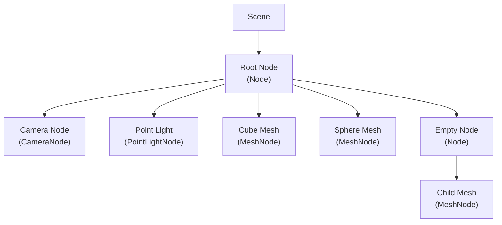
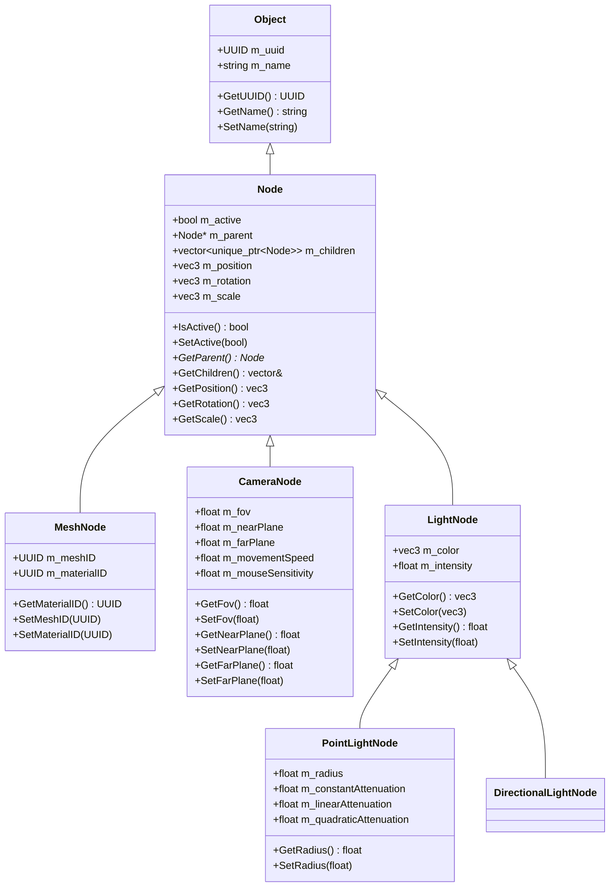
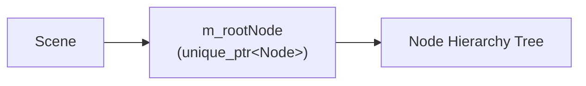
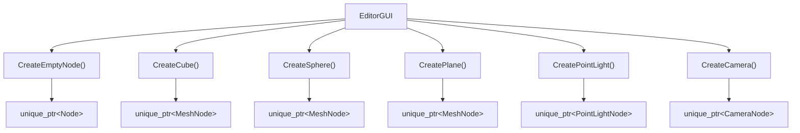
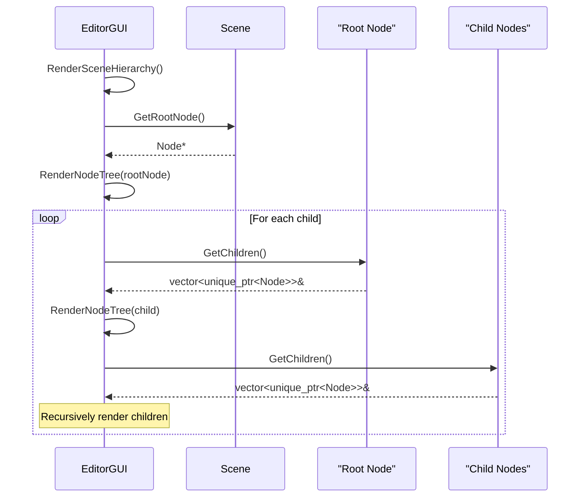
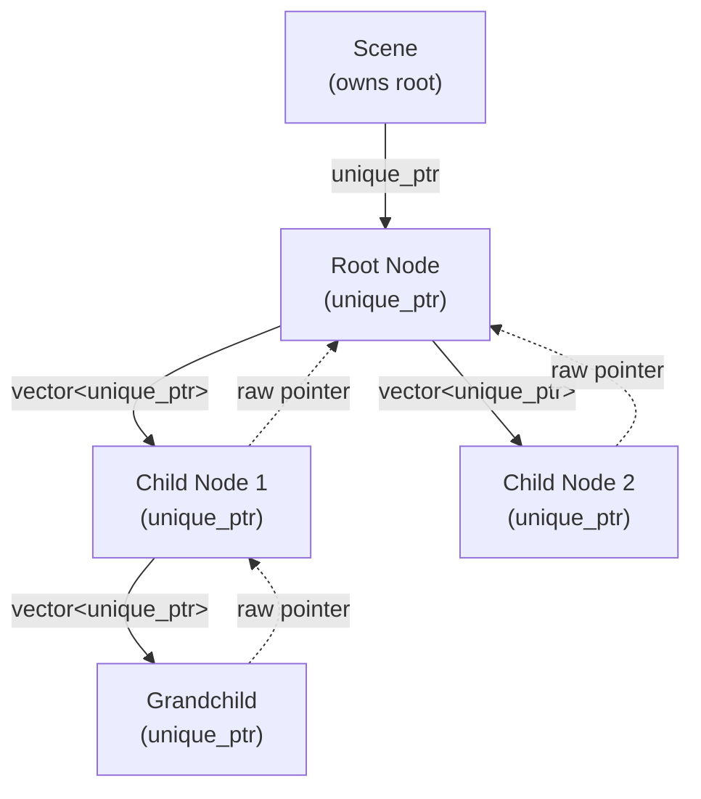

# Scene Hierarchy and Node System

Relevant source files

The following files were used as context for generating this wiki page:

- [.cache/clangd/index/neuGUI.cpp.597919E745DAD113.idx](.cache/clangd/index/neuGUI.cpp.597919E745DAD113.idx)
- [build/CMakeFiles/NeuGUILib.dir/source/neuGUI.cpp.obj](build/CMakeFiles/NeuGUILib.dir/source/neuGUI.cpp.obj)
- [build/libNeuGUILib.a](build/libNeuGUILib.a)

This document describes the scene hierarchy and node system used throughout NeuVulkanRender. The scene graph is a tree-based data structure where each node represents an object in the 3D scene with transform properties and type-specific attributes. The Editor GUI (see [4.1](#4.1)) provides interactive tools for manipulating this hierarchy through the Scene Hierarchy panel and Inspector.

For the underlying scene graph architecture and implementation details, see [5.1](#5.1). For asset management and UUID-based references, see [5.2](#5.2). For property editing in the Inspector panel, see [4.4](#4.4).

## Scene Graph Overview

The scene graph organizes all objects in a 3D scene as a hierarchy of nodes. Each scene has a root node, and all other nodes are children (direct or indirect) of this root.

**Key Characteristics:**
- **Hierarchical transforms**: Child nodes inherit parent transformations
- **Polymorphic nodes**: Base `Node` class with specialized subtypes
- **Active state**: Nodes can be enabled/disabled
- **UUID identification**: Each node is derived from `Object` with a unique UUID
- **Parent-child relationships**: Managed through `GetParent()` and `GetChildren()` methods

**Sources:** [build/libNeuGUILib.a:1-9396207]()

## Node Class Hierarchy

The node system uses polymorphic inheritance to support different object types while maintaining a common interface.

**Sources:** [build/libNeuGUILib.a:1-9396207]()

## Base Node Class

The `Node` class provides common functionality for all scene objects.

### Core Properties

| Property | Type | Description |
|----------|------|-------------|
| `m_uuid` | `UUID` | Unique identifier (inherited from `Object`) |
| `m_name` | `string` | Display name (inherited from `Object`) |
| `m_active` | `bool` | Whether node is active in the scene |
| `m_parent` | `Node*` | Pointer to parent node (null for root) |
| `m_children` | `vector<unique_ptr<Node>>` | Child nodes owned by this node |
| `m_position` | `glm::vec3` | Local position relative to parent |
| `m_rotation` | `glm::vec3` | Local rotation (Euler angles) |
| `m_scale` | `glm::vec3` | Local scale |

### Key Methods

**Active State:**
- `IsActive() const -> bool`: Returns whether the node is active
- `SetActive(bool active)`: Enables or disables the node

**Hierarchy Navigation:**
- `GetParent() const -> Node*`: Returns parent node pointer
- `GetChildren() const -> const vector<unique_ptr<Node>>&`: Returns children vector

**Transform Accessors:**
- `GetPosition() const -> const glm::vec3&`: Returns local position
- `GetRotation() const -> const glm::vec3&`: Returns local rotation
- `GetScale() const -> const glm::vec3&`: Returns local scale

**Sources:** [build/libNeuGUILib.a:1-9396207]()

## Specialized Node Types

### MeshNode

Represents a renderable mesh object with material assignment.

**Additional Properties:**
- `m_meshID` (`UUID`): Reference to mesh resource in asset system
- `m_materialID` (`UUID`): Reference to material resource in asset system

**Key Methods:**
- `GetMaterialID() const -> const UUID&`: Returns material UUID
- `SetMeshID(const UUID& id)`: Assigns mesh resource
- `SetMaterialID(const UUID& id)`: Assigns material resource

MeshNode instances are rendered during the scene rendering passes. The mesh and material UUIDs are resolved through the asset system (see [5.2](#5.2)) to obtain the actual GPU resources.

### CameraNode

Represents a camera viewpoint in the scene.

**Additional Properties:**
- `m_fov` (`float`): Field of view in degrees
- `m_nearPlane` (`float`): Near clipping plane distance
- `m_farPlane` (`float`): Far clipping plane distance
- `m_movementSpeed` (`float`): Camera movement speed for editor controls
- `m_mouseSensitivity` (`float`): Mouse sensitivity for editor controls

**Key Methods:**
- `GetFov() const -> float`, `SetFov(float)`
- `GetNearPlane() const -> float`, `SetNearPlane(float)`
- `GetFarPlane() const -> float`, `SetFarPlane(float)`
- `GetMovementSpeed() const -> float`, `SetMovementSpeed(float)`
- `GetMouseSensitivity() const -> float`, `SetMouseSensitivity(float)`

### LightNode (Base)

Abstract base class for light sources.

**Common Properties:**
- `m_color` (`glm::vec3`): RGB light color (0-1 range)
- `m_intensity` (`float`): Light intensity multiplier

**Key Methods:**
- `GetColor() const -> const glm::vec3&`, `SetColor(const glm::vec3&)`
- `GetIntensity() const -> float`, `SetIntensity(float)`

### PointLightNode

Represents an omnidirectional point light with distance-based attenuation.

**Additional Properties:**
- `m_radius` (`float`): Maximum influence radius
- `m_constantAttenuation` (`float`): Constant attenuation factor
- `m_linearAttenuation` (`float`): Linear attenuation factor
- `m_quadraticAttenuation` (`float`): Quadratic attenuation factor

**Key Methods:**
- `GetRadius() const -> float`, `SetRadius(float)`
- `GetConstantAttenuation() const -> float`, `SetConstantAttenuation(float)`
- `GetLinearAttenuation() const -> float`, `SetLinearAttenuation(float)`
- `GetQuadraticAttenuation() const -> float`, `SetQuadraticAttenuation(float)`

Attenuation is calculated as: `1.0 / (constant + linear * distance + quadratic * distance^2)`

**Sources:** [build/libNeuGUILib.a:1-9396207]()

## Scene Class

The `Scene` class is the container for the entire scene graph.

**Key Method:**
- `GetRootNode() const -> Node*`: Returns the root node of the scene graph

The scene maintains ownership of the root node through a `unique_ptr<Node>`. All other nodes in the scene are children (direct or nested) of this root, forming a complete tree structure.

**Sources:** [build/libNeuGUILib.a:1-9396207]()

## Scene Hierarchy Manipulation in EditorGUI

The `EditorGUI` class provides methods for creating, deleting, and modifying nodes in the scene hierarchy.

### Node Creation Methods

The following factory methods create new node instances:

**Factory Methods:**
- `CreateEmptyNode() -> void`: Creates a base `Node` with no specialized behavior
- `CreateCube() -> void`: Creates a `MeshNode` with cube mesh assigned
- `CreateSphere() -> void`: Creates a `MeshNode` with sphere mesh assigned
- `CreatePlane() -> void`: Creates a `MeshNode` with plane mesh assigned
- `CreatePointLight() -> void`: Creates a `PointLightNode` with default light settings
- `CreateCamera() -> void`: Creates a `CameraNode` with default camera settings

These methods internally use `std::make_unique` to construct the appropriate node type, then add it to the scene hierarchy through pending operations.

### Node Deletion

**Method:**
- `DeleteSelectedNode() -> void`: Removes the currently selected node and all its children

Node deletion is deferred through the pending operations system to avoid invalidating iterators during scene traversal.

### Pending Operations System

Node creation and deletion are not performed immediately but are queued as pending operations:

**Method:**
- `ProcessPendingNodeOperations() -> void`: Processes all queued node operations

This design prevents issues with modifying the scene graph during iteration (e.g., while rendering the scene hierarchy tree).

**Sources:** [build/libNeuGUILib.a:1-9396207]()

## Scene Hierarchy Rendering

The EditorGUI renders the scene hierarchy as an interactive tree view in the Scene Hierarchy panel.

### Rendering Flow

**Key Methods:**
- `RenderSceneHierarchy() -> void`: Top-level method that renders the entire hierarchy panel
- `RenderNodeTree(Node* node) -> void`: Recursively renders a node and its children as a tree structure

### Tree Node Display

For each node in the hierarchy:
1. Display node name (from `GetName()`)
2. Check if node has children (via `GetChildren()`)
3. If children exist, render as expandable tree node
4. On selection, update `GetSelectedNode()` to point to the clicked node
5. Recursively render children with indentation

**Sources:** [build/libNeuGUILib.a:1-9396207]()

## Node Selection and Inspection

The EditorGUI maintains a selected node for property editing.

**Method:**
- `GetSelectedNode() -> Node*`: Returns the currently selected node (or nullptr)

When a node is selected in the Scene Hierarchy panel, the Inspector panel (see [4.4](#4.4)) displays type-specific properties:

**Inspector Rendering Methods:**
- `RenderInspector() -> void`: Main inspector rendering
- `RenderTransformEditor(Node* node) -> void`: Common transform properties (position, rotation, scale)
- `RenderMeshNodeInspector(Node* node) -> void`: Mesh and material assignment for `MeshNode`
- `RenderCameraNodeInspector(Node* node) -> void`: Camera-specific properties for `CameraNode`
- `RenderPointLightInspector(PointLightNode* node) -> void`: Point light properties for `PointLightNode`

### Inspector Property Mapping

| Node Type | Inspector Method | Properties Displayed |
|-----------|------------------|---------------------|
| All nodes | `RenderTransformEditor` | Position, Rotation, Scale, Active state |
| `MeshNode` | `RenderMeshNodeInspector` | Mesh UUID, Material UUID |
| `CameraNode` | `RenderCameraNodeInspector` | FOV, Near/Far planes, Movement speed, Mouse sensitivity |
| `PointLightNode` | `RenderPointLightInspector` | Color, Intensity, Radius, Attenuation factors |

**Sources:** [build/libNeuGUILib.a:1-9396207]()

## Scene Management

The EditorGUI manages the current active scene.

### Scene Loading and Creation

**Methods:**
- `SetCurrentScene(std::shared_ptr<Scene> scene) -> void`: Sets the active scene
- `CreateScene() -> void`: Creates a new empty scene

Scenes are managed as `std::shared_ptr<Scene>` to allow shared ownership between the EditorGUI and RenderCore systems.

### Scene Storage in Project

Projects maintain a list of scene paths:
- Scenes are serialized to disk as separate files
- The active project (via `RenderCore::GetCurrentProject()`) tracks scene paths
- EditorGUI loads scenes from these paths on project load

**Sources:** [build/libNeuGUILib.a:1-9396207]()

## Node Ownership and Memory Management

The scene graph uses strict ownership semantics through smart pointers:

**Ownership Rules:**
1. **Scene owns root node**: `unique_ptr<Node>` stored in `Scene`
2. **Parents own children**: `vector<unique_ptr<Node>>` stored in each `Node`
3. **Children reference parents**: Raw `Node*` pointer stored in each child (non-owning)

This design ensures:
- Automatic cleanup when nodes are deleted
- No circular ownership (parent owns child, child references parent)
- Clear ownership semantics throughout the hierarchy

When a node is deleted, all its children are automatically destroyed due to the `unique_ptr` ownership model.

**Sources:** [build/libNeuGUILib.a:1-9396207]()

---
