# Inspector and Property Editing

Relevant source files

The following files were used as context for generating this wiki page:

- [.cache/clangd/index/neuGUI.cpp.597919E745DAD113.idx](.cache/clangd/index/neuGUI.cpp.597919E745DAD113.idx)
- [build/CMakeFiles/NeuGUILib.dir/source/neuGUI.cpp.obj](build/CMakeFiles/NeuGUILib.dir/source/neuGUI.cpp.obj)
- [build/libNeuGUILib.a](build/libNeuGUILib.a)

The Inspector panel provides a unified interface for viewing and editing properties of selected scene nodes, materials, and rendering settings. This document details the inspector system's architecture, the type-specific property editors, and how property changes propagate to the scene graph and rendering pipeline.

For information about the Scene Hierarchy panel and node selection, see [Scene Hierarchy and Node System](#4.3). For details on the overall editor panel layout, see [Editor Interface and Panels](#4.1).

## Inspector Panel Architecture

The inspector panel is implemented by `EditorGUI::RenderInspector()`, which dynamically displays property editors based on the currently selected entity type. The inspector uses ImGui immediate-mode widgets to provide interactive controls for property editing.

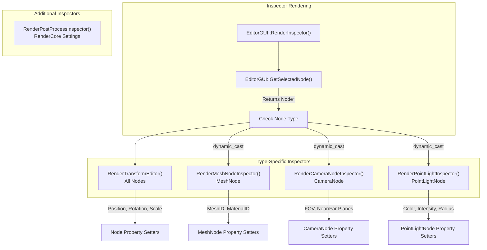

**Sources:** [build/libNeuGUILib.a:3-400154]()

The inspector system uses polymorphism to determine which property editor to display. When a node is selected, the inspector queries the node type and renders the appropriate UI widgets.

## Transform Editor

All scene nodes inherit from the base `Node` class and share common transform properties. The `RenderTransformEditor()` function provides editing controls for position, rotation, and scale, which are fundamental to all nodes in the scene graph.

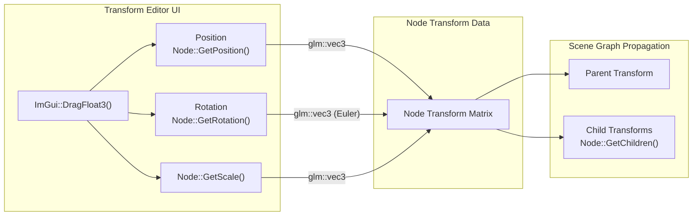

**Sources:** [build/libNeuGUILib.a:3-400154]()

### Transform Properties

| Property | Type | Description | Getter | Setter |
|----------|------|-------------|--------|--------|
| Position | `glm::vec3` | World-space position | `Node::GetPosition()` | Implicit via UI |
| Rotation | `glm::vec3` | Euler angles (degrees) | `Node::GetRotation()` | Implicit via UI |
| Scale | `glm::vec3` | Non-uniform scale | `Node::GetScale()` | Implicit via UI |
| Active | `bool` | Node visibility/enabled state | `Node::IsActive()` | `Node::SetActive()` |

The transform editor also displays the node's parent relationship via `Node::GetParent()` and provides a tree view of children via `Node::GetChildren()`.

**Sources:** [build/libNeuGUILib.a:3-400154]()

## Node-Specific Inspectors

Each node type has specialized properties beyond the base transform. The inspector system uses `dynamic_cast` to detect the concrete node type and render the appropriate property editors.

### MeshNode Inspector

The `RenderMeshNodeInspector()` function provides editing for mesh and material assignments. MeshNode represents a renderable 3D object in the scene.

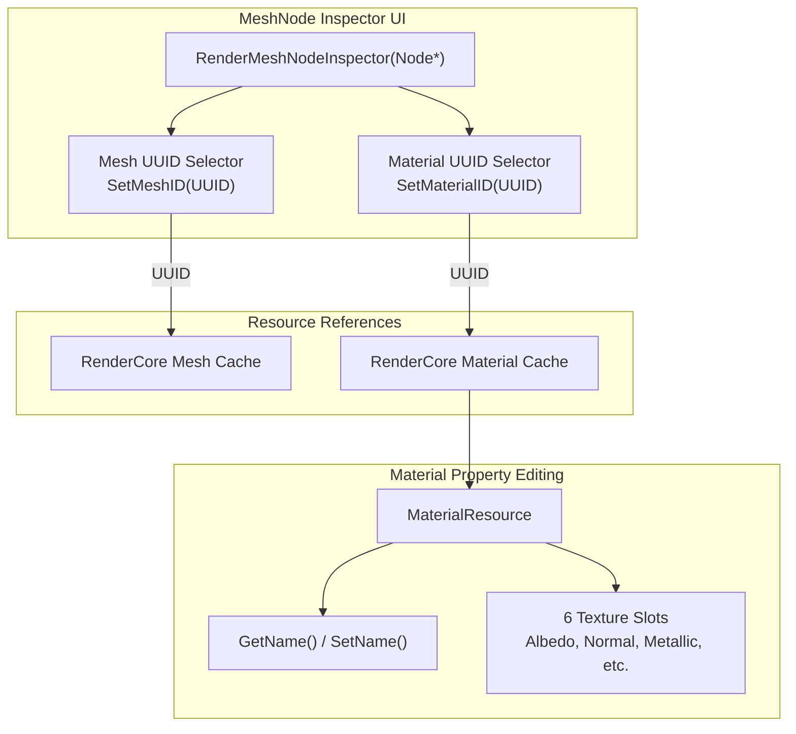

**Sources:** [build/libNeuGUILib.a:3-400154]()

**MeshNode Properties:**

| Property | Type | Description | Getter | Setter |
|----------|------|-------------|--------|--------|
| Mesh ID | `UUID` | Reference to mesh resource | `GetMeshID()` | `SetMeshID(UUID)` |
| Material ID | `UUID` | Reference to material resource | `GetMaterialID()` | `SetMaterialID(UUID)` |

The inspector provides UUID selection widgets that display available meshes and materials from the asset system. When a new mesh or material is assigned, the UUID-based resource cache in RenderCore ensures the resources are loaded.

**Sources:** [build/libNeuGUILib.a:3-400154]()

### CameraNode Inspector

The `RenderCameraNodeInspector()` function exposes camera projection and control properties. CameraNode represents a camera in the scene that can be used for rendering.

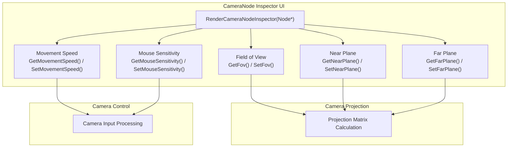

**Sources:** [build/libNeuGUILib.a:3-400154]()

**CameraNode Properties:**

| Property | Type | Description | Getter | Setter |
|----------|------|-------------|--------|--------|
| Field of View | `float` | Vertical FOV in degrees | `GetFov()` | `SetFov(float)` |
| Near Plane | `float` | Near clipping plane distance | `GetNearPlane()` | `SetNearPlane(float)` |
| Far Plane | `float` | Far clipping plane distance | `GetFarPlane()` | `SetFarPlane(float)` |
| Movement Speed | `float` | Camera movement speed multiplier | `GetMovementSpeed()` | `SetMovementSpeed(float)` |
| Mouse Sensitivity | `float` | Mouse look sensitivity | `GetMouseSensitivity()` | `SetMouseSensitivity(float)` |

The CameraNode inspector provides real-time control over camera properties that immediately affect the viewport rendering. Changes to FOV or clipping planes trigger projection matrix recalculation.

**Sources:** [build/libNeuGUILib.a:3-400154]()

### PointLightNode Inspector

The `RenderPointLightInspector()` function provides controls for point light properties including color, intensity, and attenuation parameters.

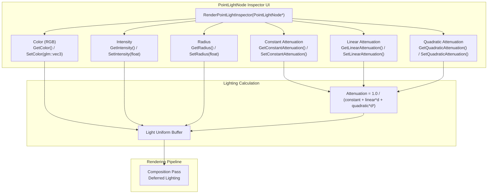

**Sources:** [build/libNeuGUILib.a:3-400154]()

**PointLightNode Properties:**

| Property | Type | Description | Getter | Setter |
|----------|------|-------------|--------|--------|
| Color | `glm::vec3` | RGB light color (0-1 range) | `GetColor()` | `SetColor(glm::vec3)` |
| Intensity | `float` | Light intensity multiplier | `GetIntensity()` | `SetIntensity(float)` |
| Radius | `float` | Effective light radius | `GetRadius()` | `SetRadius(float)` |
| Constant Attenuation | `float` | Constant term in attenuation formula | `GetConstantAttenuation()` | `SetConstantAttenuation(float)` |
| Linear Attenuation | `float` | Linear distance term | `GetLinearAttenuation()` | `SetLinearAttenuation(float)` |
| Quadratic Attenuation | `float` | Quadratic distance term | `GetQuadraticAttenuation()` | `SetQuadraticAttenuation(float)` |

The attenuation parameters control how light intensity falls off with distance. The shader uses the formula: `attenuation = 1.0 / (constant + linear * distance + quadratic * distance²)`.

**Sources:** [build/libNeuGUILib.a:3-400154]()

## Material Property Editing

Materials are edited through the `MaterialResource` class, which provides access to material name and texture slot assignments. The inspector displays material properties when a MeshNode with a valid material is selected.

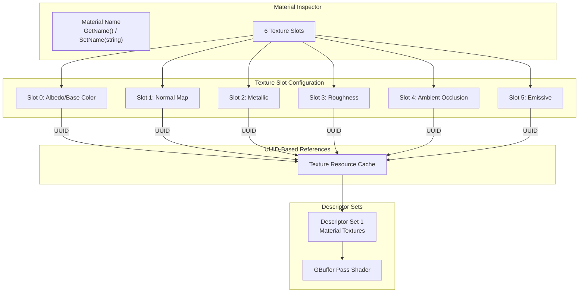

**Sources:** [build/libNeuGUILib.a:3-400154]()

**MaterialResource Properties:**

| Property | Type | Description | Access Methods |
|----------|------|-------------|----------------|
| Name | `std::string` | Human-readable material name | `GetName()`, `SetName(string)` |
| Texture Slots | `UUID[6]` | References to texture resources | Indexed access |

The material system uses UUID-based references to texture resources. When a texture UUID is assigned, the RenderCore's texture cache handles loading and Vulkan descriptor set binding. Default textures (white, black, normal) are used for unassigned slots.

**Sources:** [build/libNeuGUILib.a:3-400154]()

## RenderCore Settings Inspector

The `RenderPostProcessInspector()` function provides access to rendering pipeline settings that are not tied to specific scene nodes. These settings control post-processing effects, shadow quality, and other rendering features.

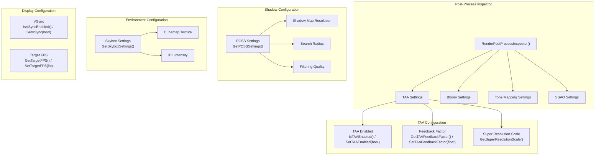

**Sources:** [build/libNeuGUILib.a:3-400154]()

### RenderCore Settings Access

The inspector accesses rendering settings through the `RenderCore` singleton:

| Setting Category | Access Method | Description |
|-----------------|---------------|-------------|
| Camera | `GetCamera()` | Access to main camera properties |
| Post-Processing | `GetPostProcessSettings()` | TAA, bloom, tone mapping, SSAO |
| Shadow (PCSS) | `GetPCSSSettings()` | Shadow map resolution and PCSS parameters |
| Skybox/IBL | `GetSkyboxSettings()` | Environment mapping and IBL |
| VSync | `IsVSyncEnabled()`, `SetVSync(bool)` | Vertical synchronization toggle |
| Target FPS | `GetTargetFPS()`, `SetTargetFPS(int)` | Frame rate limit |

**Sources:** [build/libNeuGUILib.a:3-400154]()

### TAA Settings

Temporal Anti-Aliasing (TAA) settings control the quality and behavior of temporal anti-aliasing:

| Property | Type | Description | Access Methods |
|----------|------|-------------|----------------|
| Enabled | `bool` | Enable/disable TAA | `IsTAAEnabled()`, `SetTAAEnabled(bool)` |
| Feedback Factor | `float` | History blend factor (0-1) | `GetTAAFeedbackFactor()`, `SetTAAFeedbackFactor(float)` |
| Super Resolution Scale | `float` | Internal resolution scale (default 1.25x) | `GetSuperResolutionScale()` |

The feedback factor controls how much of the previous frame's result is blended with the current frame. Lower values reduce ghosting but increase temporal noise. Higher values provide smoother anti-aliasing but may cause trailing artifacts.

**Sources:** [build/libNeuGUILib.a:3-400154]()

### Skybox Settings

The `SkyboxSettings` class provides configuration for environment mapping and image-based lighting (IBL):

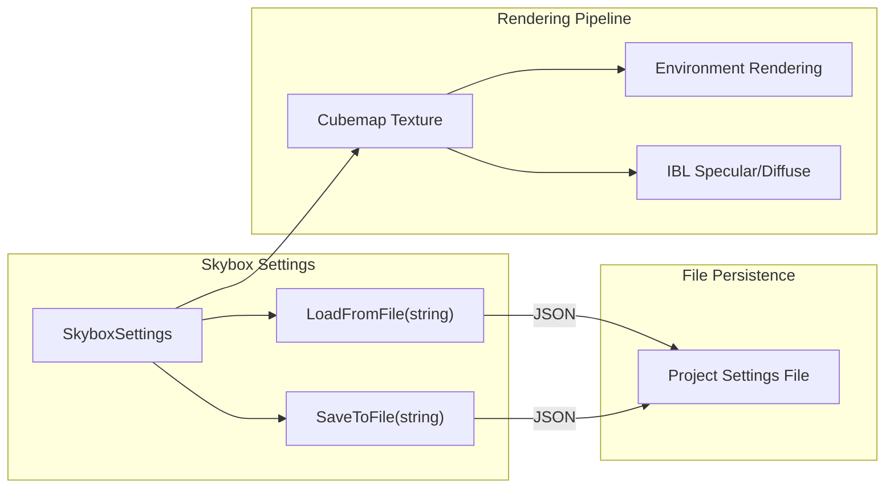

**Sources:** [build/libNeuGUILib.a:3-400154]()

The `SkyboxSettings::LoadFromFile()` and `SkyboxSettings::SaveToFile()` methods handle JSON serialization of skybox configuration, allowing settings to be persisted with the project.

**Sources:** [build/libNeuGUILib.a:3-400154]()

## Property Editing Workflow

The inspector system follows an immediate-mode UI pattern where property values are read from scene nodes each frame and modifications are applied immediately when UI widgets are interacted with.

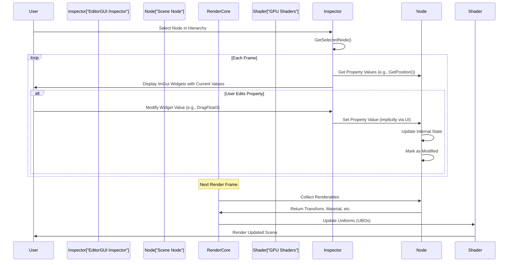

**Sources:** [build/libNeuGUILib.a:3-400154]()

### Immediate Property Application

Unlike traditional retained-mode UIs, the inspector applies property changes immediately:

1. **Read Phase**: Inspector queries node properties via getter methods (e.g., `GetPosition()`, `GetColor()`)
2. **UI Rendering**: ImGui widgets display current values and handle user input
3. **Write Phase**: If a widget is modified, the new value is applied (implicitly through the UI system)
4. **Scene Update**: Changes propagate to the scene graph and are reflected in the next render frame

This immediate feedback loop allows users to see the effects of their edits in real-time without explicit "Apply" or "OK" buttons.

**Sources:** [build/libNeuGUILib.a:3-400154]()

### UUID-Based Resource References

Material and mesh assignments use UUID-based references to ensure stability across asset renames and moves:

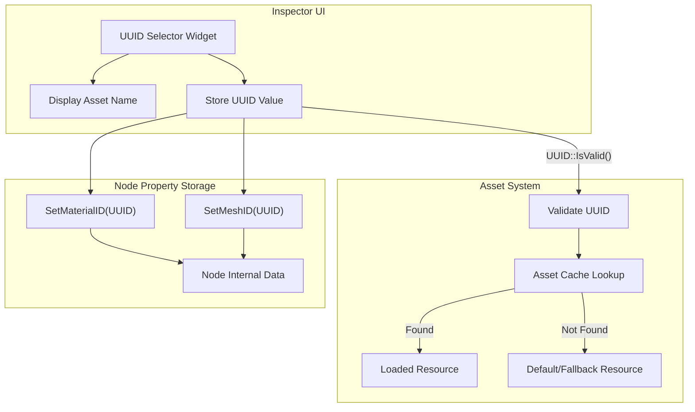

**Sources:** [build/libNeuGUILib.a:3-400154]()

The UUID system provides several benefits:
- **Stability**: Asset references remain valid even if files are moved or renamed
- **Uniqueness**: Each asset has a globally unique identifier via `UUID::Invalid()` for null references
- **Validation**: `UUID::IsValid()` checks if a reference is valid before dereferencing
- **Type Safety**: Separate UUID types for different resource categories prevent type mismatches

**Sources:** [build/libNeuGUILib.a:3-400154]()

### JSON Serialization

Property values are serialized to JSON for project persistence using the nlohmann/json library. The inspector reads and writes JSON structures for:

- Scene node properties (transform, active state)
- Material assignments
- Light parameters
- Camera settings
- RenderCore configuration

The `nlohmann::json` integration provides type-safe serialization with validation. Properties are stored in JSON objects with key-value pairs that map to C++ class members.

**Sources:** [build/libNeuGUILib.a:3-400154]()

### GLM Vector Editing

Transform properties use GLM vector types (`glm::vec3`) for position, rotation, and scale. The inspector provides specialized editing controls:

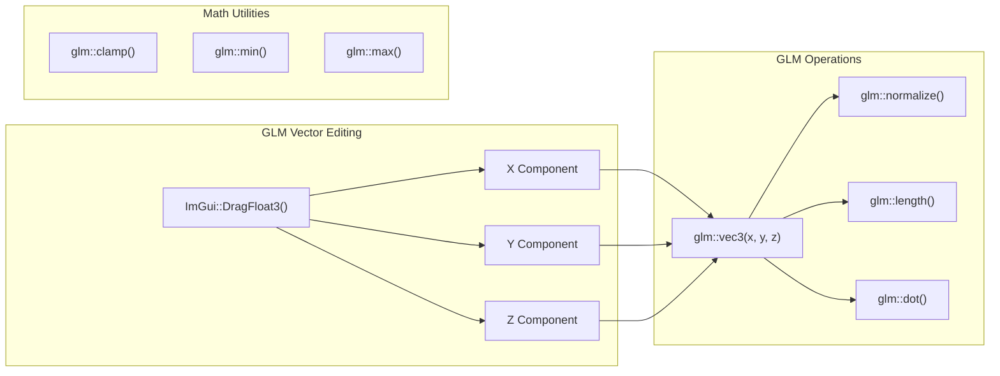

**Sources:** [build/libNeuGUILib.a:3-400154]()

The inspector uses GLM's vector math functions for validation and normalization:
- `glm::length()` - Calculate vector magnitude
- `glm::normalize()` - Normalize to unit length
- `glm::dot()` - Dot product for calculations
- `glm::clamp()` - Constrain values to valid ranges
- `glm::min()` / `glm::max()` - Component-wise min/max

**Sources:** [build/libNeuGUILib.a:3-400154]()

---
