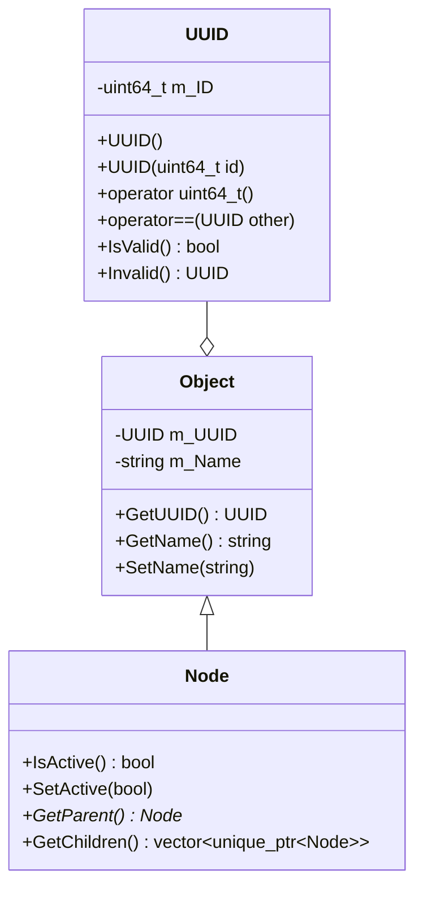
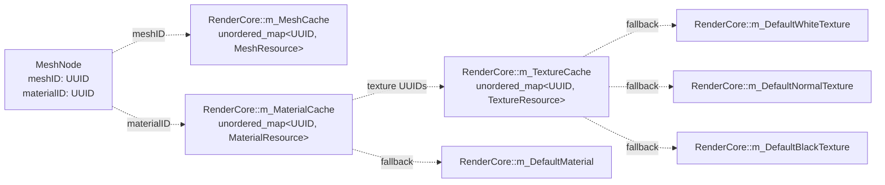
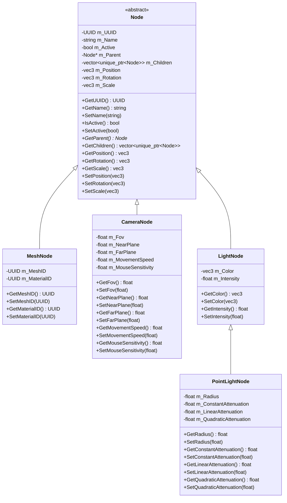
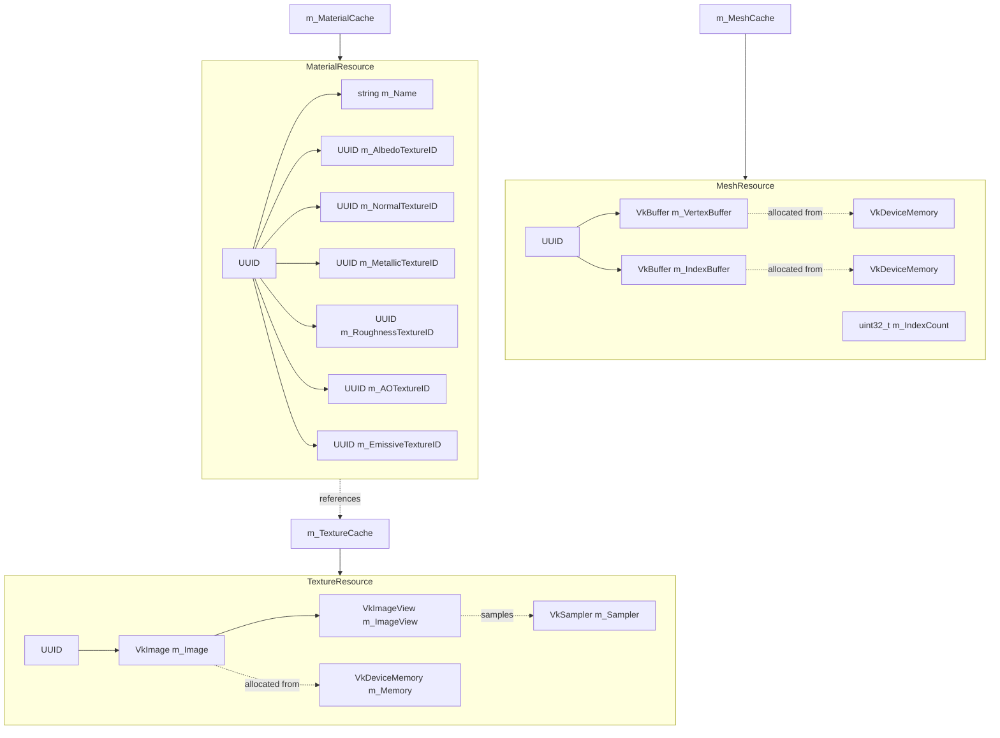
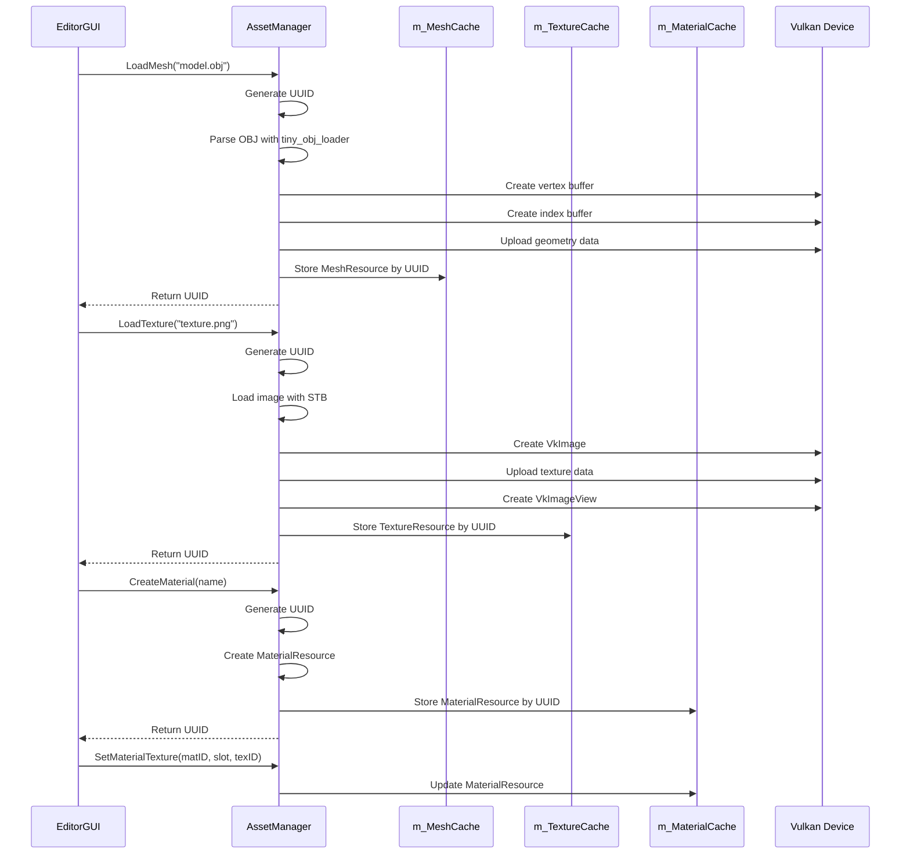
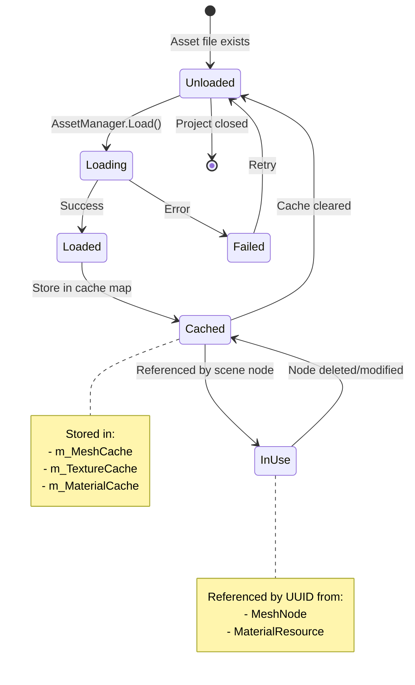
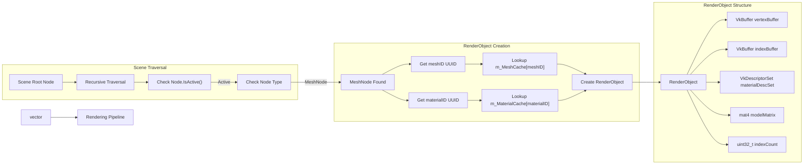
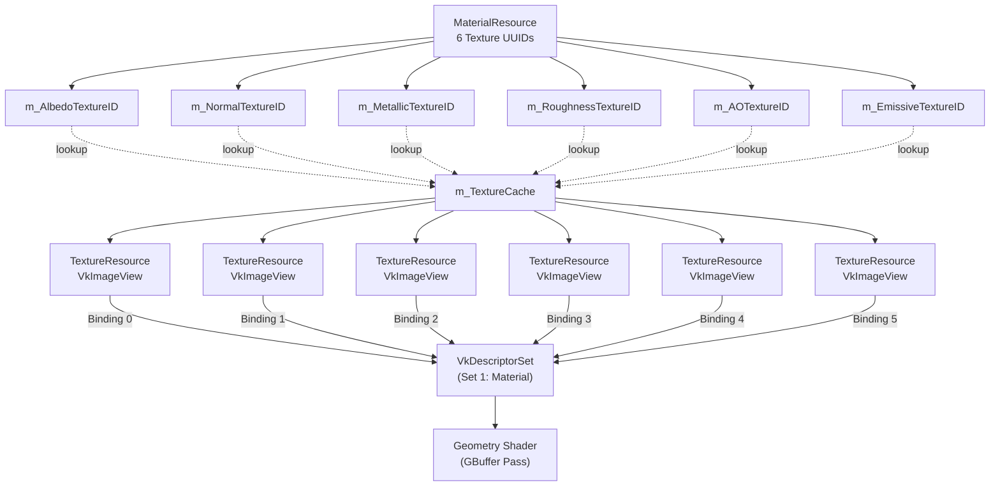
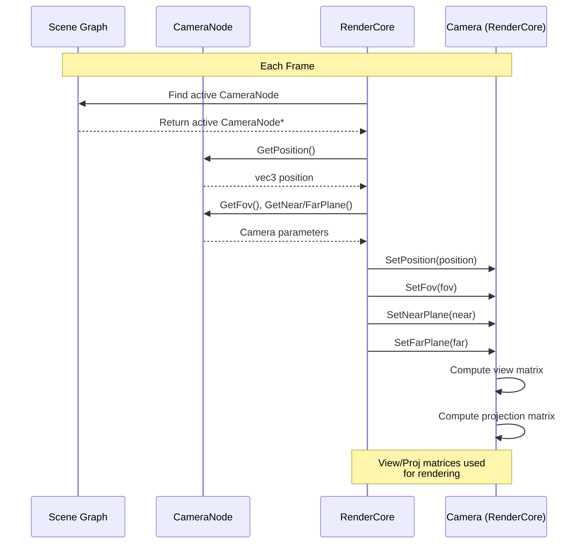

# Scene and Asset System

<details>
<summary>Relevant source files</summary>

The following files were used as context for generating this wiki page:

- [.cache/clangd/index/neuGUI.cpp.597919E745DAD113.idx](.cache/clangd/index/neuGUI.cpp.597919E745DAD113.idx)
- [build/CMakeFiles/NeuGUILib.dir/source/neuGUI.cpp.obj](build/CMakeFiles/NeuGUILib.dir/source/neuGUI.cpp.obj)
- [build/libNeuGUILib.a](build/libNeuGUILib.a)
- [source/RenderCore.cpp](source/RenderCore.cpp)

</details>


## Overview

The Scene and Asset System provides scene graph management and resource loading for the NeuVulkanRender engine. This document covers the hierarchical node system, UUID-based asset referencing, and resource caching mechanisms implemented in `NeuSceneLib` and `NeuAssetLib`.

For information about how these systems are used in the editor interface, see [Editor System (EditorGUI)](#4). For details on how resources are consumed by the rendering pipeline, see [Rendering System (RenderCore)](#3).

---

## Architecture Overview

The Scene and Asset System consists of two primary subsystems that work together to provide data-driven content management:

```mermaid
graph TB
    subgraph "Scene Graph (NeuSceneLib)"
        Scene["Scene"]
        RootNode["Root Node"]
        NodeBase["Node (Base Class)"]
        MeshNode["MeshNode"]
        CameraNode["CameraNode"]
        LightNode["LightNode"]
        PointLightNode["PointLightNode"]
        
        Scene --> RootNode
        RootNode --> NodeBase
        NodeBase <|-- MeshNode
        NodeBase <|-- CameraNode
        NodeBase <|-- LightNode
        LightNode <|-- PointLightNode
    end
    
    subgraph "Asset System"
        AssetManager["AssetManager"]
        UUIDSystem["UUID System"]
        MeshCache["MeshCache<br/>(UUID → MeshResource)"]
        TextureCache["TextureCache<br/>(UUID → TextureResource)"]
        MaterialCache["MaterialCache<br/>(UUID → MaterialResource)"]
        
        AssetManager --> UUIDSystem
        AssetManager --> MeshCache
        AssetManager --> TextureCache
        AssetManager --> MaterialCache
    end
    
    subgraph "Resource Types"
        MeshResource["MeshResource<br/>Vertex/Index Data"]
        TextureResource["TextureResource<br/>Image Data"]
        MaterialResource["MaterialResource<br/>6 Texture Bindings"]
        
        MaterialResource -.references.-> TextureResource
    end
    
    MeshNode -.references.-> MeshCache
    MeshNode -.references.-> MaterialCache
    
    MeshCache --> MeshResource
    TextureCache --> TextureResource
    MaterialCache --> MaterialResource
    
    RenderCore["RenderCore<br/>Rendering System"] --> Scene
    RenderCore --> MeshCache
    RenderCore --> TextureCache
    RenderCore --> MaterialCache
    
    EditorGUI["EditorGUI<br/>Editor System"] --> Scene
    EditorGUI --> AssetManager
```

**Sources:** [source/RenderCore.cpp:1-600](), Diagram 4 from high-level architecture

---

## UUID System

The UUID system provides stable, globally unique identifiers for all assets and objects in the engine, enabling references to remain valid across project saves, asset renames, and file moves.

### UUID Class

The `UUID` class is defined in `NeuCoreLib` and provides 64-bit unique identifiers:



**Key Methods:**
- `UUID::IsValid()`: Returns `true` if the UUID is non-zero
- `UUID::Invalid()`: Returns a sentinel invalid UUID (0)
- `operator uint64_t()`: Implicit conversion for use as hash map keys

**Sources:** [source/RenderCore.cpp:30-31](), interface definitions visible in EditorGUI usage

### UUID-Based Caching

All resources are stored in `std::unordered_map` containers using UUIDs as keys:



**Cache Definitions:**
- `m_MeshCache`: [source/RenderCore.cpp:30]()
- `m_TextureCache`: [source/RenderCore.cpp:217]()
- `m_MaterialCache`: [source/RenderCore.cpp:218]()
- Default resources: [source/RenderCore.cpp:219-222]()

**Sources:** [source/RenderCore.cpp:30](), [source/RenderCore.cpp:217-222]()

---

## Scene Graph Architecture

The scene graph uses a hierarchical node system with parent-child relationships and transform propagation.

### Scene Class

The `Scene` class is the root container for a scene graph:

**Key Methods:**
- `Scene::GetRootNode()`: Returns the root node of the hierarchy
- Scene serialization to/from JSON
- Scene lifecycle management

**Sources:** [source/RenderCore.cpp:7](), EditorGUI scene management code

### Node System

All scene objects inherit from the `Node` base class, which provides common functionality:



**Transform System:**
- Each node has local position, rotation (Euler angles), and scale
- Transforms are stored as `glm::vec3` values
- Transform hierarchy enables parent-relative positioning
- Active state controls rendering and simulation participation

**Sources:** Interface definitions from EditorGUI inspector code, node creation functions

### Node Types

#### MeshNode

Represents a renderable mesh object with material assignment:

**Properties:**
- `m_MeshID`: UUID reference to mesh resource
- `m_MaterialID`: UUID reference to material resource

**Methods:**
- `GetMeshID()` / `SetMeshID(UUID)`: [source/RenderCore.cpp:2-3]()
- `GetMaterialID()` / `SetMaterialID(UUID)`: [source/RenderCore.cpp:2-3]()

The `MeshNode` stores only UUIDs, not the actual mesh/material data, enabling efficient scene graph copies and serialization.

**Sources:** [source/RenderCore.cpp:2-3](), EditorGUI mesh node inspector code

#### CameraNode

Represents a camera with perspective projection parameters:

**Properties:**
- `m_Fov`: Field of view in degrees (default: 45.0)
- `m_NearPlane`: Near clipping plane (default: 0.1)
- `m_FarPlane`: Far clipping plane (default: 1000.0)
- `m_MovementSpeed`: Camera movement speed
- `m_MouseSensitivity`: Mouse look sensitivity

**Methods:**
- `GetFov()` / `SetFov(float)`: Control field of view
- `GetNearPlane()` / `SetNearPlane(float)`: Control near clipping
- `GetFarPlane()` / `SetFarPlane(float)`: Control far clipping
- `GetMovementSpeed()` / `SetMovementSpeed(float)`: Control movement speed
- `GetMouseSensitivity()` / `SetMouseSensitivity(float)`: Control look sensitivity

**Sources:** Camera node interface definitions, EditorGUI camera inspector code

#### LightNode

Base class for light sources:

**Properties:**
- `m_Color`: Light color as RGB vector
- `m_Intensity`: Light intensity multiplier

**Methods:**
- `GetColor()` / `SetColor(vec3)`: Control light color
- `GetIntensity()` / `SetIntensity(float)`: Control light intensity

**Sources:** [source/RenderCore.cpp:4](), EditorGUI light inspector code

#### PointLightNode

Extends `LightNode` with point light-specific attenuation parameters:

**Properties:**
- `m_Radius`: Maximum light radius
- `m_ConstantAttenuation`: Constant attenuation factor (default: 1.0)
- `m_LinearAttenuation`: Linear attenuation factor
- `m_QuadraticAttenuation`: Quadratic attenuation factor

**Attenuation Formula:**
```
attenuation = 1.0 / (constant + linear * distance + quadratic * distance²)
```

**Methods:**
- `GetRadius()` / `SetRadius(float)`: Control maximum light range
- `GetConstantAttenuation()` / `SetConstantAttenuation(float)`
- `GetLinearAttenuation()` / `SetLinearAttenuation(float)`
- `GetQuadraticAttenuation()` / `SetQuadraticAttenuation(float)`

**Sources:** [source/RenderCore.cpp:4](), EditorGUI point light inspector code

---

## Asset Management System

### Resource Types

The asset system manages three primary resource types, each with UUID-based caching:



**Sources:** [source/RenderCore.cpp:30](), [source/RenderCore.cpp:217-218](), resource structure definitions

#### MeshResource

Stores GPU buffers for mesh geometry:

**Key Fields:**
- `m_VertexBuffer`: Vulkan buffer containing vertex data
- `m_IndexBuffer`: Vulkan buffer containing index data
- `m_VertexBufferMemory`: Device memory for vertex buffer
- `m_IndexBufferMemory`: Device memory for index buffer
- `m_IndexCount`: Number of indices for rendering

**Loading:**
- Loaded via `AssetManager` from OBJ files using `tiny_obj_loader`
- Vertex data uploaded to GPU immediately
- Cached in `RenderCore::m_MeshCache`

**Sources:** [source/RenderCore.cpp:30](), [source/RenderCore.cpp:102-106](), [source/RenderCore.cpp:11]()

#### TextureResource

Stores GPU texture data:

**Key Fields:**
- `m_Image`: Vulkan image object
- `m_ImageView`: Vulkan image view for sampling
- `m_Memory`: Device memory allocation
- `m_Sampler`: Texture sampler (typically shared/global)

**Loading:**
- Loaded via `AssetManager` from image files (PNG, JPG, HDR, DDS)
- Uses STB libraries for standard formats
- Uses custom DDS loader for compressed formats: [source/RenderCore.cpp:3]()
- Cached in `RenderCore::m_TextureCache`

**Default Textures:**
The system provides fallback textures when assets are missing:
- `m_DefaultWhiteTexture`: 1x1 white texture (R=1, G=1, B=1, A=1)
- `m_DefaultBlackTexture`: 1x1 black texture (R=0, G=0, B=0, A=1)
- `m_DefaultNormalTexture`: 1x1 normal map (R=0.5, G=0.5, B=1.0, A=1.0)

**Sources:** [source/RenderCore.cpp:217-221](), [source/RenderCore.cpp:304]()

#### MaterialResource

Stores references to up to 6 PBR textures:

**Material Texture Slots:**
1. **Albedo (Base Color)**: RGB color map, alpha for transparency
2. **Normal**: Tangent-space normal map for surface detail
3. **Metallic**: Grayscale map controlling metallic response
4. **Roughness**: Grayscale map controlling surface roughness
5. **Ambient Occlusion**: Grayscale map for ambient shadowing
6. **Emissive**: RGB map for self-illumination

**Key Methods:**
- `GetName()` / `SetName(string)`: Material name for UI display

**Descriptor Set Binding:**
Each material is bound to shader descriptor set via `m_MaterialDescriptorSetLayout`:
```
Set 1: Material Textures (geometry pass)
  - Binding 0: Albedo texture
  - Binding 1: Normal texture
  - Binding 2: Metallic texture
  - Binding 3: Roughness texture
  - Binding 4: AO texture
  - Binding 5: Emissive texture
```

**Fallback Behavior:**
When a texture UUID is invalid or not found in cache, the system uses default textures to prevent rendering errors.

**Sources:** [source/RenderCore.cpp:218](), [source/RenderCore.cpp:223-224](), material descriptor set layout

### AssetManager

The `AssetManager` provides a centralized interface for loading assets from disk:



**Key Responsibilities:**
- Loading meshes from OBJ files
- Loading textures from image files (PNG, JPG, HDR, DDS)
- Creating and managing materials
- Assigning textures to material slots
- UUID generation for new assets
- Caching loaded resources

**Sources:** [source/RenderCore.cpp:2](), asset loading functions

### Resource Lifecycle



**Lazy Loading:**
Assets are loaded on-demand when first accessed, not at project load time. This reduces startup time and memory usage.

**Cache Persistence:**
Once loaded, resources remain in cache until explicitly cleared or the project is closed. This prevents redundant disk I/O and GPU uploads.

**Sources:** Cache management in RenderCore

---

## Integration with Rendering System

### RenderObject Collection

The rendering system collects scene nodes into `RenderObject` structures for GPU submission:



**RenderObject Structure (Conceptual):**
```cpp
struct RenderObject {
    VkBuffer vertexBuffer;     // From MeshResource
    VkBuffer indexBuffer;      // From MeshResource
    uint32_t indexCount;       // From MeshResource
    VkDescriptorSet materialDescriptorSet; // Material textures
    glm::mat4 modelMatrix;     // From Node transform hierarchy
};
```

**Sources:** [source/RenderCore.cpp:213-214](), render object collection logic

### Material Descriptor Sets

Materials are bound to the geometry pipeline via descriptor sets:



**Descriptor Set Layout:**
- Defined in `m_MaterialDescriptorSetLayout`: [source/RenderCore.cpp:223-224]()
- Updated whenever material texture assignments change
- Bound during geometry pass rendering

**Fallback Mechanism:**
If a texture UUID is invalid or not found in cache:
1. Check texture slot purpose
2. Use `m_DefaultWhiteTexture` for albedo/metallic/roughness/AO
3. Use `m_DefaultNormalTexture` for normal maps
4. Use `m_DefaultBlackTexture` for emissive maps

**Sources:** [source/RenderCore.cpp:223-224](), material descriptor set creation

### Camera Integration

`CameraNode` properties are synchronized to the `Camera` class used by `RenderCore`:



**Camera Class:**
- Defined in `RenderCore`: [source/RenderCore.cpp:112-113]()
- Manages view and projection matrices
- Handles input for camera movement (when enabled)

**Sources:** [source/RenderCore.cpp:112-119](), camera integration logic

### Light Integration

`LightNode` and `PointLightNode` data is collected for lighting calculations:

**Light Uniform Buffer:**
```cpp
struct LightUBO {
    vec3 position;      // From Node transform
    float intensity;    // From LightNode
    vec3 color;         // From LightNode
    float radius;       // From PointLightNode (if applicable)
    // Attenuation parameters...
};
```

**Light Collection:**
1. Scene traversal identifies all active `LightNode` instances
2. Transform position computed from node hierarchy
3. Light properties packed into uniform buffer
4. Buffer bound to composition pass descriptor set (Set 1)

**Sources:** [source/RenderCore.cpp:88-90](), [source/RenderCore.cpp:93-95](), light uniform buffer definitions

---

## Serialization

Both scenes and assets support JSON serialization for project persistence.

### Scene Serialization

Scene graphs are serialized to JSON with full node hierarchy preservation:

**JSON Structure (Conceptual):**
```json
{
  "scene": {
    "name": "Main Scene",
    "rootNode": {
      "uuid": "...",
      "name": "Root",
      "active": true,
      "position": [0.0, 0.0, 0.0],
      "rotation": [0.0, 0.0, 0.0],
      "scale": [1.0, 1.0, 1.0],
      "children": [
        {
          "type": "MeshNode",
          "uuid": "...",
          "name": "Cube",
          "meshID": "...",
          "materialID": "...",
          "position": [2.0, 1.0, 0.0],
          "children": []
        }
      ]
    }
  }
}
```

**Key Features:**
- UUIDs preserved across saves/loads
- Node hierarchy fully reconstructed
- Transform values stored as arrays
- Type information enables polymorphic reconstruction

**Sources:** JSON serialization code in Project/Scene classes

### Material Serialization

Materials are serialized with texture UUID references:

**JSON Structure (Conceptual):**
```json
{
  "materials": {
    "uuid123": {
      "name": "Wood Material",
      "albedo": "textureUUID1",
      "normal": "textureUUID2",
      "metallic": "textureUUID3",
      "roughness": "textureUUID4",
      "ao": "textureUUID5",
      "emissive": "invalid"
    }
  }
}
```

**Sources:** Material serialization in Project system

---

## Summary Tables

### Node Type Comparison

| Node Type | Purpose | Key Properties | References |
|-----------|---------|----------------|------------|
| `Node` | Base class | Position, rotation, scale, active state, parent/children | UUID, name |
| `MeshNode` | Renderable geometry | Mesh UUID, material UUID | MeshResource, MaterialResource |
| `CameraNode` | Viewport camera | FOV, near/far planes, movement speed | Camera system |
| `LightNode` | Light source base | Color, intensity | Composition pass |
| `PointLightNode` | Point light | Radius, attenuation parameters | Light uniform buffers |

### Resource Type Comparison

| Resource Type | Storage | GPU Resources | Cache Key | Loaded By |
|---------------|---------|---------------|-----------|-----------|
| `MeshResource` | CPU + GPU | `VkBuffer` (vertex/index) | UUID | `AssetManager` |
| `TextureResource` | GPU | `VkImage`, `VkImageView` | UUID | `AssetManager` |
| `MaterialResource` | CPU | None (references textures) | UUID | `AssetManager` |

### Default Resource Summary

| Resource | Type | Purpose | Size | Values |
|----------|------|---------|------|--------|
| `m_DefaultWhiteTexture` | Texture | Fallback albedo/metallic/roughness | 1x1 | (1.0, 1.0, 1.0, 1.0) |
| `m_DefaultBlackTexture` | Texture | Fallback emissive | 1x1 | (0.0, 0.0, 0.0, 1.0) |
| `m_DefaultNormalTexture` | Texture | Fallback normal map | 1x1 | (0.5, 0.5, 1.0, 1.0) |
| `m_DefaultMaterial` | Material | Fallback material | N/A | References default textures |

**Sources:** [source/RenderCore.cpp:219-222](), [source/RenderCore.cpp:304-305]()

---
