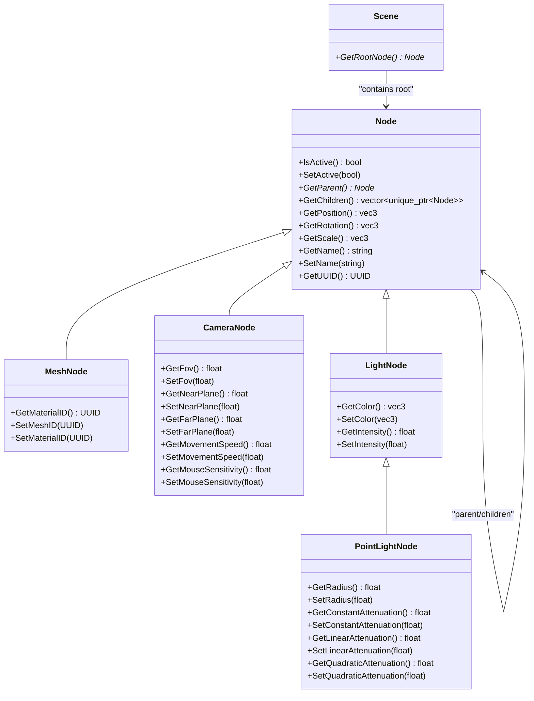
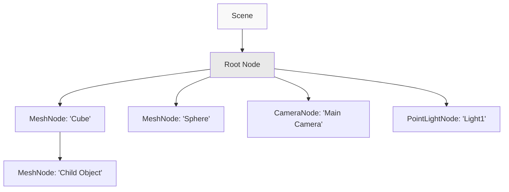
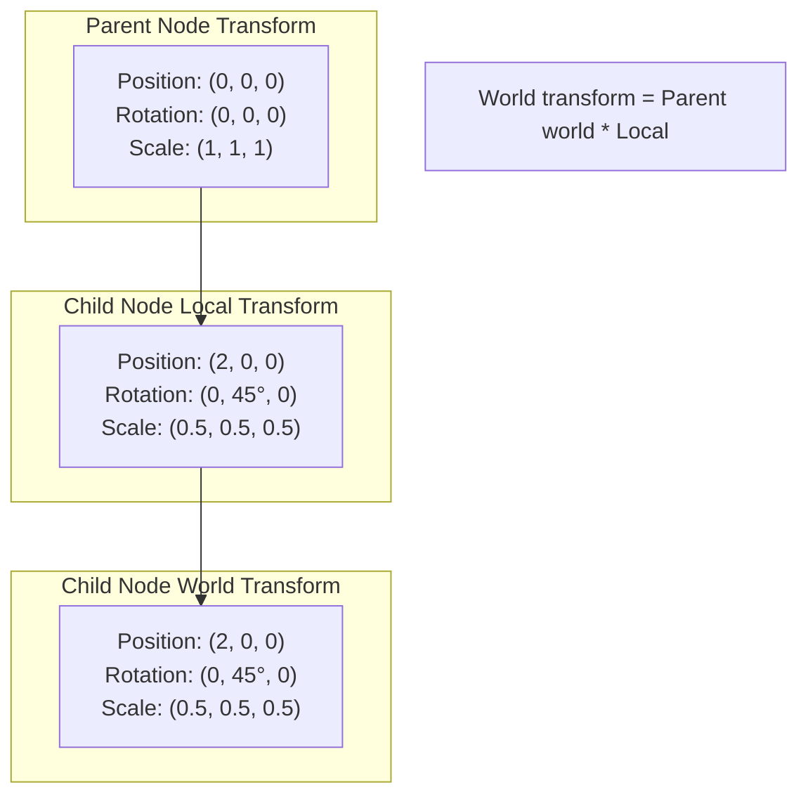
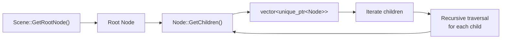
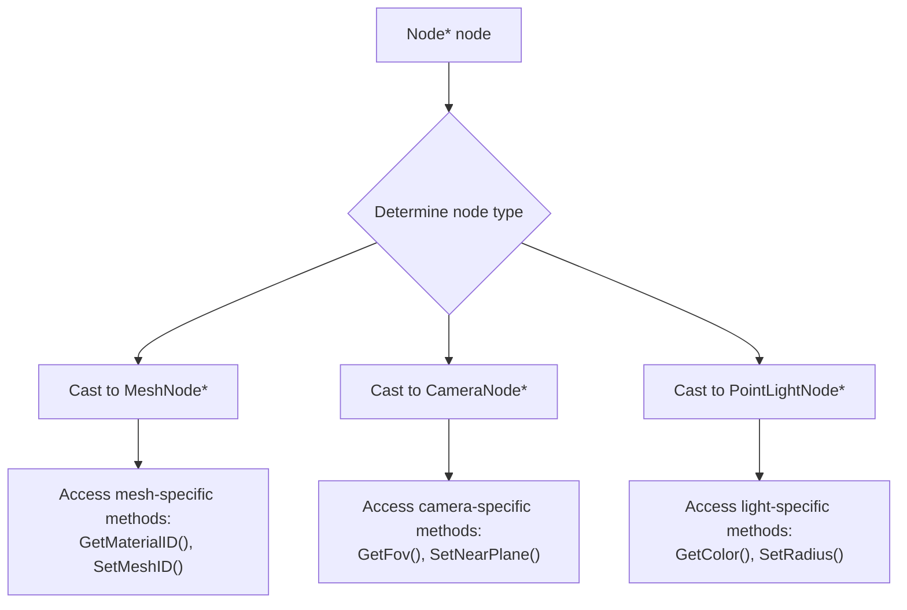
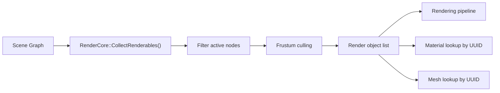

# Scene Graph Architecture

<details>
<summary>Relevant source files</summary>

The following files were used as context for generating this wiki page:

- [.cache/clangd/index/neuGUI.cpp.597919E745DAD113.idx](.cache/clangd/index/neuGUI.cpp.597919E745DAD113.idx)
- [build/CMakeFiles/NeuGUILib.dir/source/neuGUI.cpp.obj](build/CMakeFiles/NeuGUILib.dir/source/neuGUI.cpp.obj)
- [build/libNeuGUILib.a](build/libNeuGUILib.a)

</details>


This page documents the scene graph architecture used in NeuVulkanRender, including the hierarchical node system, transform management, and polymorphic node types. The scene graph provides the structural foundation for organizing and manipulating 3D content in the engine.

For information about asset management and UUID-based references, see [Asset Management and UUID System](#5.2). For details about how the editor interacts with the scene graph, see [Scene Hierarchy and Node System](#4.3).

## Overview

The scene graph implements a hierarchical tree structure where each scene contains a root node that can have multiple children. All renderable objects, cameras, and lights exist as specialized node types within this hierarchy. The system supports:

- **Hierarchical organization**: Parent-child relationships with transform propagation
- **Polymorphic node types**: Specialized node classes inheriting from a common base
- **Transform system**: Position, rotation, and scale with local and world-space representations
- **Active state management**: Nodes can be enabled/disabled without removal from the hierarchy
- **Type-safe node operations**: Each node type exposes its own specialized interface

## Core Architecture

### Scene and Node Hierarchy



**Sources**: Based on symbols from `build/libNeuGUILib.a` including `_ZNK9neurender5Scene11GetRootNodeEv`, `_ZNK9neurender4Node8IsActiveEv`, `_ZN9neurender4Node9SetActiveEb`, etc.

### Runtime Scene Graph Structure

The scene graph at runtime forms a tree structure starting from a single root node:



Each node in the hierarchy:
- Has exactly one parent (except the root node)
- Can have zero or more children
- Inherits transforms from its parent
- Maintains its own local transform
- Can be independently activated/deactivated

**Sources**: Diagram based on scene structure described in high-level architecture document.

## Transform System

### Transform Representation

Each `Node` maintains transform data through three components:

| Component | Type | Description |
|-----------|------|-------------|
| Position | `glm::vec3` | Local position relative to parent |
| Rotation | `glm::vec3` | Euler angles (yaw, pitch, roll) |
| Scale | `glm::vec3` | Scale factors on each axis |

The transform system provides read-only access through getter methods:
- `GetPosition()`: Returns local position vector
- `GetRotation()`: Returns rotation as Euler angles
- `GetScale()`: Returns scale factors

**Sources**: Methods `_ZNK9neurender4Node11GetPositionEv`, `_ZNK9neurender4Node11GetRotationEv`, `_ZNK9neurender4Node8GetScaleEv` from `build/libNeuGUILib.a`.

### Transform Hierarchy and Propagation



Transform propagation occurs hierarchically:
- Each node stores its local transform relative to its parent
- World-space transforms are computed by concatenating parent transforms
- Modifying a parent's transform affects all descendants
- The root node's local transform is equivalent to its world transform

**Sources**: Transform system design inferred from node hierarchy structure and GLM usage (`_ZN3glm3vecILi3EfLNS_9qualifierE0EEC1Ef` symbols).

## Node Types

### Base Node Class

The `Node` class serves as the abstract base for all scene graph entities. It provides:

**Core Properties**:
- **UUID**: Unique identifier for stable references (see [Asset Management and UUID System](#5.2))
- **Name**: Human-readable string identifier
- **Active State**: Boolean flag controlling whether the node participates in rendering and updates
- **Hierarchy**: Parent pointer and children collection

**Key Methods**:

| Method | Purpose |
|--------|---------|
| `IsActive()` | Returns whether the node is active |
| `SetActive(bool)` | Enables or disables the node |
| `GetParent()` | Returns pointer to parent node |
| `GetChildren()` | Returns vector of child nodes |
| `GetName()` | Returns node name string |
| `SetName(string)` | Updates node name |

**Sources**: Symbols `_ZNK9neurender4Node8IsActiveEv`, `_ZN9neurender4Node9SetActiveEb`, `_ZNK9neurender4Node9GetParentEv`, `_ZNK9neurender4Node11GetChildrenEv`, `_ZNK9neurender6Object7GetNameB5cxx11Ev`, `_ZN9neurender6Object7SetNameERKNSt7__cxx1112basic_stringIcSt11char_traitsIcESaIcEEE` from `build/libNeuGUILib.a`.

### MeshNode

`MeshNode` represents a renderable 3D object with geometry and material.

**Properties**:
- **Mesh UUID**: Reference to mesh resource containing vertex/index data
- **Material UUID**: Reference to material resource defining appearance

**Key Methods**:

```cpp
// Defined in neurender::MeshNode
UUID GetMaterialID();
void SetMeshID(const UUID&);
void SetMaterialID(const UUID&);
```

The `MeshNode` uses UUID references to decouple the scene graph from actual resource data. This allows:
- Multiple nodes to reference the same mesh/material (instancing)
- Lazy loading of resources
- Hot-swapping of materials without changing scene structure

**Sources**: Symbols `_ZNK9neurender8MeshNode13GetMaterialIDEv`, `_ZN9neurender8MeshNode9SetMeshIDERKNS_4UUIDE`, `_ZN9neurender8MeshNode13SetMaterialIDERKNS_4UUIDE` from `build/libNeuGUILib.a`.

### CameraNode

`CameraNode` defines a viewpoint for rendering the scene.

**Projection Parameters**:

| Parameter | Method | Default | Description |
|-----------|--------|---------|-------------|
| FOV | `GetFov()` / `SetFov(float)` | - | Vertical field of view in degrees |
| Near Plane | `GetNearPlane()` / `SetNearPlane(float)` | - | Near clipping plane distance |
| Far Plane | `GetFarPlane()` / `SetFarPlane(float)` | - | Far clipping plane distance |

**Camera Control Parameters**:

| Parameter | Method | Description |
|-----------|--------|-------------|
| Movement Speed | `GetMovementSpeed()` / `SetMovementSpeed(float)` | Speed of camera translation |
| Mouse Sensitivity | `GetMouseSensitivity()` / `SetMouseSensitivity(float)` | Mouse look rotation speed |

The camera's position and orientation are inherited from the base `Node` transform system. The camera views down its local negative Z-axis.

**Sources**: Symbols `_ZNK9neurender10CameraNode6GetFovEv`, `_ZN9neurender10CameraNode6SetFovEf`, `_ZNK9neurender10CameraNode12GetNearPlaneEv`, `_ZN9neurender10CameraNode12SetNearPlaneEf`, `_ZNK9neurender10CameraNode11GetFarPlaneEv`, `_ZN9neurender10CameraNode11SetFarPlaneEf`, `_ZNK9neurender10CameraNode16GetMovementSpeedEv`, `_ZN9neurender10CameraNode16SetMovementSpeedEf`, `_ZNK9neurender10CameraNode19GetMouseSensitivityEv`, `_ZN9neurender10CameraNode19SetMouseSensitivityEf` from `build/libNeuGUILib.a`.

### LightNode and PointLightNode

`LightNode` is the base class for all light sources in the scene. `PointLightNode` extends it with point-specific attenuation.

**LightNode (Base)**:

| Property | Methods | Description |
|----------|---------|-------------|
| Color | `GetColor()` / `SetColor(vec3)` | RGB light color |
| Intensity | `GetIntensity()` / `SetIntensity(float)` | Light brightness multiplier |

**PointLightNode (Derived)**:

Point lights emit light uniformly in all directions with distance-based attenuation.

| Property | Methods | Description |
|----------|---------|-------------|
| Radius | `GetRadius()` / `SetRadius(float)` | Maximum effective range |
| Constant Attenuation | `GetConstantAttenuation()` / `SetConstantAttenuation(float)` | Constant term in attenuation formula |
| Linear Attenuation | `GetLinearAttenuation()` / `SetLinearAttenuation(float)` | Linear term in attenuation formula |
| Quadratic Attenuation | `GetQuadraticAttenuation()` / `SetQuadraticAttenuation(float)` | Quadratic term in attenuation formula |

**Attenuation Formula**:

```
attenuation = 1.0 / (constant + linear * distance + quadratic * distance²)
```

The light's world position is determined by the node's transform in the scene hierarchy.

**Sources**: Symbols `_ZNK9neurender9LightNode8GetColorEv`, `_ZNK9neurender9LightNode12GetIntensityEv`, `_ZN9neurender9LightNode8SetColorERKN3glm3vecILi3EfLNS1_9qualifierE0EEE`, `_ZN9neurender9LightNode12SetIntensityEf`, `_ZNK9neurender14PointLightNode9GetRadiusEv`, `_ZNK9neurender14PointLightNode22GetConstantAttenuationEv`, `_ZNK9neurender14PointLightNode20GetLinearAttenuationEv`, `_ZNK9neurender14PointLightNode23GetQuadraticAttenuationEv`, `_ZN9neurender14PointLightNode9SetRadiusEf`, `_ZN9neurender14PointLightNode22SetConstantAttenuationEf`, `_ZN9neurender14PointLightNode20SetLinearAttenuationEf`, `_ZN9neurender14PointLightNode23SetQuadraticAttenuationEf` from `build/libNeuGUILib.a`.

## Scene Graph Traversal and Operations

### Node Collection and Iteration



Traversing the scene graph follows a depth-first pattern:

1. Start with `Scene::GetRootNode()` to obtain the root
2. Call `Node::GetChildren()` to get child collection
3. Iterate through children (stored as `vector<unique_ptr<Node>>`)
4. Recursively process each child's subtree

**Active State Filtering**:

During traversal, the `IsActive()` method determines whether a node should be processed:
- Inactive nodes are skipped during rendering
- Inactive nodes' children may still be active (no automatic propagation)
- Editor operations can toggle active state without modifying the hierarchy

**Sources**: Traversal pattern inferred from `_ZNKSt6vectorISt10unique_ptrIN9neurender4NodeESt14default_deleteIS2_EESaIS5_EE5beginEv`, `_ZNKSt6vectorISt10unique_ptrIN9neurender4NodeESt14default_deleteIS2_EESaIS5_EE3endEv` and iteration symbols from `build/libNeuGUILib.a`.

### Type Identification and Casting

The scene graph uses C++ polymorphism with dynamic typing. To work with specialized node types:



The editor uses type-safe casting to access specialized node interfaces. Type checking occurs before accessing derived class methods.

**Sources**: Type system inferred from class hierarchy symbols including `_ZNSt10unique_ptrIN9neurender8MeshNodeESt14default_deleteIS1_EED1Ev`, `_ZNSt10unique_ptrIN9neurender10CameraNodeESt14default_deleteIS1_EED1Ev`, `_ZNSt10unique_ptrIN9neurender14PointLightNodeESt14default_deleteIS1_EED1Ev` from `build/libNeuGUILib.a`.

## Integration with Other Systems

### Scene Graph and Rendering



The rendering system traverses the scene graph to build a list of renderable objects:

1. **Collection**: `RenderCore` walks the scene graph starting from the root
2. **Active filtering**: Only nodes with `IsActive() == true` are considered
3. **Type filtering**: Only `MeshNode` instances contribute geometry
4. **Frustum culling**: Objects outside camera view are excluded
5. **Resource resolution**: UUIDs are resolved to actual mesh/material data

**Sources**: Integration described in high-level architecture diagrams referencing `RenderCore::CollectRenderables()` and scene traversal.

### Scene Graph and Editor

The editor provides interactive manipulation of the scene graph through panels (see [Scene Hierarchy and Node System](#4.3)):

- **Scene Hierarchy Panel**: Tree view of all nodes with drag-drop reparenting
- **Inspector Panel**: Property editing for selected node
- **Node creation**: Factory methods create specialized node types
- **Node deletion**: Removes nodes from hierarchy

All editor operations maintain scene graph invariants:
- Root node cannot be deleted
- Reparenting validates no cycles are created
- UUID references remain valid across operations

**Sources**: Editor integration described in symbols like `_ZN9neurender9EditorGUI15GetSelectedNodeEv`, `_ZN9neurender9EditorGUI18DeleteSelectedNodeEv` from `build/libNeuGUILib.a`.

---
