# Asset Management and UUID System

<details>
<summary>Relevant source files</summary>

The following files were used as context for generating this wiki page:

- [.cache/clangd/index/neuGUI.cpp.597919E745DAD113.idx](.cache/clangd/index/neuGUI.cpp.597919E745DAD113.idx)
- [build/CMakeFiles/NeuGUILib.dir/source/neuGUI.cpp.obj](build/CMakeFiles/NeuGUILib.dir/source/neuGUI.cpp.obj)
- [build/libNeuGUILib.a](build/libNeuGUILib.a)
- [source/RenderCore.cpp](source/RenderCore.cpp)

</details>


## Purpose and Scope

This document describes the asset management system in NeuVulkanRender, which uses UUIDs (Universally Unique Identifiers) to provide stable references to rendering resources. The system manages meshes, textures, and materials through a cache-based architecture with lazy loading and fallback resources.

For information about the scene graph structure that uses these assets, see [Scene Graph Architecture](#5.1). For details on resource loading from files, see the Asset Loading sections in the Asset Library documentation.

## UUID System

The `UUID` class provides stable, globally unique 64-bit identifiers for all assets in the rendering engine. UUIDs serve as persistent references that remain valid across asset moves, renames, and project sessions.

### Core Functionality

| Operation | Method/Operator | Purpose |
|-----------|----------------|---------|
| Validation | `IsValid()` | Check if UUID is non-zero (valid) |
| Invalid constant | `Invalid()` | Static method returning null UUID |
| Equality | `operator==` | Compare UUIDs for identity |
| Conversion | `operator uint64_t()` | Get raw uint64_t value for hashing |

**Key Properties**:
- 64-bit unsigned integer representation
- Used as keys in `std::unordered_map` caches for O(1) lookup
- Serialized to/from JSON as hexadecimal strings
- Enables stable references across asset lifecycle changes

**Sources**: [build/libNeuGUILib.a:1-2]() (mangled symbols: `_ZNK9neurender4UUIDcvyEv`, `_ZNK9neurender4UUIDeqERKS0_`, `_ZNK9neurender4UUID7IsValidEv`, `_ZN9neurender4UUID7InvalidEv`)

### UUID Usage Pattern

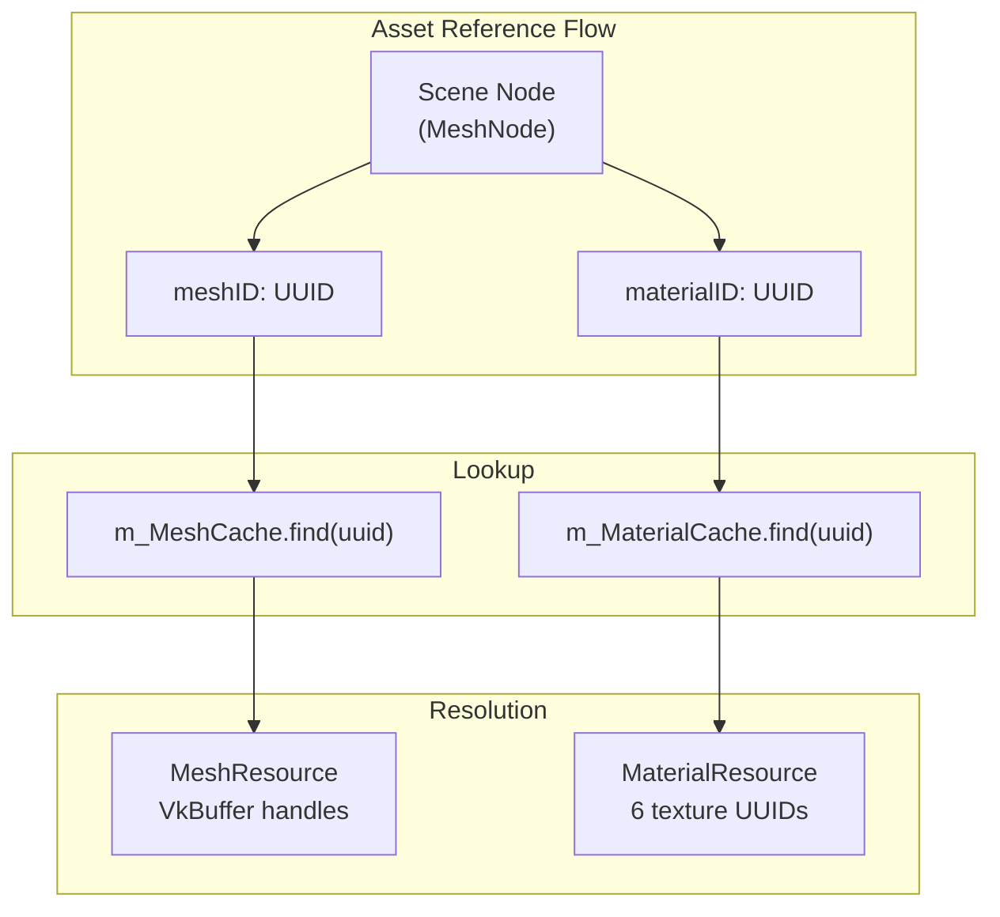

UUIDs are used throughout the codebase for indirection:

1. **Storage**: Nodes store UUIDs instead of raw pointers to resources
2. **Lookup**: UUIDs are keys in cache hash maps
3. **Serialization**: UUIDs saved to JSON for scene persistence
4. **Stability**: Assets can be reloaded/moved without invalidating references

**Sources**: [source/RenderCore.cpp:30](), [source/RenderCore.cpp:217-218]()

## Resource Types

### MeshResource

Stores vertex and index buffer data for geometry rendered on the GPU.

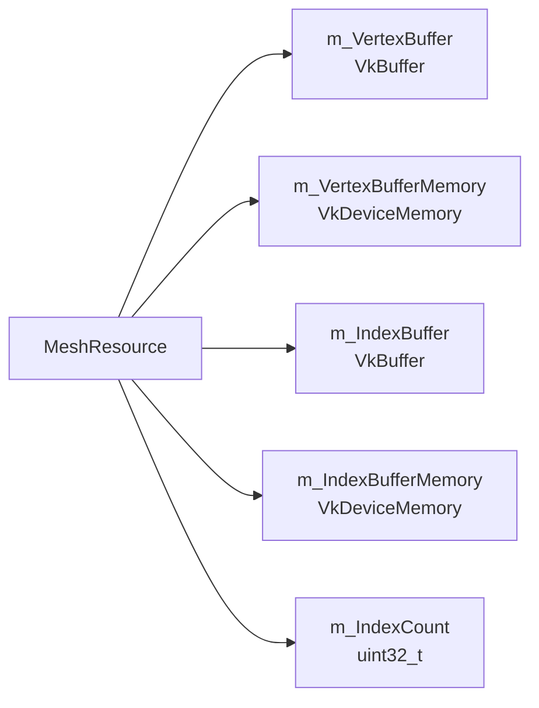

**Key Members**:
- `VkBuffer m_VertexBuffer` - Vulkan vertex buffer handle
- `VkDeviceMemory m_VertexBufferMemory` - GPU memory allocation for vertices
- `VkBuffer m_IndexBuffer` - Vulkan index buffer handle
- `VkDeviceMemory m_IndexBufferMemory` - GPU memory allocation for indices
- `uint32_t m_IndexCount` - Number of indices for draw calls

**Storage**: `RenderCore::m_MeshCache` of type `std::unordered_map<UUID, MeshResource>`

**Vertex Format**: Assumed to include position, normal, tangent, UV coordinates, and color (exact structure not shown in provided code)

**Sources**: [source/RenderCore.cpp:30](), [source/RenderCore.cpp:102-106]()

### TextureResource

Stores GPU texture data including image, memory, view, and sampler objects.

**Key Members**:
- `VkImage` - Vulkan image handle (GPU texture storage)
- `VkDeviceMemory` - Device memory allocation
- `VkImageView` - Image view for shader access
- `VkSampler` - Sampler configuration (filtering, wrapping)
- `uint32_t width, height` - Texture dimensions

**Storage**: `RenderCore::m_TextureCache` of type `std::unordered_map<UUID, TextureResource>`

**Default Fallback Textures**:

| Default | Name | Purpose | Value |
|---------|------|---------|-------|
| White | `m_DefaultWhiteTexture` | Albedo, Metallic fallback | (1,1,1,1) |
| Normal | `m_DefaultNormalTexture` | Normal map fallback | (0.5,0.5,1,1) |
| Black | `m_DefaultBlackTexture` | AO, Emissive fallback | (0,0,0,1) |

All defaults are 1×1 pixel textures created during initialization.

**Sources**: [source/RenderCore.cpp:217](), [source/RenderCore.cpp:219-221](), [source/RenderCore.cpp:304]()

### MaterialResource

PBR (Physically Based Rendering) material properties with references to up to 6 textures.

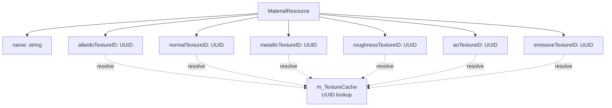

**Texture Slots**:

| Slot | Shader Binding | Default Fallback |
|------|---------------|------------------|
| 0 | Albedo (Base Color) | `m_DefaultWhiteTexture` |
| 1 | Normal Map | `m_DefaultNormalTexture` |
| 2 | Metallic | `m_DefaultWhiteTexture` |
| 3 | Roughness | `m_DefaultWhiteTexture` |
| 4 | Ambient Occlusion | `m_DefaultBlackTexture` |
| 5 | Emissive | `m_DefaultBlackTexture` |

**Key Methods**:
- `GetName()` / `SetName(const std::string&)` - Material naming for editor display
- Each texture slot stores a UUID reference to a texture

**Storage**: `RenderCore::m_MaterialCache` of type `std::unordered_map<UUID, MaterialResource>`

**Default Fallback**: `m_DefaultMaterial` used when material UUID not found

**Sources**: [source/RenderCore.cpp:218](), [source/RenderCore.cpp:222-224](), [source/RenderCore.cpp:305](), [build/libNeuGUILib.a]() (symbols: `_ZNK9neurender16MaterialResource7GetNameB5cxx11Ev`, `_ZN9neurender16MaterialResource7SetNameERKNSt7__cxx1112basic_stringIcSt11char_traitsIcESaIcEEE`)

### CubeMapResource

Stores cubemap data for skybox rendering and Image-Based Lighting (IBL).

**Key Properties**:
- 6 face images (right, left, top, bottom, front, back)
- Prefiltered mipmap chain for specular IBL
- Irradiance map for diffuse IBL
- Associated samplers and image views

**Storage**: `RenderCore::m_SkyboxCubeMap` - Single active skybox pointer

**Initialization Flow**:
1. Load 6 HDR face images via `LoadFromFiles()`
2. Generate prefiltered environment map via `GeneratePrefilteredMap()`
3. Create descriptor sets binding cubemap to shaders

**Default Paths**: `resource/DefaultHDRI/{right,left,top,bottom,front,back}.hdr`

**Sources**: [source/RenderCore.cpp:31-32](), [source/RenderCore.cpp:308-323]()

## Asset Cache Architecture

### Cache Implementation

All asset caches use `std::unordered_map<UUID, ResourceType>` for constant-time lookups:

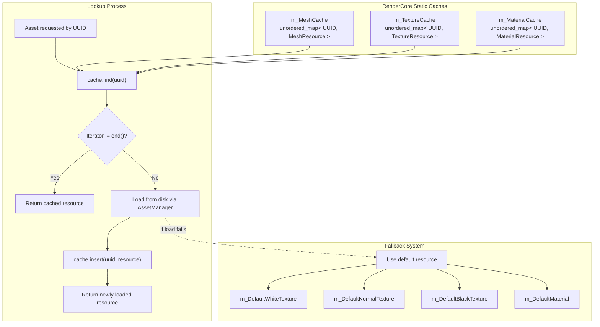

**Hash Map Characteristics**:
- O(1) average-case lookup performance
- UUID's `operator uint64_t()` provides hash value
- No collision handling visible in provided code (std::hash used)

**Sources**: [source/RenderCore.cpp:30](), [source/RenderCore.cpp:217-218]()

### Cache Lifetime Management

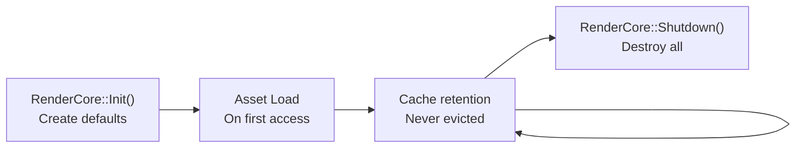

**Lifecycle**:
1. **Initialization**: Default resources created
2. **Lazy Loading**: Assets loaded on first access, inserted into cache
3. **Persistence**: Resources remain in cache indefinitely
4. **Shutdown**: All resources destroyed, caches cleared

**Memory Management**:
- No reference counting or automatic eviction
- All loaded assets persist until shutdown
- Suitable for small-to-medium asset sets
- Large projects may require streaming extensions

**GPU Resource Destruction Order** (during shutdown):
1. `vkDeviceWaitIdle()` - Wait for GPU to finish
2. Descriptor sets freed (via descriptor pool destruction)
3. Samplers: `vkDestroySampler()`
4. Image views: `vkDestroyImageView()`
5. Images: `vkDestroyImage()`
6. Buffers: `vkDestroyBuffer()`
7. Memory: `vkFreeMemory()`

**Sources**: [source/RenderCore.cpp:290-391](), [source/RenderCore.cpp:393-595]()

### Lazy Loading Strategy

Assets are loaded on-demand rather than upfront:

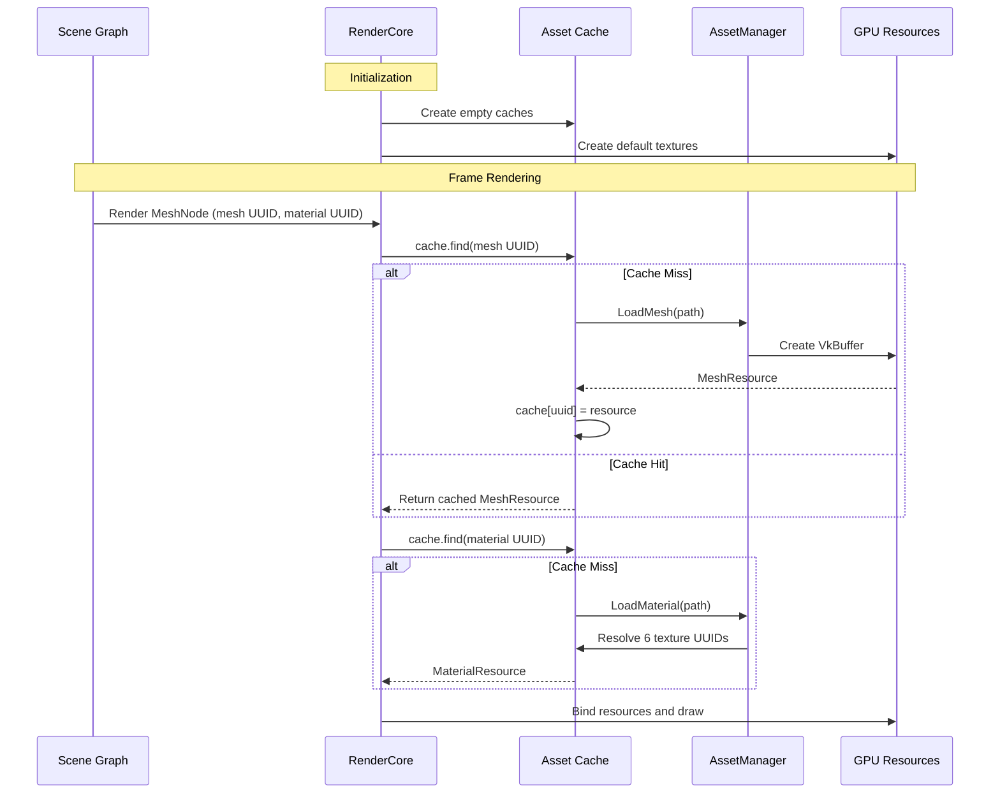

**Benefits**:
- Reduced startup time (only defaults loaded initially)
- Lower memory usage (only accessed assets consume VRAM)
- Simplified scene serialization (just UUIDs)
- Enables streaming workflows for large asset libraries

**Drawback**: First access causes frame stall during disk I/O

**Sources**: Inferred from cache architecture [source/RenderCore.cpp:30](), [source/RenderCore.cpp:217-218](), [source/RenderCore.cpp:304-305]()

## Scene Graph Integration

### MeshNode Asset References

`MeshNode` stores UUID references to mesh and material assets without owning them directly:

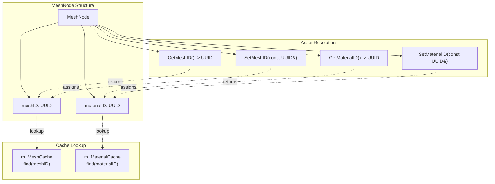

**Key Methods**:
- `SetMeshID(const UUID&)` - Assign mesh by UUID reference
- `GetMaterialID()` - Get assigned material UUID
- `SetMaterialID(const UUID&)` - Assign material by UUID reference

**Benefits of UUID References**:
- **Stable References**: UUIDs remain valid across asset reload, moves, renames
- **Serialization**: Save/load scenes as JSON with UUID strings
- **Asset Sharing**: Multiple nodes reference same mesh/material via UUID
- **Decoupling**: Scene graph independent of asset loading implementation

**Sources**: [build/libNeuGUILib.a]() (symbols: `_ZNK9neurender8MeshNode13GetMaterialIDEv`, `_ZN9neurender8MeshNode9SetMeshIDERKNS_4UUIDE`, `_ZN9neurender8MeshNode13SetMaterialIDERKNS_4UUIDE`)

### Material to Texture Resolution

Materials create a two-level indirection for texture access:

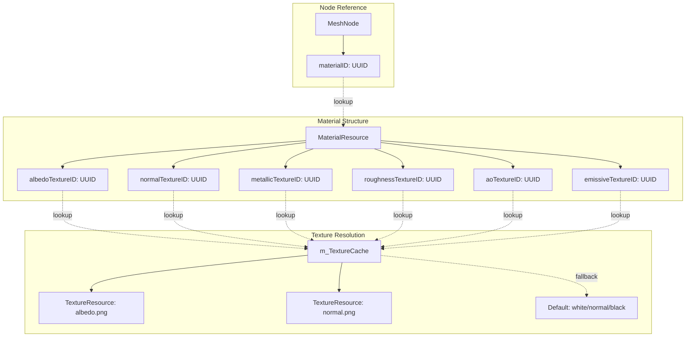

**Two-Level Indirection**:
1. **Level 1**: MeshNode → Material UUID → MaterialResource
2. **Level 2**: MaterialResource → Texture UUIDs (×6) → TextureResource

**Advantages**:
- **Material Reuse**: Multiple meshes share same material instance
- **Texture Sharing**: Multiple materials can reference same texture
- **Partial Materials**: Missing textures automatically fall back to defaults
- **Dynamic Updates**: Swap textures without modifying material structure

**Sources**: [source/RenderCore.cpp:218](), [source/RenderCore.cpp:223-224]()

## Default Resources

### Default Texture Creation

Three default textures provide fallbacks for missing texture assets:

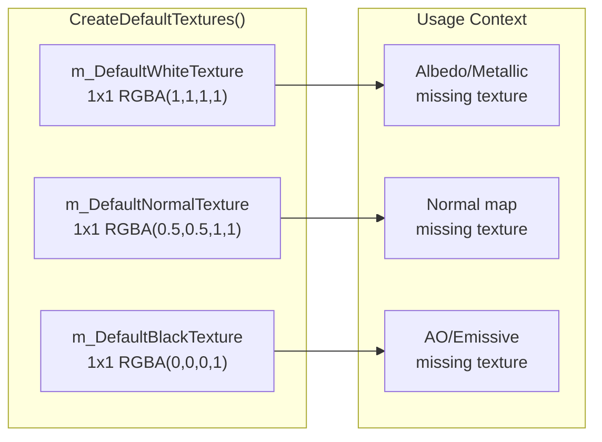

**Texture Properties**:
- **Size**: 1×1 pixel (minimal VRAM footprint)
- **Format**: RGBA8 (4 bytes per texture)
- **Lifetime**: Created during `Init()`, destroyed during `Shutdown()`
- **Normal Map Value**: (0.5, 0.5, 1.0) maps to tangent-space up vector (0, 0, 1) after remapping

**Visual Result**: When applied to geometry, produces neutral appearance suitable for debugging.

**Sources**: [source/RenderCore.cpp:304](), [source/RenderCore.cpp:219-221]()

### Default Material

The default material provides a complete fallback when material UUID lookup fails:

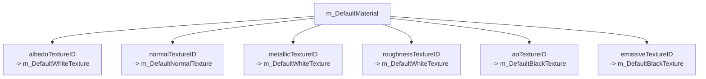

**Rendered Appearance**:
- White base color (albedo = 1.0)
- Flat surface (normal = up vector)
- Fully metallic (metallic = 1.0)
- Smooth surface (roughness = 1.0 interpreted as smooth)
- No ambient occlusion (ao = 0.0)
- No emission (emissive = 0.0)

**Result**: Shiny white material useful for identifying missing material assignments.

**Sources**: [source/RenderCore.cpp:305](), [source/RenderCore.cpp:222]()

## Descriptor Set Management

### Material Descriptor Set Layout

Materials bind their 6 textures to descriptor set bindings for shader access:

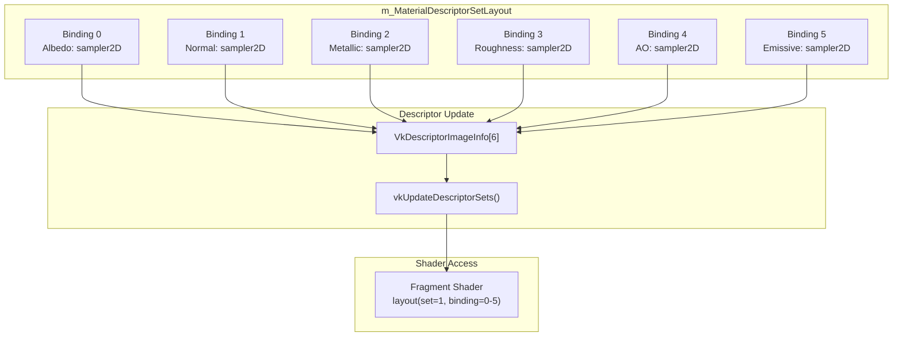

**Geometry Pass Descriptor Organization**:
- **Set 0**: Per-object data (MVP matrices, model transform)
- **Set 1**: Per-material data (6 texture samplers)

**Binding Strategy Benefits**:
- Efficient material switching: rebind Set 1 only, Set 0 remains bound
- Batching: render all meshes with same material without rebinding
- Clear separation between transform and appearance data

**Sources**: [source/RenderCore.cpp:73-74](), [source/RenderCore.cpp:223-224]()

### Descriptor Update Process

When rendering a MeshNode, the following resolution occurs:

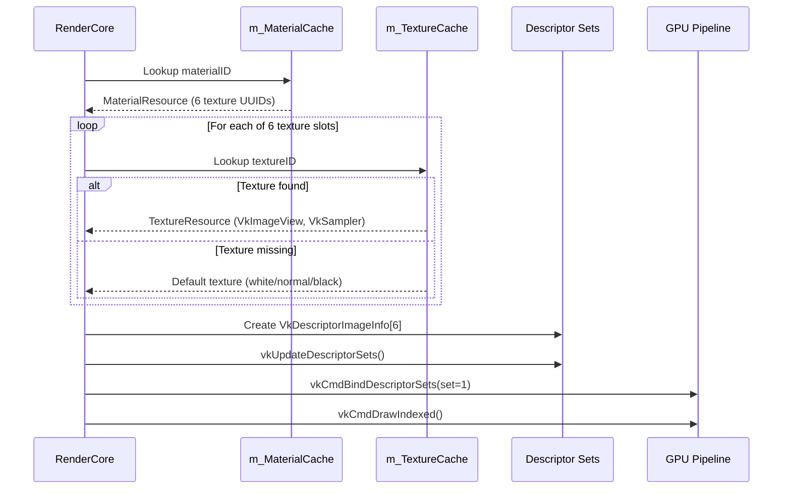

**Steps**:
1. Resolve material UUID → MaterialResource
2. For each of 6 texture slots, resolve UUID → TextureResource
3. Use default texture if UUID lookup fails
4. Populate `VkDescriptorImageInfo` array with resolved image views and samplers
5. Update descriptor set via `vkUpdateDescriptorSets()`
6. Bind descriptor set before draw call

**Optimization Note**: Descriptor sets could be cached per-material to avoid redundant updates (implementation not visible in provided code).

**Sources**: Inferred from descriptor layout [source/RenderCore.cpp:223-224]()

## Serialization and Persistence

### Scene Serialization Format

Scenes serialize to JSON with UUID references stored as strings:

```json
{
  "nodes": [
    {
      "uuid": "0x1234567890ABCDEF",
      "name": "Character",
      "type": "MeshNode",
      "transform": {
        "position": [0, 0, 0],
        "rotation": [0, 0, 0],
        "scale": [1, 1, 1]
      },
      "meshID": "0xFEDCBA9876543210",
      "materialID": "0xABCDEF1234567890"
    }
  ]
}
```

**Key Points**:
- UUIDs serialized as hexadecimal strings (`uint64_t → "0x..."`)
- Asset file paths NOT embedded (looked up via project asset database)
- References remain stable across asset file moves/renames
- Human-readable for debugging and version control

**Sources**: Inferred from UUID usage and JSON library inclusion [source/RenderCore.cpp:23]()

### Material Serialization Format

Materials serialize with texture UUID references:

```json
{
  "name": "WoodFloor",
  "albedoTexture": "0xAABBCCDD11223344",
  "normalTexture": "0x11223344AABBCCDD",
  "metallicTexture": "0x0000000000000000",
  "roughnessTexture": "0x0000000000000000",
  "aoTexture": "0x5566778899AABBCC",
  "emissiveTexture": "0x0000000000000000"
}
```

**UUID Interpretation**:
- `0x0000000000000000` or `UUID::Invalid()` → Use default texture
- Missing texture fields → Use defaults
- UUID → File path resolution via project asset database

**Sources**: Inferred from MaterialResource structure and JSON usage

## Asset Manager Integration

The `AssetManager` handles loading assets from disk and creating GPU resources:

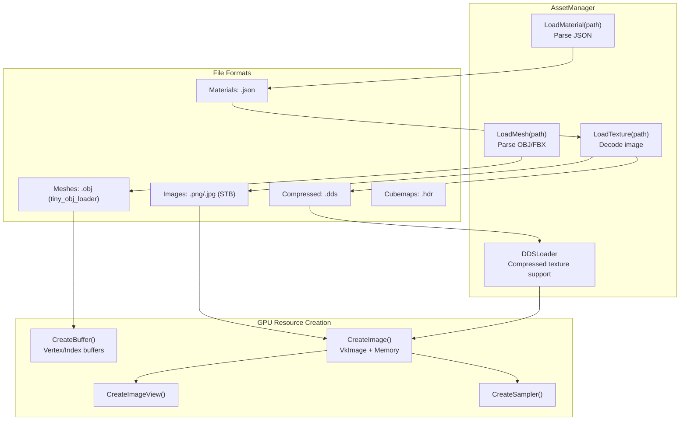

**Supported Formats**:
- **Meshes**: OBJ (via `tiny_obj_loader` library)
- **Textures**: PNG/JPG (via STB library), DDS (custom loader)
- **Materials**: JSON with texture path/UUID references
- **Cubemaps**: HDR format for skybox faces

**Loading Pipeline**:
1. UUID → File path mapping (via project asset database)
2. File reading from disk
3. Format-specific parsing (OBJ, PNG, JSON)
4. Vulkan resource creation (buffers, images, views, samplers)
5. GPU memory upload
6. Cache insertion with UUID key

**Sources**: [source/RenderCore.cpp:2-3]() (AssetManager, DDSLoader includes), [source/RenderCore.cpp:11]() (tiny_obj_loader include)

## Performance Characteristics

### Cache Lookup Performance

| Operation | Complexity | Notes |
|-----------|-----------|-------|
| UUID lookup | O(1) average | `unordered_map::find()` |
| Cache miss (first load) | O(disk I/O) | File read + GPU upload |
| Cache hit (subsequent) | O(1) | Return cached reference |
| Material resolve | O(1) + 6×O(1) | Material + 6 texture lookups |
| Default fallback | O(1) | Pre-created resources |

**Performance Bottlenecks**:
- **Initial Load**: Disk I/O and GPU upload stalls frame rendering
- **Descriptor Updates**: CPU overhead creating descriptor writes per-material
- **No Async Loading**: Main thread blocks on asset loads

**Sources**: Inferred from cache implementation [source/RenderCore.cpp:30](), [source/RenderCore.cpp:217-218]()

### Memory Footprint Estimates

**Texture Memory**:
- 2K texture (2048×2048 RGBA8 + mipmaps): ~16 MB VRAM
- 4K texture (4096×4096 RGBA8 + mipmaps): ~64 MB VRAM
- Default textures (1×1 each): ~12 bytes VRAM

**Mesh Memory**:
- Vertex data: ~48 bytes/vertex (position, normal, tangent, UV, color)
- Index data: 4 bytes/index (uint32_t)
- 100K triangle mesh: ~14.4 MB VRAM (vertex + index buffers)

**Material Memory**:
- CPU-side metadata: ~hundreds of bytes per material
- Textures stored separately in texture cache
- No GPU memory for material itself (only references)

**Aggregate**:
- Small project (50 textures, 20 meshes): ~1-2 GB VRAM
- Large project (500 textures, 200 meshes): ~10-20 GB VRAM
- No eviction policy: memory grows monotonically with loaded assets

**Sources**: Inferred from resource structures [source/RenderCore.cpp:102-106]()

## Project Integration

### Project Asset Database

Projects maintain UUID → file path mappings for asset resolution:

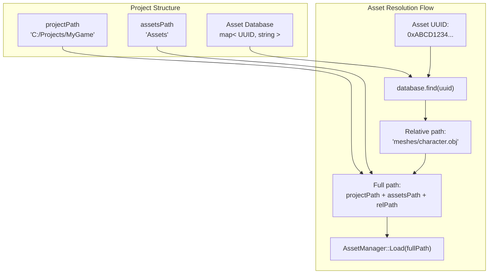

**Key Operations**:
- `GetProjectPath()` - Returns base project directory
- `GetAssetsPath()` - Returns assets subdirectory (typically `"Assets"`)
- UUID → Path lookup (implementation details not in provided code)
- Path → UUID registration during asset import

**Sources**: [build/libNeuGUILib.a]() (symbol: `_ZNK9neurender7Project14GetProjectPathB5cxx11Ev`, `_ZNK9neurender7Project13GetAssetsPathB5cxx11Ev`)

### Asset Import Workflow

When importing new assets into a project:

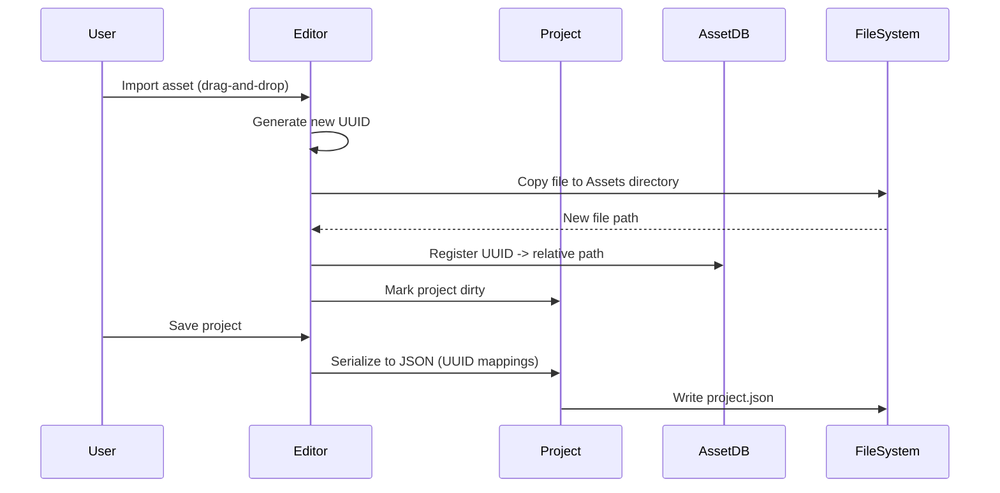

**Import Steps**:
1. Generate fresh UUID for new asset
2. Copy/move file to project assets directory
3. Register UUID → relative path mapping
4. Persist mapping to project JSON file
5. Update content browser display

**Sources**: Inferred from project system architecture

## Limitations and Future Enhancements

### Current Limitations

1. **No Streaming**: Assets loaded permanently into cache (unbounded memory growth)
2. **No Async Loading**: Frame stalls on disk I/O during cache miss
3. **No Reference Counting**: Cannot detect and free unused assets
4. **No Hot Reload**: Modifying asset files on disk requires engine restart
5. **No Texture Compression**: Textures stored uncompressed in VRAM (except DDS)
6. **Static Lifetime**: All resources persist until shutdown

### Potential Improvements

**Asset Streaming System**:
- Implement LRU (Least Recently Used) cache eviction policy
- Memory budget enforcement with automatic unloading
- Distance-based LOD streaming for large worlds
- Async loading with placeholder/proxy resources

**Hot Reload Support**:
- File system watcher monitoring asset directory
- Reload changed assets and update cache in-place
- Notify descriptor sets to rebind updated resources
- Handle graceful degradation if reload fails

**Memory Optimization**:
- BC7/BC5 texture compression for reduced VRAM usage
- Mesh compression (quantization, delta encoding)
- Shared texture atlases for small textures
- Streaming texture mipmaps (load high-res on demand)

**Reference Management**:
- Track active references to each asset
- Free assets with zero references after N frames
- Smart pointer wrappers around UUIDs for automatic tracking

**Sources**: Analysis of current implementation limitations

---
