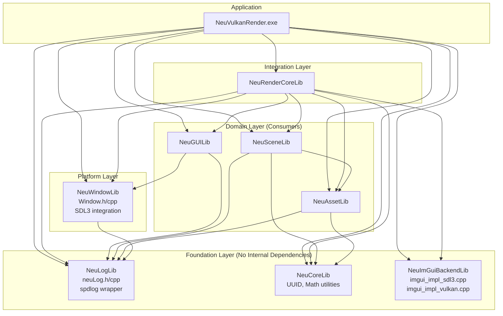
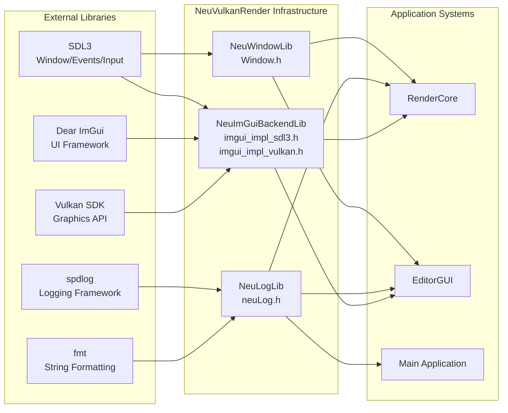

# Platform and Infrastructure Libraries

Relevant source files

The following files were used as context for generating this wiki page:

- [build/CMakeFiles/NeuGUILib.dir/progress.make](build/CMakeFiles/NeuGUILib.dir/progress.make)
- [build/CMakeFiles/NeuImGuiBackendLib.dir/compiler_depend.make](build/CMakeFiles/NeuImGuiBackendLib.dir/compiler_depend.make)
- [build/CMakeFiles/NeuImGuiBackendLib.dir/progress.make](build/CMakeFiles/NeuImGuiBackendLib.dir/progress.make)
- [build/CMakeFiles/NeuLogLib.dir/compiler_depend.make](build/CMakeFiles/NeuLogLib.dir/compiler_depend.make)
- [build/CMakeFiles/NeuLogLib.dir/progress.make](build/CMakeFiles/NeuLogLib.dir/progress.make)
- [build/CMakeFiles/NeuRenderCoreLib.dir/progress.make](build/CMakeFiles/NeuRenderCoreLib.dir/progress.make)
- [build/CMakeFiles/NeuVulkanRender.dir/progress.make](build/CMakeFiles/NeuVulkanRender.dir/progress.make)
- [build/CMakeFiles/NeuWindowLib.dir/compiler_depend.make](build/CMakeFiles/NeuWindowLib.dir/compiler_depend.make)
- [build/CMakeFiles/NeuWindowLib.dir/progress.make](build/CMakeFiles/NeuWindowLib.dir/progress.make)
- [build/CMakeFiles/progress.marks](build/CMakeFiles/progress.marks)

This section documents the foundational platform and infrastructure libraries that provide cross-cutting services to the entire NeuVulkanRender application. These libraries form the base layer of the system architecture, handling windowing, logging, ImGui backend integration, and core utilities. They have minimal internal dependencies and are consumed by all higher-level modules including the rendering engine, editor, and scene management systems.

The infrastructure libraries covered in this section include:
- **NeuWindowLib**: SDL3-based window management and event handling (see [6.1](#6.1))
- **NeuLogLib**: spdlog-based logging system (see [6.2](#6.2))
- **NeuImGuiBackendLib**: Custom ImGui backends for SDL3 and Vulkan integration (see [6.3](#6.3))
- **NeuCoreLib**: Core utilities including UUID generation, math helpers, and common types

For details on external library dependencies like SDL3, spdlog, and ImGui themselves, see [External Dependencies](#7).

## Library Architecture

The platform libraries are designed as independent, reusable modules with clear separation of concerns. They follow a layered dependency structure where foundation libraries (logging, core utilities) have no internal dependencies, while platform libraries (windowing, ImGui backend) may depend only on foundation libraries.

**Library Dependency Structure**

Sources: [build/CMakeFiles/NeuWindowLib.dir/compiler_depend.make:1-500](), [build/CMakeFiles/NeuLogLib.dir/compiler_depend.make:1-227](), [build/CMakeFiles/NeuImGuiBackendLib.dir/compiler_depend.make:1-350]()

## External Library Integration

The platform libraries act as thin wrappers around external third-party libraries, providing a consistent interface for the rest of the application while isolating external dependencies.

**External Library Integration Points**

Sources: [build/CMakeFiles/NeuWindowLib.dir/compiler_depend.make:451-496](), [build/CMakeFiles/NeuLogLib.dir/compiler_depend.make:202-227](), [build/CMakeFiles/NeuImGuiBackendLib.dir/compiler_depend.make:228-289]()

## Library Components

### NeuWindowLib

**Purpose**: Provides window creation, event handling, and input management through SDL3 integration.

**Key Files**:
- `include/Window.h` - Window class interface
- `source/Window.cpp` - SDL3 window management implementation
- `neuwindow_export.h` - DLL export macros for shared library

**Dependencies**:
- SDL3 (external): Window/event management
- NeuLogLib (internal): Logging window lifecycle events

The window library encapsulates all SDL3 windowing functionality, providing a clean C++ interface for window creation, event polling, and surface management for Vulkan rendering.

Sources: [build/CMakeFiles/NeuWindowLib.dir/compiler_depend.make:4-496]()

### NeuLogLib

**Purpose**: Provides application-wide logging functionality through spdlog integration.

**Key Files**:
- `include/neuLog.h` - Logging interface and macros
- `source/neuLog.cpp` - spdlog logger initialization and configuration
- `neulog_export.h` - DLL export macros for shared library

**Dependencies**:
- spdlog (external): High-performance logging framework
- fmt (external): String formatting (used by spdlog)

**External Headers Used**:
- `spdlog/spdlog.h` - Main spdlog header
- `spdlog/async.h` - Async logger support
- `spdlog/sinks/stdout_color_sinks.h` - Console output sinks
- `spdlog/sinks/wincolor_sink.h` - Windows-specific colored console
- `fmt/base.h`, `fmt/format.h` - Formatting library

The logging library is a lightweight wrapper that initializes spdlog loggers with appropriate sinks (console, file) and provides macros for easy logging throughout the codebase.

Sources: [build/CMakeFiles/NeuLogLib.dir/compiler_depend.make:4-227]()

### NeuImGuiBackendLib

**Purpose**: Provides custom ImGui rendering backends for SDL3 and Vulkan integration.

**Key Files**:
- `source/imgui_impl_sdl3.cpp` - ImGui SDL3 platform backend
- `source/imgui_impl_vulkan.cpp` - ImGui Vulkan rendering backend
- `imgui_impl_sdl3.h` - SDL3 backend interface (from vcpkg)
- `imgui_impl_vulkan.h` - Vulkan backend interface (from vcpkg)

**Dependencies**:
- SDL3 (external): Platform/input backend
- Vulkan (external): Graphics API backend
- Dear ImGui (external): UI framework

**External Headers Used**:
- `imgui.h`, `imconfig.h` - Core ImGui headers
- `SDL3/SDL.h` and related headers - SDL3 integration
- `vulkan/vulkan.h`, `vulkan/vulkan_core.h` - Vulkan integration

This library implements the two-part backend architecture required by ImGui: a platform backend (SDL3) that handles input/windowing, and a renderer backend (Vulkan) that handles GPU rendering. Together they enable ImGui to render UI elements using Vulkan on SDL3 windows.

Sources: [build/CMakeFiles/NeuImGuiBackendLib.dir/compiler_depend.make:4-349]()

### NeuCoreLib

**Purpose**: Provides core utility functionality used across the application.

**Components** (inferred from high-level documentation):
- UUID generation and management for asset identification
- Math utilities and helper functions
- Common type definitions and utilities

While NeuCoreLib doesn't appear in the provided compiler dependency files, it is referenced extensively in the high-level architecture diagrams as providing UUID and math utilities consumed by scene and asset management systems.

## Build System Integration

The infrastructure libraries are built as separate compilation units in the CMake build system, allowing for modular compilation and linking.

**Library Build Targets**

| Library | CMake Target | Build Progress IDs | Type |
|---------|--------------|-------------------|------|
| NeuLogLib | NeuLogLib.dir | 30-31 | Static Library |
| NeuWindowLib | NeuWindowLib.dir | 46-47 | Static Library |
| NeuImGuiBackendLib | NeuImGuiBackendLib.dir | 27-29 | Static Library |
| NeuGUILib | NeuGUILib.dir | 25-26 | Static Library |

Each library generates export headers (`neulog_export.h`, `neuwindow_export.h`) for proper symbol visibility when building as shared libraries, though the current build configuration appears to use static libraries.

Sources: [build/CMakeFiles/NeuLogLib.dir/progress.make:1-4](), [build/CMakeFiles/NeuWindowLib.dir/progress.make:1-4](), [build/CMakeFiles/NeuImGuiBackendLib.dir/progress.make:1-5](), [build/CMakeFiles/NeuGUILib.dir/progress.make:1-4]()

## Usage Patterns

**Logging Usage**

The logging library is used pervasively throughout the codebase by all major systems:
- RenderCore uses it for rendering pipeline diagnostics
- EditorGUI uses it for user action logging
- Window management uses it for lifecycle events
- Asset loading uses it for resource tracking

**Window Management Usage**

The window library is used primarily by:
- RenderCore for creating the Vulkan surface and swapchain
- EditorGUI for handling user input events
- Main application for window lifecycle management

**ImGui Backend Usage**

The ImGui backend libraries are used by:
- EditorGUI for rendering the entire editor interface
- RenderCore for integrating ImGui rendering into the Vulkan command buffer pipeline

## Cross-Platform Considerations

While the current build system targets Windows x86_64 with MinGW GCC, the infrastructure libraries use cross-platform dependencies (SDL3, spdlog) that support multiple platforms. The abstraction provided by these libraries allows for potential future cross-platform support without changes to higher-level systems.

**Platform-Specific Elements**:
- SDL3 handles platform differences in windowing
- spdlog uses platform-specific console sinks (`wincolor_sink.h` on Windows)
- ImGui backends abstract platform input and Vulkan rendering

Sources: [build/CMakeFiles/NeuWindowLib.dir/compiler_depend.make:1-500](), [build/CMakeFiles/NeuLogLib.dir/compiler_depend.make:1-227]()

---
