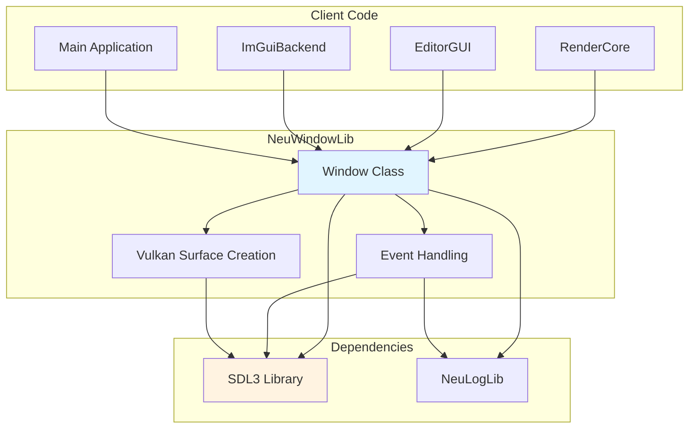
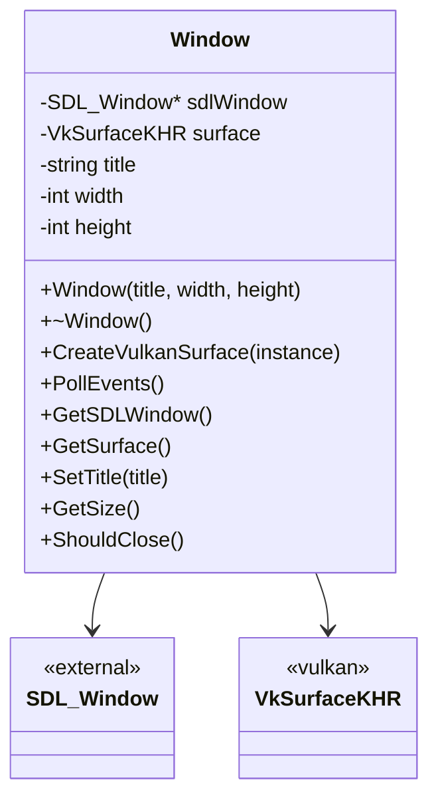
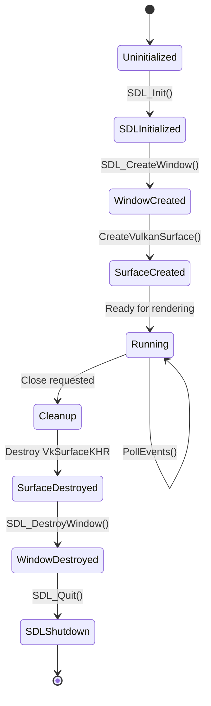
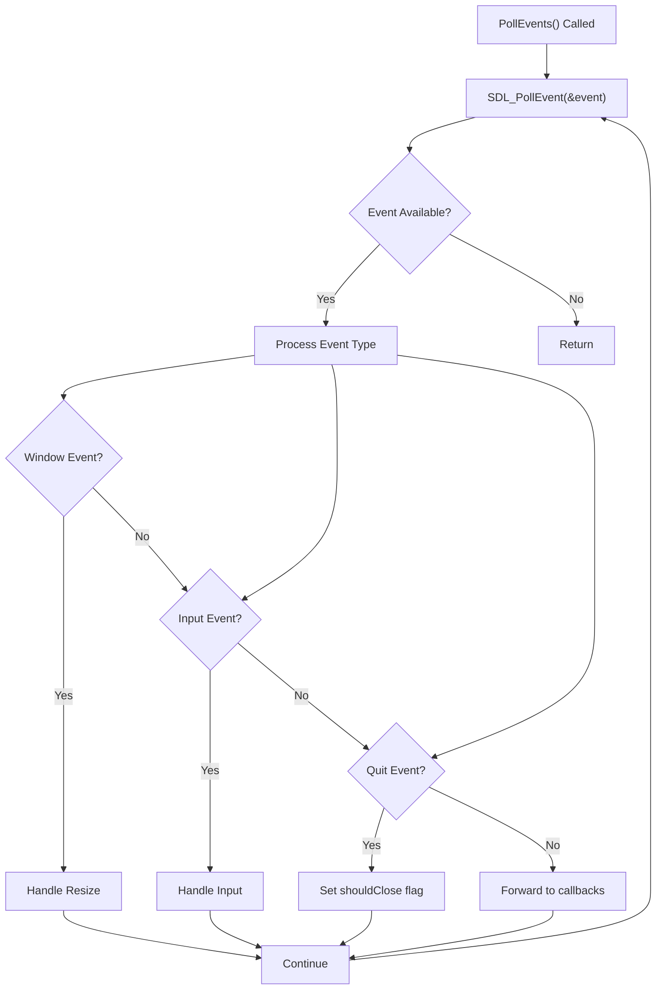
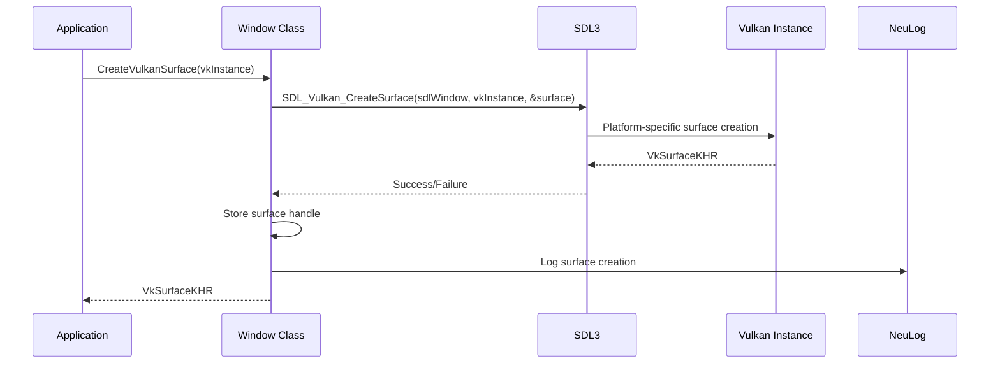
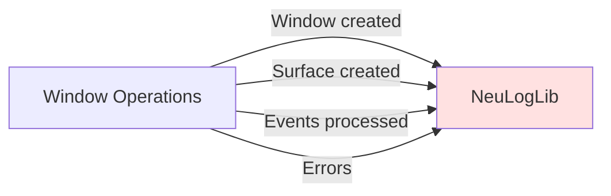
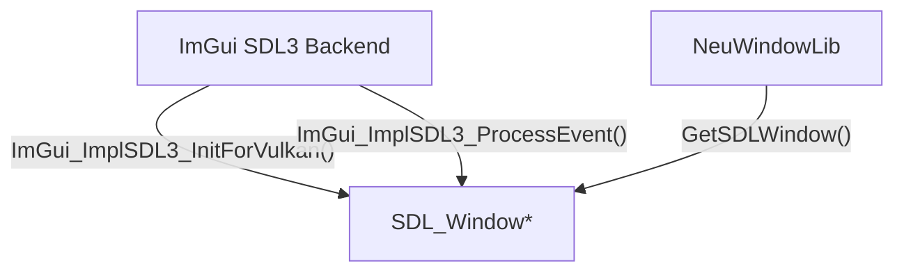
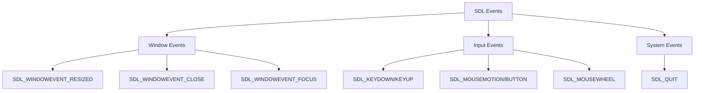

# Window Management (NeuWindowLib)

Relevant source files

The following files were used as context for generating this wiki page:

- [build/CMakeFiles/NeuImGuiBackendLib.dir/compiler_depend.make](build/CMakeFiles/NeuImGuiBackendLib.dir/compiler_depend.make)
- [build/CMakeFiles/NeuLogLib.dir/compiler_depend.make](build/CMakeFiles/NeuLogLib.dir/compiler_depend.make)
- [build/CMakeFiles/NeuRenderCoreLib.dir/progress.make](build/CMakeFiles/NeuRenderCoreLib.dir/progress.make)
- [build/CMakeFiles/NeuVulkanRender.dir/progress.make](build/CMakeFiles/NeuVulkanRender.dir/progress.make)
- [build/CMakeFiles/NeuWindowLib.dir/compiler_depend.make](build/CMakeFiles/NeuWindowLib.dir/compiler_depend.make)
- [build/CMakeFiles/NeuWindowLib.dir/progress.make](build/CMakeFiles/NeuWindowLib.dir/progress.make)
- [build/CMakeFiles/progress.marks](build/CMakeFiles/progress.marks)

NeuWindowLib provides cross-platform window management capabilities for the NeuVulkanRender engine by wrapping SDL3 functionality. This library handles window creation, event processing, and Vulkan surface initialization required for rendering operations.

For information about the rendering system that uses this library, see [Rendering System (RenderCore)](#3). For ImGui integration with the window system, see [ImGui Backend Integration](#6.3).

## Purpose and Scope

NeuWindowLib serves as the platform abstraction layer for windowing operations in NeuVulkanRender. Its primary responsibilities include:

- Creating and managing OS windows via SDL3
- Polling and dispatching window/input events
- Creating Vulkan rendering surfaces
- Managing window properties (title, dimensions, state)
- Integrating with the logging system for diagnostic output

This library does not handle rendering operations directly, nor does it manage ImGui state—those are handled by RenderCore and NeuImGuiBackendLib respectively.

## Architecture Overview

**Sources:** [build/CMakeFiles/NeuWindowLib.dir/compiler_depend.make:4-528]()

## Core Components

### Window Class

The `Window` class (defined in [include/Window.h]()) provides the primary interface for window management operations. This class encapsulates SDL3 window and event handling functionality.

**Sources:** [include/Window.h](), [build/CMakeFiles/NeuWindowLib.dir/compiler_depend.make:449-450]()

### SDL3 Integration

NeuWindowLib integrates the following SDL3 subsystems:

| SDL3 Component | Purpose | Header |
|----------------|---------|--------|
| SDL_video | Window creation and management | SDL_video.h |
| SDL_events | Event polling and handling | SDL_events.h |
| SDL_init | SDL subsystem initialization | SDL_init.h |
| SDL_keyboard | Keyboard input | SDL_keyboard.h |
| SDL_mouse | Mouse input | SDL_mouse.h |
| SDL_vulkan | Vulkan surface creation | SDL_video.h |

**Sources:** [build/CMakeFiles/NeuWindowLib.dir/compiler_depend.make:451-509]()

## Window Lifecycle

**Sources:** [source/Window.cpp](), [build/CMakeFiles/NeuWindowLib.dir/compiler_depend.make:4]()

### Initialization Sequence

1. **SDL Initialization**: Initialize SDL3 subsystems (video, events)
2. **Window Creation**: Create SDL window with appropriate flags (Vulkan, resizable, shown)
3. **Surface Creation**: Create Vulkan surface from SDL window
4. **Logging Setup**: Register window creation with NeuLogLib

### Event Processing

The window continuously polls for SDL events during the application main loop:

**Sources:** [source/Window.cpp](), [build/CMakeFiles/NeuWindowLib.dir/compiler_depend.make:466]()

## Vulkan Surface Management

NeuWindowLib creates platform-specific Vulkan surfaces using SDL3's Vulkan integration:

The Vulkan surface is required for creating the swapchain and presenting rendered images to the window.

**Sources:** [source/Window.cpp](), [build/CMakeFiles/NeuWindowLib.dir/compiler_depend.make:449,509]()

## Integration with Other Systems

### Dependency on NeuLogLib

NeuWindowLib uses NeuLogLib for diagnostic logging throughout window operations:

**Sources:** [build/CMakeFiles/NeuWindowLib.dir/compiler_depend.make:450,515-528]()

### Usage by RenderCore

RenderCore depends on NeuWindowLib to obtain the window handle and Vulkan surface for rendering:

| RenderCore Need | NeuWindowLib Provides |
|-----------------|----------------------|
| Vulkan Surface | `GetSurface()` returns VkSurfaceKHR |
| Window Dimensions | `GetSize()` returns width/height |
| Event Loop | `PollEvents()` processes input |
| Window Handle | `GetSDLWindow()` returns SDL_Window* |

**Sources:** [build/CMakeFiles/NeuRenderCoreLib.dir/progress.make:1-5]()

### Usage by ImGuiBackend

The ImGui SDL3 backend requires access to the SDL window for input processing and rendering context:

**Sources:** [build/CMakeFiles/NeuImGuiBackendLib.dir/compiler_depend.make:4-289](), [build/CMakeFiles/NeuWindowLib.dir/compiler_depend.make:514]()

## Build Configuration

### Library Dependencies

NeuWindowLib has the following build dependencies:

| Dependency | Type | Purpose |
|-----------|------|---------|
| SDL3 | External | Window and event management |
| spdlog | External | Logging framework |
| fmt | External | String formatting (via spdlog) |
| Vulkan SDK | External | Vulkan types and surface creation |
| NeuLogLib | Internal | Logging utilities |

**Sources:** [build/CMakeFiles/NeuWindowLib.dir/compiler_depend.make:447-528]()

### Export Symbols

The library exports symbols via `neuwindow_export.h` for use by other modules. This enables proper DLL/shared library linking on Windows and other platforms.

**Sources:** [build/CMakeFiles/NeuWindowLib.dir/compiler_depend.make:448]()

## Event Handling

### Supported Event Types

NeuWindowLib processes the following SDL event categories:

**Sources:** [source/Window.cpp](), [build/CMakeFiles/NeuWindowLib.dir/compiler_depend.make:466]()

## Thread Safety

NeuWindowLib is designed for single-threaded access from the main application thread. SDL3 window operations must occur on the same thread that initialized SDL. Event polling should be performed on the main thread before any rendering operations.

**Sources:** [build/CMakeFiles/NeuWindowLib.dir/compiler_depend.make:503-507]()

---
