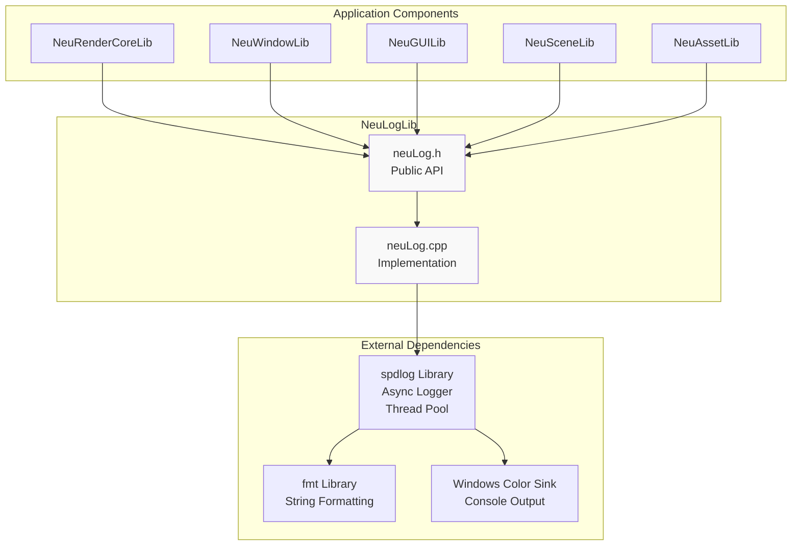
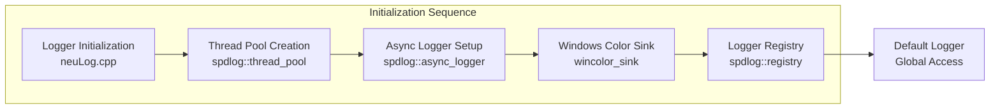
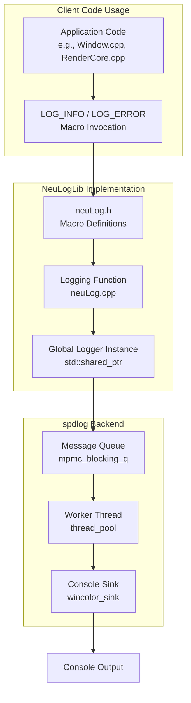
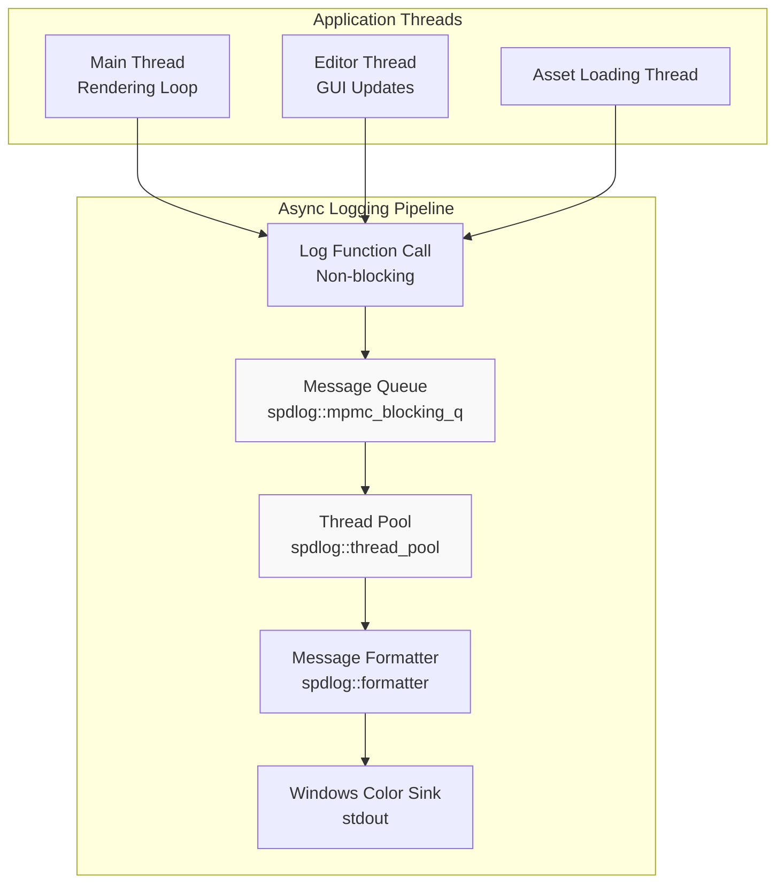
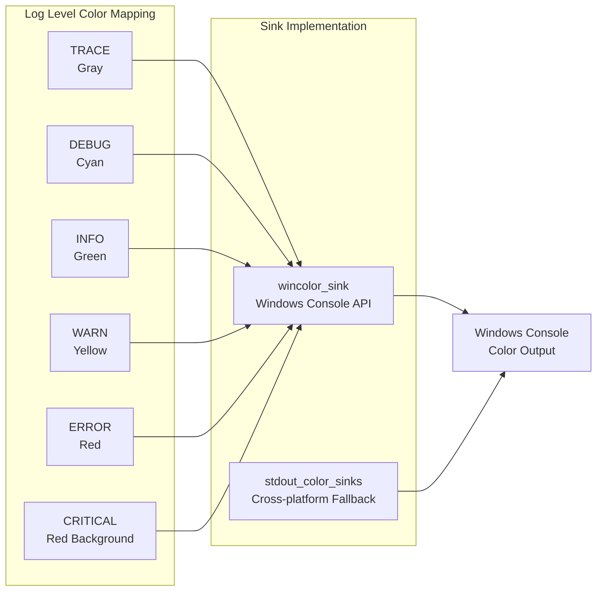
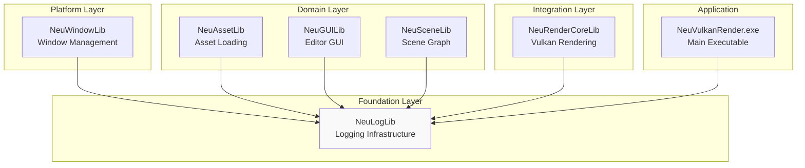
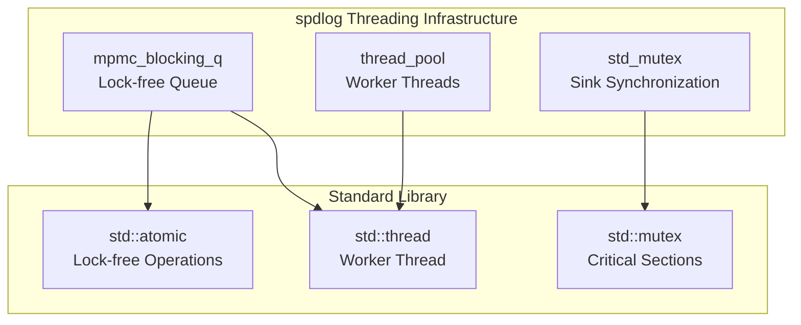

# Logging System (NeuLogLib)

Relevant source files

The following files were used as context for generating this wiki page:

- [build/CMakeFiles/NeuGUILib.dir/progress.make](build/CMakeFiles/NeuGUILib.dir/progress.make)
- [build/CMakeFiles/NeuImGuiBackendLib.dir/compiler_depend.make](build/CMakeFiles/NeuImGuiBackendLib.dir/compiler_depend.make)
- [build/CMakeFiles/NeuImGuiBackendLib.dir/progress.make](build/CMakeFiles/NeuImGuiBackendLib.dir/progress.make)
- [build/CMakeFiles/NeuLogLib.dir/compiler_depend.make](build/CMakeFiles/NeuLogLib.dir/compiler_depend.make)
- [build/CMakeFiles/NeuLogLib.dir/progress.make](build/CMakeFiles/NeuLogLib.dir/progress.make)
- [build/CMakeFiles/NeuWindowLib.dir/compiler_depend.make](build/CMakeFiles/NeuWindowLib.dir/compiler_depend.make)

## Purpose and Scope

NeuLogLib provides centralized, high-performance logging infrastructure for the entire NeuVulkanRender application. It wraps the **spdlog** library to offer a simplified interface for structured logging with color-coded console output and asynchronous logging support. This library serves as a foundational dependency used by all other subsystems including NeuWindowLib, NeuRenderCoreLib, NeuGUILib, NeuSceneLib, and NeuAssetLib.

For information about the build system integration and library dependencies, see [Library Dependencies and Build System](#2.2).

---

## Architecture Overview

NeuLogLib is a thin wrapper around the **spdlog** logging framework, providing a standardized logging interface for the entire codebase. The library is designed to be lightweight, thread-safe, and performant, supporting both synchronous and asynchronous logging modes.

### High-Level Architecture

**Sources**: [build/CMakeFiles/NeuLogLib.dir/compiler_depend.make:1-227](), Diagram 1 (Overall System Architecture)

---

## Library Structure

### File Organization

| File | Purpose |
|------|---------|
| `include/neuLog.h` | Public API header defining logging macros and initialization functions |
| `source/neuLog.cpp` | Implementation of logger setup and configuration |
| `neulog_export.h` | CMake-generated export macros for shared library symbols |

### Dependencies

NeuLogLib depends on the following external libraries:

| Library | Purpose | Headers Used |
|---------|---------|--------------|
| **spdlog** | High-performance logging framework | `spdlog/spdlog.h`, `spdlog/async.h`, `spdlog/async_logger.h` |
| **spdlog sinks** | Output destinations | `spdlog/sinks/stdout_color_sinks.h`, `spdlog/sinks/wincolor_sink.h` |
| **fmt** | String formatting (spdlog dependency) | `fmt/base.h`, `fmt/format.h` |

**Sources**: [build/CMakeFiles/NeuLogLib.dir/compiler_depend.make:200-227]()

---

## Core Components

### Logger Initialization Flow

**Sources**: [build/CMakeFiles/NeuLogLib.dir/compiler_depend.make:204-227](), Diagram 2 (Build System and Library Dependencies)

### Key spdlog Components Used

NeuLogLib integrates the following spdlog subsystems:

| Component | Header | Purpose |
|-----------|--------|---------|
| **async_logger** | `spdlog/async_logger.h` | Asynchronous logging with background thread |
| **thread_pool** | `spdlog/details/thread_pool.h` | Worker thread management for async logging |
| **wincolor_sink** | `spdlog/sinks/wincolor_sink.h` | Windows console with color support |
| **mpmc_blocking_q** | `spdlog/details/mpmc_blocking_q.h` | Multi-producer multi-consumer queue for log messages |
| **log_msg** | `spdlog/details/log_msg.h` | Log message structure |
| **registry** | `spdlog/details/registry.h` | Global logger registry for name-based access |

**Sources**: [build/CMakeFiles/NeuLogLib.dir/compiler_depend.make:205-225]()

---

## API Surface

### Public Header Interface

The `neuLog.h` header provides the public API for logging operations. Based on typical spdlog wrapper patterns and the dependency analysis, the API likely includes:

**Expected API Functions** (to be implemented in `neuLog.h`):
- Logger initialization/shutdown functions
- Logging macros for different severity levels (trace, debug, info, warn, error, critical)
- Logger configuration functions

### Logger Access Pattern

**Sources**: [build/CMakeFiles/NeuLogLib.dir/compiler_depend.make:201-227](), [build/CMakeFiles/NeuWindowLib.dir/compiler_depend.make:447-450]()

---

## Integration with spdlog

### Asynchronous Logging Architecture

NeuLogLib uses **spdlog's asynchronous logging** to minimize performance impact on the application's main rendering thread:

**Sources**: [build/CMakeFiles/NeuLogLib.dir/compiler_depend.make:212-218]()

### spdlog Details Classes

The following spdlog detail classes are utilized for internal logging mechanics:

| Detail Class | Header | Purpose |
|--------------|--------|---------|
| `thread_pool` | `spdlog/details/thread_pool.h` | Manages background worker threads for async logging |
| `mpmc_blocking_q` | `spdlog/details/mpmc_blocking_q.h` | Lock-free queue for passing log messages to worker threads |
| `log_msg` | `spdlog/details/log_msg.h` | Encapsulates log message data (level, timestamp, payload) |
| `log_msg_buffer` | `spdlog/details/log_msg_buffer.h` | Buffered log message for efficient memory handling |
| `backtracer` | `spdlog/details/backtracer.h` | Stores recent log messages for debugging |
| `registry` | `spdlog/details/registry.h` | Global registry for named logger instances |
| `synchronous_factory` | `spdlog/details/synchronous_factory.h` | Factory for creating synchronous loggers |
| `console_globals` | `spdlog/details/console_globals.h` | Global state for console operations |
| `periodic_worker` | `spdlog/details/periodic_worker.h` | Periodic flushing of log buffers |

**Sources**: [build/CMakeFiles/NeuLogLib.dir/compiler_depend.make:207-218]()

---

## Windows Platform Integration

### Color Console Output

NeuLogLib uses **spdlog's Windows-specific color sink** for enhanced console output:

**Sources**: [build/CMakeFiles/NeuLogLib.dir/compiler_depend.make:223-224]()

---

## Build System Configuration

### CMake Target Dependencies

The NeuLogLib CMake target has the following structure:

**Build Artifacts:**
- Static library: `libNeuLogLib.a` (MinGW GCC)
- Export header: `neulog_export.h`

**Compiler Dependencies:**
- Source: [source/neuLog.cpp:1]()
- Header: [include/neuLog.h:1]()
- Export: `neulog_export.h` (generated)

**External Library Linkage:**
- `spdlog` (header-only or linked)
- `fmt` (dependency of spdlog)
- Standard library threading (`pthread` on MinGW)

**Sources**: [build/CMakeFiles/NeuLogLib.dir/compiler_depend.make:1-227](), [build/CMakeFiles/NeuLogLib.dir/progress.make:1-4]()

---

## Usage by Other Libraries

### Library Dependency Graph

**Sources**: Diagram 2 (Build System and Library Dependencies), [build/CMakeFiles/NeuWindowLib.dir/compiler_depend.make:447-450]()

### Example Usage Contexts

Based on the dependency analysis, NeuLogLib is used by:

| Library | Example Usage Context |
|---------|----------------------|
| **NeuWindowLib** | Logging SDL3 window events, initialization errors, display mode changes |
| **NeuRenderCoreLib** | Logging Vulkan validation layers, device selection, pipeline compilation |
| **NeuGUILib** | Logging ImGui events, project operations, scene modifications |
| **NeuSceneLib** | Logging node creation/destruction, scene serialization |
| **NeuAssetLib** | Logging asset loading progress, cache hits/misses, errors |

**Sources**: [build/CMakeFiles/NeuWindowLib.dir/compiler_depend.make:447-450](), Diagram 1 (Overall System Architecture)

---

## Thread Safety and Performance

### Async Logging Benefits

The use of **spdlog's async logging** provides:

1. **Non-blocking logging calls** - Application threads are not blocked by I/O operations
2. **Thread-safe message queuing** - Multi-producer multi-consumer queue handles concurrent access
3. **Background processing** - Dedicated worker threads format and output messages
4. **Minimal performance overhead** - Rendering and asset loading are not impacted by logging

### Threading Components

**Sources**: [build/CMakeFiles/NeuLogLib.dir/compiler_depend.make:212-218](), [build/CMakeFiles/NeuLogLib.dir/compiler_depend.make:64-73]()

---

## Standard Library Dependencies

NeuLogLib relies on C++14 standard library features through spdlog:

**C++ Headers Used:**
- `<memory>` - Smart pointers for logger lifetime management
- `<string>`, `<string_view>` - Log message handling
- `<vector>`, `<array>` - Container support
- `<chrono>` - Timestamp generation
- `<thread>`, `<mutex>`, `<condition_variable>` - Threading primitives
- `<atomic>` - Lock-free operations
- `<functional>` - Callback mechanisms
- `<unordered_map>` - Logger registry

**Sources**: [build/CMakeFiles/NeuLogLib.dir/compiler_depend.make:12-158]()

---
