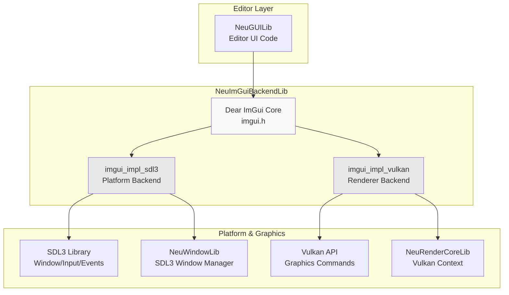
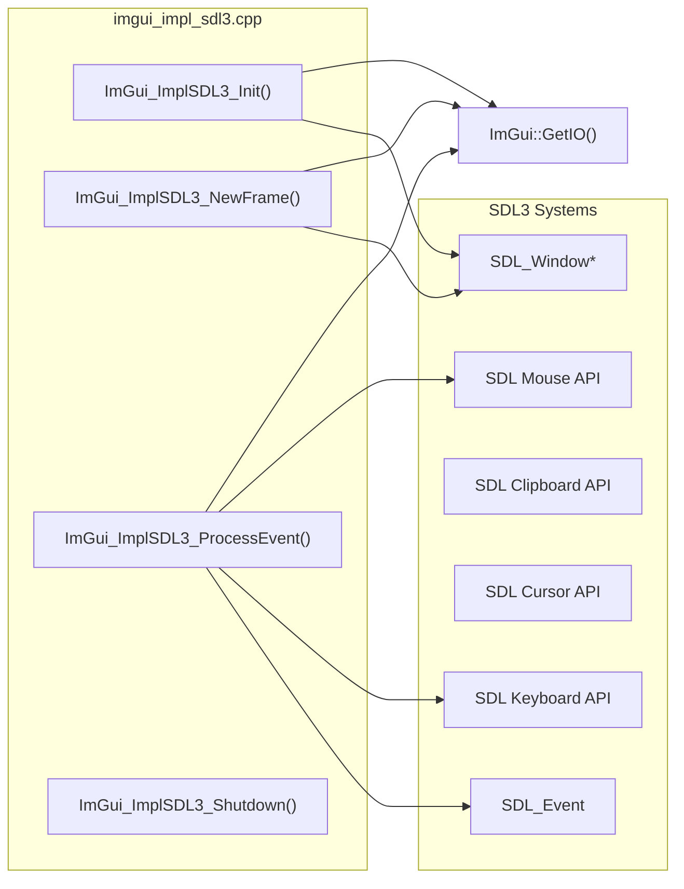
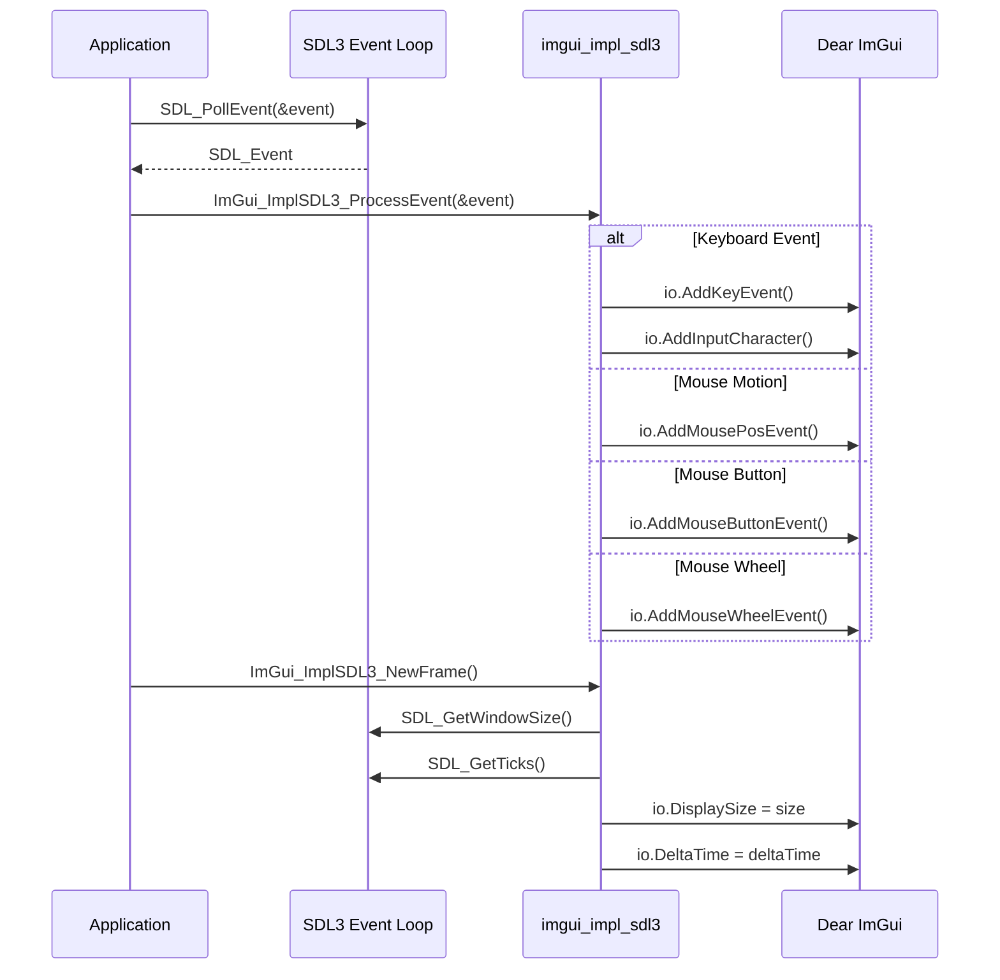
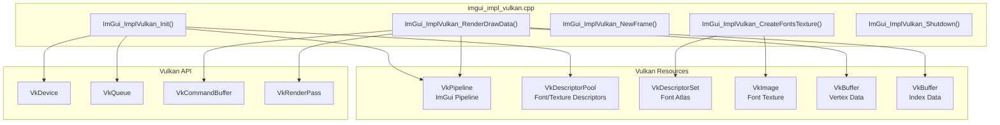
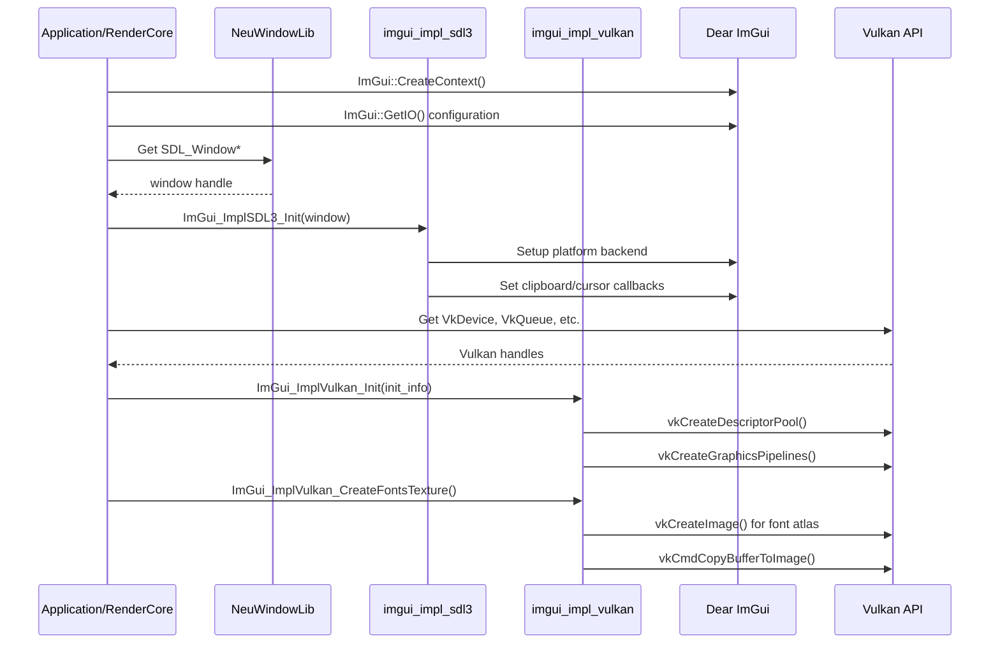
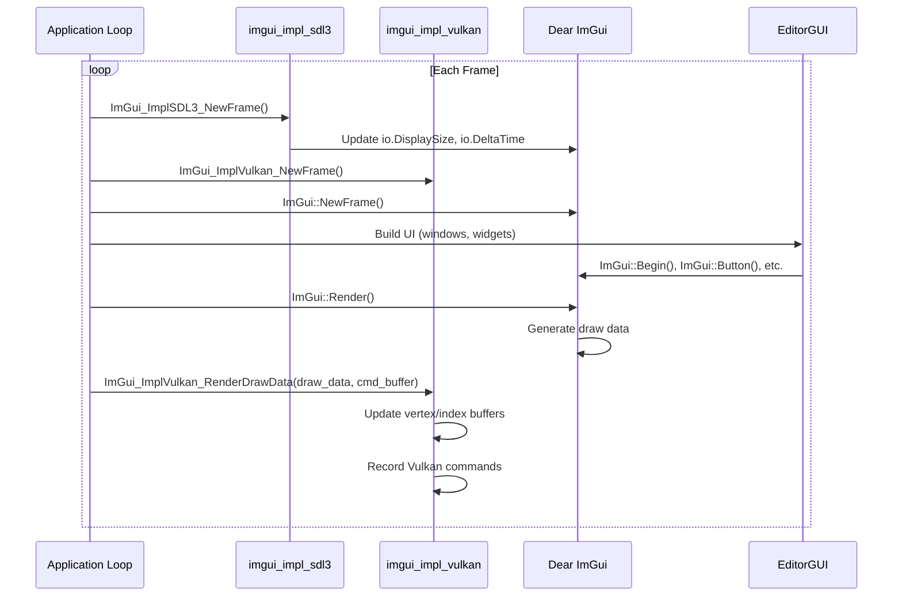
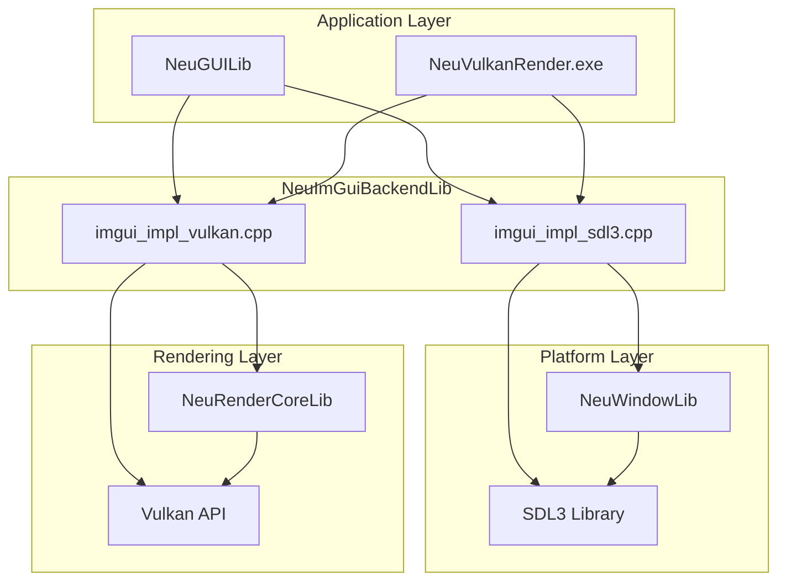

# ImGui Backend Integration

Relevant source files

The following files were used as context for generating this wiki page:

- [build/CMakeFiles/NeuImGuiBackendLib.dir/compiler_depend.make](build/CMakeFiles/NeuImGuiBackendLib.dir/compiler_depend.make)
- [build/CMakeFiles/NeuLogLib.dir/compiler_depend.make](build/CMakeFiles/NeuLogLib.dir/compiler_depend.make)
- [build/CMakeFiles/NeuWindowLib.dir/compiler_depend.make](build/CMakeFiles/NeuWindowLib.dir/compiler_depend.make)
- [build/imgui.ini](build/imgui.ini)

The ImGui Backend Integration system provides the platform and rendering layer bindings that enable Dear ImGui to function within NeuVulkanRender. This subsystem bridges Dear ImGui's immediate-mode GUI framework with SDL3 for windowing/input and Vulkan for GPU rendering. For information about the higher-level editor UI components that use this backend, see [Editor System (EditorGUI)](#4).

**Sources:** [build/CMakeFiles/NeuImGuiBackendLib.dir/compiler_depend.make:1-961]()

## System Purpose

The `NeuImGuiBackendLib` library implements two backend adapters:
- **SDL3 Backend** (`imgui_impl_sdl3`): Handles window management, input events, clipboard operations, and cursor management
- **Vulkan Backend** (`imgui_impl_vulkan`): Manages GPU resources, descriptor sets, render passes, and command buffer recording for ImGui rendering

These backends translate ImGui's platform-agnostic API calls into platform-specific SDL3 calls and Vulkan commands, enabling the editor UI to render efficiently on the GPU.

**Sources:** [build/CMakeFiles/NeuImGuiBackendLib.dir/compiler_depend.make:4-5](), [build/CMakeFiles/NeuImGuiBackendLib.dir/compiler_depend.make:291-292]()

## Architecture Overview

**Diagram:** ImGui Backend Integration Architecture

The backend sits between the Dear ImGui core library and the underlying platform/graphics APIs. The SDL3 backend handles all platform-specific operations (windowing, input), while the Vulkan backend handles GPU rendering operations. Both backends are initialized and managed by higher-level systems like `RenderCore` and `EditorGUI`.

**Sources:** [build/CMakeFiles/NeuImGuiBackendLib.dir/compiler_depend.make:4-5](), [build/CMakeFiles/NeuImGuiBackendLib.dir/compiler_depend.make:287-289](), [build/CMakeFiles/NeuImGuiBackendLib.dir/compiler_depend.make:291-349]()

## SDL3 Backend Implementation

### Component Structure

**Diagram:** SDL3 Backend Component Relationships

The SDL3 backend provides the platform layer for ImGui by:
1. **Window Management**: Associates ImGui with an SDL3 window handle
2. **Input Processing**: Translates SDL3 events into ImGui input state
3. **Frame Synchronization**: Updates display size, delta time, and input state each frame
4. **System Integration**: Handles clipboard, cursor visibility, and system-level UI features

**Sources:** [build/CMakeFiles/NeuImGuiBackendLib.dir/compiler_depend.make:4-289]()

### Key SDL3 Backend Functions

| Function | Purpose | SDL3 APIs Used |
|----------|---------|----------------|
| `ImGui_ImplSDL3_Init()` | Initialize backend with SDL window | `SDL_GetWindowSize()`, `SDL_GetWindowFlags()` |
| `ImGui_ImplSDL3_NewFrame()` | Update per-frame state (time, display size) | `SDL_GetWindowSize()`, `SDL_GetTicks()` |
| `ImGui_ImplSDL3_ProcessEvent()` | Convert SDL events to ImGui input | `SDL_KEYDOWN`, `SDL_MOUSEMOTION`, `SDL_MOUSEWHEEL` |
| `ImGui_ImplSDL3_Shutdown()` | Clean up SDL-related resources | Cursor cleanup, memory deallocation |

**Sources:** [build/CMakeFiles/NeuImGuiBackendLib.dir/compiler_depend.make:228-289]()

### Event Handling Flow

**Diagram:** SDL3 Event Processing Flow

Events flow from SDL3 through the backend into ImGui's input state. The backend translates SDL's event structure into ImGui's input API calls, ensuring proper keyboard, mouse, and window events are captured.

**Sources:** [build/CMakeFiles/NeuImGuiBackendLib.dir/compiler_depend.make:228-289]()

## Vulkan Backend Implementation

### Component Structure

**Diagram:** Vulkan Backend Resource Management

The Vulkan backend manages all GPU resources required for ImGui rendering:
- **Pipeline**: Graphics pipeline for rendering ImGui geometry
- **Descriptors**: Descriptor sets for font textures and user textures
- **Buffers**: Dynamic vertex and index buffers updated each frame
- **Textures**: Font atlas texture uploaded to GPU memory

**Sources:** [build/CMakeFiles/NeuImGuiBackendLib.dir/compiler_depend.make:291-349]()

### Key Vulkan Backend Functions

| Function | Purpose | Vulkan Operations |
|----------|---------|-------------------|
| `ImGui_ImplVulkan_Init()` | Create pipeline, descriptor pool | `vkCreateGraphicsPipelines()`, `vkCreateDescriptorPool()` |
| `ImGui_ImplVulkan_CreateFontsTexture()` | Upload font atlas to GPU | `vkCreateImage()`, `vkCmdCopyBufferToImage()` |
| `ImGui_ImplVulkan_NewFrame()` | Prepare for new frame (no-op in Vulkan) | N/A |
| `ImGui_ImplVulkan_RenderDrawData()` | Record draw commands to command buffer | `vkCmdBindPipeline()`, `vkCmdDraw()` |
| `ImGui_ImplVulkan_Shutdown()` | Destroy all Vulkan resources | `vkDestroyPipeline()`, `vkDestroyDescriptorPool()` |

**Sources:** [build/CMakeFiles/NeuImGuiBackendLib.dir/compiler_depend.make:332-349]()

### Rendering Pipeline

```mermaid
graph LR
    subgraph "Per-Frame Rendering"
        BeginFrame["ImGui::NewFrame()"]
        BuildUI["EditorGUI Build UI"]
        Render["ImGui::Render()"]
        GetDrawData["ImGui::GetDrawData()"]
        RenderVk["ImGui_ImplVulkan_RenderDrawData()"]
    end
    
    subgraph "Vulkan Commands"
        BindPipeline["vkCmdBindPipeline"]
        BindVB["vkCmdBindVertexBuffers"]
        BindIB["vkCmdBindIndexBuffer"]
        BindDescSet["vkCmdBindDescriptorSets"]
        SetViewport["vkCmdSetViewport"]
        SetScissor["vkCmdSetScissor"]
        DrawIndexed["vkCmdDrawIndexed"]
    end
    
    BeginFrame --> BuildUI
    BuildUI --> Render
    Render --> GetDrawData
    GetDrawData --> RenderVk
    
    RenderVk --> BindPipeline
    BindPipeline --> BindVB
    BindVB --> BindIB
    BindIB --> BindDescSet
    BindDescSet --> SetViewport
    SetViewport --> SetScissor
    SetScissor --> DrawIndexed
```

**Diagram:** ImGui Vulkan Rendering Command Flow

Each frame, after ImGui generates draw data, the Vulkan backend records the necessary commands to a command buffer. This includes binding the ImGui pipeline, updating dynamic buffers with vertex/index data, and issuing draw calls for each draw command in ImGui's draw list.

**Sources:** [build/CMakeFiles/NeuImGuiBackendLib.dir/compiler_depend.make:291-349]()

## Initialization and Integration

### Initialization Sequence

**Diagram:** ImGui Backend Initialization Sequence

The backends must be initialized in a specific order:
1. Create ImGui context
2. Initialize SDL3 backend with window handle
3. Initialize Vulkan backend with Vulkan context
4. Create font texture on GPU

**Sources:** [build/CMakeFiles/NeuImGuiBackendLib.dir/compiler_depend.make:4-5](), [build/CMakeFiles/NeuImGuiBackendLib.dir/compiler_depend.make:291-349]()

### Frame Rendering Sequence

**Diagram:** Per-Frame Backend Update and Render Cycle

The frame cycle follows the standard ImGui pattern:
1. Update platform state (SDL3 backend)
2. Begin new ImGui frame
3. Build UI using ImGui API
4. Render ImGui draw data to command buffer (Vulkan backend)

**Sources:** [build/CMakeFiles/NeuImGuiBackendLib.dir/compiler_depend.make:4-5](), [build/CMakeFiles/NeuImGuiBackendLib.dir/compiler_depend.make:291-349]()

## Dependencies and External Libraries

### Compilation Dependencies

| Dependency | Purpose | Header Files |
|------------|---------|--------------|
| Dear ImGui | Core immediate-mode GUI library | `imgui.h`, `imconfig.h` |
| SDL3 | Window/input platform layer | `SDL3/SDL.h`, `SDL3/SDL_video.h`, `SDL3/SDL_events.h` |
| Vulkan SDK | GPU rendering API | `vulkan/vulkan.h`, `vulkan/vk_platform.h` |
| ImGui SDL3 Backend | SDL3 platform backend header | `imgui_impl_sdl3.h` |
| ImGui Vulkan Backend | Vulkan renderer backend header | `imgui_impl_vulkan.h` |

**Sources:** [build/CMakeFiles/NeuImGuiBackendLib.dir/compiler_depend.make:287-289](), [build/CMakeFiles/NeuImGuiBackendLib.dir/compiler_depend.make:332-349]()

### Integration with Other Systems

**Diagram:** Backend Integration with NeuVulkanRender Systems

The ImGui backends integrate with:
- **NeuWindowLib**: Provides the SDL window handle for the SDL3 backend
- **NeuRenderCoreLib**: Provides Vulkan device, queue, and command buffers for the Vulkan backend
- **NeuGUILib**: Uses both backends to render the editor interface
- **Main Application**: Coordinates initialization and frame updates

**Sources:** [build/CMakeFiles/NeuImGuiBackendLib.dir/compiler_depend.make:4-5](), [build/CMakeFiles/NeuWindowLib.dir/compiler_depend.make:447-528](), [build/CMakeFiles/NeuLogLib.dir/compiler_depend.make:1-227]()

## Configuration and Settings

The ImGui backends can be configured through ImGui's `ImGuiIO` structure and backend-specific initialization parameters:

### SDL3 Backend Configuration
- Window association: Pass `SDL_Window*` to `ImGui_ImplSDL3_Init()`
- Input mapping: Automatic keyboard/mouse mapping to ImGui keys
- Clipboard handling: Integrates with SDL clipboard API
- Cursor management: SDL cursor visibility and type control

### Vulkan Backend Configuration  
- Vulkan context: Pass `VkDevice`, `VkQueue`, `VkPhysicalDevice` via `ImGui_ImplVulkan_InitInfo`
- Descriptor pool: Backend creates its own descriptor pool for font/texture descriptors
- Render pass: Must provide compatible `VkRenderPass` for pipeline creation
- MSAA: Configurable sample count for anti-aliasing
- Pipeline cache: Optional `VkPipelineCache` for faster pipeline creation

**Sources:** [build/CMakeFiles/NeuImGuiBackendLib.dir/compiler_depend.make:4-5](), [build/CMakeFiles/NeuImGuiBackendLib.dir/compiler_depend.make:291-349]()

---
