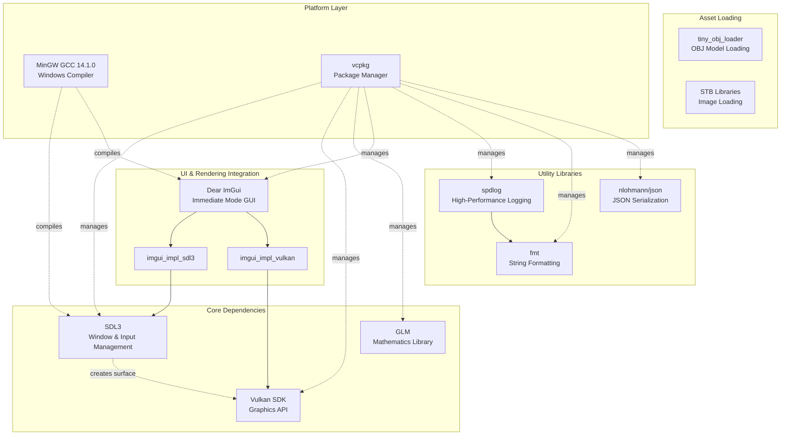
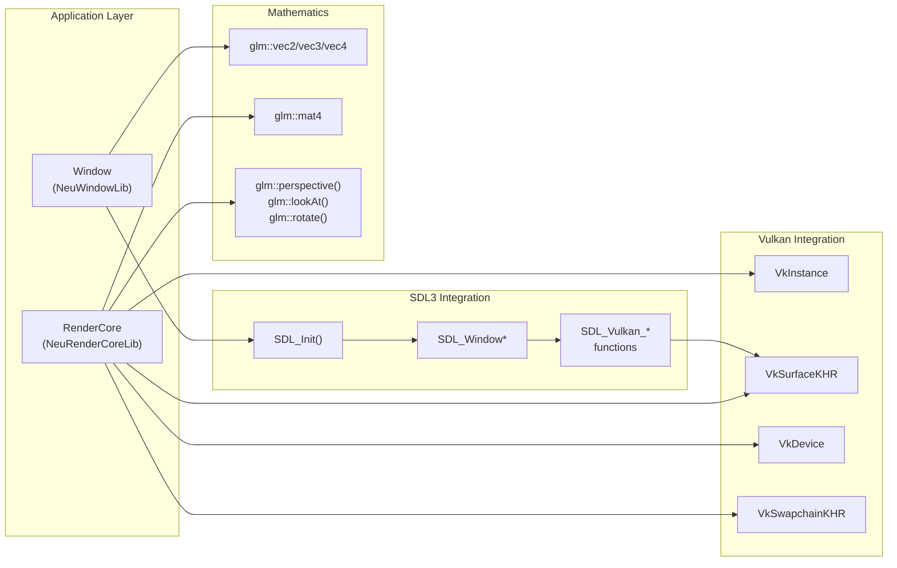
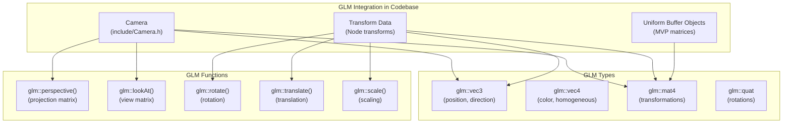
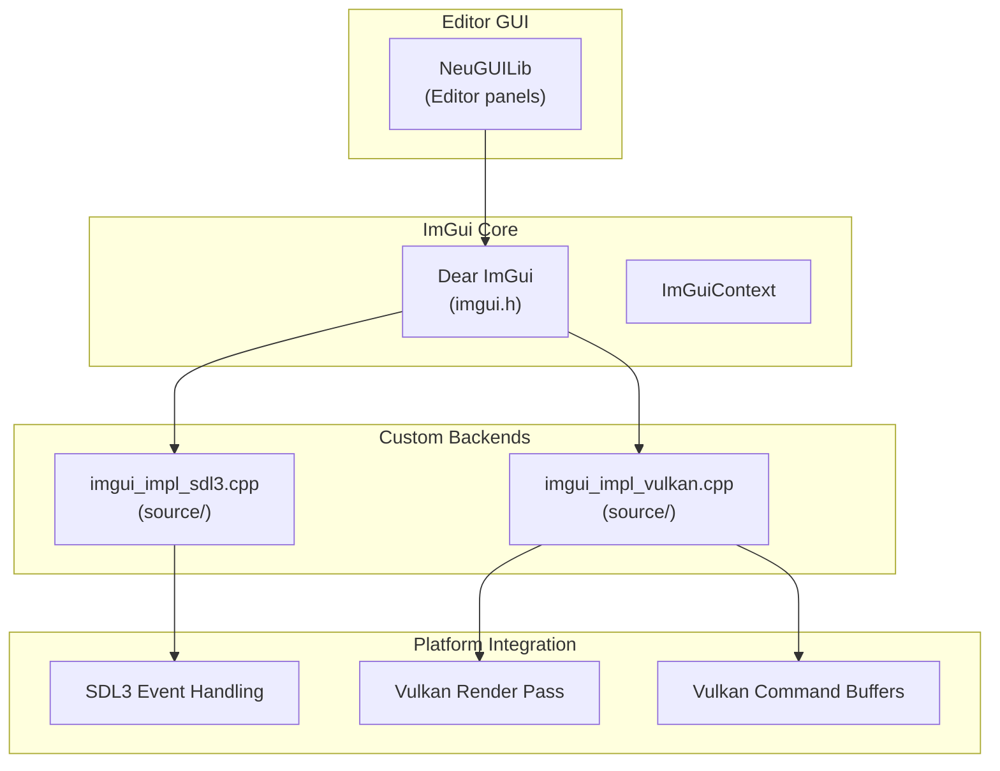
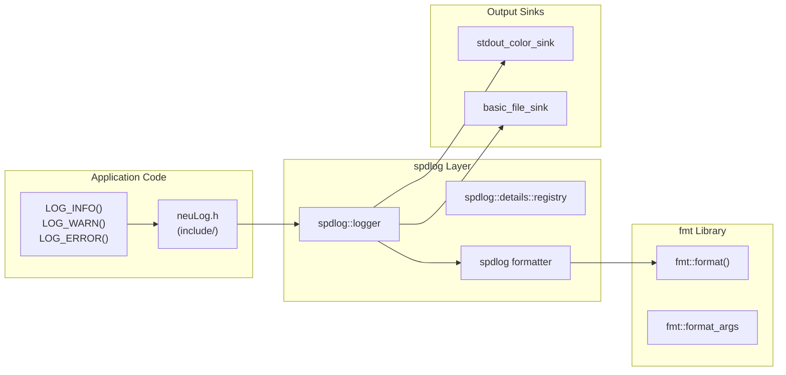

# External Dependencies

<details>
<summary>Relevant source files</summary>

The following files were used as context for generating this wiki page:

- [build/CMakeFiles/NeuImGuiBackendLib.dir/compiler_depend.make](build/CMakeFiles/NeuImGuiBackendLib.dir/compiler_depend.make)
- [build/CMakeFiles/NeuLogLib.dir/compiler_depend.make](build/CMakeFiles/NeuLogLib.dir/compiler_depend.make)
- [build/CMakeFiles/NeuRenderCoreLib.dir/compiler_depend.make](build/CMakeFiles/NeuRenderCoreLib.dir/compiler_depend.make)
- [build/CMakeFiles/NeuVulkanRender.dir/compiler_depend.make](build/CMakeFiles/NeuVulkanRender.dir/compiler_depend.make)
- [build/CMakeFiles/NeuWindowLib.dir/compiler_depend.make](build/CMakeFiles/NeuWindowLib.dir/compiler_depend.make)

</details>


This document provides a comprehensive overview of the third-party libraries used by NeuVulkanRender, their purposes, integration points, and how they are managed through the build system. For information about specific library usage patterns in the codebase, see [GLM (OpenGL Mathematics Library)](#7.1) and [spdlog Logging Library](#7.2).

## Overview

NeuVulkanRender integrates multiple external dependencies to provide cross-platform windowing, GPU rendering, mathematics, UI, serialization, logging, and asset loading capabilities. All dependencies are managed through **vcpkg** as a package manager and are configured for x64-mingw-dynamic target on Windows. The dependencies are located at `D:/vcpkg/installed/x64-mingw-dynamic/include/` as evidenced by the compiler dependency files.

---

## Dependency Architecture

The following diagram shows the hierarchical structure of external dependencies and their relationships:



**Sources:** [build/CMakeFiles/NeuVulkanRender.dir/compiler_depend.make](), [build/CMakeFiles/NeuRenderCoreLib.dir/compiler_depend.make](), [build/CMakeFiles/NeuImGuiBackendLib.dir/compiler_depend.make]()

---

## Dependency Catalog

| Library | Version | Purpose | Package Source | License |
|---------|---------|---------|----------------|---------|
| SDL3 | Latest | Cross-platform window creation, event handling, input processing | vcpkg | Zlib |
| Vulkan SDK | 1.3+ | Low-level GPU graphics and compute API | vcpkg | Apache 2.0 |
| GLM | Latest | Header-only C++ mathematics library for graphics (vectors, matrices, transformations) | vcpkg | MIT |
| Dear ImGui | Latest | Immediate mode graphical user interface library | vcpkg | MIT |
| spdlog | Latest | Fast C++ logging library with multiple sinks and formatting support | vcpkg | MIT |
| fmt | Latest | Modern C++ string formatting library (used by spdlog) | vcpkg | MIT |
| nlohmann/json | Latest | JSON parsing and serialization for project/scene data | vcpkg | MIT |
| tiny_obj_loader | Latest | Lightweight Wavefront OBJ file loader | vcpkg | MIT |
| STB libraries | Latest | Single-file public domain libraries for image loading | vcpkg | Public Domain |

**Sources:** [build/CMakeFiles/NeuVulkanRender.dir/compiler_depend.make:543-601](), [build/CMakeFiles/NeuRenderCoreLib.dir/compiler_depend.make:118-263]()

---

## Package Management and Build Integration

### vcpkg Configuration

The project uses **vcpkg** with the `x64-mingw-dynamic` triplet for dynamic library linking on Windows x64 with MinGW. All dependencies are installed to:

```
D:/vcpkg/installed/x64-mingw-dynamic/
├── include/           # Header files
├── lib/               # Link-time libraries  
├── bin/               # Runtime DLLs
└── share/             # CMake find modules
```

**Sources:** [build/CMakeFiles/NeuVulkanRender.dir/compiler_depend.make:543-878]()

### Compiler Toolchain

The project is built using **MinGW GCC 14.1.0** targeting x86_64-w64-mingw32:

- Compiler: `C:/msys64/mingw64/bin/g++.exe`
- Standard library: libstdc++ 14.1.0
- C++ Standard: C++17 or higher
- Architecture: x86_64 with SSE/AVX support

**Sources:** [build/CMakeFiles/NeuVulkanRender.dir/compiler_depend.make:5-523](), [build/CMakeFiles/NeuRenderCoreLib.dir/compiler_depend.make:5-263]()

---

## Core Graphics Stack Integration



**Sources:** [build/CMakeFiles/NeuWindowLib.dir/compiler_depend.make:451-601](), [build/CMakeFiles/NeuRenderCoreLib.dir/compiler_depend.make:492-494]()

---

## SDL3 Window Management

**Purpose:** Cross-platform window creation, event handling, input processing, and Vulkan surface creation.

### Key Integration Points

- **Window Creation:** `SDL_CreateWindow()` in [source/Window.cpp]()
- **Vulkan Surface:** `SDL_Vulkan_CreateSurface()` creates `VkSurfaceKHR`
- **Event Loop:** `SDL_PollEvent()` for input and window events
- **Extensions:** `SDL_Vulkan_GetInstanceExtensions()` queries required Vulkan extensions

### Header Dependencies

```
SDL3/SDL.h                    # Main SDL header
SDL3/SDL_video.h              # Window management
SDL3/SDL_events.h             # Event handling
SDL3/SDL_keyboard.h           # Keyboard input
SDL3/SDL_mouse.h              # Mouse input
SDL3/SDL_vulkan.h             # Vulkan integration (implicit via SDL.h)
```

**Sources:** [build/CMakeFiles/NeuWindowLib.dir/compiler_depend.make:451-601](), [build/CMakeFiles/NeuImGuiBackendLib.dir/compiler_depend.make:228-286]()

---

## Vulkan Graphics API

**Purpose:** Low-level GPU control for rendering, compute, and resource management.

### Key Integration Points

- **Instance Creation:** `vkCreateInstance()` in [source/RenderCore.cpp]()
- **Device Selection:** `vkEnumeratePhysicalDevices()` and `vkCreateDevice()`
- **Swapchain:** `vkCreateSwapchainKHR()` for presentation
- **Command Buffers:** `vkAllocateCommandBuffers()` and `vkBeginCommandBuffer()`
- **Synchronization:** `vkCreateFence()`, `vkCreateSemaphore()` for triple-buffering

### Header Dependencies

```
vulkan/vulkan.h               # Core Vulkan API
vulkan/vulkan_core.h          # Core types and functions
vulkan/vk_platform.h          # Platform-specific definitions
vk_video/                     # Video codec extensions (unused but included)
```

### Vulkan Extensions Used

The codebase relies on several Vulkan extensions:
- `VK_KHR_swapchain` - Presentation support
- `VK_KHR_surface` - Platform surface abstraction
- Platform-specific surface extensions (e.g., `VK_KHR_win32_surface`)

**Sources:** [build/CMakeFiles/NeuRenderCoreLib.dir/compiler_depend.make:480-494](), [build/CMakeFiles/NeuImGuiBackendLib.dir/compiler_depend.make:335-349]()

---

## GLM Mathematics Library

**Purpose:** Provide GPU-friendly vector, matrix, and transformation operations.

### Key Usage Patterns



### Core GLM Headers

```
glm/glm.hpp                          # Main include
glm/gtc/matrix_transform.hpp         # Transform functions (perspective, lookAt, etc.)
glm/gtc/constants.hpp                # Mathematical constants
glm/vec2.hpp, glm/vec3.hpp, glm/vec4.hpp  # Vector types
glm/mat4x4.hpp                       # 4x4 matrix type
glm/geometric.hpp                    # Geometric operations (normalize, cross, dot)
glm/trigonometric.hpp                # Trigonometric functions
```

For detailed GLM usage documentation, see [GLM (OpenGL Mathematics Library)](#7.1).

**Sources:** [build/CMakeFiles/NeuRenderCoreLib.dir/compiler_depend.make:118-263](), [source/Camera.cpp]()

---

## Dear ImGui Editor Integration

**Purpose:** Provide immediate-mode GUI framework for the editor interface.

### Custom Backend Implementation

The project implements custom ImGui backends for SDL3 and Vulkan integration:



### Backend Files

- **[source/imgui_impl_sdl3.cpp]():** Implements `ImGui_ImplSDL3_Init()`, `ImGui_ImplSDL3_NewFrame()`, `ImGui_ImplSDL3_ProcessEvent()` for SDL3 input handling
- **[source/imgui_impl_vulkan.cpp]():** Implements `ImGui_ImplVulkan_Init()`, `ImGui_ImplVulkan_NewFrame()`, `ImGui_ImplVulkan_RenderDrawData()` for Vulkan rendering

### ImGui Headers Used

```
imgui.h                       # Core ImGui API
imconfig.h                    # Configuration
imgui_impl_sdl3.h             # SDL3 backend interface
imgui_impl_vulkan.h           # Vulkan backend interface
```

**Sources:** [build/CMakeFiles/NeuImGuiBackendLib.dir/compiler_depend.make:4-349](), [source/imgui_impl_sdl3.cpp](), [source/imgui_impl_vulkan.cpp]()

---

## spdlog Logging Framework

**Purpose:** High-performance, thread-safe logging with multiple sinks and formatting capabilities.

### Integration Architecture



### spdlog Headers

```
spdlog/spdlog.h               # Main header
spdlog/logger.h               # Logger class
spdlog/common.h               # Common types
spdlog/fmt/fmt.h              # fmt integration
spdlog/details/registry.h     # Logger registry
```

For detailed spdlog usage patterns, see [spdlog Logging Library](#7.2).

**Sources:** [build/CMakeFiles/NeuRenderCoreLib.dir/compiler_depend.make:464-479](), [include/neuLog.h]()

---

## fmt String Formatting

**Purpose:** Modern C++ string formatting library providing type-safe, efficient formatting.

### Usage Context

- **Primary User:** spdlog uses fmt as its formatting backend
- **Format Strings:** Type-safe format strings with automatic type deduction
- **Performance:** Compile-time format string validation

### fmt Headers

```
fmt/base.h                    # Core formatting
fmt/format.h                  # Main format API
```

**Sources:** [build/CMakeFiles/NeuRenderCoreLib.dir/compiler_depend.make:464-465](), [build/CMakeFiles/NeuVulkanRender.dir/compiler_depend.make:602-603]()

---

## nlohmann/json Serialization

**Purpose:** JSON parsing and serialization for project metadata, scene data, and configuration.

### Usage Patterns

The JSON library is used for:
- **Project Files:** Serializing `Project` metadata, paths, and settings
- **Scene Data:** Saving and loading scene hierarchies and node properties
- **GUI Settings:** Persisting editor panel layouts and configurations

**Expected Headers:**
```
nlohmann/json.hpp             # Single-header JSON library
```

**Sources:** High-level system diagrams indicate JSON usage for project serialization

---

## Asset Loading Libraries

### tiny_obj_loader

**Purpose:** Load Wavefront .obj 3D model files.

**Integration Point:** Used in `MeshResource` loading to parse OBJ geometry data including vertices, normals, texture coordinates, and materials.

### STB Libraries

**Purpose:** Load various image formats (PNG, JPG, BMP, TGA) for texture resources.

**Common STB Headers:**
```
stb_image.h                   # Image loading
stb_image_write.h             # Image writing (optional)
```

**Integration Point:** Used in `TextureResource` loading to decode image files into pixel data for Vulkan texture creation.

**Sources:** High-level system diagrams indicate usage for asset loading

---

## Build System Integration

### CMake Dependency Configuration

The CMake build system locates and links external dependencies through vcpkg's CMake integration:

```
find_package(SDL3 CONFIG REQUIRED)
find_package(Vulkan REQUIRED)
find_package(glm CONFIG REQUIRED)
find_package(imgui CONFIG REQUIRED)
find_package(spdlog CONFIG REQUIRED)
find_package(nlohmann_json CONFIG REQUIRED)
```

### Library Linking

Each module links against its required dependencies:

| Module | External Dependencies |
|--------|----------------------|
| `NeuWindowLib` | SDL3, spdlog |
| `NeuRenderCoreLib` | Vulkan, SDL3, GLM, spdlog |
| `NeuImGuiBackendLib` | ImGui, SDL3, Vulkan |
| `NeuGUILib` | ImGui, SDL3, spdlog, nlohmann_json |
| `NeuAssetLib` | tiny_obj_loader, STB, spdlog |

**Sources:** [build/CMakeFiles/Makefile2](), [build/CMakeFiles/NeuVulkanRender.dir/compiler_depend.make]()

---

## Platform-Specific Considerations

### Windows Integration

The project targets Windows with specific platform dependencies:

- **Windows API:** Extensive Windows API headers for system integration
- **MSYS2/MinGW64:** MSYS2 environment provides Unix-like build tools
- **Dynamic Linking:** All vcpkg dependencies built as dynamic libraries (.dll)

### Compiler Intrinsics

The build includes extensive SIMD intrinsics support:
- SSE/SSE2/SSE3/SSSE3/SSE4.1/SSE4.2
- AVX/AVX2/AVX-512
- BMI/BMI2, FMA, etc.

These are used primarily by GLM for optimized vector/matrix operations.

**Sources:** [build/CMakeFiles/NeuVulkanRender.dir/compiler_depend.make:413-523](), [build/CMakeFiles/NeuRenderCoreLib.dir/compiler_depend.make:113-116]()

---

## Dependency Update and Maintenance

### vcpkg Updates

To update all dependencies:
```bash
vcpkg upgrade --no-dry-run
```

### Version Pinning

For production builds, dependency versions can be pinned using vcpkg manifests (`vcpkg.json`) to ensure reproducible builds.

### Compatibility Matrix

| Component | Minimum Version | Tested Version |
|-----------|----------------|----------------|
| SDL3 | 3.0.0 | Latest |
| Vulkan | 1.3 | Latest |
| GLM | 0.9.9 | Latest |
| ImGui | 1.89 | Latest |
| spdlog | 1.11 | Latest |
| MinGW GCC | 14.0 | 14.1.0 |

**Sources:** [build/CMakeFiles/NeuVulkanRender.dir/compiler_depend.make:1-3]()

---
