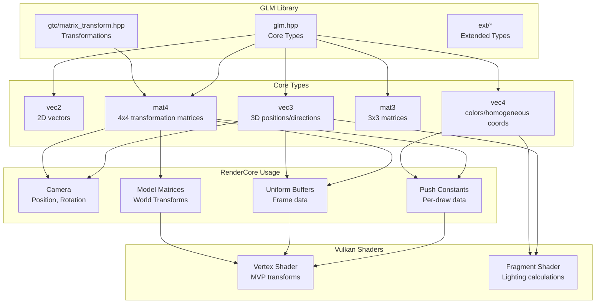
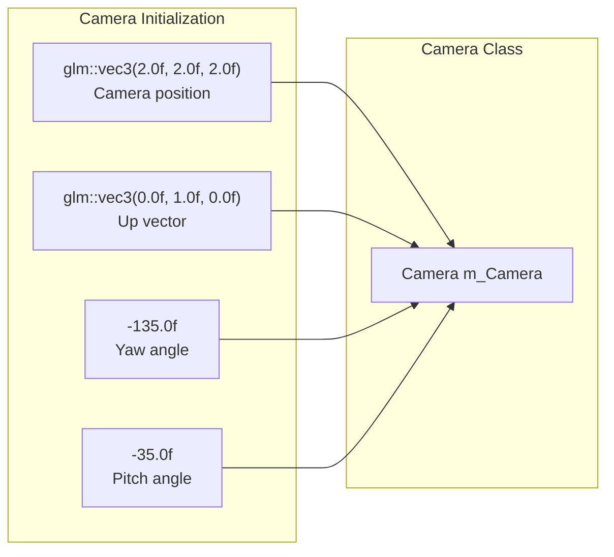
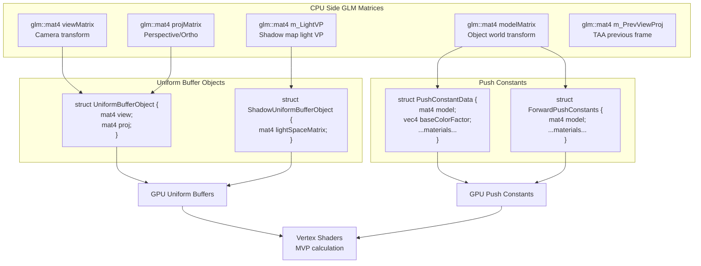
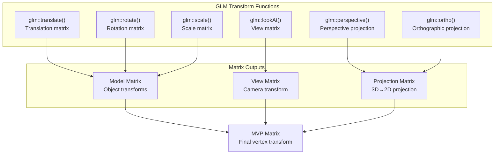
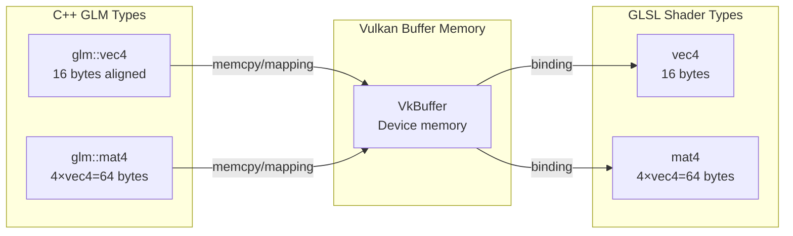
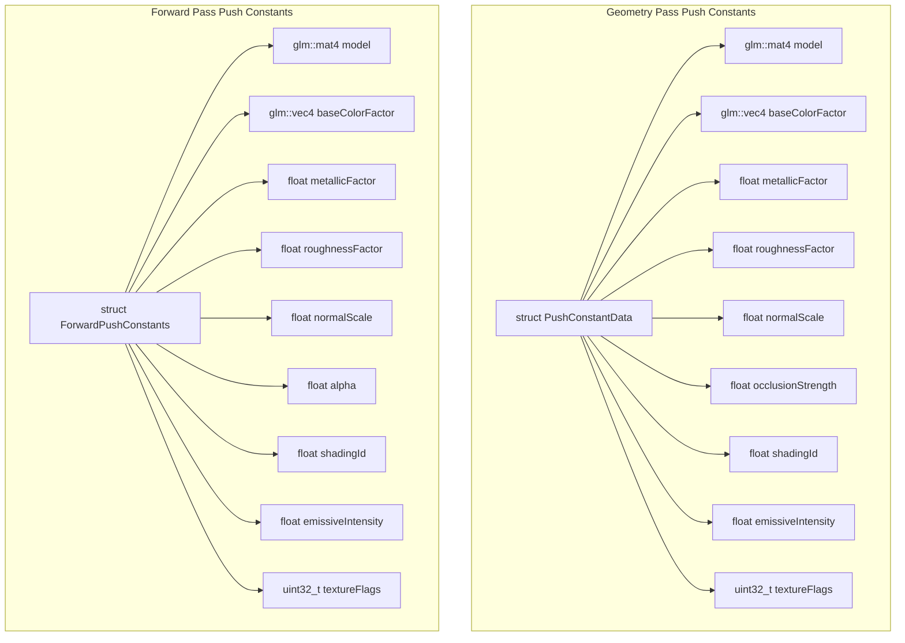
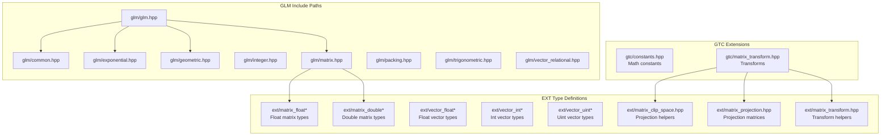

# GLM (OpenGL Mathematics Library)

<details>
<summary>Relevant source files</summary>

The following files were used as context for generating this wiki page:

- [build/CMakeFiles/NeuRenderCoreLib.dir/compiler_depend.make](build/CMakeFiles/NeuRenderCoreLib.dir/compiler_depend.make)
- [build/CMakeFiles/NeuVulkanRender.dir/compiler_depend.make](build/CMakeFiles/NeuVulkanRender.dir/compiler_depend.make)
- [source/RenderCore.cpp](source/RenderCore.cpp)

</details>


## Purpose and Scope

This page documents the usage of GLM (OpenGL Mathematics Library) in NeuVulkanRender. GLM is a header-only C++ mathematics library designed for graphics software that provides vector and matrix types compatible with GLSL (OpenGL Shading Language). In this codebase, GLM serves as the foundational mathematics system for all 3D transformations, camera operations, and shader data structures.

For information about the rendering pipeline that uses these mathematical constructs, see [Rendering System (RenderCore)](#3). For camera-specific implementations using GLM, see [Rendering Pipeline](#3.2).

---

## GLM Integration Overview

GLM provides a type system that matches Vulkan/GLSL shader expectations, ensuring seamless CPU-GPU data exchange without manual padding or layout conversions.



**Sources:** [build/CMakeFiles/NeuVulkanRender.dir/compiler_depend.make:604-749]()

---

## Core Vector Types

GLM provides strongly-typed vector types used extensively throughout the rendering pipeline.

### Vector Type Hierarchy

| Type | Components | Common Uses in NeuVulkanRender |
|------|------------|--------------------------------|
| `glm::vec2` | x, y (float) | Texture coordinates, viewport dimensions, 2D positions |
| `glm::vec3` | x, y, z (float) | 3D positions, normals, directions, colors (RGB) |
| `glm::vec4` | x, y, z, w (float) | Homogeneous coordinates, colors (RGBA), material properties |
| `glm::ivec2` | x, y (int) | Integer coordinates, image dimensions |
| `glm::ivec3` | x, y, z (int) | Integer 3D coordinates |

### Vector Usage in Camera System



**Sources:** [source/RenderCore.cpp:112-113]()

### Vector Usage Examples

The codebase uses `glm::vec2` for viewport calculations:

```cpp
// Viewport size passed to composition shader
glm::vec2 viewportSize = glm::vec2(m_RenderExtent.width, m_RenderExtent.height);
vkCmdPushConstants(commandBuffer, m_CompositionPipelineLayout,
                   VK_SHADER_STAGE_FRAGMENT_BIT, 0, sizeof(glm::vec2),
                   &viewportSize);
```

Poisson disk sampling uses `glm::vec2` for shadow map sampling:

```cpp
std::vector<glm::vec2> RenderCore::m_PoissonDisk;
```

**Sources:** [source/RenderCore.cpp:156](), [source/RenderCore.cpp:1460-1464]()

---

## Core Matrix Types

GLM matrices form the backbone of 3D transformations, supporting model-view-projection (MVP) calculations and coordinate space conversions.

### Matrix Type Usage

| Type | Dimensions | Common Uses |
|------|------------|-------------|
| `glm::mat3` | 3×3 | Normal transformations, 2D transformations, rotation-only matrices |
| `glm::mat4` | 4×4 | Model, View, Projection matrices, full 3D transformations |

### Matrix Data Flow



**Sources:** [source/RenderCore.cpp:210](), [source/RenderCore.cpp:214](), [source/RenderCore.cpp:1367-1377](), [source/RenderCore.cpp:1510-1520]()

### Static Matrix Members

The `RenderCore` class maintains several key matrices as static members:

```cpp
// Previous frame view-projection for TAA (Temporal Anti-Aliasing)
glm::mat4 RenderCore::m_PrevViewProj = glm::mat4(1.0f);

// Light space view-projection for shadow mapping
glm::mat4 RenderCore::m_LightVP = glm::mat4(1.0f);
```

**Sources:** [source/RenderCore.cpp:210](), [source/RenderCore.cpp:214]()

---

## Transformation Operations

GLM provides transformation functions through the `glm/gtc/matrix_transform.hpp` header, enabling common graphics operations.

### Transform Function Categories



### GLM Include Structure

The codebase includes GLM transformation utilities:

```cpp
#include <glm/gtc/matrix_transform.hpp>
```

This header provides:
- **Translation**: `glm::translate(mat4, vec3)` - creates translation matrix
- **Rotation**: `glm::rotate(mat4, angle, axis)` - creates rotation matrix
- **Scaling**: `glm::scale(mat4, vec3)` - creates scale matrix
- **View matrices**: `glm::lookAt(eye, center, up)` - creates view matrix
- **Projections**: `glm::perspective(fov, aspect, near, far)` - creates perspective projection

**Sources:** [source/RenderCore.cpp:19](), [build/CMakeFiles/NeuVulkanRender.dir/compiler_depend.make:730-731]()

---

## Vulkan Integration

GLM types are designed to be binary-compatible with Vulkan/GLSL types, ensuring correct memory layout without manual packing.

### Memory Layout Compatibility



### Push Constants Data Structures

Push constants use GLM types to pass per-draw data to shaders efficiently:



**Geometry Pass Implementation:**
```cpp
// Push constants structure (Must match shader layout)
struct PushConstantData {
    glm::mat4 model;
    glm::vec4 baseColorFactor;
    float metallicFactor;
    float roughnessFactor;
    float normalScale;
    float occlusionStrength;
    float shadingId;
    float emissiveIntensity;
    uint32_t textureFlags;
};
```

**Forward Pass Implementation:**
```cpp
struct ForwardPushConstants {
    glm::mat4 model;
    glm::vec4 baseColorFactor;
    float metallicFactor;
    float roughnessFactor;
    float normalScale;
    float alpha;
    float shadingId;
    float emissiveIntensity;
    uint32_t textureFlags;
};
```

**Sources:** [source/RenderCore.cpp:1367-1377](), [source/RenderCore.cpp:1510-1520]()

---

## GLM Type Distribution in Codebase



**Sources:** [build/CMakeFiles/NeuVulkanRender.dir/compiler_depend.make:604-749]()

---

## Specific Usage Patterns

### Camera System Integration

The `Camera` class uses GLM for position and orientation:

```cpp
Camera RenderCore::m_Camera(glm::vec3(2.0f, 2.0f, 2.0f),  // position
                            glm::vec3(0.0f, 1.0f, 0.0f),   // up vector
                            -135.0f,                        // yaw
                            -35.0f);                        // pitch
```

**Sources:** [source/RenderCore.cpp:112-113]()

### Shadow Mapping

Shadow map calculations use dedicated matrix storage:

```cpp
// Light space view-projection matrix for shadow mapping
glm::mat4 RenderCore::m_LightVP = glm::mat4(1.0f);

// PCSS (Percentage Closer Soft Shadows) sampling pattern
std::vector<glm::vec2> RenderCore::m_PoissonDisk;
```

**Sources:** [source/RenderCore.cpp:156](), [source/RenderCore.cpp:214]()

### Temporal Anti-Aliasing (TAA)

TAA requires previous frame matrix storage:

```cpp
// Previous frame's view-projection matrix for motion vector calculation
glm::mat4 RenderCore::m_PrevViewProj = glm::mat4(1.0f);
```

**Sources:** [source/RenderCore.cpp:210]()

### Viewport Coordinate Conversion

Viewport dimensions are passed to shaders as `glm::vec2`:

```cpp
glm::vec2 viewportSize = glm::vec2(m_RenderExtent.width, m_RenderExtent.height);
vkCmdPushConstants(commandBuffer, m_CompositionPipelineLayout,
                   VK_SHADER_STAGE_FRAGMENT_BIT, 0, sizeof(glm::vec2),
                   &viewportSize);
```

**Sources:** [source/RenderCore.cpp:1460-1464]()

---

## GLM Precision and Qualifiers

GLM supports different precision qualifiers for performance optimization, though the codebase primarily uses default (high) precision.

### Precision Types Available

| Qualifier | Type Example | Precision | Use Case |
|-----------|--------------|-----------|----------|
| Default | `glm::vec3` | High (float) | Standard usage throughout codebase |
| High | `glm::highp_vec3` | High (float) | Explicit high precision |
| Medium | `glm::mediump_vec3` | Medium | Mobile optimization |
| Low | `glm::lowp_vec3` | Low | Color values only |

The codebase uses default precision types exclusively, matching Vulkan's standard float precision expectations.

**Sources:** [build/CMakeFiles/NeuVulkanRender.dir/compiler_depend.make:640-712]()

---

## Summary Table: GLM Usage by System

| System Component | GLM Types Used | Purpose |
|------------------|----------------|---------|
| Camera | `vec3`, `mat4` | Position, view matrix, projection matrix |
| RenderObjects | `mat4` | Model matrices for transformations |
| Push Constants | `mat4`, `vec4`, `float` | Per-draw material and transform data |
| Uniform Buffers | `mat4`, `vec3`, `vec4` | Per-frame camera and lighting data |
| Shadow Mapping | `mat4`, `vec2` | Light view-projection, Poisson sampling |
| TAA | `mat4` | Previous frame view-projection |
| Viewport | `vec2` | Screen dimensions for fragment shaders |

**Sources:** [source/RenderCore.cpp:112-113](), [source/RenderCore.cpp:156](), [source/RenderCore.cpp:210](), [source/RenderCore.cpp:214](), [source/RenderCore.cpp:1367-1377](), [source/RenderCore.cpp:1460-1464](), [source/RenderCore.cpp:1510-1520]()

---
