# spdlog Logging Library

<details>
<summary>Relevant source files</summary>

The following files were used as context for generating this wiki page:

- [build/CMakeFiles/NeuGUILib.dir/progress.make](build/CMakeFiles/NeuGUILib.dir/progress.make)
- [build/CMakeFiles/NeuImGuiBackendLib.dir/compiler_depend.make](build/CMakeFiles/NeuImGuiBackendLib.dir/compiler_depend.make)
- [build/CMakeFiles/NeuImGuiBackendLib.dir/progress.make](build/CMakeFiles/NeuImGuiBackendLib.dir/progress.make)
- [build/CMakeFiles/NeuLogLib.dir/compiler_depend.make](build/CMakeFiles/NeuLogLib.dir/compiler_depend.make)
- [build/CMakeFiles/NeuLogLib.dir/progress.make](build/CMakeFiles/NeuLogLib.dir/progress.make)
- [build/CMakeFiles/NeuWindowLib.dir/compiler_depend.make](build/CMakeFiles/NeuWindowLib.dir/compiler_depend.make)

</details>


## Purpose and Integration

NeuVulkanRender uses **spdlog** as its logging backend, integrated through the **NeuLogLib** wrapper library. spdlog provides a fast, header-only C++ logging system with support for multiple output destinations (sinks), formatted messages, and compile-time log level filtering. The project uses spdlog version 1.x through vcpkg dependency management.

**Integration Points:**
- **NeuLogLib** wraps spdlog to provide project-wide logging functionality
- All major subsystems (RenderCore, Window, GUI, Scene, Asset) use the logging API
- Configured with console sinks for development debugging
- Uses fmt library backend for message formatting

This document covers the spdlog architecture as used in NeuVulkanRender, including logger setup, message formatting, and performance optimization patterns.

---

## NeuVulkanRender Logging Architecture

NeuVulkanRender's logging system consists of a thin wrapper (NeuLogLib) around spdlog, providing a simplified API for the rest of the codebase.

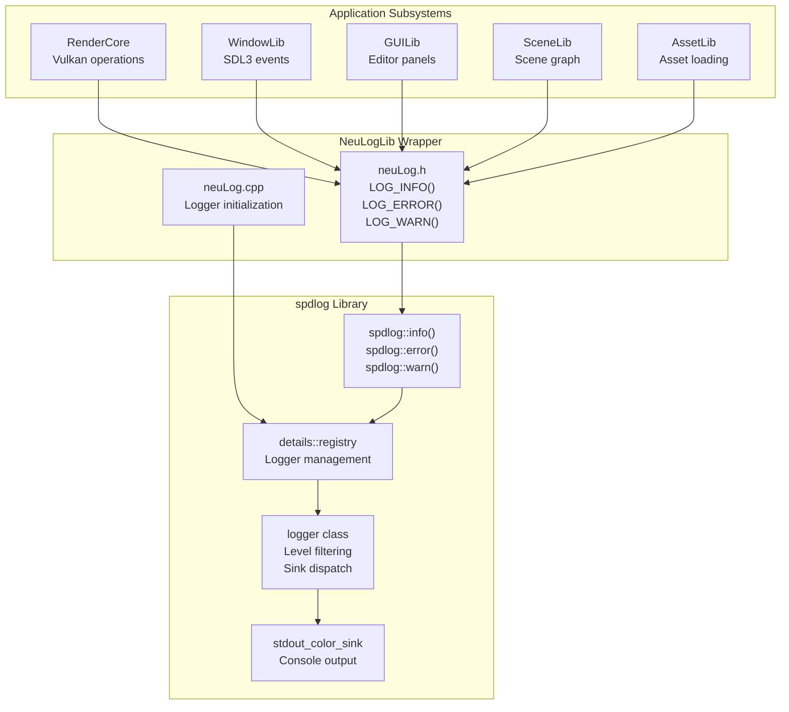

**Sources:** [build/CMakeFiles/NeuLogLib.dir/compiler_depend.make:4-227](), [build/CMakeFiles/NeuWindowLib.dir/compiler_depend.make:447-450]()

---

## NeuLogLib Wrapper Interface

The project provides convenience macros in [include/neuLog.h]() that wrap spdlog's global API:

| NeuLogLib Macro | spdlog Function | Purpose |
|-----------------|-----------------|---------|
| `LOG_TRACE(...)` | `spdlog::trace()` | Detailed trace information |
| `LOG_DEBUG(...)` | `spdlog::debug()` | Debug-level diagnostics |
| `LOG_INFO(...)` | `spdlog::info()` | Informational messages |
| `LOG_WARN(...)` | `spdlog::warn()` | Warning conditions |
| `LOG_ERROR(...)` | `spdlog::error()` | Error conditions |
| `LOG_CRITICAL(...)` | `spdlog::critical()` | Critical failures |

The initialization in [source/neuLog.cpp]() sets up the default logger with console output during application startup.

**Sources:** [build/CMakeFiles/NeuLogLib.dir/compiler_depend.make:200-227]()

---

## spdlog System Architecture Overview

The spdlog library implements a layered architecture with five primary components: a global API layer, logger management through a registry, individual logger instances with level filtering, a message pipeline for formatting and storage, and an output layer with formatters and sinks.

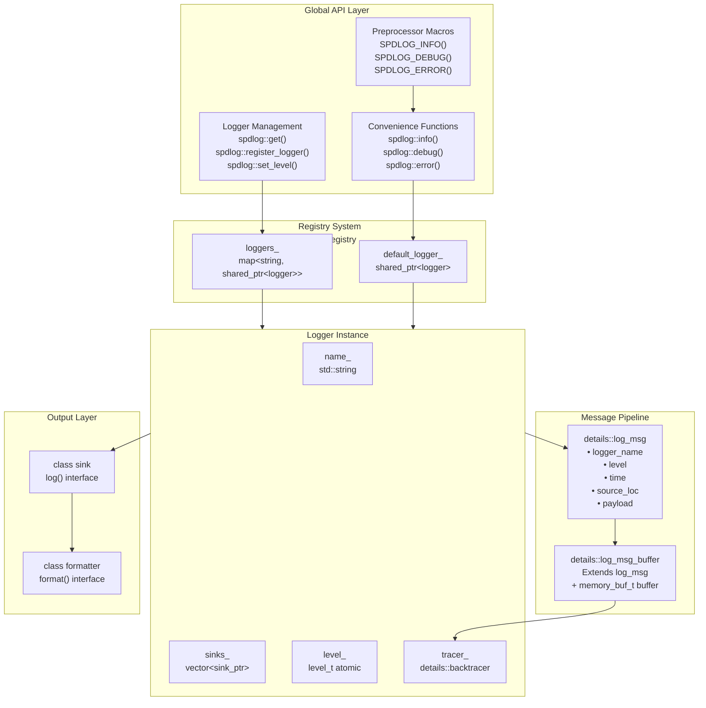

**Sources:** Build system references spdlog headers in vcpkg: [build/CMakeFiles/NeuLogLib.dir/compiler_depend.make:202-227]()

---

## Core Type System

spdlog defines a comprehensive type system for log levels, messages, and formatting abstractions.

### Log Level Enumeration

| Level | Numeric Value | Macro Constant | String Name |
|-------|---------------|----------------|-------------|
| `trace` | 0 | `SPDLOG_LEVEL_TRACE` | "trace" |
| `debug` | 1 | `SPDLOG_LEVEL_DEBUG` | "debug" |
| `info` | 2 | `SPDLOG_LEVEL_INFO` | "info" |
| `warn` | 3 | `SPDLOG_LEVEL_WARN` | "warning" |
| `err` | 4 | `SPDLOG_LEVEL_ERROR` | "error" |
| `critical` | 5 | `SPDLOG_LEVEL_CRITICAL` | "critical" |
| `off` | 6 | `SPDLOG_LEVEL_OFF` | "off" |

**Sources:** spdlog common types defined in vcpkg installation

### Common Type Aliases

| Type Alias | Definition | Purpose |
|------------|------------|---------|
| `log_clock` | `std::chrono::system_clock` | Timestamp source |
| `sink_ptr` | `std::shared_ptr<sinks::sink>` | Shared sink pointer |
| `sinks_init_list` | `std::initializer_list<sink_ptr>` | Sink initialization |
| `err_handler` | `std::function<void(const std::string&)>` | Error callback |
| `level_t` | `std::atomic<int>` or `details::null_atomic_int` | Thread-safe level storage |
| `string_view_t` | `fmt::basic_string_view<char>` or `std::string_view` | String view type |
| `memory_buf_t` | `fmt::basic_memory_buffer<char, 250>` or `std::string` | Formatting buffer |
| `format_string_t<Args...>` | `fmt::format_string<Args...>` or `std::format_string<Args...>` | Compile-time format string |

**Sources:** spdlog type aliases from vcpkg headers

---

## Logger Class Structure

The `logger` class is the central entity for logging operations, managing sinks, level filtering, and backtrace functionality.

```mermaid
graph TB
    subgraph LoggerClass["class logger"]
        direction TB
        
        Members["Member Variables"]
        PublicAPI["Public API Methods"]
        ProtectedHelpers["Protected Helper Methods"]
        
        Members --> Name["name_<br/>std::string"]
        Members --> Sinks["sinks_<br/>vector&lt;sink_ptr&gt;"]
        Members --> Level["level_<br/>level_t (atomic)"]
        Members --> FlushLevel["flush_level_<br/>level_t"]
        Members --> ErrorHandler["custom_err_handler_<br/>err_handler"]
        Members --> Tracer["tracer_<br/>details::backtracer"]
        
        PublicAPI --> LogMethods["log()<br/>trace()<br/>debug()<br/>info()<br/>warn()<br/>error()<br/>critical()"]
        PublicAPI --> ConfigMethods["set_level()<br/>set_formatter()<br/>set_pattern()<br/>set_error_handler()"]
        PublicAPI --> BacktraceMethods["enable_backtrace()<br/>disable_backtrace()<br/>dump_backtrace()"]
        PublicAPI --> FlushMethods["flush()<br/>flush_on()"]
        PublicAPI --> QueryMethods["should_log()<br/>should_backtrace()<br/>level()<br/>name()<br/>sinks()"]
        
        ProtectedHelpers --> LogImpl["log_()<br/>Template formatting"]
        ProtectedHelpers --> LogIt["log_it_()<br/>Message routing"]
        ProtectedHelpers --> SinkIt["sink_it_()<br/>Sink dispatch"]
        ProtectedHelpers --> FlushImpl["flush_()<br/>Sink flushing"]
        ProtectedHelpers --> ErrHandler["err_handler_()<br/>Error handling"]
    end
```

**Sources:** [build/CMakeFiles/NeuLogLib.dir/compiler_depend.make:221-394]()

### Logger Construction

The `logger` class provides multiple constructors for different initialization scenarios:

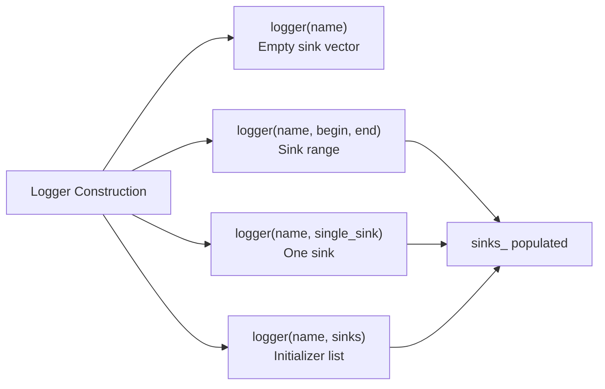

**Sources:** Logger construction patterns from spdlog headers

---

## Message Structure and Pipeline

The message pipeline transforms log calls into structured `log_msg` objects that flow through formatters and sinks.

### log_msg Structure

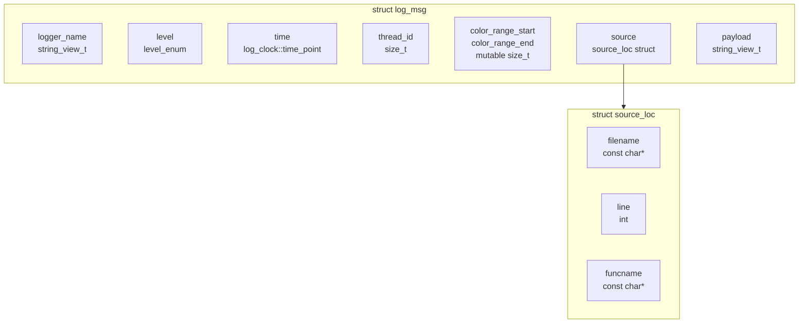

**Sources:** [build/CMakeFiles/NeuLogLib.dir/compiler_depend.make:210-211]()

### log_msg_buffer for Backtrace

The `log_msg_buffer` class extends `log_msg` by adding an internal buffer to copy string data, ensuring the message survives beyond the call stack for backtrace storage.

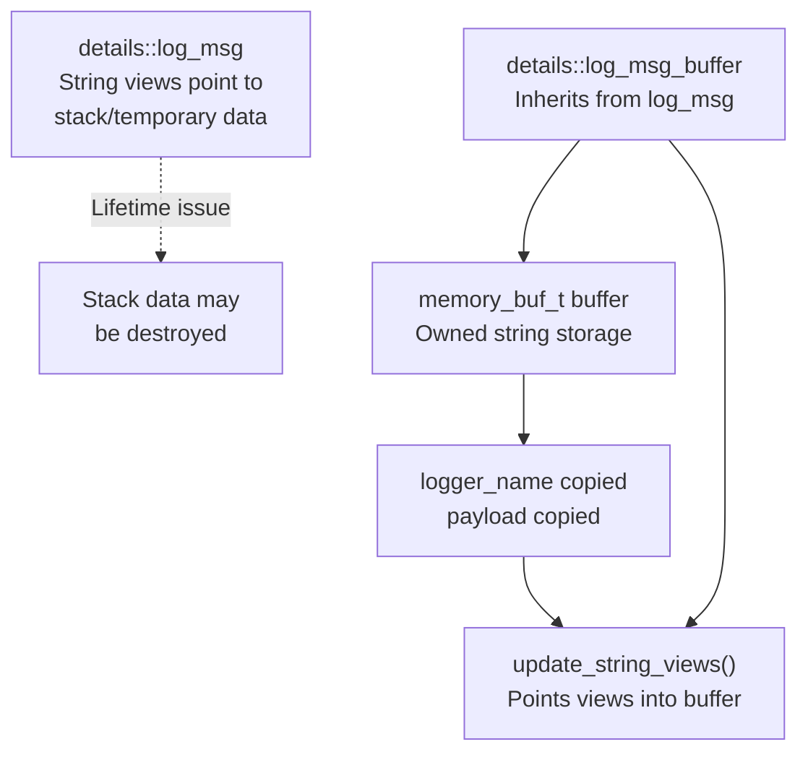

The `update_string_views()` method repoints the `logger_name` and `payload` string views to reference data within the internal buffer rather than external stack locations.

**Sources:** [build/CMakeFiles/NeuLogLib.dir/compiler_depend.make:211-212]()

---

## Message Flow from API Call to Output

This diagram shows the complete path a log message takes through the spdlog system.

```mermaid
graph TB
    UserCode["User Code<br/>spdlog::info('msg')"]
    
    DefaultLogger["spdlog::default_logger_raw()"]
    
    LoggerLog["logger::log()<br/>Template methods"]
    
    ShouldLog{"logger::should_log()<br/>Level check"}
    
    FormatMessage["Format arguments<br/>fmt::vformat_to()"]
    
    CreateLogMsg["Create log_msg<br/>• timestamp<br/>• source_loc<br/>• formatted text"]
    
    LogIt["logger::log_it_()<br/>(log_msg, log_enabled,<br/>traceback_enabled)"]
    
    CheckBacktrace{"tracer_.enabled()?"}
    
    StoreBacktrace["log_msg_buffer copy<br/>tracer_.push_back()"]
    
    CheckEnabled{"log_enabled?"}
    
    SinkIt["logger::sink_it_()<br/>Dispatch to sinks"]
    
    ForEachSink["For each sink in sinks_"]
    
    SinkLog["sink->log(log_msg)"]
    
    FormatSink["sink applies formatter"]
    
    Output["Write to destination<br/>console/file/custom"]
    
    CheckFlush{"msg.level >= flush_level_?"}
    
    FlushSink["sink->flush()"]
    
    UserCode --> DefaultLogger
    DefaultLogger --> LoggerLog
    LoggerLog --> ShouldLog
    
    ShouldLog -->|"false"| CheckBacktrace
    ShouldLog -->|"true"| FormatMessage
    
    FormatMessage --> CreateLogMsg
    CreateLogMsg --> LogIt
    
    LogIt --> CheckBacktrace
    CheckBacktrace -->|"true"| StoreBacktrace
    CheckBacktrace -->|"false"| CheckEnabled
    StoreBacktrace --> CheckEnabled
    
    CheckEnabled -->|"false"| Done["Return"]
    CheckEnabled -->|"true"| SinkIt
    
    SinkIt --> ForEachSink
    ForEachSink --> SinkLog
    SinkLog --> FormatSink
    FormatSink --> Output
    Output --> CheckFlush
    
    CheckFlush -->|"true"| FlushSink
    CheckFlush -->|"false"| Done
    FlushSink --> Done
```

**Sources:** Logger message flow from spdlog headers referenced in [build/CMakeFiles/NeuLogLib.dir/compiler_depend.make:221]()

---

## Global API and Registry System

The global API provides convenience functions that operate on a default logger managed by a singleton registry.

### Registry Singleton Pattern

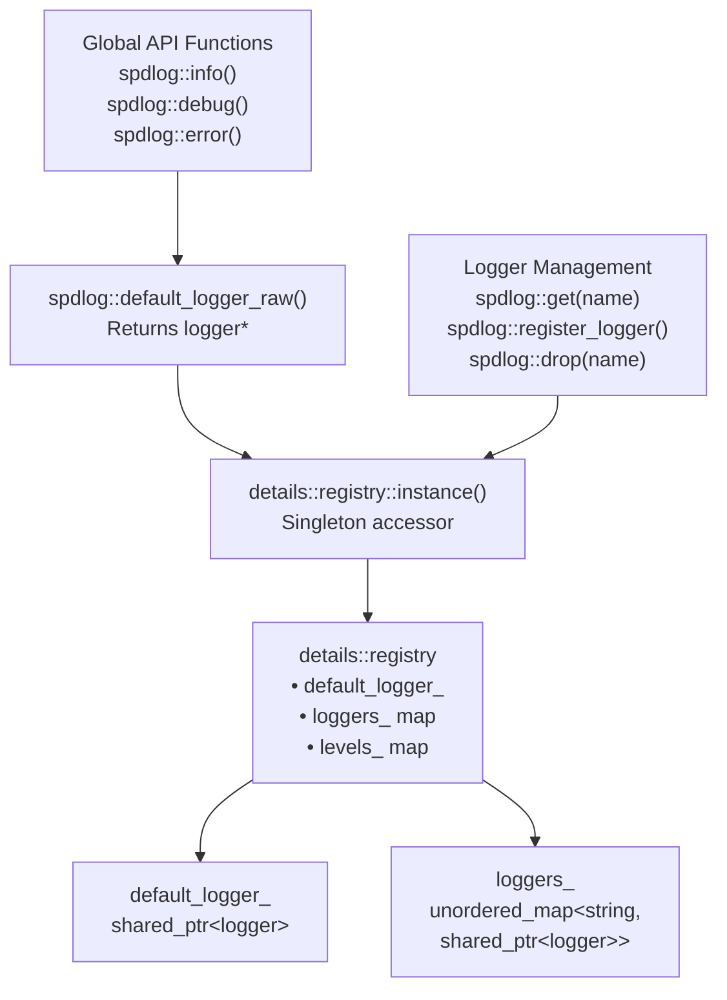

**Sources:** [build/CMakeFiles/NeuLogLib.dir/compiler_depend.make:216-225]()

### Global API Function Table

| Function | Purpose | Default Logger Method |
|----------|---------|---------------------|
| `spdlog::log(level, fmt, args...)` | Log with specified level | `logger::log()` |
| `spdlog::trace(fmt, args...)` | Log trace message | `logger::trace()` |
| `spdlog::debug(fmt, args...)` | Log debug message | `logger::debug()` |
| `spdlog::info(fmt, args...)` | Log info message | `logger::info()` |
| `spdlog::warn(fmt, args...)` | Log warning message | `logger::warn()` |
| `spdlog::error(fmt, args...)` | Log error message | `logger::error()` |
| `spdlog::critical(fmt, args...)` | Log critical message | `logger::critical()` |
| `spdlog::set_level(level)` | Set global log level | `logger::set_level()` |
| `spdlog::set_pattern(pattern)` | Set format pattern | `logger::set_pattern()` |
| `spdlog::flush_on(level)` | Set flush trigger level | `logger::flush_on()` |
| `spdlog::enable_backtrace(n)` | Enable backtrace buffer | `logger::enable_backtrace()` |
| `spdlog::dump_backtrace()` | Dump backtrace buffer | `logger::dump_backtrace()` |

**Sources:** Global API functions from [build/CMakeFiles/NeuLogLib.dir/compiler_depend.make:225]()

---

## Backtrace System

The backtrace system provides a circular buffer that stores recent log messages for debugging, allowing developers to dump historical logs when errors occur.

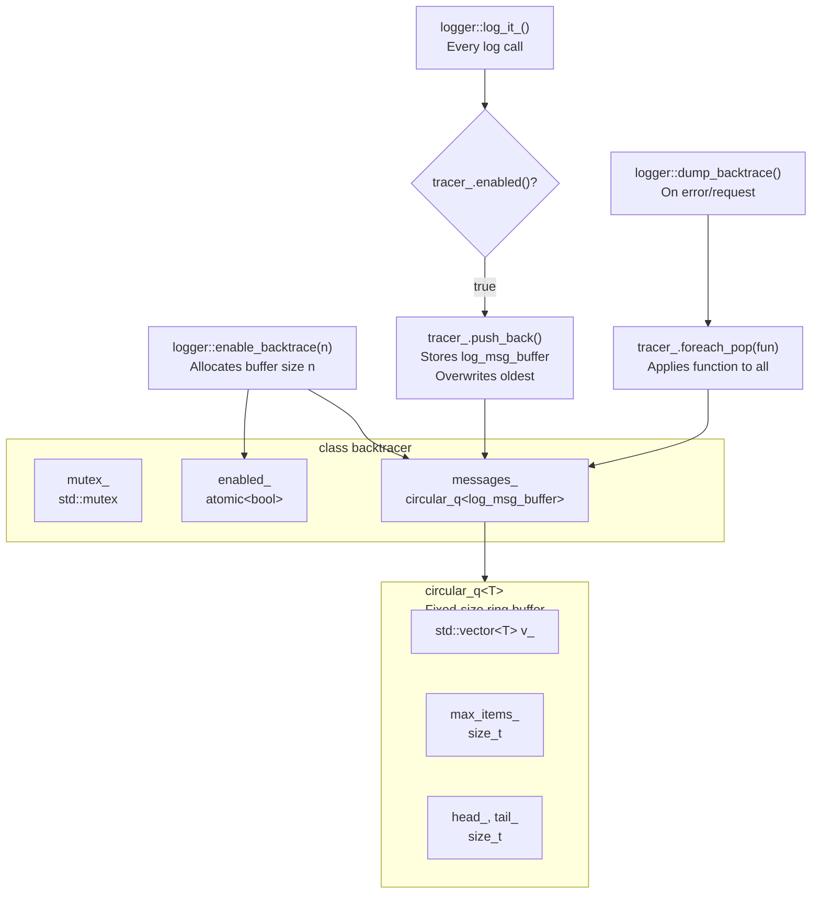

**Key Characteristics:**
- **Thread-safe**: Protected by mutex
- **Fixed size**: Circular buffer overwrites oldest messages
- **Zero-copy storage**: Uses `log_msg_buffer` to own string data
- **Conditional**: Only stores messages when enabled
- **On-demand**: Dumps only when explicitly requested

**Sources:** [build/CMakeFiles/NeuLogLib.dir/compiler_depend.make:207-208]()

---

## Compile-Time Optimization with Macros

spdlog provides preprocessor macros that enable compile-time elimination of log statements based on `SPDLOG_ACTIVE_LEVEL`.

### Macro Definition Pattern

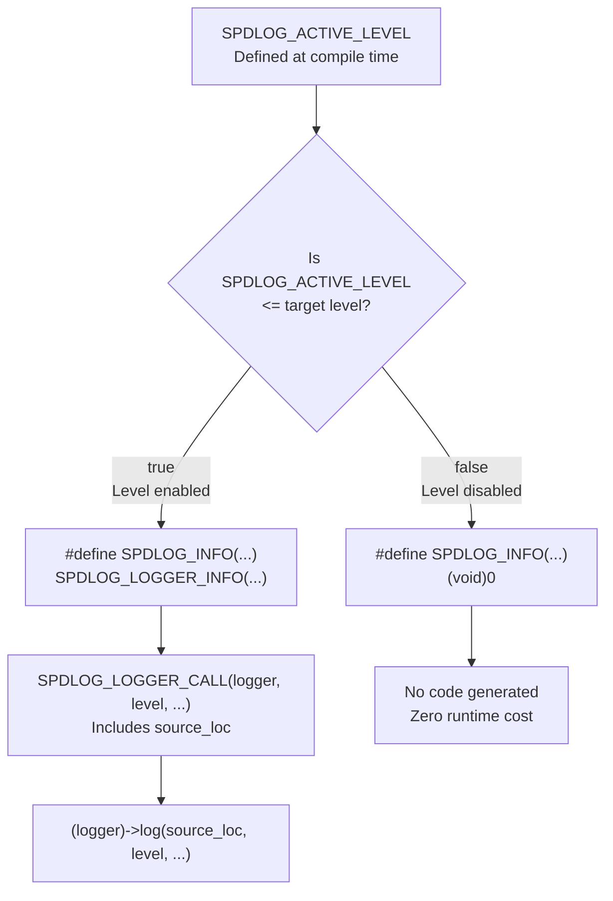

**Sources:** Macro definitions from spdlog headers in vcpkg

### Macro Definitions by Level

| Level | Enabled Condition | Macro | Expands To |
|-------|------------------|-------|-----------|
| TRACE | `SPDLOG_ACTIVE_LEVEL <= 0` | `SPDLOG_TRACE(...)` | `SPDLOG_LOGGER_TRACE(default_logger_raw(), ...)` |
| DEBUG | `SPDLOG_ACTIVE_LEVEL <= 1` | `SPDLOG_DEBUG(...)` | `SPDLOG_LOGGER_DEBUG(default_logger_raw(), ...)` |
| INFO | `SPDLOG_ACTIVE_LEVEL <= 2` | `SPDLOG_INFO(...)` | `SPDLOG_LOGGER_INFO(default_logger_raw(), ...)` |
| WARN | `SPDLOG_ACTIVE_LEVEL <= 3` | `SPDLOG_WARN(...)` | `SPDLOG_LOGGER_WARN(default_logger_raw(), ...)` |
| ERROR | `SPDLOG_ACTIVE_LEVEL <= 4` | `SPDLOG_ERROR(...)` | `SPDLOG_LOGGER_ERROR(default_logger_raw(), ...)` |
| CRITICAL | `SPDLOG_ACTIVE_LEVEL <= 5` | `SPDLOG_CRITICAL(...)` | `SPDLOG_LOGGER_CRITICAL(default_logger_raw(), ...)` |

When a level is disabled, the macro expands to `(void)0`, which the compiler optimizes away completely.

**Sources:** Compile-time macros from spdlog main header

### Source Location Capture

The `SPDLOG_LOGGER_CALL` macro conditionally captures source location information:

```cpp
#ifndef SPDLOG_NO_SOURCE_LOC
    #define SPDLOG_LOGGER_CALL(logger, level, ...) \
        (logger)->log(spdlog::source_loc{__FILE__, __LINE__, SPDLOG_FUNCTION}, level, __VA_ARGS__)
#else
    #define SPDLOG_LOGGER_CALL(logger, level, ...) \
        (logger)->log(spdlog::source_loc{}, level, __VA_ARGS__)
#endif
```

This allows developers to disable source location tracking for minimal overhead builds.

**Sources:** Source location macros from spdlog

---

## Formatter Interface

The `formatter` class defines the interface for converting `log_msg` structures into formatted text output.

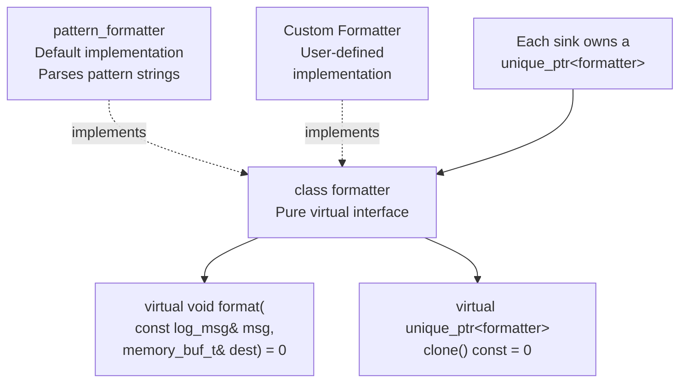

**Key Design Points:**
- **Pure virtual interface**: Allows custom formatting implementations
- **Cloneable**: `clone()` method supports copying formatters to multiple sinks
- **Buffer output**: Writes directly to `memory_buf_t` for efficiency
- **Sink ownership**: Each sink maintains its own formatter instance

**Sources:** [build/CMakeFiles/NeuLogLib.dir/compiler_depend.make:220]()

---

## Level Filtering Mechanisms

spdlog implements two orthogonal filtering mechanisms: runtime level checking and compile-time elimination.

### Runtime Level Filtering

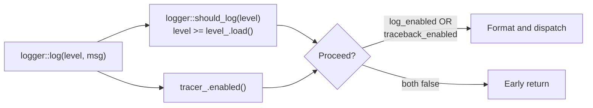

The `should_log()` method performs an atomic load of the logger's level threshold and compares it to the message level.

**Sources:** Logger level filtering from spdlog headers

### Compile-Time vs Runtime Filtering

| Aspect | Compile-Time (Macros) | Runtime (should_log) |
|--------|----------------------|---------------------|
| **Mechanism** | `SPDLOG_ACTIVE_LEVEL` preprocessor checks | Atomic integer comparison |
| **Granularity** | Per translation unit | Per logger instance |
| **Overhead** | Zero - code eliminated | Minimal - single atomic load |
| **Flexibility** | Requires recompilation | Can change at runtime |
| **Use Case** | Production builds with fixed levels | Development/debugging |
| **API** | `SPDLOG_INFO()` macros | `spdlog::info()` functions |

**Recommendation**: Use macros in performance-critical code and function API for runtime flexibility.

**Sources:** Level filtering mechanisms from spdlog

---

## Header-Only Configuration

spdlog is designed as a header-only library by default, with optional compiled-library mode.

### Build Mode Selection

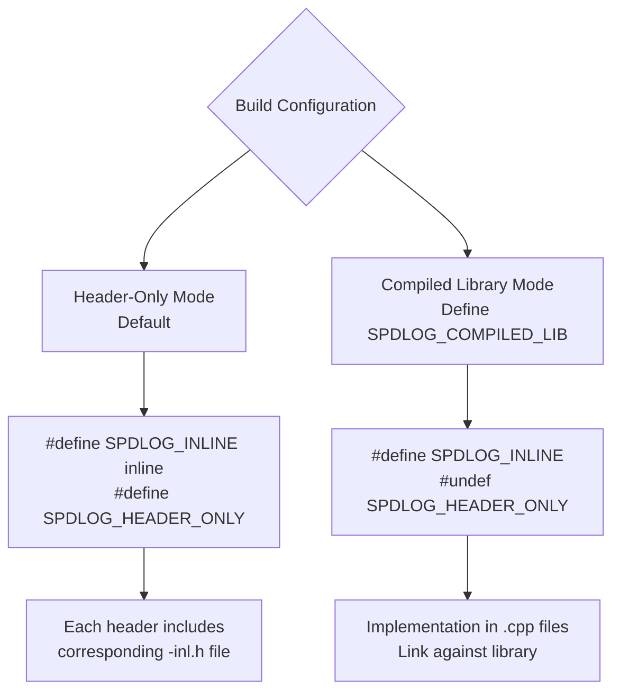

**Header-Only Pattern:**
```cpp
// At end of header file
#ifdef SPDLOG_HEADER_ONLY
    #include "logger-inl.h"
#endif
```

This pattern appears in `logger.h`, `common.h`, `log_msg.h`, `log_msg_buffer.h`, and `backtracer.h`.

**Sources:** Header-only configuration from spdlog common header

---

## Format String Support

spdlog supports both the `{fmt}` library and C++20 `std::format` through conditional compilation.

### Format Library Selection

| Condition | Namespace | String View | Memory Buffer | Format String Type |
|-----------|-----------|-------------|---------------|-------------------|
| `SPDLOG_USE_STD_FORMAT` defined | `std` | `std::string_view` | `std::string` | `std::format_string<Args...>` |
| Using `{fmt}` (default) | `fmt` | `fmt::basic_string_view<char>` | `fmt::basic_memory_buffer<char, 250>` | `fmt::format_string<Args...>` |

**Type Aliases:**
- `namespace fmt_lib = std;` or `namespace fmt_lib = fmt;`
- `using string_view_t = ...`
- `using memory_buf_t = ...`
- `template<typename... Args> using format_string_t = ...`

**Sources:** [build/CMakeFiles/NeuLogLib.dir/compiler_depend.make:202-203]()

---

## Error Handling

spdlog provides configurable error handling through exception macros and custom error handlers.

### Exception Handling Modes

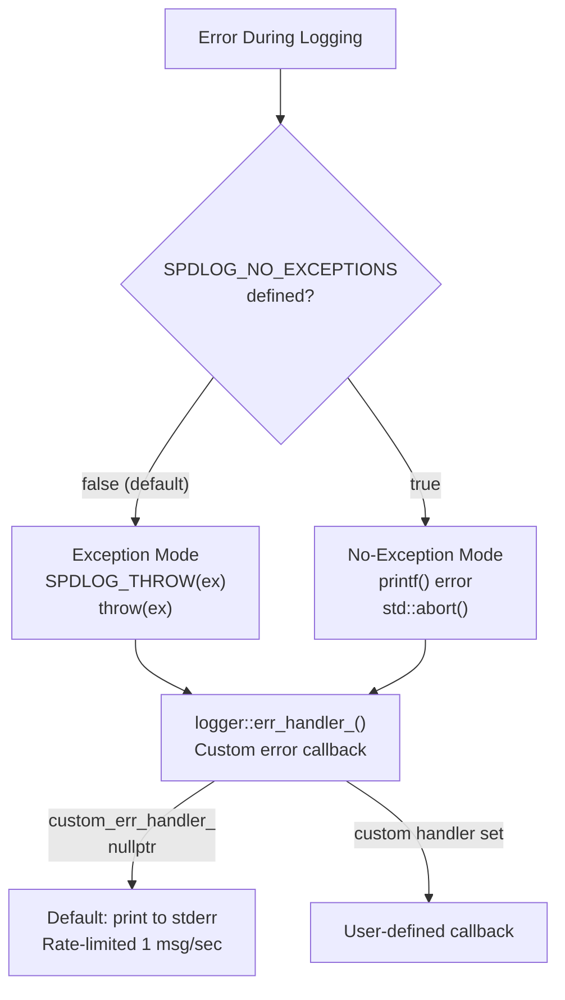

**Error Handler API:**
```cpp
// Set per-logger error handler
logger->set_error_handler([](const std::string& msg) {
    // Custom error handling
});

// Set global error handler
spdlog::set_error_handler([](const std::string& msg) {
    // Custom error handling
});
```

**Sources:** [ThirParty/spdlog/common.h:107-121](), [ThirParty/spdlog/logger.h:31-46](), [ThirParty/spdlog/logger.h:302]()
